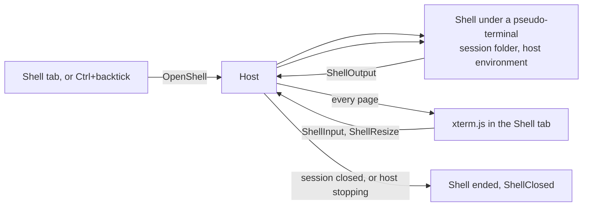

# Shell Pane

The [workflow comparison](/docs/infra/claude-interface/agent-console/workflow-comparison) named the one step [terminal parity](/docs/infra/claude-interface/agent-console/terminal-parity) could not remove: the quick `git` command or test run that sent the person back to a terminal. The Claude desktop app's Code tab answers it with an integrated terminal that "opens in your session's working directory and shares the same environment as Claude" ([Claude Code desktop](https://code.claude.com/docs/en/desktop)). The console's Shell tab is that terminal.

## How it works

- **A Shell tab in the console**, after the timeline, changes and usage tabs, opened by `` Ctrl+` `` from the world. It opens on a shell in the current session's folder, and **+** opens another beside it, each its own shell with its own close.
- **The host owns the process.** The page runs nothing. `OpenShell` asks the session's host to start PowerShell on Windows, or the person's `$SHELL` elsewhere, under a pseudo-terminal in the session's folder with the host's own environment (`spawnPtyShell`). The shell's bytes reach every page as `ShellOutput`; keystrokes and a new size go back as `ShellInput` and `ShellResize`. A remote connection's shell runs on that machine, since that is where its session runs.
- **A shell is the host's, not the driver's.** The four shell commands are a union of their own (`ShellCommand`) beside the driver's (`DriverCommand`), answered by the host's shell registry (`createShellRegistry`, `handleShellCommand`) rather than the driver, and never forwarded to a [session window](/docs/infra/claude-interface/agent-console/session-windows). A shell's output is a server message, never an agent event, so it never enters a session's event log.
- **A shell outlives neither its session nor the host.** A session reporting itself closed ends its shells, and the host stopping ends them all; each end reaches every page as `ShellClosed`. A page that reconnects is replayed every running shell with the last of its output — the host keeps a bounded amount per shell (`SHELL_OUTPUT_LENGTH`) — and drops what it had of that shell first, so nothing shows twice.
- **xterm.js draws it, loaded when first shown.** The terminal renderer VS Code and the Code tab use, so colour, cursor movement and full-screen programs behave as in a terminal. `@xterm/xterm` and its fit addon load with a dynamic `import()` when a shell first mounts, so the console's own chunk carries none of it. The terminal fills its space and tells the shell each new size.
- **node-pty ships beside the executable.** A pseudo-terminal needs node-pty's native addons, and on Windows it also loads a worker and forks an agent from files beside its own code, which a single executable cannot hold. The Windows build embeds node-pty's code and its Windows prebuilt binaries as assets (`scripts/copyNodePty.ts`, `scripts/writeSeaConfig.ts`), the install writes them out into the install folder beside the Claude Code binary, and the executable loads that copy when the first shell opens (`loadNodePty`). The agent node-pty forks runs the executable again with the agent's path, which the executable answers itself (`runConsoleListAgent`). Run from the package, node-pty is an ordinary optional dependency.

## Dependency admission

Both pass the [admission test](/docs/architecture/dependency-admission) as ordinary keeps. **node-pty** is an engine over each system's pseudo-terminal API (ConPTY on Windows) — a native surface nobody would reimplement — and it is optional, so a system without a prebuilt binary or a compiler still installs the host and only its Shell tab says no shell can start. **@xterm/xterm** and its fit addon are the terminal emulator itself: escape sequences, input handling and accessibility are the product, which is the stop list's accessibility-shaped and engine rows.

## What is deliberately not in it

- **No terminal inside the voxel world.** The shell is a console tab; the world stays a place, not a second screen.
- **No prebuilt shell support on Linux.** node-pty ships prebuilt binaries for Windows and macOS. A Linux host opens a shell only where node-pty was built from source, and otherwise answers that no shell can start.

## Key files

| File                                                                            | Role                                                                    |
| :------------------------------------------------------------------------------ | :---------------------------------------------------------------------- |
| `packages/agent-console-server/src/models/command/ShellCommand.ts`              | The four shell commands, apart from the driver's                        |
| `packages/agent-console-server/src/services/shell/createShellRegistry.ts`       | The host's shells, their bounded output, and ending them with a session |
| `packages/agent-console-server/src/services/shell/spawnPtyShell.ts`             | The platform's shell under a pseudo-terminal                            |
| `packages/agent-console-server/src/services/shell/loadNodePty.ts`               | node-pty, from the install folder inside the executable                 |
| `packages/agent-console-server/src/services/shell/runConsoleListAgent.ts`       | node-pty's forked agent, answered by the executable                     |
| `packages/agent-console-server/src/services/server/createAgentConsoleServer.ts` | The shell commands answered, output broadcast and replayed              |
| `packages/agent-console-server/scripts/copyNodePty.ts`                          | node-pty's Windows files, placed for the executable to embed            |
| `apps/web/app/store/agentConsole/shell.ts`                                      | Every host's shells and the output a later terminal is written          |
| `apps/web/app/components/AgentConsole/Panel/Shell.vue`                          | The Shell tab: a shell per tab, + and close                             |
| `apps/web/app/components/AgentConsole/Panel/ShellTerminal.vue`                  | xterm.js, loaded on first show, sized to its space                      |

## Sources

- [Claude Code desktop — terminal integration](https://code.claude.com/docs/en/desktop) — "The terminal opens in your session's working directory and shares the same environment as Claude", opened with `` Ctrl+` ``, with more tabs from **+**.
- [xterm.js](https://xtermjs.org/) — the terminal renderer used by VS Code, which the Code tab's pane also draws with.
- [node-pty](https://github.com/microsoft/node-pty) — pseudo-terminals for Node, with prebuilt Windows binaries over ConPTY.
