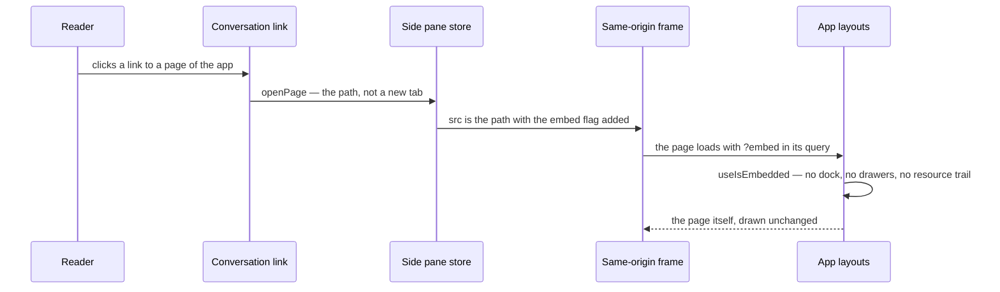

# Side pane

The [agent console](/docs/infra/claude-interface/agent-console) is worth more when the tooling around the work opens beside it. The side pane is the cheapest tier of that: any page of the Esposter app, opened in the console with no code written for it, so the [resource explorer](/docs/resource/explorer) beside the session that is editing a resource needs nothing more than the link the agent already writes.

## How it works

- **The embed flag.** A page framed by the pane carries `?embed` in its query (`EMBED_QUERY_KEY`, built by `getEmbeddedPath`). The app's root reads it once, through `useIsEmbedded`, and drops the dock; the default layout drops its drawers and the resource layout drops its trail and service menu. The page's own content is not touched, so every page of the app is embeddable with no change to it.
- **Frames, not proxies.** Each open page is a same-origin `iframe`, so the auth cookie, the page's own state and its tRPC calls behave exactly as they do in a tab of their own. Every frame stays mounted while its tab is in the background, so a page keeps its place when it is shown again.
- **Links open in the pane.** A link in a message of the conversation, or in the composer's stream, opens in the pane when it points at this app's origin. A modifier key (Ctrl, Cmd or Shift) keeps the link's own behaviour and opens a tab.
- **Layout.** The pane stands beside the console's tabs, behind a handle on its start edge that the reader drags to resize it, remembered by the browser as `LocalStorageKey.AgentConsolePaneWidth`. It never grows so wide the tabs keep less than the pane's own least width, whatever width was remembered on a wider window. It appears only while a page is open there, and closing its last tab closes it.

## Decisions

- **Only the conversation's links open in the pane.** A link in a tool result or a shell's output is left to the browser, since those surfaces render text the agent did not write as a link to the app.
- **The open pages are not kept through a reload.** The pane's tabs live in the page's memory, as its frames do, and a reload starts with none open; the width is the only thing remembered.
- **No fallback tab for a page that refuses a frame.** No page of the app sets frame headers, so a page that cannot be framed is not a case yet. Its fallback, a new tab with the pane's tab saying so, waits until a page sets one.
- **Navigation inside a frame keeps the frame.** A page that links elsewhere in the app navigates inside the frame, and the embed flag is kept only where the page's own link carries it.

## Key files

| File                                                     | Role                                                             |
| :------------------------------------------------------- | :--------------------------------------------------------------- |
| `apps/web/app/composables/useIsEmbedded.ts`              | The one read of the embed flag the layouts share                 |
| `apps/web/app/services/agentConsole/getEmbeddedPath.ts`  | A page's path with the embed flag added, as the pane frames it   |
| `apps/web/app/store/agentConsole/pane.ts`                | The open pages, the one on show, and the pane's remembered width |
| `apps/web/app/components/AgentConsole/Pane/SidePane.vue` | The pane: a tab per open page, one same-origin frame each        |
| `apps/web/app/components/AgentConsole/Sheet.vue`         | The console sheet, which stands the pane beside its tabs         |
| `apps/web/app/components/AgentConsole/Markdown.vue`      | The link click that opens a page of the app in the pane          |
| `apps/web/app/App.vue`                                   | The root, which drops the dock for an embed                      |
| `apps/web/app/layouts/default.vue`                       | The drawers an embed drops                                       |
| `apps/web/app/layouts/resource.vue`                      | The trail and service menu an embed drops, the page's title kept |
