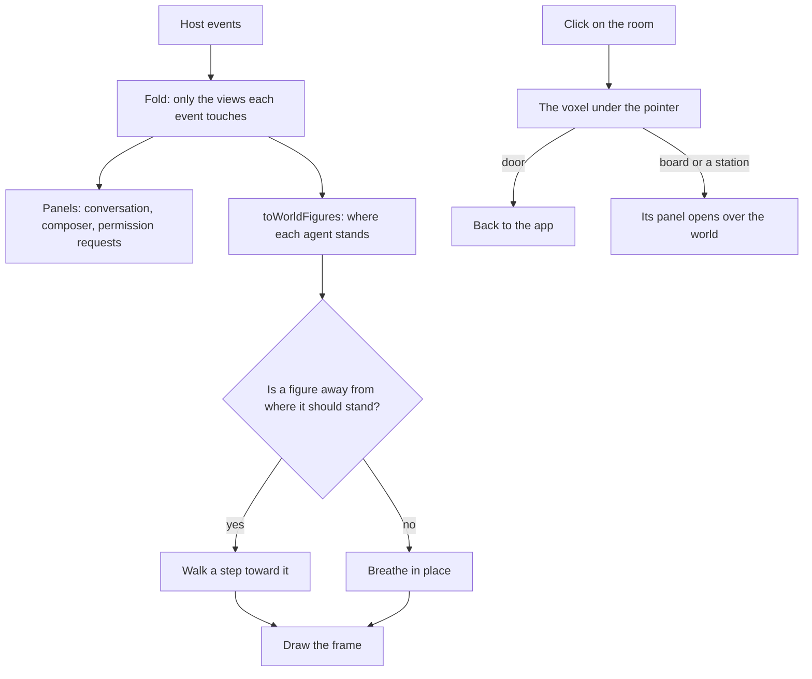

# Voxel world

The [agent console](/docs/infra/claude-interface/agent-console) is a place the session happens in, not an app page with a scene added to it. `/agent-console` uses the `immersive` layout, which has no app bar, drawer, footer or progress bar. It fills the viewport with two halves. One half is the column of panels a person types and reads in. The other is a voxel room where the session is acted out, with a heads-up display over it. Until both halves are ready, a loading screen covers the page.

## How it works

- **The room is one mesh.** The floor, the walls and every object are voxel boxes painted into one grid, and `greedyMesh` turns the grid into triangles once. A face between two solid voxels is never emitted, and neighbouring faces of one colour and one ambient occlusion merge into one quad. Occlusion is counted from each corner's solid neighbours, and a face is shaded by the way it faces. Both are baked into the vertex colours, so the world has no lights and no shadow map.
- **The room turns under a drag.** Dragging orbits the camera around the room and the wheel zooms it. The orbit stays on the open corner, so both walls stay at the back of the view. It never drops below the floor and never zooms out past where it starts, and it cannot pan. A click still opens what it lands on, since a click only counts when the pointer goes down and up on one object within a moment, which a drag never does.
- **A click is told apart by where it lands.** The room has no mesh per object. A click steps half a voxel back through the face it hit, and `getWorldObjectType` looks that voxel up in `WorldObjectMap`. The door leads back to the app, and the board opens the sessions. Each station opens the timeline of the calls made at it.
- **Each agent is a figure.** `toWorldFigures` reads the timeline lanes. The main agent stands at the station of the tool call it is waiting on, or at the gate while a permission request waits, and otherwise at home. A subagent walks in through the portal, goes to its own call's station, and leaves when it finishes. Figures sharing a station stand side by side. `ToolWorldObjectTypeMap` names each Claude Code tool's station, and any tool it does not name is used at the desk.
- **The gauges are columns.** The context vessel fills with the share of the context used, and turns to the warning colour at nine tenths of the compaction threshold. The coins stack with the cost, the pages stack with the number of files changed, and the gate's lantern lights while a request waits. Each is one white voxel scaled to its height and tinted by its material, so a change of value rebuilds nothing.
- **Every object has a button.** The heads-up display carries a button for each panel an object opens, so the keyboard and a screen reader reach everything the canvas shows. The door is the one object with no button, since the browser's own back already leads out. On a narrow screen the panel buttons collapse into one menu, and the world is a strip above the panels. The display ends with the unpair button, since it is the one bar shown whenever the page is paired. The host's connection status reads along the bottom of the world, beside the renderer's figures in development. Unpairing drops the sessions, the open panel and an expanded world along with the host, so nothing of it shows behind the title screen.
- **The world can have the page.** The world button hides the panels' column, so the room fills the page and a panel still opens over it. A pending permission request brings the column back until it has a verdict, so an expanded world never hides a question the agent asked.

## The panels

Everything typed or read is DOM, because text drawn into a canvas cannot be selected, copied, searched or read aloud:

- **Loading.** A loading screen covers the page, as a game's does, with a bar of voxel blocks, a percentage and the step under way: starting the page, building the world, and reaching a paired host. It goes once all three are done, a world that cannot start counting as done so the panels are never held behind it, and it does not come back, so pairing again later shows its own connecting line instead. Behind it, the panels and the heads-up display render on the client alone, since what they show comes from local storage and the socket. They are inert until it goes, so no field can be reached before it can be typed into, and nothing shifts in view as they fill in.
- **Pairing.** Until a host is paired, a title screen in the middle of the page, over the dimmed room, asks for its URL. It says when it is still looking for a host on this machine's loopback port, when it has found one, and when none answered, with a button to look again. Once a URL is paired, a line says the page is connecting, and it turns into a warning if the host does not answer. Retries leave that warning in place instead of flicking back to connecting on every attempt.
- **Conversation.** Replies are rendered as sanitized markdown, and every code block has a copy button of its own. Every message runs the panel's full width with no box of its own, a prompt told apart by its mark. Each carries one quiet mark over its corner, shown while it is hovered or focused and always where nothing hovers, rather than a row of buttons, and its menu copies it, forks from it, rewinds the conversation to it, and on a prompt rewinds the files to before it. The main agent's tool calls sit in the conversation where they were made, as the terminal prints them. Each collapses to a single row — the tool, its target, how long it ran and whether it passed — above a preview of its output. The call, its output and that preview brighten under the pointer and toggle on a click, unless the click ends a selection. A reply and its thinking stream in as they are written, and the whole block replaces the pieces. Thinking is folded as Claude folds it and toggles on a click anywhere on it, while hook output stays folded. A session the terminal wrote keeps no thinking text, so each of its blocks is one line saying so rather than a fold that opens onto nothing. While a turn runs, a working line at the end animates, names the turn with a verb, counts up from its prompt and the tokens it has written, and offers a tip about the console. A search runs over the session.
- **Composer.** It holds the prompt, file paste and drop, the slash palette, the model and mode, and the stop button.
- **Permission requests.** A pending request stays open under the conversation until it has a verdict, as the terminal's prompt does.
- **Panels over the world.** One of the sessions, the timeline, the changes or the usage opens over the world at a time, from an object or from its button.

The panels are bespoke, with no Vuetify:

- `Panel/Frame` draws the voxel edge.
- `Panel/Button` is the raised block.
- `Panel/Menu` is the one listbox. It is behind the slash palette, the repositories offered for a new session, and `Panel/Select` for the model and mode.
- `Panel/Popover` holds each of those menus in the browser's top layer through the Popover API, so no panel paints over one and no overflow clips it. Floating UI keeps it inside the window, flipping it to the other side of what it hangs off when there is no room, and it stays in place in the document, so it keeps the page's palette and font.
- The palette is `AgentConsolePaletteMap`, set as custom properties on the page's root by `AgentConsolePaletteStyle`. Its interface colours are the app's dusk theme ([UI library](/docs/architecture/ui-library)), and the page stays in dusk whichever theme the app is in; the world's materials are its own. The world reads the same colours as vertex colours, so a panel and the room it sits over always agree.
- One pixel font sets every panel, and nothing in the page's scoped styles reaches another page.

## What it costs to run

The world is open all day beside an editor, so it stays live while keeping each frame cheap:

- **Every frame.** The canvas renders on every animation frame, so the room is always live. A standing figure breathes in place, and a figure walks at a fixed speed to where it should stand. Each figure reuses its vectors, so a frame allocates nothing. With reduced motion asked for, a figure is simply where it should stand, and still. A hidden tab gets no animation frames, so nothing is drawn while it is hidden.
- **An event costs the event.** `foldAgentEvents` updates only what each event changes: the conversation, the tool calls, the timeline lanes, the file edits, the pending requests and the latest event of each kind. The duplicate check is a set of ids kept out of reactivity. A replay on reconnect is one pass over the log, and the bench beside the fold holds that its time per event does not grow with the log's length.
- **Fewer pixels.** The canvas renders at half the device's pixel ratio and is scaled up without smoothing, which is a quarter of the fill cost and is what gives the voxels their pixel look. The room is a handful of draw calls: one for the room, one per figure and one per gauge.
- **Only this page pays for three.js.** The world is a lazy client-only component, so its chunk loads after the page's first paint and on no other page.
- **A lost context is redrawn.** When the browser takes the WebGL context back, three rebuilds it, and the next frame draws the room again. The store holds everything, so the host is asked for nothing again.
- **Development shows the counters.** An overlay in development shows the frame rate, with the last frame's draw calls and triangles. It counts through a plain object that the overlay samples once a second, so counting a frame never re-renders the canvas that drew it.

## Key files

| File                                                         | Role                                                                        |
| :----------------------------------------------------------- | :-------------------------------------------------------------------------- |
| `apps/web/app/layouts/immersive.vue`                         | The full-screen layout; `App.vue` drops the app bar and progress bar for it |
| `apps/web/app/components/AgentConsole/Index.vue`             | The page's two halves, its palette tokens and its font                      |
| `apps/web/app/components/AgentConsole/World/Index.vue`       | The canvas, the orbiting camera and the development overlay                 |
| `apps/web/app/components/AgentConsole/World/Figure.vue`      | A figure walking to where it should stand, and breathing there              |
| `apps/web/app/components/AgentConsole/Panel/Loading.vue`     | The loading screen: the bar, the percentage and the step under way          |
| `apps/web/app/services/agentConsole/foldAgentEvents.ts`      | The incremental fold every panel and the world read                         |
| `apps/web/app/services/agentConsole/world/greedyMesh.ts`     | Voxels to one mesh, with occlusion and shading baked in                     |
| `apps/web/app/services/agentConsole/world/WorldObjectMap.ts` | Every object in the room, the boxes it is built from and where one stands   |
| `apps/web/app/services/agentConsole/world/toWorldFigures.ts` | The timeline lanes read as where each agent stands                          |
| `apps/web/app/components/AgentConsole/Panel/Menu.vue`        | The one listbox every menu and select on the page is built from             |

## Notes

- Escape keeps the terminal's one job for it, which is interrupting a turn, and nothing else. The door and the browser's back are the way out, so a key pressed to stop the agent never takes the person out of the page.
- Leaving the app bar behind also leaves the account menu and notifications behind on this page. The door is the way back to them. The app's alerts still show over the page, since the connection store's errors are raised through them.
- Instancing, levels of detail and meshing in a worker are not used. The room is small enough that each costs more than it saves. They belong to the views still proposed, whose [runtime budget](/docs/proposals/infra/agent-console/runtime-budget) sets them out.

## Sources

- [Meshing in a Minecraft game](https://0fps.net/2012/06/30/meshing-in-a-minecraft-game/), Mikola Lysenko: greedy meshing, where adjacent faces are merged into larger quads, compared against naive and culled meshing.
- [Ambient occlusion for Minecraft-like worlds](https://0fps.net/2013/07/03/ambient-occlusion-for-minecraft-like-worlds/), Mikola Lysenko: per-vertex ambient occlusion from a vertex's two side voxels and its corner voxel, baked at meshing time, and the quad split along its brighter diagonal.
- [TresCanvas](https://docs.tresjs.org/api/components/tres-canvas), TresJS: the canvas, its `ready` event that ends the loading screen's world step, and its `render` event the development overlay counts.
- [The Popover API](https://developer.mozilla.org/en-US/docs/Web/API/Popover_API), MDN: the top layer a menu is shown in, above every stacking context on the page.
- [content-visibility](https://web.dev/articles/content-visibility), web.dev: skipping layout and paint for diff rows that are off screen, paired with an intrinsic size so the scrollbar does not jump.
- [The webglcontextlost event](https://developer.mozilla.org/en-US/docs/Web/API/HTMLCanvasElement/webglcontextlost_event), MDN: how the page learns the browser took its context back.
