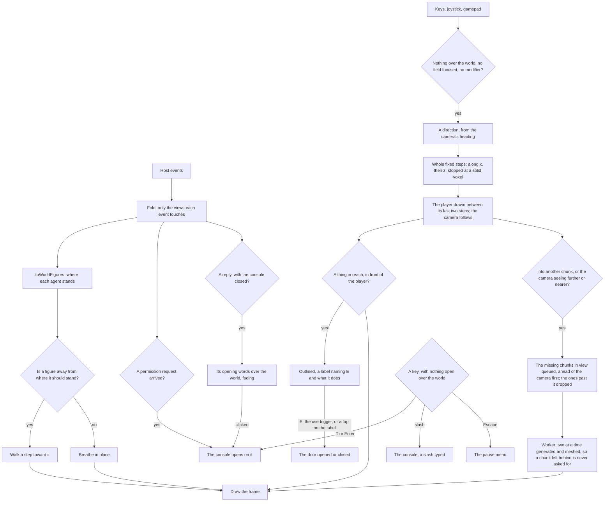

# Voxel world

The [agent console](/docs/infra/claude-interface/agent-console) is a place the session happens in, not an app page with a scene added to it. `/agent-console` uses the `immersive` layout, which has no app bar, drawer, footer or progress bar. The voxel room where the session is acted out fills the viewport, standing in terrain its door opens onto, with a heads-up display along its top, and the person is in it as a player figure they walk with the keyboard, a touch joystick or a gamepad, using a thing in the room by walking up to it. Everything a person types or reads is in the console, an overlay called up over the world the way a game calls up its chat, and a pause menu over the world holds unpairing and leaving. The world needs no host: a page that has never been paired is walked and watched like any other, and the console is where a host is paired, the first time it is opened. Until the page, the world and any paired host are ready, a loading screen covers it.

## How it works

- **The world is generated.** The ground's height in each column is four octaves of simplex noise from one seed summed, each twice the detail and half the height of the last, and it is grass over a few voxels of dirt over stone (`getTerrainHeight`, `generateChunk`). Around the room it is flattened to the room's floor and rises to the noise over a short slope, so the room stands on level ground. The same seed is the same world on every load, so nothing about it is saved. The realm is an original one: the noise is written here, and no place, name or map comes from any published setting.
- **The room is stamped into it.** The floor, the four walls and every object are voxel boxes (`RoomVoxelBoxes`) filled into whichever chunks they fall in. It is built the way a small Minecraft house reads as cozy: materials that disagree on purpose, plaster walls over a stone course and framed in timber posts with a beam along the top, so no wall is a flat sheet; a plank border and a rug on the floor; a window in the wall behind and in the wall to the right; torches on the walls; and a notice board, a bed and potted plants among the objects. Everything in it is scenery but the door, and it is all drawn from the palette, with no light but the shading every face already has. The left wall holds a door, darker than the timber framing it, closed on every load as a door is placed in Minecraft. The player opens and closes it with E from either side of the wall. It is drawn apart from the chunks, a panel a few sixteenths thick on the wall's outer face, and it swings outward a quarter turn about its hinge at the opening's far edge, eased over the UI's medium motion duration, so it snaps when reduced motion is asked for. Collision follows the door at once, as Minecraft's does: it collides as the box of its panel where it now stands, the same box its prompt outlines (`getDoorBox`), so no chunk is written, generated or meshed again for it. Leaving to the app is the pause menu's.
- **It streams what the camera can see.** Space is split into Minecraft's columns of sixteen by sixteen voxels. One view distance sets how far past the player the world is seen: fog in the clear colour thickens from halfway there to there, measured from wherever the camera's arm has it, and the camera's far plane stands where the fog ends, so a chunk wholly in the fog is culled rather than drawn. How far across the ground that view reaches from the player is read off the camera's frustum between the world's floor and its ceiling (`getViewReach`), which a camera tilted toward the horizon, pulled out, or on a wider screen stretches, and the chunks within that reach of the player's own, in a circle rather than a square, are the ones generated. They are queued ahead of the camera and near the player first, and a Web Worker is handed two at a time, one to work on and one waiting, so a chunk the player has run past before its turn is never generated. The worker hands its voxels and its mesh back as transferable buffers, so neither a frame nor the composer waits on the terrain. A chunk is dropped once it is a chunk further out than the reach, so a player pacing a border never regenerates one, and the chunks are settled again only when the player crosses into another or the reach crosses a chunk.
- **A chunk is one mesh.** `greedyMesh` turns a chunk's grid into triangles once. A face between two solid voxels is never emitted, and neighbouring faces of one colour and one ambient occlusion merge into one quad. Occlusion is counted from each corner's solid neighbours, and a face is shaded by the way it faces. Both are baked into the vertex colours, so the world has no lights and no shadow map. A chunk's grid carries a one-voxel border of its neighbours' voxels, generated the same way, which is read but not meshed, so a face on a chunk's edge is culled and shaded against what is really beside it. Nothing over a chunk's highest solid voxel is visited, so its open sky costs nothing.
- **The person is a player figure.** Six boxes — a head, a body, two arms and two legs — in the proportions a voxel person is expected to have: in sixteenths of a voxel, the head eight on a side, the body eight by twelve by four and each limb four by twelve by four, two voxels tall like an agent. It is built from the palette's colours, not from any game's model or skin. Its arms and legs swing in opposite pairs, timed by the distance walked rather than the clock so the feet never slide, and it breathes while it stands. With reduced motion asked for, the limbs hang still. Sneaking lowers its head, body and arms over its legs. It starts just inside the door on every load and is kept nowhere.
- **It walks as the camera sees it.** W, A, S and D or the arrows move it forward, left, back and right relative to the camera's heading, and it turns to face the way it walks. Diagonals are cut to the length of a straight step. Minecraft's keys do the rest: Space jumps, again on each landing while it is held, Shift sneaks, and forward pressed twice sprints until forward is let go. On a touch screen a joystick in the lower corner walks it, and through the browser's Gamepad API a gamepad's left stick walks, its A jumps, a press of the right stick sneaks and a press of the left sprints. Walking reads the same gate as the world's keys — nothing open over the world, nothing editable focused — and any browser modifier held stops it, so Ctrl, Alt and the command key keep the browser's shortcuts. A focused button keeps Space for pressing it.
- **It moves as Minecraft's player does.** The velocity is kept in blocks a tick, as Minecraft keeps it, and changed once a tick as Minecraft changes it, while the tick's movement is spread over three steps (`simulatePlayer`): on the ground a tick adds the walk's acceleration and keeps the share of the velocity the block's slipperiness and the air's drag leave, so a walk settles a little over four blocks a second; in the air the drag alone slows it and the acceleration is a fifth, so a jump carries the way it started. A sprint is three tenths faster and a jump from one pushes further along the way the player faces; a sneak is three tenths of a walk, a quarter shorter, and holds the player at an edge that would leave nothing under the feet. A jump starts upward at Minecraft's speed and gravity and the air's drag bring it back, so the player clears a block — onto the desk, the workbench or a step of the ground — and falls off one again. The whole tick's velocity moves the player before gravity takes from it, as in Minecraft, which is what lifts a jump a quarter of a block over one voxel; gravity and drag eased into each step instead would peak it just short of one.
- **Collision is one axis at a time.** The player is a box narrower than a voxel and as tall as the figure. Everything it can meet is a box, as a block's collision shape is in Minecraft: a solid voxel is a box a voxel wide, and a thing drawn apart from the voxels, such as the door, brings its own (the world store's `worldBoxes`). Each step is taken up or down, then along x, then along z, as Minecraft orders them, each clipped against every box it sweeps into, so a step into a wall at an angle slides along it, a fall stops on what is under it, and a box the player already stands inside, a door closed on them, never traps them (`moveThroughGrid`). Every voxel is looked up through the chunk that holds it (`getWorldVoxel`), and a chunk not generated yet reads as level ground at the room's floor, so nothing falls through the world while its ground is on the way. A step at the simulation's rate is far under a voxel, so it cannot tunnel. The agents walk through the player, so where a person stands never holds the session up.
- **Movement runs on a fixed timestep.** The time each frame took is spent in whole steps of a sixtieth of a second, three to one of Minecraft's ticks, a long frame counted short, and the figure is drawn between its last two positions, so the walk is the same on a slow screen and a fast one.
- **The camera follows.** It sits behind and above the player looking at its head, which a sneak lowers, and trails it with a little lag that reads as weight, or rigidly with reduced motion asked for. A sprint widens its view, as Minecraft's does, unless reduced motion is asked for. A drag on the room, or a gamepad's right stick, turns it around the player and tilts it between above the floor and short of straight down; the wheel brings it in or out, never farther than it starts. Where a wall would stand between the camera and the player, a ray cast through the grid pulls the camera in to just in front of it at once, and it eases back out once the wall is behind (`castThroughGrid`). Nothing in the room answers a click, and the cursor never changes over it.
- **Each agent is a figure.** `toWorldFigures` reads the timeline lanes. The main agent stands at the station of the tool call it is waiting on, or at the gate while a permission request waits, and otherwise at home. A subagent walks in through the portal, goes to its own call's station, and leaves when it finishes. Figures sharing a station stand side by side. `ToolWorldObjectTypeMap` names each Claude Code tool's station, and any tool it does not name is used at the desk.
- **The gauges are columns.** The context vessel fills with the share of the context used, and turns to the warning colour at nine tenths of the compaction threshold. The coins stack with the cost, the pages stack with the number of files changed, and the gate's lantern lights while a request waits. Each is one white voxel scaled to its height and tinted by its material, so a change of value rebuilds nothing.
- **A thing in the world is used from within reach of it.** A prompt acts on the world, and the door is the one thing that has one: it opens or closes. It is in reach while the player stands within a voxel and a half of its box, measured to the box's nearest point as Minecraft reaches for a block, and faces it, so it is reached from either side of the wall and from behind its open panel, and a door behind the player never prompts (`findReachableObject`). While it is in reach it is outlined where it stands, closed in its opening or swung open, by a box taken from the panel as drawn — its own position and scale turned about its hinge (`getDoorBox`) — so the outline is the door's size whatever size the constants give it, and a label over it, ordinary HTML turned to the camera, names E and what it does: Open or Close. E, a gamepad's use trigger, or a tap on the label does it, and a screen reader hears what is in reach as the player walks up to it (`useWorldPrompts`). Nothing in the room opens the console; it is reached from the heads-up display's button, and from T, Enter and the slash key.

- **The heads-up display describes the session.** One bar along the top carries the session's avatar where its theme reads one, its title, its state, its context and its cost, and a button that opens the console with its key written on it. While a permission request waits, that button carries a warning mark. The host's connection status reads along the bottom of the world, beside the renderer's figures in development.
- **The keys are the world's while nothing is over it.** T or Enter opens the console on the conversation with the composer focused, and the slash key opens it with a slash already typed, as a game's command line does. E uses what is in reach. Escape opens the pause menu on its way back to the world, as a game's opens on resume, and W and S walk it as the arrows do: back to the world, the sessions, unpair, and leave to the app. The keys are read only while no dialog is open over the world, nothing editable has focus and no modifier is held, so a browser shortcut or a field is never taken over, and the shortcuts dialog lists them.
- **A question from the agent opens the console.** A permission request opens the console on it, and the gate's lantern and the heads-up display's mark stay lit until it has a verdict, so a request never waits where nobody looks.
- **The latest lines show over the world.** With the console closed, each new reply's opening words appear at the foot of the world, on one line, and fade after a few seconds, as a game's chat lines do. A click on one opens the console. A line is only ever a reply: a diff or a permission request always opens the console instead. A log replayed on connecting shows none.
- **Unpairing leaves nothing behind.** It drops the sessions, the console and the pause menu along with the host, so the world is left empty and the console asks for a host again.

## The panels

Everything typed or read is DOM, because text drawn into a canvas cannot be selected, copied, searched or read aloud. It is all in the console, a native modal dialog: the browser moves focus into it, keeps the world behind it out of reach, and returns focus to where it was when it closes. It has a close button, and Escape closes it, except while a turn runs, when Escape stops the turn as the terminal's does. On a wide screen it is a sheet down one side, so the world and the figures stay in view beside it, and on a narrow screen it covers the page. Its tabs are the conversation, the sessions, the timeline, the changes and the usage, and it remembers the one it was on. The composer's draft outlives the tab, and a line saying the host is connecting or not answering heads every tab:

- **Loading.** A loading screen covers the page, as a game's does, with a bar of voxel blocks, a percentage and the step under way: starting the page, loading the world's code, drawing its first frame, and reaching the paired host, which a page with no host counts as done. The bar moves a step at a time, since a lazily loaded chunk reports no progress of its own and the room is generated rather than fetched, so there is nothing finer to count. It goes once all three are done, a world that cannot start counting as done so the console is never held behind it, and it does not come back, so pairing again later shows its own connecting line instead. Behind it, the heads-up display renders on the client alone, since what it shows comes from local storage and the socket, and it is inert until the loading screen goes. The console and the pause menu are not mounted until then, so no key opens either early.
- **Pairing.** Until a host is paired, the console holds only a pairing panel in place of its tabs, asking for the host's URL. It says when it is still looking for a host on this machine's loopback port, when it has found one, and when none answered, with a button to look again. Once a URL is paired, a line says the page is connecting, and it turns into a warning if the host does not answer. Retries leave that warning in place instead of flicking back to connecting on every attempt.
- **Conversation.** The first tab, holding the conversation, the permission requests and the composer. With no session open, it offers the sessions instead. Replies are rendered as sanitized markdown, and every code block has a copy button of its own. Every message runs the panel's full width with no box of its own, a prompt told apart by its mark. Each carries one quiet mark over its corner, shown while it is hovered or focused and always where nothing hovers, rather than a row of buttons, and its menu copies it, forks from it, rewinds the conversation to it, and on a prompt rewinds the files to before it. The main agent's tool calls sit in the conversation where they were made, as the terminal prints them. Each collapses to a single row — the tool, its target, how long it ran and whether it passed — above a preview of its output. The call, its output and that preview brighten under the pointer and toggle on a click, unless the click ends a selection. A reply and its thinking stream in as they are written, and the whole block replaces the pieces. Thinking is folded as Claude folds it and toggles on a click anywhere on it, while hook output stays folded. A session the terminal wrote keeps no thinking text, so each of its blocks is one line saying so rather than a fold that opens onto nothing. While a turn runs, a working line at the end animates, names the task in progress or the turn's verb from Claude Code's own list, and counts up from its prompt and the tokens it has written ([terminal parity](/docs/infra/claude-interface/agent-console/terminal-parity)). A search runs over the session.
- **Composer.** It holds the prompt, file paste and drop, the slash palette, the model and mode, and the stop button.
- **Permission requests.** A pending request stays open under the conversation until it has a verdict, as the terminal's prompt does.
- **Sessions, timeline, changes, usage.** The other tabs, each the full detail of a gauge or a station in the room.

The panels are built from the [UI library](/docs/architecture/ui-library#components), with no Vuetify:

- `UiDialog` is the console, as a sheet, and the pause menu, and `UiTabs` the console's tabs. `UiFrame` draws each panel's voxel edge, and `UiButton` is the raised block. The session search, a new session's folder and a denial's message are `UiTextField`s, and the new session's is inside a `UiForm`.
- The slash palette and the repositories offered for a new session are `UiSuggestions` under their fields, which keep focus while the arrows walk them. The model and the mode are `UiSelect`. A message's actions are `UiMenu`. Each opens in the browser's top layer, so no panel paints over one and no overflow clips it.
- The page's root is a dusk theme scope, so the panels read the library's tokens with dusk's values whichever theme the app is in. The world paints with `AgentConsolePaletteMap` — its materials, and the same dusk tokens as values — so a panel and the room it sits over always agree.
- One pixel font at one size sets every panel, the agent's markdown included, and nothing in the page's scoped styles reaches another page.

## What it costs to run

The world is open all day beside an editor, so it stays live while keeping each frame cheap:

- **Every frame.** The canvas renders on every animation frame, so the room is always live. A standing figure breathes in place, and a figure walks at a fixed speed to where it should stand. The player's position is a plain object the figure writes and the camera reads, never reactive, so a frame re-renders nothing, and every figure and the camera reuse their vectors, so a frame allocates nothing. With reduced motion asked for, a figure is simply where it should stand, and still. A hidden tab gets no animation frames, so nothing is drawn while it is hidden.
- **An event costs the event.** `foldAgentEvents` updates only what each event changes: the conversation, the tool calls, the timeline lanes, the file edits, the pending requests and the latest event of each kind. The duplicate check is a set of ids kept out of reactivity. A replay on reconnect is one pass over the log, and the bench beside the fold holds that its time per event does not grow with the log's length.
- **Fewer pixels.** The canvas renders at half the device's pixel ratio and is scaled up without smoothing, which is a quarter of the fill cost and is what gives the voxels their pixel look. The world is a draw call per chunk in the camera's view, one per figure, six for the player, one for the door and one per gauge.
- **The terrain costs its view, never its size.** A player who walks for an hour holds the same chunks as one who stands at the door, and the default view holds a few dozen, a view toward the horizon about twice that. A frame spent inside one chunk under one view measures the view and does no other terrain work. Meshing a chunk costs several times generating it, and the benches beside `generateChunk` and `greedyMesh` hold both, and that a chunk's time does not grow with how far out it is.
- **Only this page pays for three.js.** The world is a lazy client-only component, so its chunk loads after the page's first paint and on no other page.
- **A lost context is redrawn.** When the browser takes the WebGL context back, three rebuilds it, and the next frame draws the room again. The store holds everything, so the host is asked for nothing again.
- **Development shows the counters.** An overlay in development shows the frame rate, with the last frame's draw calls and triangles. It counts through a plain object that the overlay samples once a second, so counting a frame never re-renders the canvas that drew it.

## Key files

| File                                                               | Role                                                                              |
| :----------------------------------------------------------------- | :-------------------------------------------------------------------------------- |
| `apps/web/app/layouts/immersive.vue`                               | The full-screen layout; `App.vue` drops the dock and loading bar for it           |
| `apps/web/app/components/AgentConsole/Index.vue`                   | The world at full size with the overlays, its dusk theme scope, its font          |
| `apps/web/app/components/AgentConsole/Overlay.vue`                 | The console: a sheet of tabs, which a permission request opens                    |
| `apps/web/app/components/AgentConsole/PauseMenu.vue`               | Back to the world, the sessions, unpair, and leave to the app                     |
| `apps/web/app/components/AgentConsole/ChatLines.vue`               | The latest replies' opening words over the world, fading                          |
| `apps/web/app/composables/agentConsole/useAgentConsoleCommands.ts` | The world's keys, bound only while nothing is open over it                        |
| `apps/web/app/store/agentConsole/panel.ts`                         | Whether the console and the pause menu are open, and the console's tab            |
| `apps/web/app/components/AgentConsole/World/Index.vue`             | The canvas, the player's state and input, and the development overlay             |
| `apps/web/app/components/AgentConsole/World/Player.vue`            | The player's six boxes, its fixed-step walk, its swing and its breath             |
| `apps/web/app/components/AgentConsole/World/FollowCamera.vue`      | Behind the player, turned by a drag, pulled in by a wall                          |
| `apps/web/app/components/AgentConsole/Joystick.vue`                | The touch joystick                                                                |
| `apps/web/app/composables/agentConsole/world/usePlayerInput.ts`    | Keys, joystick and gamepad as one direction to walk and one to look, gated        |
| `apps/web/app/services/agentConsole/world/moveThroughGrid.ts`      | One step of the player's box, clipped one axis at a time against every box        |
| `apps/web/app/services/agentConsole/world/simulatePlayer.ts`       | One step of Minecraft's movement: a tick's velocity, spread over its steps        |
| `apps/web/app/services/agentConsole/world/castThroughGrid.ts`      | How far a ray gets through the grid, which the camera's spring arm reads          |
| `apps/web/app/components/AgentConsole/World/Prompt.vue`            | The outline and the label over what is in reach, and the use trigger              |
| `apps/web/app/composables/agentConsole/world/useWorldPrompts.ts`   | Every thing in the world used from within reach of it, and what it does: the door |
| `apps/web/app/services/agentConsole/world/findReachableObject.ts`  | The nearest thing in reach and in front of the player                             |
| `apps/web/app/components/AgentConsole/World/Figure.vue`            | A figure walking to where it should stand, and breathing there                    |
| `apps/web/app/components/AgentConsole/Panel/Loading.vue`           | The loading screen: the bar, the percentage and the step under way                |
| `apps/web/app/services/agentConsole/foldAgentEvents.ts`            | The incremental fold every panel and the world read                               |
| `apps/web/app/services/agentConsole/world/greedyMesh.ts`           | Voxels to one mesh, with occlusion and shading baked in                           |
| `apps/web/app/components/AgentConsole/World/Chunks.vue`            | The chunks in the camera's reach, queued for the worker and dropped               |
| `apps/web/app/services/agentConsole/world/getViewReach.ts`         | How far across the ground the camera's frustum reaches from the player            |
| `apps/web/app/workers/agentConsole/chunk.worker.ts`                | A chunk generated and meshed off the main thread, its buffers handed back         |
| `apps/web/app/services/agentConsole/world/generateChunk.ts`        | A chunk's position to its voxels, with the room stamped in                        |
| `apps/web/app/services/agentConsole/world/getTerrainHeight.ts`     | The ground's height in a column, from the seed's noise                            |
| `apps/web/app/components/AgentConsole/World/Door.vue`              | The door's panel, swung about its hinge                                           |
| `apps/web/app/services/agentConsole/world/getDoorBox.ts`           | The door's panel as a box where it stands, which collision and its prompt read    |
| `apps/web/app/services/agentConsole/world/RoomVoxelBoxes.ts`       | The room as the boxes it is built from, around the door's opening                 |
| `apps/web/app/services/agentConsole/world/getWorldVoxel.ts`        | A voxel looked up through the chunk that holds it                                 |
| `apps/web/app/services/agentConsole/world/WorldObjectMap.ts`       | Every place a figure walks to, the boxes it is built from and where it stands     |
| `apps/web/app/services/agentConsole/world/toWorldFigures.ts`       | The timeline lanes read as where each agent stands                                |

## Notes

- Escape does what the thing in front of the person needs: in the console while a turn runs it stops the turn, as the terminal's does, in the console otherwise it closes it, and over the world it pauses. None of them leaves the page, since leaving is a choice in the pause menu, so a key pressed to stop the agent never takes the person out.
- Leaving the dock behind also leaves the account menu and notifications behind on this page. The pause menu's way out is the way back to them. The app's toasts still show over the page, since the connection store's errors are raised through them.
- The per-axis resolution is exact only while a step stays well under a voxel. A faster player, or a larger world such as the [codebase city](/docs/proposals/infra/agent-console/codebase-city), moves to sweeping the box's leading corner through the grid.
- Instancing and levels of detail are not used. The chunks in range are few enough that each costs more than it saves. They belong to the views still proposed, whose [runtime budget](/docs/proposals/infra/agent-console/runtime-budget) sets them out.

## Settled

- **A column of panels beside the world, and a button that hid it.** The world is the page and the console an overlay over it, so the room is never half the page and no mode can hide a question the agent asked.
- **Clicking the room.** Nothing in the room answers a click. A thing whose hit area nothing on screen shows is one a person finds only by trying, so a thing is used from within reach of it, where its prompt shows what it does before it is used.
- **Prompts that open the console.** The board, each station, the gauges, the gate and the main agent each had a prompt opening a console tab, the timeline filtered to a station's calls among them. Each was a second way into what the heads-up display's button and T, Enter and the slash key already open, so the room carried a second menu over the first. A prompt acts on the world only, and the console stays apart from it, reached from its button.
- **An orbit camera over the room.** It made the room a diorama to look at; the camera follows the player instead, and the room is a place to be in.
- **Pointer lock, a first-person view, or clicking to walk.** A locked pointer fights every DOM surface the console is made of, a first-person view of a room this size shows mostly walls, and clicking to walk would make a click on the room mean something again. Touch gets a joystick instead.
- **A room open on the camera's two sides, with a door always open.** It kept the camera's arm out of the walls, but a player walked out anywhere and the door was scenery. The room is walled on all four sides and its door opens and closes as Minecraft's does; the camera pulling in to the player inside is what Minecraft's own third-person camera does in a room.
- **A title screen that holds the world back until a host is paired.** The world is the page whether or not a host is paired, and pairing is the console's, asked for when the person opens it to type.

## Sources

- [Meshing in a Minecraft game](https://0fps.net/2012/06/30/meshing-in-a-minecraft-game/), Mikola Lysenko: greedy meshing, where adjacent faces are merged into larger quads, compared against naive and culled meshing.
- [Ambient occlusion for Minecraft-like worlds](https://0fps.net/2013/07/03/ambient-occlusion-for-minecraft-like-worlds/), Mikola Lysenko: per-vertex ambient occlusion from a vertex's two side voxels and its corner voxel, baked at meshing time, and the quad split along its brighter diagonal.
- [TresCanvas](https://docs.tresjs.org/api/components/tres-canvas), TresJS: the canvas, its `ready` event that ends the loading screen's world step, and its `render` event the development overlay counts.
- [Chunk](https://minecraft.wiki/w/Chunk), Minecraft Wiki: sixteen-by-sixteen columns generated and loaded around the player.
- [Making maps with noise functions](https://www.redblobgames.com/maps/terrain-from-noise/), Red Blob Games: octaves of noise summed into height.
- [Simplex noise demystified](https://weber.itn.liu.se/~stegu/simplexnoise/simplexnoise.pdf), Stefan Gustavson: the two-dimensional simplex noise the terrain is built from.
- [Proximity prompts](https://create.roblox.com/docs/ui/proximity-prompts), Roblox Creator Hub: a prompt that appears as a person comes within a set distance of an object, names the input that uses it for keyboard, gamepad and touch, and triggers the object's action.
- [Game accessibility guidelines](https://gameaccessibilityguidelines.com/full-list/): every part of the interface reachable with the same input as the play, more than one input device supported — the rule behind nothing being only in the world.
- [Dialog (modal) pattern](https://www.w3.org/WAI/ARIA/apg/patterns/dialog-modal/), WAI-ARIA Authoring Practices Guide: focus moved into the dialog and kept there, Escape closing it, focus returned to what opened it, and a visible close button — what the console's native dialog gives.
- [Controls](https://minecraft.wiki/w/Controls), Minecraft Wiki: chat on T, a command on the slash key with the slash typed, and Escape as the pause menu — the keys the console takes.
- [Skin](https://minecraft.wiki/w/Skin) and [Player](https://minecraft.wiki/w/Player), Minecraft Wiki: the player model's parts and sizes, a box a little over half a block wide and a walk of a little over four blocks a second — the proportions, the box and the speed the player starts from.
- [Entity](https://minecraft.wiki/w/Entity#Motion_of_entities), [Sprinting](https://minecraft.wiki/w/Sprinting) and [Sneaking](https://minecraft.wiki/w/Sneaking), Minecraft Wiki: a tick's gravity, drag, slipperiness and acceleration, the jump's speed, the sprint's and the sneak's share of a walk, the double tap that starts a sprint, and the edge a sneak holds at — the movement the player takes.
- [Fix your timestep!](https://gafferongames.com/post/fix_your_timestep/), Glenn Fiedler: simulation in fixed steps spent from an accumulator of frame time, and the render drawn between the last two states.
- [voxel-aabb-sweep](https://github.com/fenomas/voxel-aabb-sweep), Andy Hall: why resolving a box one axis at a time is inexact for large steps, and the sweep of its leading corner through the grid that is exact at any speed.
- [A fast voxel traversal algorithm](http://www.cse.yorku.ca/~amana/research/grid.pdf), John Amanatides and Andrew Woo: stepping a ray through a grid one boundary at a time, always the nearest next, which the spring arm casts.
- [Using spring arm components](https://dev.epicgames.com/documentation/en-us/unreal-engine/using-spring-arm-components), Unreal Engine: a third-person camera drawn in when a wall stands between it and its target, and returned once clear.
- [Gamepad API](https://developer.mozilla.org/en-US/docs/Web/API/Gamepad_API), MDN: reading a gamepad's sticks in the browser.
- [The Popover API](https://developer.mozilla.org/en-US/docs/Web/API/Popover_API), MDN: the top layer a menu is shown in, above every stacking context on the page.
- [content-visibility](https://web.dev/articles/content-visibility), web.dev: skipping layout and paint for diff rows that are off screen, paired with an intrinsic size so the scrollbar does not jump.
- [The webglcontextlost event](https://developer.mozilla.org/en-US/docs/Web/API/HTMLCanvasElement/webglcontextlost_event), MDN: how the page learns the browser took its context back.
