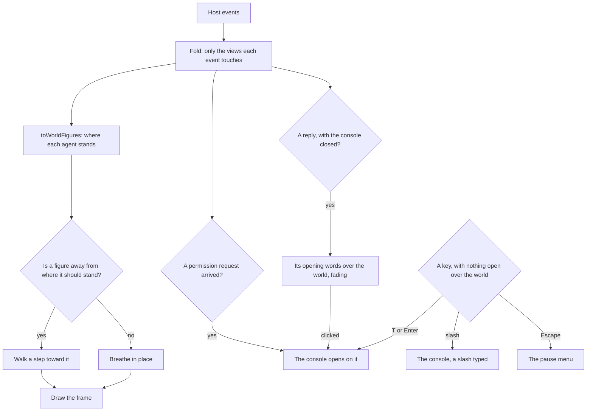

# Voxel world

The [agent console](/docs/infra/claude-interface/agent-console) is a place the session happens in, not an app page with a scene added to it. `/agent-console` uses the `immersive` layout, which has no app bar, drawer, footer or progress bar. The voxel room where the session is acted out fills the viewport, with a heads-up display along its top. Everything a person types or reads is in the console, an overlay called up over the world the way a game calls up its chat, and a pause menu over the world holds unpairing and leaving. The world needs no host: a page that has never been paired is walked and watched like any other, and the console is where a host is paired, the first time it is opened. Until the page, the world and any paired host are ready, a loading screen covers it.

## How it works

- **The room is one mesh.** The floor, the walls and every object are voxel boxes painted into one grid, and `greedyMesh` turns the grid into triangles once. A face between two solid voxels is never emitted, and neighbouring faces of one colour and one ambient occlusion merge into one quad. Occlusion is counted from each corner's solid neighbours, and a face is shaded by the way it faces. Both are baked into the vertex colours, so the world has no lights and no shadow map.
- **The room turns under a drag.** Dragging orbits the camera around the room and the wheel zooms it. The orbit stays on the open corner, so both walls stay at the back of the view. It never drops below the floor and never zooms out past where it starts, and it cannot pan. Nothing in the room answers a click, and the cursor never changes over it.
- **Each agent is a figure.** `toWorldFigures` reads the timeline lanes. The main agent stands at the station of the tool call it is waiting on, or at the gate while a permission request waits, and otherwise at home. A subagent walks in through the portal, goes to its own call's station, and leaves when it finishes. Figures sharing a station stand side by side. `ToolWorldObjectTypeMap` names each Claude Code tool's station, and any tool it does not name is used at the desk.
- **The gauges are columns.** The context vessel fills with the share of the context used, and turns to the warning colour at nine tenths of the compaction threshold. The coins stack with the cost, the pages stack with the number of files changed, and the gate's lantern lights while a request waits. Each is one white voxel scaled to its height and tinted by its material, so a change of value rebuilds nothing.
- **The heads-up display describes the session.** One bar along the top carries the session's title, its state, its context and its cost, and a button that opens the console with its key written on it. While a permission request waits, that button carries a warning mark. The host's connection status reads along the bottom of the world, beside the renderer's figures in development.
- **The keys are the world's while nothing is over it.** T or Enter opens the console on the conversation with the composer focused, and the slash key opens it with a slash already typed, as a game's command line does. Escape opens the pause menu: back to the world, the sessions, unpair, and leave to the app. The keys are read only while no dialog is open over the world, nothing editable has focus and no modifier is held, so a browser shortcut or a field is never taken over, and the shortcuts dialog lists them.
- **A question from the agent opens the console.** A permission request opens the console on it, and the gate's lantern and the heads-up display's mark stay lit until it has a verdict, so a request never waits where nobody looks.
- **The latest lines show over the world.** With the console closed, each new reply's opening words appear at the foot of the world, on one line, and fade after a few seconds, as a game's chat lines do. A click on one opens the console. A line is only ever a reply: a diff or a permission request always opens the console instead. A log replayed on connecting shows none.
- **Unpairing leaves nothing behind.** It drops the sessions, the console and the pause menu along with the host, so the world is left empty and the console asks for a host again.

## The panels

Everything typed or read is DOM, because text drawn into a canvas cannot be selected, copied, searched or read aloud. It is all in the console, a native modal dialog: the browser moves focus into it, keeps the world behind it out of reach, and returns focus to where it was when it closes. It has a close button, and Escape closes it, except while a turn runs, when Escape stops the turn as the terminal's does. On a wide screen it is a sheet down one side, so the world and the figures stay in view beside it, and on a narrow screen it covers the page. Its tabs are the conversation, the sessions, the timeline, the changes and the usage, and it remembers the one it was on. The composer's draft outlives the tab, and a line saying the host is connecting or not answering heads every tab:

- **Loading.** A loading screen covers the page, as a game's does, with a bar of voxel blocks, a percentage and the step under way: starting the page, building the world, and reaching the paired host, which a page with no host counts as done. It goes once all three are done, a world that cannot start counting as done so the console is never held behind it, and it does not come back, so pairing again later shows its own connecting line instead. Behind it, the heads-up display renders on the client alone, since what it shows comes from local storage and the socket, and it is inert until the loading screen goes. The console and the pause menu are not mounted until then, so no key opens either early.
- **Pairing.** Until a host is paired, the console holds only a pairing panel in place of its tabs, asking for the host's URL. It says when it is still looking for a host on this machine's loopback port, when it has found one, and when none answered, with a button to look again. Once a URL is paired, a line says the page is connecting, and it turns into a warning if the host does not answer. Retries leave that warning in place instead of flicking back to connecting on every attempt.
- **Conversation.** The first tab, holding the conversation, the permission requests and the composer. With no session open, it offers the sessions instead. Replies are rendered as sanitized markdown, and every code block has a copy button of its own. Every message runs the panel's full width with no box of its own, a prompt told apart by its mark. Each carries one quiet mark over its corner, shown while it is hovered or focused and always where nothing hovers, rather than a row of buttons, and its menu copies it, forks from it, rewinds the conversation to it, and on a prompt rewinds the files to before it. The main agent's tool calls sit in the conversation where they were made, as the terminal prints them. Each collapses to a single row — the tool, its target, how long it ran and whether it passed — above a preview of its output. The call, its output and that preview brighten under the pointer and toggle on a click, unless the click ends a selection. A reply and its thinking stream in as they are written, and the whole block replaces the pieces. Thinking is folded as Claude folds it and toggles on a click anywhere on it, while hook output stays folded. A session the terminal wrote keeps no thinking text, so each of its blocks is one line saying so rather than a fold that opens onto nothing. While a turn runs, a working line at the end animates, names the turn with a verb, counts up from its prompt and the tokens it has written, and offers a tip about the console ([terminal parity](/docs/infra/claude-interface/agent-console/terminal-parity)). A search runs over the session.
- **Composer.** It holds the prompt, file paste and drop, the slash palette, the model and mode, and the stop button.
- **Permission requests.** A pending request stays open under the conversation until it has a verdict, as the terminal's prompt does.
- **Sessions, timeline, changes, usage.** The other tabs, each the full detail of a gauge or a station in the room.

The panels are built from the [UI library](/docs/architecture/ui-library#components), with no Vuetify:

- `UiDialog` is the console, as a sheet, and the pause menu, and `UiTabs` the console's tabs. `UiFrame` draws each panel's voxel edge, and `UiButton` is the raised block.
- The slash palette and the repositories offered for a new session are `UiSuggestions` under their fields, which keep focus while the arrows walk them. The model and the mode are `UiSelect`. A message's actions are `UiMenu`. Each opens in the browser's top layer, so no panel paints over one and no overflow clips it.
- The page's root is a dusk theme scope, so the panels read the library's tokens with dusk's values whichever theme the app is in. The world paints with `AgentConsolePaletteMap` — its materials, and the same dusk tokens as values — so a panel and the room it sits over always agree.
- One pixel font at one size sets every panel, the agent's markdown included, and nothing in the page's scoped styles reaches another page.

## What it costs to run

The world is open all day beside an editor, so it stays live while keeping each frame cheap:

- **Every frame.** The canvas renders on every animation frame, so the room is always live. A standing figure breathes in place, and a figure walks at a fixed speed to where it should stand. Each figure reuses its vectors, so a frame allocates nothing. With reduced motion asked for, a figure is simply where it should stand, and still. A hidden tab gets no animation frames, so nothing is drawn while it is hidden.
- **An event costs the event.** `foldAgentEvents` updates only what each event changes: the conversation, the tool calls, the timeline lanes, the file edits, the pending requests and the latest event of each kind. The duplicate check is a set of ids kept out of reactivity. A replay on reconnect is one pass over the log, and the bench beside the fold holds that its time per event does not grow with the log's length.
- **Fewer pixels.** The canvas renders at half the device's pixel ratio and is scaled up without smoothing, which is a quarter of the fill cost and is what gives the voxels their pixel look. The room is a handful of draw calls: one for the room, one per figure and one per gauge.
- **Only this page pays for three.js.** The world is a lazy client-only component, so its chunk loads after the page's first paint and on no other page.
- **A lost context is redrawn.** When the browser takes the WebGL context back, three rebuilds it, and the next frame draws the room again. The store holds everything, so the host is asked for nothing again.
- **Development shows the counters.** An overlay in development shows the frame rate, with the last frame's draw calls and triangles. It counts through a plain object that the overlay samples once a second, so counting a frame never re-renders the canvas that drew it.

## Key files

| File                                                               | Role                                                                      |
| :----------------------------------------------------------------- | :------------------------------------------------------------------------ |
| `apps/web/app/layouts/immersive.vue`                               | The full-screen layout; `App.vue` drops the dock and loading bar for it   |
| `apps/web/app/components/AgentConsole/Index.vue`                   | The world at full size with the overlays, its dusk theme scope, its font  |
| `apps/web/app/components/AgentConsole/Overlay.vue`                 | The console: a sheet of tabs, which a permission request opens            |
| `apps/web/app/components/AgentConsole/PauseMenu.vue`               | Back to the world, the sessions, unpair, and leave to the app             |
| `apps/web/app/components/AgentConsole/ChatLines.vue`               | The latest replies' opening words over the world, fading                  |
| `apps/web/app/composables/agentConsole/useAgentConsoleCommands.ts` | The world's keys, bound only while nothing is open over it                |
| `apps/web/app/store/agentConsole/panel.ts`                         | Whether the console and the pause menu are open, and the console's tab    |
| `apps/web/app/components/AgentConsole/World/Index.vue`             | The canvas, the orbiting camera and the development overlay               |
| `apps/web/app/components/AgentConsole/World/Figure.vue`            | A figure walking to where it should stand, and breathing there            |
| `apps/web/app/components/AgentConsole/Panel/Loading.vue`           | The loading screen: the bar, the percentage and the step under way        |
| `apps/web/app/services/agentConsole/foldAgentEvents.ts`            | The incremental fold every panel and the world read                       |
| `apps/web/app/services/agentConsole/world/greedyMesh.ts`           | Voxels to one mesh, with occlusion and shading baked in                   |
| `apps/web/app/services/agentConsole/world/WorldObjectMap.ts`       | Every object in the room, the boxes it is built from and where one stands |
| `apps/web/app/services/agentConsole/world/toWorldFigures.ts`       | The timeline lanes read as where each agent stands                        |

## Notes

- Escape does what the thing in front of the person needs: in the console while a turn runs it stops the turn, as the terminal's does, in the console otherwise it closes it, and over the world it pauses. None of them leaves the page, since leaving is a choice in the pause menu, so a key pressed to stop the agent never takes the person out.
- Leaving the dock behind also leaves the account menu and notifications behind on this page. The pause menu's way out is the way back to them. The app's toasts still show over the page, since the connection store's errors are raised through them.
- Instancing, levels of detail and meshing in a worker are not used. The room is small enough that each costs more than it saves. They belong to the views still proposed, whose [runtime budget](/docs/proposals/infra/agent-console/runtime-budget) sets them out.

## Settled

- **A column of panels beside the world, and a button that hid it.** The world is the page and the console an overlay over it, so the room is never half the page and no mode can hide a question the agent asked.
- **Clicking the room.** Nothing in the room answers a click. A thing whose hit area nothing on screen shows is one a person finds only by trying, so each panel an object stood for is a tab in the console.
- **A title screen that holds the world back until a host is paired.** The world is the page whether or not a host is paired, and pairing is the console's, asked for when the person opens it to type.

## Sources

- [Meshing in a Minecraft game](https://0fps.net/2012/06/30/meshing-in-a-minecraft-game/), Mikola Lysenko: greedy meshing, where adjacent faces are merged into larger quads, compared against naive and culled meshing.
- [Ambient occlusion for Minecraft-like worlds](https://0fps.net/2013/07/03/ambient-occlusion-for-minecraft-like-worlds/), Mikola Lysenko: per-vertex ambient occlusion from a vertex's two side voxels and its corner voxel, baked at meshing time, and the quad split along its brighter diagonal.
- [TresCanvas](https://docs.tresjs.org/api/components/tres-canvas), TresJS: the canvas, its `ready` event that ends the loading screen's world step, and its `render` event the development overlay counts.
- [Dialog (modal) pattern](https://www.w3.org/WAI/ARIA/apg/patterns/dialog-modal/), WAI-ARIA Authoring Practices Guide: focus moved into the dialog and kept there, Escape closing it, focus returned to what opened it, and a visible close button — what the console's native dialog gives.
- [Controls](https://minecraft.wiki/w/Controls), Minecraft Wiki: chat on T, a command on the slash key with the slash typed, and Escape as the pause menu — the keys the console takes.
- [The Popover API](https://developer.mozilla.org/en-US/docs/Web/API/Popover_API), MDN: the top layer a menu is shown in, above every stacking context on the page.
- [content-visibility](https://web.dev/articles/content-visibility), web.dev: skipping layout and paint for diff rows that are off screen, paired with an intrinsic size so the scrollbar does not jump.
- [The webglcontextlost event](https://developer.mozilla.org/en-US/docs/Web/API/HTMLCanvasElement/webglcontextlost_event), MDN: how the page learns the browser took its context back.
