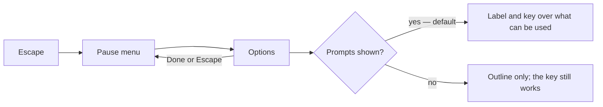

# World Settings

The [voxel world](/docs/infra/claude-interface/agent-console/voxel-world) shows a prompt over each thing the player can use, such as the door: a label naming the key and what it does, so a person new to the world learns it. A person who already knows the world may want the room without them, and the world had nowhere to say so.

## How it works

- **Options live in the pause menu**, between the sessions and the way out, as Minecraft's sit beside Back to Game. Options takes the menu's place in the same dialog, titled _Options_; Done, Escape or the close mark step back to the pause menu rather than closing it, and a second Escape closes the menu. W and S walk the options as they walk the menu.
- **The first setting is the prompts.** _Show prompts over what can be used_ is a switch, on by default. Off, the thing in reach keeps its outline, and E, a gamepad's use trigger, still uses it, so turning the prompts off never takes an action away. It takes effect at once.
- **Settings are per browser.** They are a viewer's convenience, kept in local storage (`LocalStorageKey.AgentConsolePromptsShown`), and a missing value is the default.
- **A setting is added only when something needs one**, such as the minimap's or the world's volume.

## Key files

| File                                                    | Role                                                   |
| :------------------------------------------------------ | :----------------------------------------------------- |
| `apps/web/app/components/AgentConsole/PauseMenu.vue`    | The Options entry and the settings in the menu's place |
| `apps/web/app/store/agentConsole/panel.ts`              | Whether Options is open, and the prompts setting       |
| `apps/web/app/components/AgentConsole/World/Prompt.vue` | The label drawn only while the prompts are shown       |

## Sources

- [Options](https://minecraft.wiki/w/Options), Minecraft Wiki: the Options entry in the pause menu, and settings changed there taking effect at once.
