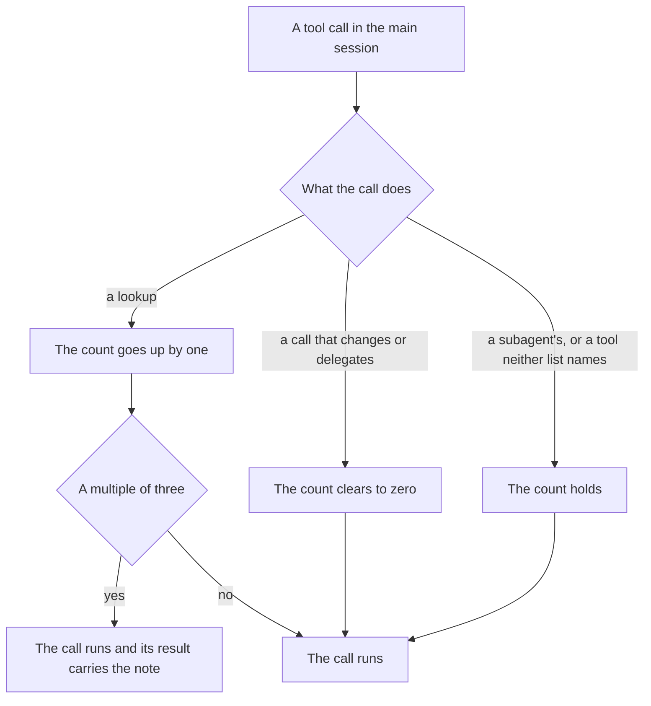

# Delegation guard

Part of [Genshin mods](/docs/infra/claude-interface/genshin-mods). The main session is the expensive reader in this repository: a lookup it makes costs the family that thinks, and its result stays in the context of every later turn. The delegation rule says a chain of lookups whose next step is a lookup too belongs to a haiku subagent, which reads the chain and returns its conclusion. The rule is easy to state and easy to break one read at a time, so the guard counts the main session's lookups and says so when a run of them gets long.

## How it works

Every call the main session makes is classified before it runs. A lookup is a call to Read, Grep, Glob or WebFetch, or a Bash or PowerShell command that only reads: `cat`, `sed`, `grep`, `rg`, `find`, `ls`, `head`, `tail`, `awk`, `wc`, `python`, `node -e`, `git show`, `git log`, `git diff` or `gh run view`. A leading `export` or `cd` chained ahead of the command is stripped first, so `cd "$W" && cat file` is a lookup, and a shell command run in the background is never one.

Calls that change the picture reset the count to zero: an Agent call, an Edit, a Write, a NotebookEdit, a shell command that is not a lookup, and each new prompt the person sends. A subagent's calls never count and never reset it, and neither do tools outside those lists, which leave the count as it was.

On the third lookup in a row, and on every third after it, the call runs as it would and its result carries a note the model reads after the result: the third lookup with no decision between them, the chain is handed to a haiku agent. The note is advice and never blocks a call.

## When it does not count

- A subagent's lookups. A subagent is already the hop the rule asks for, so the guard leaves its work and the main session's count alone.
- A failed guard. Any failure in the count lets the call through unchanged, as the [ward](/docs/infra/claude-interface/genshin-mods/ward) does, so a failure never blocks a call.

## Key files

| File                                                                    | Role                                                                  |
| :---------------------------------------------------------------------- | :-------------------------------------------------------------------- |
| `packages/genshin-mods/src/services/delegation/registerDelegation.ts`   | The call hook: counts each call and adds the note to its result       |
| `packages/genshin-mods/src/services/delegation/getCallStep.ts`          | Whether a call is a lookup, a reset or neither                        |
| `packages/genshin-mods/src/services/delegation/checkIsLookupCommand.ts` | Whether a shell command only reads, after its leading segments        |
| `packages/genshin-mods/src/services/delegation/getNextStreak.ts`        | The count after one call                                              |
| `packages/genshin-mods/src/services/delegation/getNudge.ts`             | Whether a count owes the note                                         |
| `packages/genshin-mods/src/services/constants.ts`                       | The tool lists, the command patterns, the nudge interval and its text |

## Notes

- The count judges a command by its first word after the leading segments, so a read reached another way (`pnpm exec cat`, a script that greps) is a reset. The guard errs toward asking less, since a note on a call that was not a lookup would be noise.
- The count lives in the session's state and is cleared by each prompt, so a run of lookups spanning two prompts is two runs.
- The mod has no command and no switch yet: it runs in every session, where the other mods are switched by their own command.
