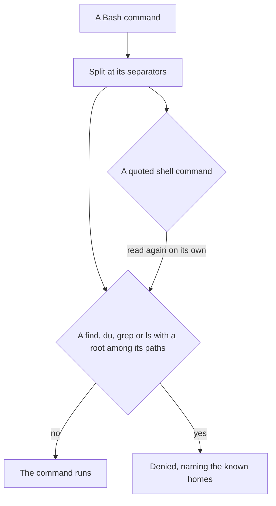

# Disk-scan guard

Part of [Genshin mods](/docs/infra/claude-interface/genshin-mods). A scan from a root reads every folder on the disk, and an agent that runs one holds a core and the disk for minutes, while the file it wants has a known home. The sessions in this repository ran about six such scans in a stretch, looking for a yt-dlp, a capture and a model's package, each with a home already written down. The rule that says so is in the throughput skill; the guard enforces it at the call, so a command that breaks it never starts.

## How it works

Every Bash command is read before it runs. The command is split at its separators (`&&`, `||`, `;`, `|`, `&`, a newline and parentheses), and in each part, every `find`, `du`, `grep` and `ls` is read with its arguments after it:

- `find`, `du`: refused when any argument is a root.
- `ls`: refused when it has the capital `-R` and any argument is a root (a lowercase `-r` is only a reverse sort).
- `grep`: refused when it recurses (`-r`, `-R`, `--recursive`, in any flag group) and a path argument is a root. With `-e` or `-f` every positional argument is a path; otherwise the first is the pattern.

A root is `/`, a drive's folder such as `/c` or `C:\`, `/Users`, `/home`, a user's home folder (`/Users/<name>`, `/c/Users/<name>`, `C:\Users\<name>`, `/home/<name>`), or the home folder by name (`~`, `$HOME`, `${HOME}`, `$USERPROFILE`). Windows spellings and a trailing slash read as the same root. A command passed as one quoted argument to a shell (`bash -c "find / …"`) is read again on its own, to three levels.

A refused command is denied with a message that names the known homes, so the next attempt goes where the file is:

- the repo, searched with `rg` or `git grep`;
- `~/Esposter/genshin-parity`, for game data and captures;
- `~/.claude/genshin-persona`, for the voice;
- a pinned tool (FFmpeg, yt-dlp) through `resolvePinnedTool`;
- a package through `require.resolve` from the package that depends on it.

A `find` inside the repo or inside `~/Esposter/genshin-parity` is not a root, so it runs as it always did.

## What it costs

The check is a regular expression over the command's text, a few microseconds per call (3.2 µs, the median of twenty runs of a thousand calls, measured on this machine). It runs in the plugin's own process, so a call pays no start-up: a standalone script would cost about 90 ms per call here, most of it Node's start.

## When it does not refuse

- A scan from anywhere that is not a root or a home folder, such as `find packages`, `du -sh ~/Desktop/Software` or `ls -R packages`.
- A grep without recursion from a root, and an `ls -r` (a reverse sort).
- A root named as data: a commit message, or a pattern argument of `grep -r`.

## Key files

| File                                                                     | Role                                                                      |
| :----------------------------------------------------------------------- | :------------------------------------------------------------------------ |
| `packages/genshin-mods/src/services/diskScan/registerDiskScan.ts`        | The Bash call hook: denies a refused command and lets every other through |
| `packages/genshin-mods/src/services/diskScan/getDiskScanRefusal.ts`      | The pure check over the command's text, and the deny message              |
| `packages/genshin-mods/src/services/diskScan/getDiskScanRefusal.test.ts` | The refused and the allowed commands, one case each                       |

## Notes

- The guard covers the Bash tool. A PowerShell command that scans a drive (`Get-ChildItem C:\ -Recurse`) is not read yet.
- It has no command and no switch: it runs in every session where the plugin is enabled, as the delegation guard does.
- A scan the guard misses is still caught by the machine watcher, which stops an orphaned `find`, `du`, `grep` or `rg` once it has burnt half a minute of CPU.
