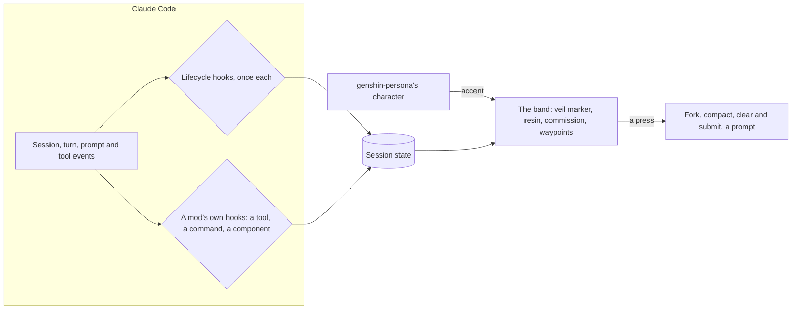

# Genshin mods

Claude Code loads **mods**: plugins whose hooks are a TypeScript module the engine runs in-process, so a plugin can draw a band above the prompt, show toasts, register commands, ask a question, rewrite a tool call before it runs and read the session's usage. `genshin-mods` carries five of them, each one answering something this repository's sessions do every day: several sessions share one checkout, long turns work through task lists, and the context of a long session is what costs. How any mod is written here, and the engine rules that shape every file of this one, is the [Claude Code mods](/docs/architecture/claude-mods) standard.

| Mod                                                                | What it does                                                                                                |
| :----------------------------------------------------------------- | :---------------------------------------------------------------------------------------------------------- |
| [Waypoints](/docs/infra/claude-interface/genshin-mods/waypoints)   | After each answer, up to three next steps the session suggests, one press each                              |
| [Resin](/docs/infra/claude-interface/genshin-mods/resin)           | The cache's countdown, the context, the limits and the cost, with warm, compact and a one-click handoff     |
| [Veil](/docs/infra/claude-interface/genshin-mods/veil)             | Recording mode: emails, amounts, phone numbers and secrets shown as placeholders while the model reads them |
| [Commission](/docs/infra/claude-interface/genshin-mods/commission) | A goal's task list, how far it is and how long it has run                                                   |
| [Ward](/docs/infra/claude-interface/genshin-mods/ward)             | A question before editing a file another session changed in the last half hour                              |

## How to use it

A checkout enables the plugin at project scope through `.agents/settings.json`, beside the persona, so a clone opened in Claude Code has it once the person trusts the repository. Anyone else installs it from the repository's marketplace:

```bash
claude plugin marketplace add Esposter/Esposter
claude plugin install genshin-mods@esposter
```

Each mod is switched by its own command, `/waypoints`, `/resin`, `/veil`, `/commission` or `/ward`: bare, it flips the mod; with `on` or `off`, it sets it. The setting is kept in the plugin's store, so it holds for every later session. Veil starts off and the other four start on. The band above the prompt draws one row per mod with something to say and steps aside for the engine's own surveys; it is focused with a click or `ctrl+x tab`, where every button has a key that presses it. A click lands only where the terminal reports clicks, the fullscreen interface in a terminal attached directly, so the keys are the path that always works.

## Decisions

- **One plugin, one module, one band.** The engine gives each plugin one band above the prompt and takes one unmatched hook per event, so the five mods register from one module, the session's events are hooked once for all of them, and the band composes a row from each mod's state.
- **Themed by the session character.** Labels use the game's own word only where it already means the thing: resin for capacity that refills on a clock, a waypoint for where to go next, a commission for a task given out, a ward for protection. The accent is the colour the [persona plugin](/docs/infra/claude-interface/persona-plugin) publishes for the session's character, already readable on a dark terminal and typed by the persona's own state contract, which the mods include rather than copy, and the game's interface gold where the persona is not installed.
- **A mod stands alone.** Every mod works with the other four switched off, and none needs the persona except for its colour. So the manifest names no plugin dependency: one would make installing the mods install the persona too, game data and output style with it, and the colour read already falls back to gold on its own.
- **Nothing beyond the session's own account.** A mod that calls the model asks through a fork of the session — a request of its own that reads the session's prefix from the prompt cache, so it costs that cache read plus its own new input and reply, counted against the same plan as any turn. No mod adds a service or a key.



## Key files

| File                                                      | Role                                                                   |
| :-------------------------------------------------------- | :--------------------------------------------------------------------- |
| `packages/genshin-mods/src/register.ts`                   | The module the engine loads, calling each register file once           |
| `packages/genshin-mods/src/services/registerLifecycle.ts` | The session's events for every mod, and the commands that switch them  |
| `packages/genshin-mods/src/services/band/registerBand.ts` | The band, its rows and its buttons' actions, in the character's colour |
| `packages/genshin-mods/src/services/InitialState.ts`      | Every state value's initial, the switches' defaults among them         |
| `packages/genshin-mods/src/services/ModDescriptionMap.ts` | Each mod's command and the line the menu shows                         |
| `packages/genshin-mods/types/index.d.ts`                  | The state contract the engine validates every key against              |
| `packages/genshin-mods/.claude-plugin/plugin.json`        | The manifest, naming the state contract                                |

## Notes

- The agent console does not show mods. It drives sessions through the Agent SDK and draws its own page, so the band reaches the terminal and the desktop app alone.
- The mods API is labelled early access and moves between releases; `claude plugin validate` on the plugin after every engine update is where a change shows first.

## Sources

- [Claude Code Mods Are Game Changers. Set Up These 5 NOW.](https://www.youtube.com/watch?v=9hetShMMp2s) (Nate Herk): the five mods, what each shows and how each is switched. The names here are our own.
- [etding/cache-keeper](https://github.com/etding/cache-keeper): a published build of the cache mod, taken for its row of figures and its warning before the cache goes cold.
