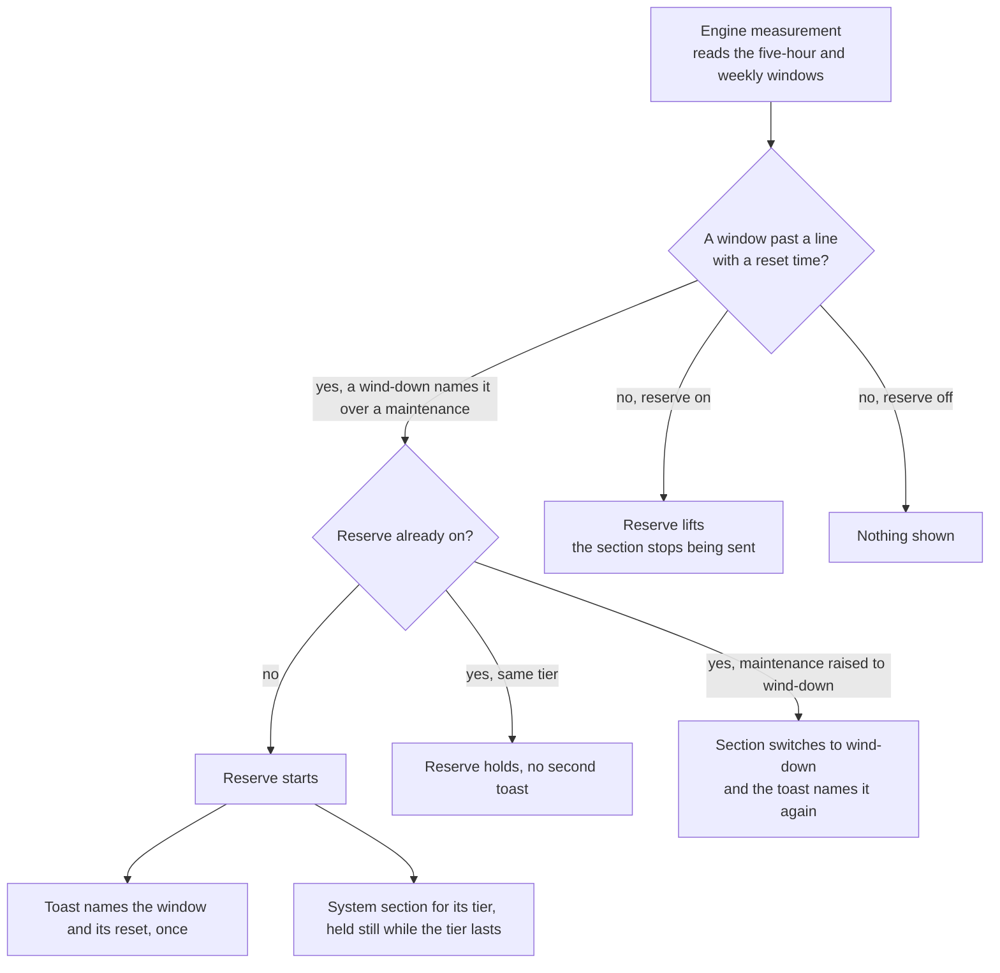

# Resin

Part of [Genshin mods](/docs/infra/claude-interface/genshin-mods). In the game, resin is the capacity that refills on a clock and is spent on what matters. A session has the same: its prompt cache, its context window and its usage limits. Resin shows all three at a glance and makes the usual answers to them one press each.

## The row

Shown once the session has sent a request, and gone again after a `/clear` or a resume:

- **cache** — minutes until the prompt cache expires, counted from when the last request or warm was sent rather than from its reply, since that is when the cache was read, and how much context a cold cache would re-send at full price.
- **context** — tokens used against the window, as the engine reports them.
- **5h** and **7d** — the limit windows' percentages, when the account reports them.
- **cost** — what the session would have cost on API billing, the engine's own total.

A figure takes the warning colour past its threshold — the cache under ten minutes, the context or a limit at four-fifths — and a figure the engine has not measured yet is left out rather than shown as zero. The countdown redraws once a minute.

## How to use it

Each is a button, or with the band focused a key: `w`, `c` and `h`.

- **Warm** renews the cache: a one-word side question through a fork of the session, which re-sends the conversation's prefix and adds no row to the transcript.
- **Compact** runs the engine's own compaction.
- **Handoff** is the whole relay in one press. A fork writes a handoff of the session — the goal, what is done, what is next, the files and decisions that matter, the open questions — then the mod clears the conversation and sends the handoff as the first prompt of the fresh one. The buttons give way to a note while it is written, and the clear waits for the handoff, so a fork that fails clears nothing and a toast says why. A clear or submit that fails after the fork is toasted the same way, and the buttons come back either way.
- Five minutes before the cache expires, a toast says so, once per expiry and never while a turn is running, since the turn renews the cache itself.
- `/resin off` hides the row, the toasts and the usage reserve's section.

## Usage reserve

A plan's usage windows are spent by the session and its agents, and a compute run that is still owed needs some of a window left to start. So each limit window has two lines, a maintenance line and a wind-down line, and the mod reads the five-hour and the weekly window against them. The lines are the constants `FIVE_HOUR_MAINTENANCE_PERCENTAGE`, `FIVE_HOUR_WIND_DOWN_PERCENTAGE` and `WEEKLY_WIND_DOWN_PERCENTAGE` in `constants.ts`, and the map that holds each window's lines is `RateLimitKindUsageWindowMap.ts`. The weekly window has no maintenance line, since running it dry locks everything out for days. The mod keeps a usage reserve in the session from the first line a window passes until that window resets.

- **What starts it** — each measurement the engine pushes reads the limit windows. A wind-down names the reserve over a maintenance tier, and when both windows are at the same tier the five-hour one is named. A toast names it with its reset time in local time, once as it starts and again as its maintenance tier rises to wind-down. Nothing is shown when the reserve ends.
- **What the session is told** — one system section naming the window, the line it has passed and its reset time, then the instruction of its tier: the maintenance tier spends the rest of the window on cleanup agents, the wind-down stops new work and has each running agent commit and hand off. The throughput skill's "The usage reserve" section spells out both. The text holds still while its tier lasts, so it does not break the prompt cache; a rise to wind-down changes it once. It is sent only while the resin mod is on.
- **What lifts it** — the window's reset drops its reading under the line, and the next measurement clears the reserve, so the section simply stops being sent. No button or command does this.

The steps a session follows under a reserve are the repository's own, in the [throughput](https://github.com/Esposter/Esposter/blob/main/.agents/skills/throughput/SKILL.md) skill's "The usage reserve" section.

## Key files

| File                                                                      | Role                                                                    |
| :------------------------------------------------------------------------ | :---------------------------------------------------------------------- |
| `packages/genshin-mods/src/services/resin/getResinFigures.ts`             | Usage and the clock into the row's figures and warnings                 |
| `packages/genshin-mods/src/services/resin/getCacheRemainingMs.ts`         | The time left on the cache                                              |
| `packages/genshin-mods/src/services/resin/RateLimitKindUsageWindowMap.ts` | The limit windows the reserve is read off, each with its lines          |
| `packages/genshin-mods/src/services/resin/getReserveWindow.ts`            | The window whose tier names the reserve, with its reset time            |
| `packages/genshin-mods/src/services/resin/getReserveSummary.ts`           | The sentence the reserve's section and its toast open with              |
| `packages/genshin-mods/src/services/resin/reserveText.ts`                 | The reserve's system section                                            |
| `packages/genshin-mods/src/services/resin/formatResetsAt.ts`              | The reset time in local time, for the toast and the section             |
| `packages/genshin-mods/src/services/registerLifecycle.ts`                 | The minute clock, the warning toast, the renewal, the reserve's reading |
| `packages/genshin-mods/src/services/band/registerBand.ts`                 | The row and the warm, compact and handoff actions                       |
| `packages/genshin-mods/src/services/constants.ts`                         | The cache's lifetime, the thresholds and the warm and handoff questions |

## Notes

- The cache's lifetime is the engine's choice, an hour on a subscription and five minutes on some API plans. The engine does not report it, so it is the mod's one constant, `CACHE_LIFETIME_MS`.
- A window the engine reports with no reset time does not start a reserve, since both the reserve's section and its lift depend on that time.
- The reserve belongs to the account's usage window rather than to the conversation, so a `/clear` or a resume keeps it until the next measurement reads the window again.
- The published cache mod also compacts by itself past a threshold. That is left to the engine's own auto-compact, which already reads the window, so the mod adds no second policy beside it.
