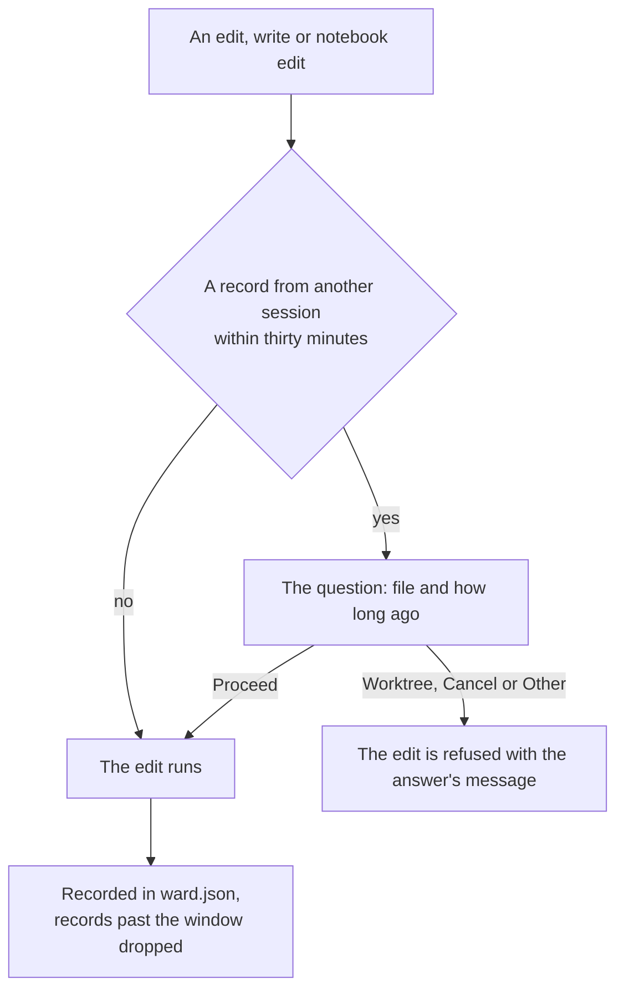

# Ward

Part of [Genshin mods](/docs/infra/claude-interface/genshin-mods). Several sessions working in one checkout is this repository's normal shape, and the git workflow already assumes another session's edits are in the tree. What nothing else catches is two sessions editing the same file at once, where the second rewrites the first's work from a stale read. Ward asks before that happens.

## How it works

Every successful edit, write or notebook edit is recorded in one file every session on the machine reads afresh, `~/.claude/genshin-mods/ward.json`: the file's path, the session that wrote it and when. Records past the window are dropped on each write, so the file holds the last half hour of edits and no more. Before any of those tools runs, the mod looks the path up, and a record from another session within the last thirty minutes opens the engine's own question dialog, naming the file and how long ago it changed.

## How to use it

Answer the question:

- **Proceed** — the edit runs.
- **Move to a worktree** — the edit is refused with a message telling the model to move this work into a git worktree and carry on there.
- **Cancel** — the edit is refused, the model told the person stopped it because another session changed the file.
- **Anything typed under Other** — the edit is refused with the person's words, which the model reads as its instruction.

`/ward off` stops the questions and the recording, and `/ward on` brings them back.

## When it does not ask

- A session's own edits never ask.
- A run with nobody watching, such as a headless one, proceeds, since a guard that blocks unattended work is worse than none.
- Any failure of the guard itself lets the edit through, a dismissed question or an unreadable record alike: a guard that blocked on its own failure would block every edit after it, and Cancel is the person's way to stop one.

## Key files

| File                                                            | Role                                                   |
| :-------------------------------------------------------------- | :----------------------------------------------------- |
| `packages/genshin-mods/src/services/ward/registerWard.ts`       | The question before an edit and the record after one   |
| `packages/genshin-mods/src/services/ward/getCollidingRecord.ts` | Whether a record calls for the question                |
| `packages/genshin-mods/src/services/ward/getRecordsWithEdit.ts` | The edit recorded, the records past the window dropped |

## Notes

- The question is the point: a guard that only blocked would stop the case where two sessions are meant to work on one file, which happens on purpose here.
- An edit made outside Claude Code, in an editor or by a script, is not recorded. Ward guards sessions from each other, and git is the record of everything else.
- The record is a file rather than the engine's store because every running session must read the newest one, and a file is read afresh on every edit.
- Neither the check nor the record is locked across sessions: two sessions editing one file in the same few milliseconds both pass the check, and two finishing an edit in that window can each write the records over the other's, losing one. The engine's `$.fs` has no lock, exclusive create or rename to build one from, and the cost of the race is one question not asked, on a guard that only asks. The same missing rename means a file left cut short by a session killed mid-write turns the guard off until the file is deleted, failing open like every other ward failure.
