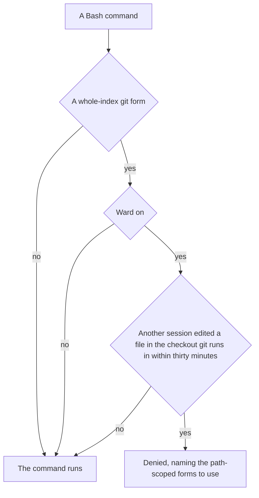

# Whole-index guard

Part of [Genshin mods](/docs/infra/claude-interface/genshin-mods). Several sessions share one checkout, so the index is shared too: `git add .` stages a peer's work, `git reset` unstages it and `git stash` sets it aside. An agent ran `git add -N .` then `git reset -q` and unstaged a peer's staged files, and prose alone did not hold, so the rule the git skill states moves to the call itself. The guard refuses the call while another session is live in the same checkout.

## How it works

Every Bash command is read before it runs, with the same reader the [disk-scan guard](/docs/infra/claude-interface/genshin-mods/disk-scan) uses: the command is split at its separators, a quoted shell command is read again on its own, and `git -C <dir>` and `git -c key=value` are skipped before the subcommand. `.`, `./`, `:/` and `:/.` are each read as every path of the checkout. A subcommand is refused when it is one of these whole-index forms:

- `add` with `.`, `-A`, `--all`, `-u` or `--update` with no path, or `-N` / `--intent-to-add` with `.` or no path;
- `reset` with no path, except `--soft`, which moves HEAD alone and leaves the index as it is. A path is one after `--`, or a second operand with no `--`, since git reads the first as a commit or a path and every one after it as a path; a lone operand may be a commit, so it is refused;
- `restore` with `.`, staged or not;
- `stash` in any form;
- `checkout .` and `checkout -- .`;
- `clean`, except a dry run (`-n`, `--dry-run`).

Path-scoped forms (`git add path`, `git restore --staged path`, `git reset -- path`, `git reset HEAD path`, `git checkout -- path`) and read-only git (`status`, `diff`, `log`) are never refused.

The refusal applies only while the ward's record file shows another session that edited a file inside this checkout in the last half hour. The checkout is the folder with the `.git` above the folder git runs in, a worktree's included: the session's working directory, moved by a `cd` earlier in the same command and then by each of git's `-C` folders, so `git -C ../other clean` is checked against the other checkout's peers. A `cd` to a home folder (`~`) or back (`-`) is not followed. A session alone in its checkout runs every git command. With the [ward](/docs/infra/claude-interface/genshin-mods/ward) off nothing is recorded, so the guard lets every command through.

A refused command is denied with the form it used and the path forms to use instead: `git add <path>`, `git reset -- <path>` and `git commit -m "…" -- <path>`, with the git skill's rule named as the owner of the list.

## When it does not refuse

- A session alone in its checkout, or a checkout whose only recent edits are the session's own.
- A path-scoped form, a read-only command, or a commit by pathspec.
- A `git reset --soft` with no path, which moves HEAD alone: it changes no index entry a peer staged, so the commit it leaves is the session's to make.
- Any failure of the guard itself lets the command through, as the other guards do.

## Key files

| File                                                              | Role                                                             |
| :---------------------------------------------------------------- | :--------------------------------------------------------------- |
| `packages/genshin-mods/src/services/ward/registerWholeIndex.ts`   | The Bash call hook: denies a refused form while a peer is live   |
| `packages/genshin-mods/src/services/ward/getWholeIndexRefusal.ts` | The pure check over the command's text, and the deny message     |
| `packages/genshin-mods/src/services/ward/getCheckoutPeer.ts`      | Whether the ward's records show another session in this checkout |
| `packages/genshin-mods/src/services/ward/getCheckoutRoot.ts`      | The checkout a session's working directory sits in               |
| `packages/genshin-mods/src/services/shell/getShellRefusal.ts`     | The segment, quoting and nesting reader both shell guards share  |
| `packages/genshin-mods/src/services/shell/joinDirectory.ts`       | A folder a `cd` or a `-C` names, joined onto the one before it   |

## Notes

- A peer is seen only through the ward's records, which hold the edits made by the Edit, Write and NotebookEdit tools. A peer that only ran git, with no edit, is not seen, and the git skill's rule still applies to it.
- The records are read once per refused form, never for an allowed command, so an ordinary git command costs only the text check.
