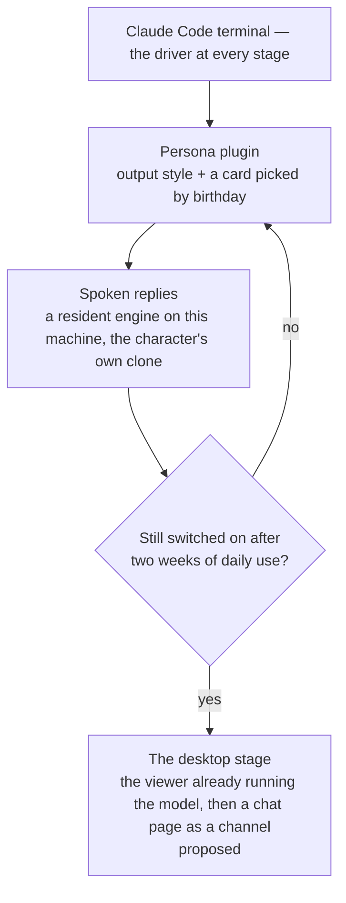

# Claude interface

The wish list was personality (a Genshin character, changing with the calendar), a spoken voice, and eventually a companion on the desktop. The constraint was maintenance: nothing that has to be re-implemented when the tool moves under it. **The terminal already exposes every hook the wish list needs, so what shipped is one plugin and nothing in the estate, with the last stage behind a named gate.**

The built stages have their own pages: the [persona plugin](/docs/infra/claude-interface/persona-plugin) and [spoken replies](/docs/infra/claude-interface/spoken-replies), with [per-character voices](/docs/infra/claude-interface/per-character-voices) covering how each character is read in a clone of their own voice and the [reference selection](/docs/infra/claude-interface/reference-selection) measuring which line of their performance the clone is conditioned on. This page holds the decision, the survey it rests on, and where the gated stage waits.

## What the terminal offers

Everything here is a Claude Code feature already, so it costs nothing to keep — one of them, channels, under a research-preview flag, which its own row says. What matters about each is the one fact that shaped a stage.

| Surface                    | The fact that matters                                                                                                                                                                                                                                                                                                |
| :------------------------- | :------------------------------------------------------------------------------------------------------------------------------------------------------------------------------------------------------------------------------------------------------------------------------------------------------------------- |
| Output styles              | A style file sets voice and tone every turn; "keep-coding-instructions" keeps the engineering behaviour; a plugin forces its own style on with "force-for-plugin".                                                                                                                                                   |
| Session-start hook         | Its stdout becomes context the model sees, and it fires on clear, compact and resume too — so what it prints survives a compaction.                                                                                                                                                                                  |
| MessageDisplay hook        | Receives each piece of a reply as it is displayed — cut at line breaks, with its message and index — and the display waits on its exit, so a script that reads one line of a reply runs before the reply is complete; the hooks of one message run concurrently, so what they hand on is ordered by the index.       |
| Plugin user configuration  | A manifest declares typed options; one marked sensitive lands in the credential store, and every option reaches a hook as an environment variable.                                                                                                                                                                   |
| Plugin dependency install  | A plugin root holding a package manifest and an npm lockfile gets a frozen install with lifecycle scripts off and a one-minute ceiling — which is why the speech engine's runtime and weights are installed by the plugin's `voice` verb into its state directory rather than shipped.                               |
| Plugin settings file       | May set two keys, both about subagents. The status line and the spinner are user settings, so the plugin's skill writes them on request.                                                                                                                                                                             |
| Voice dictation            | Built in, push-to-talk, no tokens and no cost. Input is solved without building anything.                                                                                                                                                                                                                            |
| Desktop app                | Reads the same settings, hooks and plugins as the CLI. A visual shell already exists; it changes the frame, not the personality.                                                                                                                                                                                     |
| Channels                   | An MCP server declaring the "claude/channel" capability pushes events into the session already open — the one way a line from outside reaches a session without opening a second one. In research preview, a plugin registers only under a development flag that asks a confirmation at every launch.                |
| Agent SDK and ACP adapters | The only way to drive a real session from a custom window, and it draws on the subscription's own usage limits — the separate monthly credit announced for it was paused before it took effect. This row is why the [SDK-driven companion](/docs/infra/rejected/sdk-driven-companion) is rejected rather than gated. |

There is no speech in the terminal itself; what links the two is a hook talking to a process on the same machine over a local socket, and that is enough.

## The stages and their gates

A stage opens on a fact about use or about the platform, never on a wish, and the diagram draws the one gate of use there is, in front of the desktop stage alone. The stages before it waited on the platform instead. The character voice waited on an inference engine that installs in one command with no Python environment, which Transformers.js shipping Chatterbox as a model class runnable from Node on the GPU answered: the engine's runtime is one `npm ci` into the plugin's state directory, run by the `voice` verb ([spoken replies](/docs/infra/claude-interface/spoken-replies)). The desktop stage waited on a platform move and the platform moved twice, once each way: driving a session from a window of our own became permitted rather than forbidden, and on the work's own usage limits rather than free beside them, which is a no under the rule that every stage is free ([SDK-driven companion](/docs/infra/rejected/sdk-driven-companion)), and channels gave a way to push a typed line into the terminal's own session, which is the yes. So the stage is two proposals behind a gate of use, and neither builds a window: the desktop Live2D viewer already running the character's model becomes [the stage](/docs/proposals/infra/viewer-stage) that each spoken line is shown and heard on, and a small local page becomes [the chat](/docs/proposals/infra/channel-chat) whose lines land in the session the terminal holds. A stage that closes its gate goes back one step, not to zero, and a stage's rollback is git.

## Not taken

- **Replacing the terminal with a home-built interface** over the Agent SDK: every turn out of the limits the work needs and a rewrite every time the harness changes shape, against a terminal that costs nothing to keep. The [SDK-driven companion](/docs/infra/rejected/sdk-driven-companion) is the same answer given once more at the desktop stage.
- **Third-party graphical front-ends**: every one surveyed solves parallel sessions and diff review, which the desktop app now does, and none carries personality. The Live2D companions written for coding agents spectate the same hooks this plugin does, and each brings a window, a renderer and a voice of its own — where the viewer already on the desk and the clone already built are both the better half, and the one thing they lack, a line typed into the running session, channels give.
- **A terseness plugin kept alongside**: two forces on the voice at once is how a persona becomes a long prompt. If terseness is wanted, it is one line in the output style.

## Notes

- Voice dictation costs one command and spends no tokens; it is the input half of the companion vision, already shipped.
- Of the platform surfaces this rests on, the output style is the one that has been removed and restored once already; if it goes again, the rules text moves into the session-start script beside the card, so that fallback is proven.
