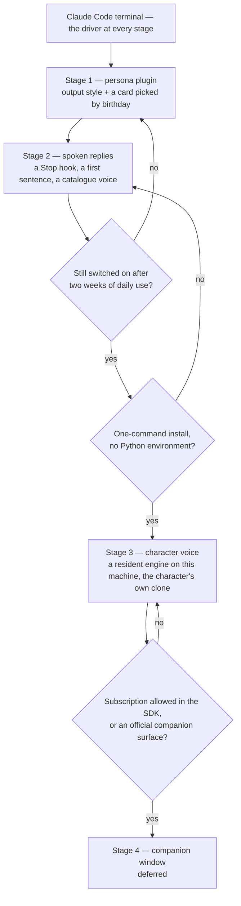

# Claude interface

The wish list was personality (a Genshin character rather than a terseness plugin, changing with the calendar), a spoken voice, and eventually a companion on the desktop. The constraint was maintenance: nothing that has to be re-implemented when the tool moves under it. The two pull against each other, and the survey below is where they met — **the terminal already exposes every hook the wish list needs, so what shipped is one plugin and nothing in the estate, with the last stage behind a named gate.**

The three built stages have their own pages: the [persona plugin](/docs/infra/claude-interface/persona-plugin) and [spoken replies](/docs/infra/claude-interface/spoken-replies), with [per-character voices](/docs/infra/claude-interface/per-character-voices) covering how each character is read in a clone of their own voice and the [reference selection](/docs/infra/claude-interface/reference-selection) measuring which line of their performance the clone is conditioned on. This page holds the decision, the survey it rests on, and where the gated stage waits.

## What the terminal offers

Everything here is a shipped Claude Code feature, so it costs nothing to keep. What matters about each is the one fact that shaped a stage.

| Surface                    | The fact that matters                                                                                                                                                                                                                                                                                                                                                                          |
| :------------------------- | :--------------------------------------------------------------------------------------------------------------------------------------------------------------------------------------------------------------------------------------------------------------------------------------------------------------------------------------------------------------------------------------------- |
| Output styles              | A style file sets voice and tone every turn; "keep-coding-instructions" keeps the engineering behaviour; a plugin forces its own style on with "force-for-plugin". The model is reminded of the style mid-conversation.                                                                                                                                                                        |
| Session-start hook         | Its stdout becomes context the model sees, and it fires on clear, compact and resume too — so what it prints survives a compaction.                                                                                                                                                                                                                                                            |
| MessageDisplay hook        | Receives each piece of a reply as it is displayed — cut at line breaks, the piece as "delta", its message and index within it, and the reply's turn as "turn_id" — and the display waits on its exit, so a script that reads one line of a reply runs before the reply is complete; the hooks of one message run concurrently, so what they hand on is ordered by the index, never by arrival. |
| Plugin user configuration  | A manifest declares typed options; one marked sensitive lands in the credential store rather than a settings file, and every option reaches a hook as an environment variable.                                                                                                                                                                                                                 |
| Plugin dependency install  | A plugin root holding a package manifest and an npm lockfile gets a frozen install with lifecycle scripts off and a one-minute ceiling when the plugin is copied into the cache — which is why the speech engine's runtime and weights are installed by the plugin's `voice` verb into its state directory rather than shipped.                                                                |
| Plugin settings file       | May set two keys, both about subagents. The status line and the spinner are user settings, so the plugin's skill writes them on request, its hook keeps the spinner on the session's character, and the persona page says how the path survives an update.                                                                                                                                     |
| Voice dictation            | Built in, push-to-talk, no tokens and no cost. Input is solved without building anything.                                                                                                                                                                                                                                                                                                      |
| Desktop app                | Reads the same settings, hooks and plugins as the CLI. A visual shell already exists; it changes the frame, not the personality.                                                                                                                                                                                                                                                               |
| Agent SDK and ACP adapters | The only way to drive a real session from a custom window, and both bill through an API key: the subscription login is not permitted for a third-party product, so a home-built driver pays API prices. This row gates stage 4.                                                                                                                                                                |

There is no speech in the terminal itself; what links the two is a hook talking to a process on the same machine over a local socket, and that is enough.

## The stages and their gates

Stages 1 and 2 were built together, because stage 2 was one Pulumi file and one hook. Each later stage opens only when the gate before it answers yes, and the answer is a fact about use or about the platform, never a wish: the character voice waited on an inference engine that installs in one command with no Python environment, and Transformers.js shipping Chatterbox as a model class runnable from Node on the GPU is what answered it — the engine's runtime is one `npm ci` into the plugin's state directory, run by the `voice` verb ([spoken replies](/docs/infra/claude-interface/spoken-replies)). The [companion window](/docs/infra/deferred/companion-window) waits on a platform move. A stage that closes its gate goes back one step, not to zero — the arrows are the whole rollback plan, and stage 3's rollback is git, because it replaced stage 2's service rather than adding beside it.

## Not taken

- **Replacing the terminal with a home-built interface** over the Agent SDK: API billing on every turn and a rewrite every time the harness changes shape, against a terminal that costs nothing to keep. The whole plan is built to avoid this.
- **Third-party graphical front-ends**: every one surveyed solves parallel sessions and diff review, which the desktop app now does, and none carries personality.
- **A terseness plugin kept alongside**: two forces on the voice at once is how a persona becomes a long prompt. The previous one was uninstalled and its marketplace entry removed, not just disabled; if terseness is wanted, it is one line in the output style.
- **A published voice plugin for stage 2**: the free ones reached Microsoft's neural voices through an unofficial endpoint that changed under them more than once; stage 2 used the supported API on a provisioned resource instead, and stage 3 removed the service altogether.
- **Keeping the Azure Speech path beside the clone**: no adapter kept "in case" — the account, its key output, the markup builder, the catalogue check and the generated voice table all went in the change that shipped the clone, because every one of them was an approximation of what the clone does directly, and the rollback plan is git.

## Notes

- Voice dictation costs one command and spends no tokens; it is the input half of the companion vision, already shipped.
- The one dependency on the platform is the output style, which has been removed and restored once already; if it goes again, the rules text moves into the session-start script beside the card — exactly how the terseness plugin worked — so the fallback is proven.
