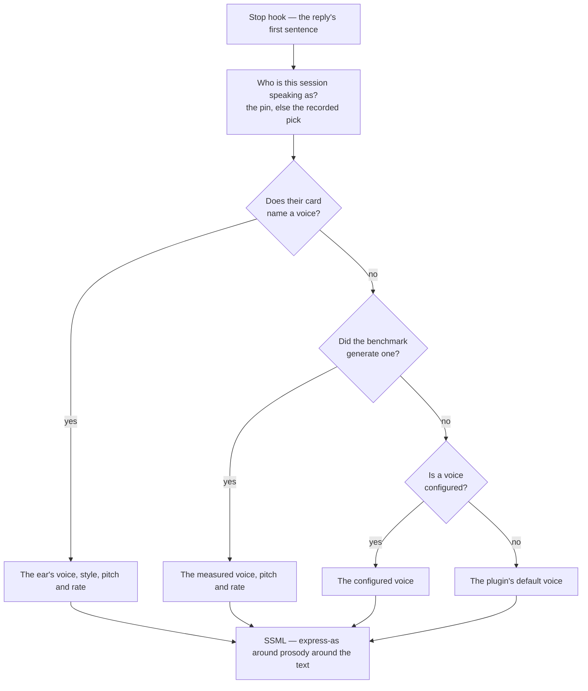

# Per-character voices

[Spoken replies](/docs/infra/claude-interface/spoken-replies) shipped with one voice for the whole roster: whoever the session picked, the same Australian English narrator read them. The persona changed and the voice did not, which is the one thing a spoken persona cannot afford.

**A character's voice is now their own.** It costs no new service, no new resource and nothing beyond the free tier the stage already sits on, because it spends the expressiveness the speech markup was always carrying. The voice comes from two files kept apart on purpose: the module the [voice match benchmark](/docs/infra/claude-interface/voice-match-benchmark) generates for the character from their own audio, and the card, where a person who listened writes the correction that overrules it ([generated artifacts](/docs/architecture/generated-artifacts)).

## The four levers

Everything here is one SSML element or attribute, and every one of them is free.

| Lever                                        | What it changes                                                                                                                                                     |
| :------------------------------------------- | :------------------------------------------------------------------------------------------------------------------------------------------------------------------ |
| The voice itself                             | Register and accent. The largest effect by far, and the catalogue carries enough English voices to give most of the roster its own.                                 |
| `mstts:express-as` `style` and `styledegree` | Temperament — cheerful, whispering, newscast — at an intensity from a hundredth to twice the voice's own definition. Only the voices that declare a style have one. |
| `prosody` `pitch`                            | Baseline pitch, within half to one and a half times the voice's own.                                                                                                |
| `prosody` `rate`                             | Speaking pace, within half to twice the voice's own.                                                                                                                |

**`role` is not among them.** The markup's fifth lever recasts the speaker as a girl, a boy or an older adult, and only the Chinese voices declare it. Replies are spoken in English, so it is unavailable here rather than unused.

## Where a voice comes from

The card wins, the generated measurement stands behind it, the user's configured voice stands in for a character neither has reached, and the plugin's own default stands behind all three — so setting the option overrides the characters nobody has voiced, never the ones somebody has.



The hook reads who the session is speaking as from what the session start already recorded, never by picking again: it runs after every reply, and the [lore pick](/docs/infra/claude-interface/persona-plugin) can reach the network.

## The field a card carries

Optional, and the ear's alone: a card names a voice only when someone listened and chose it over the measurement. The voice name, then any of the adjustments the markup takes. Pitch and rate are signed percentages **as numbers**, and the markup builder writes the sign:

```ts
voice: { name: "en-GB-SoniaNeural", pitch: -4, rate: -4, style: "sad" },
```

Like the spinner's lines, it never reaches the model — a character is never told the name of the voice reading them. An omitted adjustment is one the card did not make, so the voice keeps its own. The name is deliberately not checked against a union of known voices: the service gains and retires voices on Microsoft's schedule, so a copy of that catalogue in the repository would be wrong by the next patch, and the `voices` command asks the live list instead.

## How the roster is assigned, and what that is worth

Every generated voice is a **measurement**: the [voice match benchmark](/docs/infra/claude-interface/voice-match-benchmark) reads the character's own Japanese performance, measures every catalogue voice once, and writes the closest voice with the pitch and rate that take it the rest of the way. The first table shipped was judged from the game's metadata and the catalogue's descriptions, with nothing listened to; it was deleted when the measurement replaced it, because a judged value in an authored file reads as a person's choice.

**Nobody has listened yet.** A measured fit is a better starting point than a judged one and still not a heard one: the benchmark's page says what the ear owes it — three candidates confirmed per sampled character, never a hundred auditioned — and the card is where that confirmation goes.

The catalogue has fewer English voices than the roster has characters, so some voices read for more than one character, told apart by pitch and rate. Only one character speaks per session, so a shared voice is invisible in use.

## Checking the cards against the catalogue

Both ways a voice line can be wrong are silent — an unknown voice returns no audio at all, and a style the voice does not declare is dropped back to neutral — so there is a command that says so out loud:

```bash
node "${CLAUDE_PLUGIN_ROOT}/scripts/genshin.ts" voices
```

It lists the resource's voices live and reports every character whose voice — the card's, else the generated one — names one the resource does not have, or a style the voice does not declare. Nothing about the catalogue is kept in this repository: it gains and retires voices on Microsoft's schedule, and a copy would be wrong by the next patch. The command needs the endpoint and key in the environment, which is where a hook already finds them.

## Key files

| File                                                                  | Role                                                    |
| :-------------------------------------------------------------------- | :------------------------------------------------------ |
| `packages/genshin-persona/src/personaCards/*.ts`                      | The optional `voice` field, the ear's                   |
| `packages/genshin-persona/src/generated/personaVoices/`               | The measured voice, one generated module per character  |
| `packages/genshin-persona/src/services/readCharacterVoice.ts`         | The card's voice over the generated one                 |
| `packages/genshin-persona/src/models/SpeechVoice.ts`                  | The field's shape                                       |
| `packages/genshin-persona/src/services/getSsml.ts`                    | Style around prosody around the text, and the namespace |
| `packages/genshin-persona/src/services/readSessionCharacterName.ts`   | Who the session speaks as, without picking again        |
| `packages/genshin-persona/src/services/readSpeechVoiceDefinitions.ts` | The catalogue, read live                                |
| `packages/genshin-persona/src/services/getSpeechVoiceFinding.ts`      | What is wrong with one card's voice                     |

## Notes

- The volume the `volume` verb sets joins the pitch and the rate in the same `prosody`, so a card's adjustments and the person's loudness no longer nest two elements deep.
- The style namespace is declared on the markup only when a card named a style, so the common case is the same document it always was.
