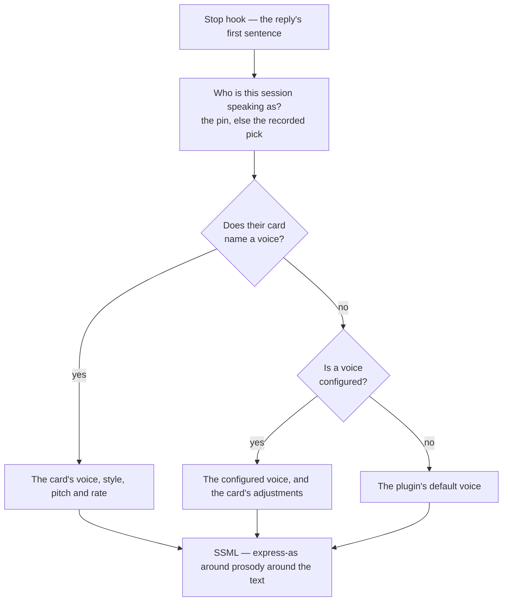

# Per-character voices

[Spoken replies](/docs/infra/claude-interface/spoken-replies) shipped with one voice for the whole roster: whoever the session picked, the same Australian English narrator read them. The persona changed and the voice did not, which is the one thing a spoken persona cannot afford.

**A character's voice is now part of their card.** It costs no new service, no new resource and nothing beyond the free tier the stage already sits on, because it spends the expressiveness the speech markup was always carrying.

## The four levers

Everything here is one SSML element or attribute, and every one of them is free.

| Lever                                        | What it changes                                                                                                                                                     |
| :------------------------------------------- | :------------------------------------------------------------------------------------------------------------------------------------------------------------------ |
| The voice itself                             | Register and accent. The largest effect by far, and the catalogue carries enough English voices to give most of the roster its own.                                 |
| `mstts:express-as` `style` and `styledegree` | Temperament — cheerful, whispering, newscast — at an intensity from a hundredth to twice the voice's own definition. Only the voices that declare a style have one. |
| `prosody` `pitch`                            | Baseline pitch, within half to one and a half times the voice's own.                                                                                                |
| `prosody` `rate`                             | Speaking pace, within half to twice the voice's own.                                                                                                                |

**`role` is not among them.** The markup's fifth lever recasts the speaker as a girl, a boy or an older adult, and only the Chinese voices declare it. Replies are spoken in English, so it is unavailable here rather than unused.

## Where a voice comes from

The card wins, the user's configured voice stands in for a card that names none, and the plugin's own default stands behind both — so setting the option overrides the characters nobody has written a voice for, never the ones somebody has.



The hook reads who the session is speaking as from what the session start already recorded, never by picking again: it runs after every reply, and the [lore pick](/docs/infra/claude-interface/persona-plugin) can reach the network.

## The line a card carries

The voice name first, then any of the adjustments as `key=value`, in any order, spelled the way the markup spells its own attributes:

```markdown
- Voice: en-GB-SoniaNeural style=sad pitch=-4% rate=-4%
```

Like the spinner's lines, it is lifted out of the context before the model sees it — a character is never told the name of the voice reading them. A key the parser does not know costs that one adjustment, not the voice.

## How the roster was assigned, and what that is worth

Every card in the roster carries a voice. The assignment was made from **what the game data records** — gender, body type, region — **and what Microsoft publishes about each voice**, and it was checked against neither.

**Nobody listened to anything.** The pitch and rate numbers are judgments, not measurements: no character's own audio was analysed, and no synthesized line was compared against one. They are a considered starting point and should be corrected by ear, one card at a time, by whoever is listening. That is the honest status of the whole table, and the [voice match benchmark](/docs/proposals/infra/voice-match-benchmark) is the proposal that would replace the judgement with a measurement.

Region steers the accent because it is the strongest axis for keeping two characters apart, following the game's own English casting where that casting is explicit. It is a device for distinctiveness, not a claim about anybody.

The catalogue has fewer English voices than the roster has characters, so some voices read for more than one character, told apart by pitch, rate and style. Only one character speaks per session, so a shared voice is invisible in use.

## Checking the cards against the catalogue

Both ways a voice line can be wrong are silent — an unknown voice returns no audio at all, and a style the voice does not declare is dropped back to neutral — so there is a command that says so out loud:

```bash
node "${CLAUDE_PLUGIN_ROOT}/scripts/genshin.ts" voices
```

It lists the resource's voices live and reports every card that names one the resource does not have, or a style the voice does not declare. Nothing about the catalogue is kept in this repository: it gains and retires voices on Microsoft's schedule, and a copy would be wrong by the next patch. The command needs the endpoint and key in the environment, which is where a hook already finds them.

## Key files

| File                                                                  | Role                                                    |
| :-------------------------------------------------------------------- | :------------------------------------------------------ |
| `packages/genshin-persona/cards/*.md`                                 | The `- Voice:` line, one per character                  |
| `packages/genshin-persona/src/services/parseSpeechVoice.ts`           | The line's grammar                                      |
| `packages/genshin-persona/src/services/getSsml.ts`                    | Style around prosody around the text, and the namespace |
| `packages/genshin-persona/src/services/readSessionCharacterName.ts`   | Who the session speaks as, without picking again        |
| `packages/genshin-persona/src/services/readSpeechVoiceDefinitions.ts` | The catalogue, read live                                |
| `packages/genshin-persona/src/services/getSpeechVoiceFinding.ts`      | What is wrong with one card's line                      |

## Notes

- The volume the `volume` verb sets joins the pitch and the rate in the same `prosody`, so a card's adjustments and the person's loudness no longer nest two elements deep.
- The style namespace is declared on the markup only when a card named a style, so the common case is the same document it always was.
