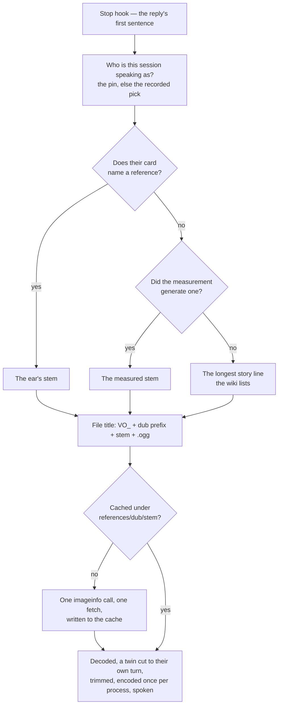

# Per-character voices

[Spoken replies](/docs/infra/claude-interface/spoken-replies) first shipped with one catalogue narrator for the whole roster, then with a catalogue voice per character bent by pitch and rate. The persona changed and the voice only approximated it, which is the one thing a spoken persona cannot afford.

**A character's voice is now their own.** The engine is a zero-shot cloner: handed a few seconds of a speaker, it reads any sentence in that speaker's voice. So what a character needs is one reference clip of their own performance, and that is exactly what the community wiki the plugin already reads cards from hosts — every voice line, as plain Ogg Vorbis, one file per line per dub.

## What a character's voice is

The voice comes from two sources kept apart on purpose, resolved in code and never by copying ([generated artifacts](/docs/architecture/generated-artifacts)):

- **The generated map**, `src/generated/PersonaReferenceMap.ts` — one entry per character holding the **stem** of the line the [reference selection](/docs/infra/claude-interface/reference-selection) measured as the most typically them, and the **likeness** its clone scored. Written by the measurement, never by hand.
- **The card's `reference`** — the ear's correction, and only that: a stem someone listened to and chose over the measurement. Deleting it restores the measurement; regenerating the map never touches a card.

A character neither has reached is spoken from the longest story line the wiki lists — spoken, never silent — and the `voice` verb says so when it is that character it proves the voice with.

## The stem, and the dub

A line's file on the wiki is `VO_`, a dub prefix, the character's name and the line's title: `VO_Clorinde More About Clorinde - 03.ogg` in English, `VO_JA_Clorinde More About Clorinde - 03.ogg` in Japanese. The **stem** is the part every dub shares — `Clorinde More About Clorinde - 03` — and it is what the map and a card hold. The plugin composes the file title from the stem and the dub the `voice` verb wrote, asks the wiki's API for that file's URL in one call, fetches it, and caches it under the state directory by dub and stem. Switching the dub needs no new measurement: the same line is fetched in the other performance.



## The field a card carries

Optional, and the ear's alone:

```ts
reference: "Clorinde More About Clorinde - 03",
```

Like the spinner's lines, it never reaches the model — a character is not told which line their voice is cloned from. It is not checked against a union of known stems: the wiki's pages move on the community's schedule, so the check is a command that asks the wiki, run over every character's effective reference in every dub ([reference selection](/docs/infra/claude-interface/reference-selection)).

## What the character's voice is, and where it lives

The voice is the actor's, and the game's publisher requires written consent from both the company and the artist for any generative use of it. What makes this defensible is unchanged from the day it was first proposed: the reference audio is fetched to this machine and stays here, the plugin ships nothing lifted from the game, and what is committed per character is a line's **title** and a number. The wiki hosting the clip is its exposure; a public Apache-2.0 package committing the same clip would be ours, copied into every installer's plugin cache — so the clip is not committed, however convenient that would be, and the cache is the person's to delete.

## What the likeness is worth

The number beside each stem is a validation, not a ranking: the cosine between the clone of one carrier sentence and the character's own profile, on the same speaker encoder that scored the catalogue voices before. The clone reads about 0.79 where a character's own clip reads about 0.98 and the best catalogue voice read 0.91 — the engine trades similarity for speed, and a second reference or a smaller language model moved it by nothing. **The ear keeps the last word**: a character whose clone scores low is a character whose reference the ear should look at, and the card is where the ear's answer goes.

## Key files

| File                                                                | Role                                                            |
| :------------------------------------------------------------------ | :-------------------------------------------------------------- |
| `packages/genshin-persona/src/generated/PersonaReferenceMap.ts`     | The measured stem and likeness per character, one generated map |
| `packages/genshin-persona/src/personaCards/*.ts`                    | The optional `reference` field, the ear's                       |
| `packages/genshin-persona/src/services/readCharacterReference.ts`   | The card's stem over the generated one, "" for neither          |
| `packages/genshin-persona/src/services/getWikiFileTitle.ts`         | The file title from the stem and the dub                        |
| `packages/genshin-persona/src/services/readWikiFileUrls.ts`         | The wiki's URL for each title, in one call                      |
| `packages/genshin-persona/src/services/readReferenceClip.ts`        | Fetch on first use, cache by dub and stem, decode, cut, trim    |
| `packages/genshin-persona/src/services/cutOpeningTurn.ts`           | A dialogue's first turn, cut at the first pause long enough     |
| `packages/genshin-persona/src/services/readWikiStoryLines.ts`       | A character's lines off their page, a twin's off the Traveler's |
| `packages/genshin-persona/src/services/readSessionCharacterName.ts` | Who the session speaks as, without picking again                |
| `packages/genshin-persona/src/models/PersonaReference.ts`           | The map entry's shape                                           |

## Notes

- The reference is trimmed to the engine's ten-second conditioning window, so a minute-long story line is read from its opening; the measurement embeds the same opening seconds, so what it chose is what the engine hears.
- The player twins are the one exception in how a reference is read. The wiki keeps no page for Aether or Lumine: their lines are the Traveler's, one story page per region linked from the Traveler's index, every line a dialogue with Paimon filed under one file per twin, with a word the twins say differently written as a choice. The plugin reads a twin's lines as the ones they open, with their own word choice, and cuts the clip at the first pause long enough to be Paimon's cue — the same cut the measurement makes before it profiles them — so a twin's reference is their opening turn and nothing of their companion's voice. A line Paimon opens is not theirs to be read from.
- The volume the `volume` verb sets is a gain on the samples, not a lever of the voice: the named levels the speech markup once took are gone, and the file on disk is unchanged for anyone who wrote a number.
