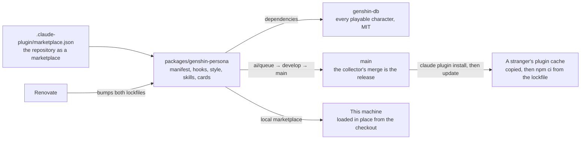
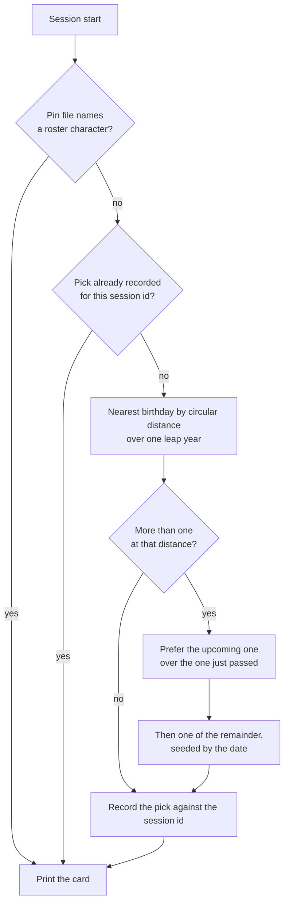
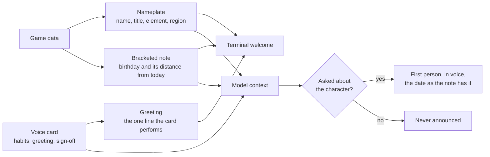

# Persona plugin

Stage 1 of the [Claude interface](/docs/infra/claude-interface). The plugin replaced the terseness plugin outright, and a new game patch costs one dependency bump this repository already automates, and nothing hand-written.

## Where it lives

Inside this monorepo, as a private workspace package that is also a plugin — a plugin is a directory with a manifest, and a marketplace is a repository with one file at its root naming where its plugins are. Everything a separate repository would need — dependency updates, formatting, lint, tests, the review pipeline — this one already runs.

The root manifest is the one file outside the package, and it is the one path the tool fixes: `.claude-plugin/marketplace.json` at the repository root names the repository as the marketplace `esposter`, owned by Esposter, with the package as its one plugin. It lives beside the agent tree rather than inside it ([agent configuration](/docs/architecture/agent-configuration)).



Two consequences shape the package, both forced by the remote install running a frozen `npm ci` in the copied plugin:

- **The dependency is a plain semver range, not a catalog entry.** npm cannot read the workspace catalog protocol, so this is the one manifest in the repository whose dependency states its own range; Renovate moves it, and the npm lockfile beside it, exactly as it moves everything else.
- **The package declares no devDependencies.** A `workspace:` range would fail the same `npm ci`, so its tooling — Vitest, TypeScript, the shared configuration — resolves from the repository root's own installs, which is where node's lookup lands after the package's empty `node_modules`. Two lockfiles describe one dependency: the workspace lockfile serves the install here, the npm lockfile every cached install elsewhere, and neither is edited by hand.

On this machine the checkout is added as a local marketplace and the plugin installed from it. A plugin whose source is a relative path inside a directory marketplace is **loaded in place**: the CLI records a cache entry keyed by the checkout's commit, but reads the files from the checkout, so a pull that changes the plugin takes effect at the next session start with no step to repeat. Elsewhere the release is a merge to `main`, which the [review collector](/docs/infra/review-collector) performs; an installed copy follows the marketplace on the tool's next plugin update.

## Installable by anyone

The repository is public, so the marketplace is too: two commands, no clone of their own.

```bash
claude plugin marketplace add Esposter/Esposter
claude plugin install genshin-persona@esposter
```

The install copies the plugin into the plugin cache and, because the plugin root holds a package manifest and an npm lockfile, runs a frozen npm install there with lifecycle scripts off and a one-minute ceiling — the game-data package installs in a few seconds. What the public copy must not contain is as fixed as what it must: no image, audio or text lifted from the game. The character data arrives through the dependency, the voice cards are written in our words about how a character speaks, and the voice of the deferred [character voice](/docs/infra/deferred/character-voice) never enters the repository at all.

## The roster is a dependency

The game-data package the community maintains under MIT ships every playable character as bundled JSON — name, title, element, region, birthday and the patch that introduced them — and follows each game patch within days. The hook loads that package from the plugin's own installed dependencies through `require`, rather than a static import, so a missing install fails inside the script where the fallback card is instead of at link time before anything has run. There is no generated roster, no generator, and no test that the two agree. The cost is one JSON read at session start, under a second, far below anything a session notices.

A character with no card is fully usable — the data alone is a persona — which is what makes "every playable character" a property of the dependency rather than a backlog.

## How a session gets its character

The pick is **whoever's birthday is nearest to today**, so the character changes with the calendar rather than by a counter, and the card can say why — a bracketed note under the name, "[birthday 20 September, today]" or "[birthday 23 September, in 3 days]" — a line of context that is true today and false next week.



The edge cases, each decided and each covered by the pick's tests:

- **Several share the nearest birthday.** The upcoming one wins over the one just passed, because anticipation reads better than aftermath. Among what is left the choice is seeded by the date through a small string hash, so it feels random day to day and is identical for every session started that day.
- **The session crosses midnight.** The pick is recorded against the session id at startup and reused on every later start event — clear, compact, resume — so a compaction after midnight never swaps the character mid-conversation. Records older than a week are pruned on each start.
- **Year wrap and leap day.** Every month and day is measured as a day of one leap year, so late December and early January are neighbours and a 29 February is a day like any other.
- **A character with no birthday** — the Traveler — is never picked by distance, and is the fallback card when the data cannot be read, because the one character who is the player is the right one to have when the data is gone.
- **A pin names a character the roster does not hold.** The pin is ignored and the day's pick stands; the skill's `today` verb reports the stale pin.
- **The workspace is not installed** — a fresh clone before the first install — or **anything else fails.** A process-level handler registered before any work prints the Traveler card and exits zero. A session start is never blocked by its own decoration.

The hook reads one package and one state directory under the user's Claude home, no network: the pick records as tab-separated lines, a shape that cannot fail to parse, plus a pin file and a mute flag.

**Why a hook picks and not the model.** A skill the model chooses from would spend a decision every session on a question with a fixed answer. That is the [typed decisions](/docs/infra/typed-decisions) rule applied to the terminal, and a nearest-birthday lookup is the cheapest tier there is: code.

## The card is small, and authored last

The card the hook prints is a name, title, element and region, the birthday note, and — when the character has one — the authored voice card: three speech habits, a greeting and a sign-off, about fifty tokens. It is printed as the hook's JSON form, so the whole card reaches the model as context while the terminal shows the person a welcome of three lines — and no token is spent twice.

```text
✦ Clorinde — Candlebearer, Shadowhunter · Electro · Fontaine
[birthday 20 September, today]
State your dispute. Spare the details.
```

The welcome keeps two voices apart by shape. The nameplate and the bracketed note are the plugin's: who is speaking, and the date and its distance from today, written as a caption because a character does not announce their own birthday. The bare line is the character's, said to the person in the first person or addressed to them, and it is the one line of a card that is performed rather than described. The same split is a standing rule for the model: the note is never announced, and when the person asks about the character — the birthday, the home region, the title — the answer comes in voice, in the first person, with the date and the distance taken from the note as written rather than recomputed.



Personalisation goes wherever it costs the model nothing: the greeting, the status line and the spoken voice are all read by a person, never by the model, and the context budget stays at the card. The output style, forced on while the plugin is enabled with coding instructions kept, carries the standing rules: in character in prose, never in code, commits, commands or error text, with every fact a neutral reply would carry still carried. The published comparisons of persona prompts agree that a long character sheet degrades engineering output while a functional identity of a few lines does not.

The plugin's authoring skill keeps the hand-written half honest: the card shape and its ceiling, the sources a habit may be drawn from (the character's own in-game lines and story, described in our words, never quoted), and the rule that a card describes how the character speaks and never what the assistant should do. Its one command lists the characters that have no card yet, most recently released first, so authoring is a queue drained when someone feels like it and never a gate on a patch.

## The skill

`/genshin-persona:genshin` — plugin skills are namespaced by the plugin's name — runs the plugin's own script and relays its lines: the roster, today's pick, `pin` and `unpin`, `mute` and `unmute`. Every answer comes from the script, because the roster is game data nothing but the script has read.

## Key files

| File                                                               | Role                                                                                                 |
| :----------------------------------------------------------------- | :--------------------------------------------------------------------------------------------------- |
| `.claude-plugin/marketplace.json`                                  | The repository as the `esposter` marketplace, with this package as its one plugin                    |
| `packages/genshin-persona/.claude-plugin/plugin.json`              | The plugin manifest: discovery metadata and the three user-configuration options                     |
| `packages/genshin-persona/package.json`                            | The one dependency as a plain range; no devDependencies, so the npm lockfile stays honest            |
| `packages/genshin-persona/hooks/hooks.json`                        | The session-start hook and the asynchronous Stop hook                                                |
| `packages/genshin-persona/output-styles/traveler.md`               | The standing voice rules, forced on while the plugin is enabled                                      |
| `packages/genshin-persona/scripts/pick.ts`                         | The session-start entrypoint: resolve the character, print the card, never fail                      |
| `packages/genshin-persona/scripts/genshin.ts`                      | The skill's command: roster, today, pin, unpin, mute, unmute, and the uncarded queue                 |
| `packages/genshin-persona/scripts/status.ts`                       | The status line: the pin or the session's recorded name, from the state files alone                  |
| `packages/genshin-persona/src/services/pickCharacter.ts`           | The nearest-birthday pick and its two tie-breaks                                                     |
| `packages/genshin-persona/src/services/resolveSessionCharacter.ts` | Pin, then the session's record, then today's pick                                                    |
| `packages/genshin-persona/src/services/getSessionStartOutput.ts`   | The two readers' subsets: the whole card as context, the nameplate, note and greeting as the welcome |
| `packages/genshin-persona/skills/genshin/SKILL.md`                 | The user-facing verbs                                                                                |
| `packages/genshin-persona/skills/genshin-author/SKILL.md`          | How a voice card is written                                                                          |
| `packages/genshin-persona/cards/`                                  | Authored voice cards, one per character that has one                                                 |

## Notes

- Markdown files, a few scripts of a few dozen lines, and one Renovate-owned dependency in a workspace that already has hundreds; that is the whole maintenance surface.
- The status line shows the current name by reading the same per-session record and the pin, never the game data, so it stays cheap to redraw. A plugin cannot ship a status line, so the setting lives in user settings and points at the plugin's own script.
