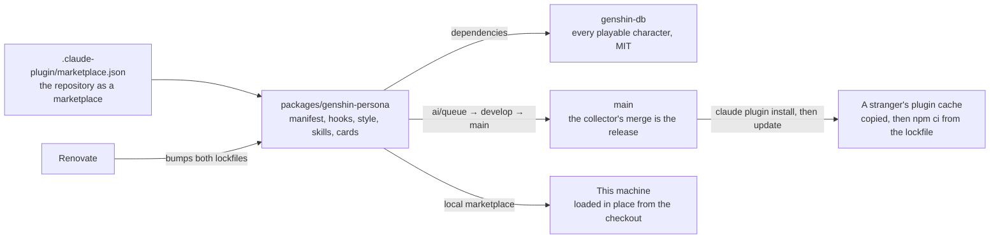
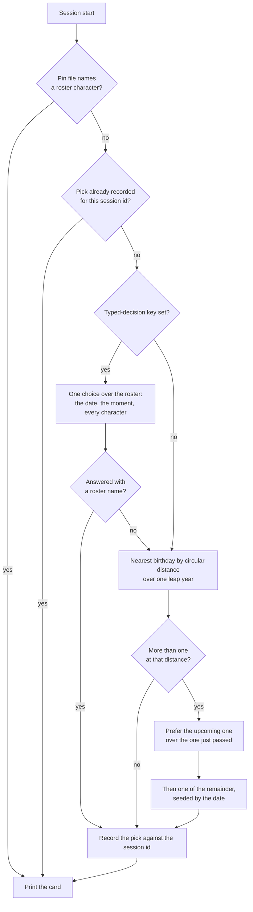
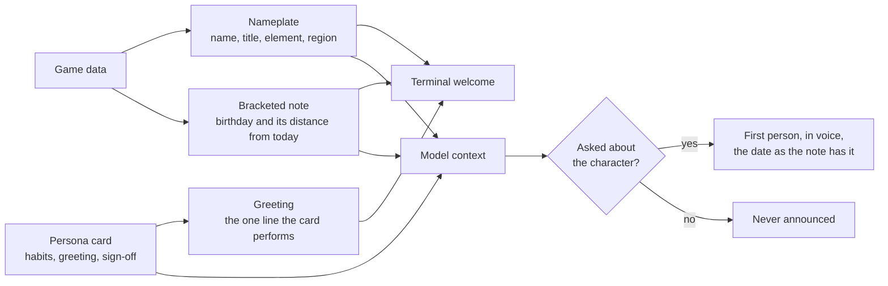
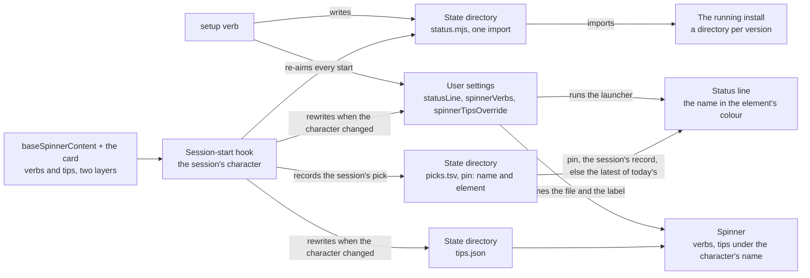

# Persona plugin

Stage 1 of the [Claude interface](/docs/infra/claude-interface). The plugin replaced the terseness plugin outright, and a new game patch costs one dependency bump this repository already automates, and nothing hand-written.

## Where it lives

Inside this monorepo, as a private workspace package that is also a plugin — a plugin is a directory with a manifest, and a marketplace is a repository with one file at its root naming where its plugins are. Everything a separate repository would need — dependency updates, formatting, lint, tests, the review pipeline — this one already runs.

The root manifest is the one file outside the package, and it is the one path the tool fixes: `.claude-plugin/marketplace.json` at the repository root names the repository as the marketplace `esposter`, owned by Esposter, with the package as its one plugin. It lives beside the agent tree rather than inside it ([agent configuration](/docs/architecture/agent-configuration)).



Two consequences shape the package, both forced by the remote install running a frozen `npm ci` in the copied plugin:

- **The dependencies are plain semver ranges, not catalog entries.** npm cannot read the workspace catalog protocol, so this is the one manifest in the repository whose dependencies state their own ranges; Renovate moves them, and the npm lockfile beside them, exactly as it moves everything else.
- **The package declares no devDependencies.** A `workspace:` range would fail the same `npm ci`, so its tooling — Vitest, TypeScript, the shared configuration — resolves from the repository root's own installs, which is where node's lookup lands after the package's empty `node_modules`. Two lockfiles describe the same dependencies: the workspace lockfile serves the install here, the npm lockfile every cached install elsewhere, and neither is edited by hand.

On this machine the checkout is added as a local marketplace and the plugin installed from it. A plugin whose source is a relative path inside a directory marketplace is **loaded in place**: the CLI records a cache entry keyed by the checkout's commit, but reads the files from the checkout, so a pull that changes the plugin takes effect at the next session start with no step to repeat. Elsewhere the release is a merge to `main`, which the [review collector](/docs/infra/review-collector) performs; an installed copy follows the marketplace on the tool's next plugin update.

## Installable by anyone

The repository is public, so the marketplace is too: two commands, no clone of their own, and no listing in Anthropic's own directory, which was [decided against](/docs/infra/rejected/official-plugin-directory).

```bash
claude plugin marketplace add Esposter/Esposter
claude plugin install genshin-persona@esposter
```

The install copies the plugin into the plugin cache and, because the plugin root holds a package manifest and an npm lockfile, runs a frozen npm install there with lifecycle scripts off and a one-minute ceiling — the game-data package installs in a few seconds. What the public copy must not contain is as fixed as what it must: no image, audio or text lifted from the game. The character data arrives through the dependency, the persona cards are written in our words about how a character speaks, and the voice of the deferred [character voice](/docs/infra/deferred/character-voice) never enters the repository at all.

## The roster is a dependency

The game-data package the community maintains under MIT ships every playable character as bundled JSON — name, title, element, region, birthday, affiliation, weapon, constellation and the patch that introduced them — and follows each game patch within days. The hook loads that package from the plugin's own installed dependencies through `require`, rather than a static import, so a missing install fails inside the script where the fallback card is instead of at link time before anything has run. There is no generated roster, no generator, and no test that the two agree.

Loading that package is almost the whole cost of a start — the better part of a second, against milliseconds for the query it then answers — so the roster is read once per installed version and kept in the state directory, which takes a warm start down to a fraction of that. The cache's file name carries the version off the data package's own manifest, so a bump invalidates it by itself and a write prunes every other version's copy: nothing is generated, nothing is checked in, and no step is added to the bump.

A character with no card is fully usable — the data alone is a persona — which is what makes "every playable character" a property of the dependency rather than a backlog.

## How a session gets its character

By default the pick is **whoever's birthday is nearest to today**, so the character changes with the calendar rather than by a counter, and the card can say why — a bracketed note under the name, "[Birthday: 20 September, today]" or "[Birthday: 23 September, in 3 days]" — a line of context that is true today and false next week. Every session started on one day gets the same answer, because the pick is a function of the date alone.

With a [typed-decision](/docs/infra/typed-decisions) key in the plugin's options, the session's character is **picked by lore** instead: one choice question over the whole roster, each character an option described by **the habits their card was written with** — how they actually are to talk to — with the game's own line about them standing in only for a character nobody has carded yet. Alongside it is the state code knows for certain: every character's facts, including the affiliation, weapon and constellation the data always held and nothing used to read, with their birthday measured from today, and the person's moment — the date, the weekday, the hour, the time zone and the locale, which is all the machine knows without asking. The description is deliberately absent from that state, because the habits say the same thing better and saying it twice was the largest thing the request carried for nothing. The answer is taken however spread its probabilities, because a confidence floor guards an action and a pick is a preference. The tier is asked afresh at every session start rather than once a day: a round trip of about a second is cheap enough to spend each time, and a little variety between the day's sessions is what the lore pick is for. The call is one attempt with a short ceiling, and anything short of an answer — no key, a timeout, a name the roster does not hold — falls back to the birthday pick, never to the failure card.



The edge cases, each decided and each covered by the pick's tests:

- **Several share the nearest birthday.** The upcoming one wins over the one just passed, because anticipation reads better than aftermath. Among what is left the choice is seeded by the date through a small string hash, so it feels random day to day and is identical for every session started that day.
- **The session crosses midnight.** The pick is recorded against the session id at startup and reused on every later start event — clear, compact, resume — so a compaction after midnight never swaps the character mid-conversation. Records older than a week are pruned on each start.
- **Year wrap and leap day.** Every month and day is measured as a day of one leap year, so late December and early January are neighbours and a 29 February is a day like any other.
- **A character with no birthday** — the Traveler — is never picked by distance, and is the fallback card when the data cannot be read, because the one character who is the player is the right one to have when the data is gone.
- **A pin names a character the roster does not hold.** The pin is ignored and the pick stands; the `today` command reports the stale pin.
- **The tier cannot be reached, or answers a name that is not in the roster.** The birthday pick stands in for that session, and the next start asks again. The `today` command asks the same way, so under the lore pick it shows one answer the next session may not repeat.
- **The workspace is not installed** — a fresh clone before the first install — or **anything else fails.** A process-level handler registered before any work prints the Traveler card and exits zero. A session start is never blocked by its own decoration.

The hook reads one package and one state directory under the user's Claude home: the pick records as tab-separated lines, a shape that cannot fail to parse, plus a pin file, a mute flag, a volume and the roster cached against the installed data package's version. Every write into that directory lands on a temp sibling and is renamed over its target, so a session killed part-way through leaves the previous file rather than half of this one. The cache is the file that needs it: the others are read a line and a field at a time and survive losing either, while half-written JSON would throw in every later session instead of being rebuilt. The one network call it may make is the lore pick's, and only with a key set.

**Why a hook picks and not the model.** A skill the model chooses from would spend a decision every session on a question with a fixed answer. That is the [typed decisions](/docs/infra/typed-decisions) rule applied to the terminal: a nearest-birthday lookup is the cheapest tier there is, code, and where a judgement is wanted it goes to the typed-decision tier at each start, never to the session's own model.

## The card is small, and authored last

The card the hook prints is a name, title, element and region, the birthday note, and — when the character has one — the authored persona card: three speech habits, a greeting and a sign-off, about fifty tokens. A card is a typed module at `src/cards/<slug>.ts`, so its shape is checked where it is written: a card matched by string prefixes fails silently in every direction, and a key spelled one letter wrong reaches the model as a speech habit rather than as an error. It is printed as the hook's JSON form, so the whole card reaches the model as context while the terminal shows the person a welcome of three lines — and no token is spent twice.

```text
✦ Clorinde — Candlebearer, Shadowhunter · Electro · Fontaine
[Birthday: 20 September, today]
State your dispute. Spare the details.
```

The welcome keeps two voices apart by shape. The nameplate and the bracketed note are the plugin's: who is speaking, and the date and its distance from today, written as a caption because a character does not announce their own birthday. The bare line is the character's, said to the person in the first person or addressed to them, and it is the one line of a card that is performed rather than described. The same split is a standing rule for the model: the note is never announced, and when the person asks about the character — the birthday, the home region, the title — the answer comes in voice, in the first person, with the date and the distance taken from the note as written rather than recomputed.



Personalisation goes wherever it costs the model nothing: the status line and the spoken voice are the person's alone, the greeting is performed to them out of the card the model is already holding, and the context budget stays at the card. The output style, forced on while the plugin is enabled with coding instructions kept, carries the standing rules: in character in prose, never in code, commits, commands or error text, with every fact a neutral reply would carry still carried. The published comparisons of persona prompts agree that a long character sheet degrades engineering output while a functional identity of a few lines does not.

The plugin's authoring skill keeps the hand-written half honest: the card shape and its ceiling, the sources a line may be drawn from (the character's own in-game lines and story, described in our words, never quoted), and the rule that a card describes how the character speaks and never what the assistant should do. Its commands are the loop: two queues list the characters with no card and the cards with no spinner lines, newest first, and one prints a character's own lines to write from, off the game data or, before the data carries them, off the community wiki. Authoring is a queue drained when someone feels like it and never a gate on a patch, and a patch refills it on the same cadence as the dependency bump.

The card is the per-character half of the persona and the output style is the invariant half, on purpose: a style per character would be the same lines in a file the tool cannot switch per session, and the card already reaches the model as context at every start. Beside the voice the model also gets the game's one-line description of the character, the lore it answers from when asked who it is.

## The commands

Every control is its own slash command — `/genshin-persona:today`, `roster`, `pin`, `unpin`, `mute`, `unmute`, `volume`, `setup` and `teardown`, namespaced by the plugin's name — because a verb hidden inside one command's argument is invisible in the menu and a bare invocation of that command has no meaning. Each is a skill of a command and a relay rule that the user alone can invoke, so its description is read by a person browsing the menu and never loaded into the session. One more skill, `genshin`, is the model's and hidden from the menu: it carries the table of verbs, so a request put in words — who is this, louder, pin Furina — reaches the right one. Every command runs the plugin's own script and relays its lines, because the roster is game data nothing but the script has read, and the script's last line says when the change lands.

## The settings a plugin cannot ship

A plugin's own settings file may set two keys, both about subagents, so the status line, the spinner verbs and the spinner tips are user settings. The `setup` command writes them and `teardown` removes exactly what `setup` wrote. The spinner keys are taken over outright — the built-in verbs and tips are replaced, not joined — while a status line that is not the plugin's is left alone, because replacing it would lose something the person wrote.

The spinner follows the character. Its content has two layers of the same shape: the base Teyvat verbs and tips in `baseSpinnerContent.ts`, which every character shows, and the character's own `verbs` and `tips` on their card — read by a person, never by the model, so the card's fifty-token ceiling is untouched. The session-start hook resolves the character, computes the spinner, and rewrites the two settings keys and the tips file only when they would change, so on most days it writes nothing. Settings load before hooks run, so a change lands at the next session start, which is the same lag the pick itself carries and matters only on the first session of a day the character changed.

The status line has one more problem to solve: an install lands under a directory named after its version, so a setting pointing straight at the plugin's script breaks on every update. The setting points instead at a launcher in the plugin's state directory, one import line, and the hook re-aims that launcher at the running install whenever it differs. An update is followed on the next session, with nothing for the person to repeat.

The line itself is the name in the element's colour, a 24-bit ANSI foreground the terminal paints, so a Pyro day reads red and an Electro day violet at a glance. It is redrawn on every assistant message and must stay cheap, so it never opens the game data, which costs the better part of a second to load: the state files carry the element beside the name, on each pick record and on the pin. The tool also runs it once when a session starts, in the same instant the hook is still writing that session's record, so the record it looks for may not be there yet. The latest pick of the day stands in — the same name under the birthday pick, the last one seen under the lore pick — so the line shows from the first frame on every start but the first of a day.



The revisit trigger is the tool letting a plugin ship these keys, or choose a spinner per session: the base content then moves into the plugin's settings file, and the launcher, `setup` and `teardown` are deleted.

## Key files

| File                                                               | Role                                                                                                   |
| :----------------------------------------------------------------- | :----------------------------------------------------------------------------------------------------- |
| `.claude-plugin/marketplace.json`                                  | The repository as the `esposter` marketplace, with this package as its one plugin                      |
| `packages/genshin-persona/.claude-plugin/plugin.json`              | The plugin manifest: discovery metadata and the user-configuration options                             |
| `packages/genshin-persona/package.json`                            | Every dependency as a plain range; no devDependencies, so the npm lockfile stays honest                |
| `packages/genshin-persona/hooks/hooks.json`                        | The session-start hook and the asynchronous Stop hook                                                  |
| `packages/genshin-persona/output-styles/traveler.md`               | The standing voice rules, forced on while the plugin is enabled                                        |
| `packages/genshin-persona/scripts/pick.ts`                         | The session-start entrypoint: resolve the character, print the card, never fail                        |
| `packages/genshin-persona/scripts/genshin.ts`                      | The commands' script: roster, today, pin, unpin, mute, unmute, volume, setup, teardown, and the queues |
| `packages/genshin-persona/scripts/status.ts`                       | The status line: the pin, the session's record, else the latest of today's, from the state files       |
| `packages/genshin-persona/src/services/formatNameplate.ts`         | The name in its element's colour, plain where the element has none                                     |
| `packages/genshin-persona/src/services/writeStatusLauncher.ts`     | The launcher the status line runs, re-aimed at the running install on every session start              |
| `packages/genshin-persona/src/models/PersonaCard.ts`               | The card's shape, split by reader: habits for the model, verbs, tips and voice for the person          |
| `packages/genshin-persona/src/services/getSpinner.ts`              | The base content with the character's own behind it, under the character's name                        |
| `packages/genshin-persona/src/services/writeSpinner.ts`            | The two spinner settings and the tips file, written only when they would change                        |
| `packages/genshin-persona/src/services/baseSpinnerContent.ts`      | The base Teyvat verbs and tips every character's spinner shows first                                   |
| `packages/genshin-persona/src/services/pickCharacter.ts`           | The nearest-birthday pick and its two tie-breaks                                                       |
| `packages/genshin-persona/src/services/resolveSessionCharacter.ts` | Pin, then the session's record, then a fresh pick                                                      |
| `packages/genshin-persona/src/services/pickCurrentCharacter.ts`    | The lore pick with a key, asked afresh each start, else the birthday pick                              |
| `packages/genshin-persona/src/services/getLorePickRequest.ts`      | The one choice over the roster and the state it is asked over                                          |
| `packages/genshin-persona/src/services/getSsml.ts`                 | The utterance as the speech service reads it, the volume wrapped in only when one was set              |
| `packages/genshin-persona/src/services/getSessionStartOutput.ts`   | The two readers' subsets: the whole card as context, the nameplate, note and greeting as the welcome   |
| `packages/genshin-persona/skills/<verb>/SKILL.md`                  | One slash command per verb, invocable by the user alone                                                |
| `packages/genshin-persona/skills/genshin/SKILL.md`                 | The model's router from a request in words to a verb, hidden from the menu                             |
| `packages/genshin-persona/skills/genshin-author/SKILL.md`          | How a persona card is written                                                                          |
| `packages/genshin-persona/src/cards/`                              | Authored persona cards, one typed module per character that has one                                    |

## Notes

- Markdown files, a few scripts of a few dozen lines, and Renovate-owned dependencies in a workspace that already has hundreds; that is the whole maintenance surface.
- `mute` and `unmute` decide whether the Stop hook calls the speech service at all, and `volume` shapes the voice through the speech markup's own levels, from `silent` to `x-loud` or a number of its scale, at no change to the call.
- The status line reads the pick records and the pin, never the game data, so it stays cheap to redraw; the element rides on those records so the colour costs no lookup.
