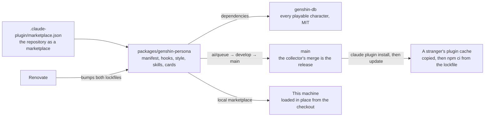
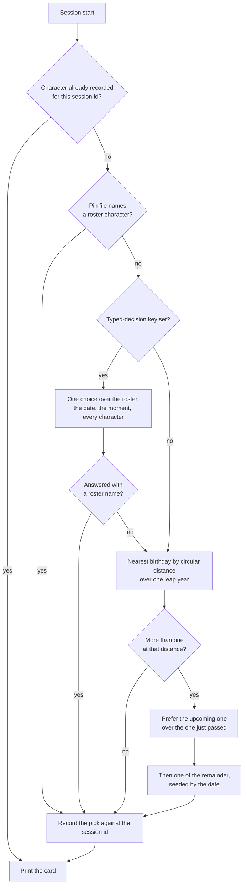
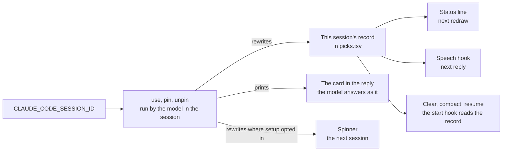
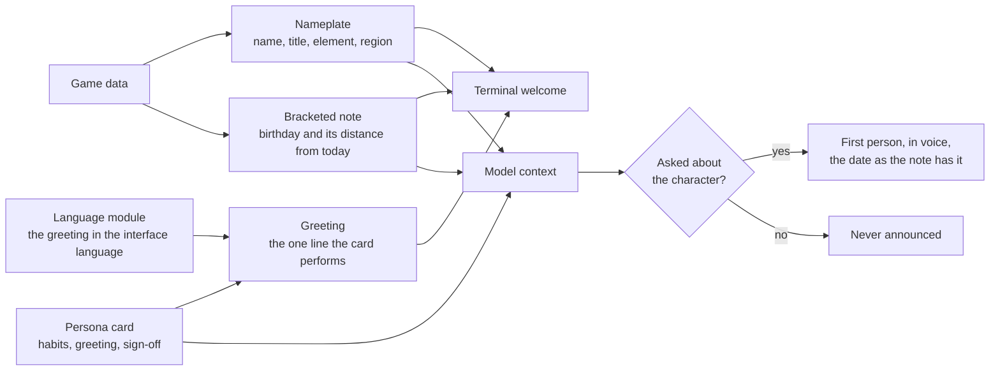
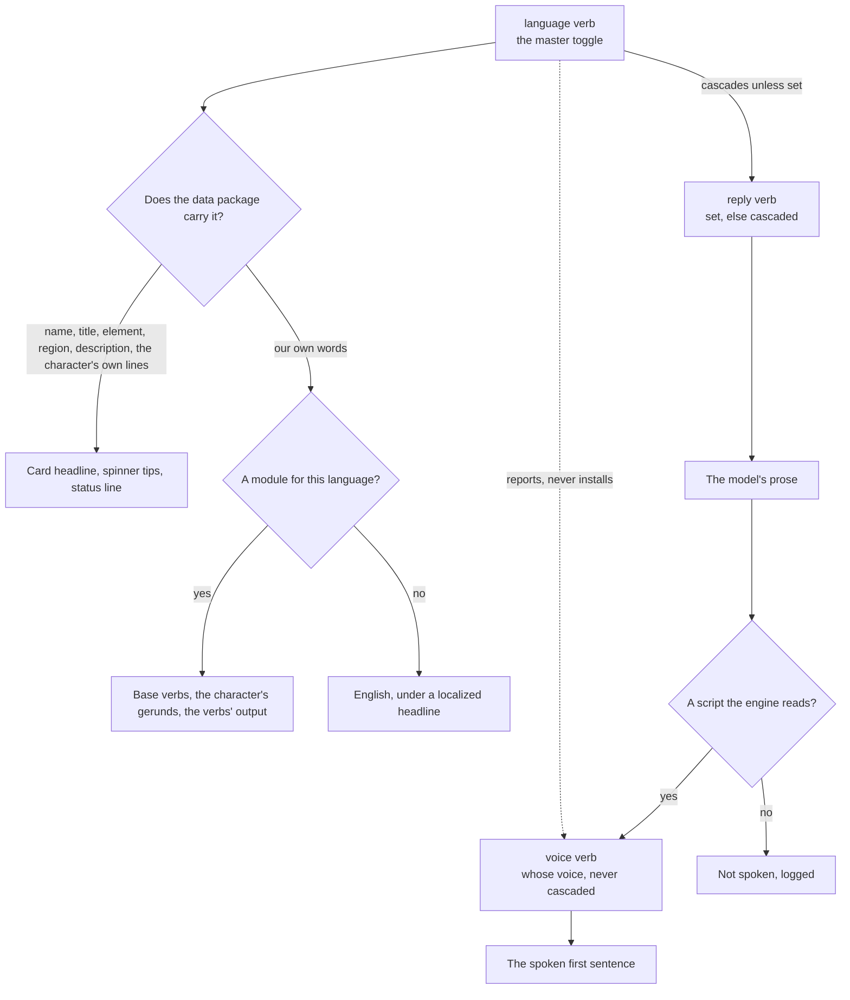
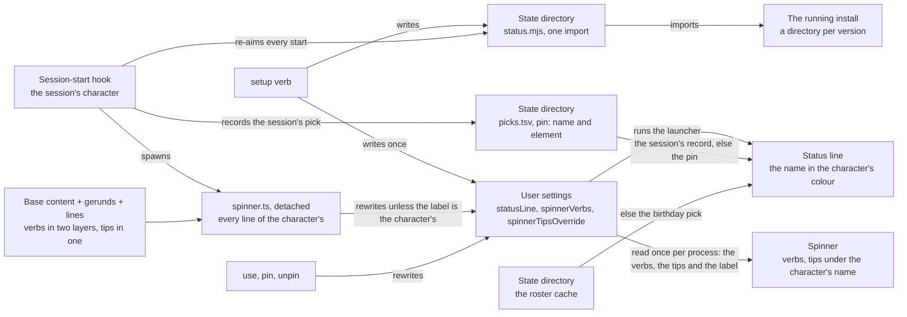

# Persona plugin

Stage 1 of the [Claude interface](/docs/infra/claude-interface). The plugin replaced the terseness plugin outright, and a new game patch costs one dependency bump this repository already automates, and nothing hand-written.

## Where it lives

Inside this monorepo, as a private workspace package that is also a plugin — a plugin is a directory with a manifest, and a marketplace is a repository with one file at its root naming where its plugins are. Everything a separate repository would need — dependency updates, formatting, lint, tests, the review pipeline — this one already runs.

The root manifest is the one file outside the package, and it is the one path the tool fixes: `.claude-plugin/marketplace.json` at the repository root names the repository as the marketplace `esposter`, owned by Esposter, with the package as its one plugin. It lives beside the agent tree rather than inside it ([agent configuration](/docs/architecture/agent-configuration)).



Two consequences shape the package, both forced by the remote install running a frozen `npm ci` in the copied plugin:

- **The dependencies are plain semver ranges, not catalog entries.** npm cannot read the workspace catalog protocol, so this is the one manifest in the repository whose dependencies state their own ranges; Renovate moves them, and the npm lockfile beside them, exactly as it moves everything else.
- **The package declares no devDependencies.** A `workspace:` range would fail the same `npm ci`, so its tooling — Vitest, TypeScript, the shared configuration — resolves from the repository root's own installs, which is where node's lookup lands after the package's empty `node_modules`. Two lockfiles describe the same dependencies: the workspace lockfile serves the install here, the npm lockfile every cached install elsewhere, and neither is edited by hand. It is also why the [reference selection](/docs/infra/claude-interface/reference-selection) that generates the plugin's reference map lives in the repository's `scripts` rather than here, and why the speech engine's runtime is installed by the `voice` verb into the state directory rather than declared: either would ride along into every install.
- **It consumes no workspace package, though one route exists.** A _published_ package such as `@esposter/shared` could be named by a plain range, and "linkWorkspacePackages" would resolve it to the sibling here while the cached copy fetched the registry build. Declined: every release of that package would move the range and leave the frozen npm lockfile disagreeing with the manifest, so the public install would fail until someone regenerated it by hand — a coupling to another package's release cadence that nothing the plugin needs from `shared` earns.

The same install rules out two shortcuts that get suggested: `pnpm-lock.yaml` is not a lockfile the installer reads (only bun's and npm's are), and no setting switches it to another package manager — "CLAUDE_PACKAGE_MANAGER" belongs to a third-party plugin's own scripts, not to the tool. `engines.node` is also not the root manifest's pin restated: the root states the version this repository runs on and `update:node` rewrites it, the plugin states the feature floor (Temporal) that travels with the copy, and a stranger's `npm ci` warns on it before a hook crashes.

A checkout declares itself: `.agents/settings.json` names the marketplace `esposter` with the relative source `.` and enables `genshin-persona@esposter`, so a clone opened in Claude Code installs the plugin at project scope once the person trusts the repository, on any machine and with no path anyone types. A plugin whose source is a relative path inside a directory marketplace is **loaded in place**: the CLI records a cache entry keyed by the checkout's commit, but reads the files from the checkout, so a pull that changes the plugin takes effect at the next session start with no step to repeat. Elsewhere the release is a merge to `main`, which the [review collector](/docs/infra/review-collector) performs; an installed copy follows the marketplace on the tool's next plugin update.

## Installable by anyone

The repository is public, so the marketplace is too: two commands for someone who wants the plugin without a checkout of their own — a clone needs neither, since its own settings declare both — and no listing in Anthropic's own directory, which was [decided against](/docs/infra/rejected/official-plugin-directory).

```bash
claude plugin marketplace add Esposter/Esposter
claude plugin install genshin-persona@esposter
```

The install copies the plugin into the plugin cache and, because the plugin root holds a package manifest and an npm lockfile, runs a frozen npm install there with lifecycle scripts off and a one-minute ceiling — the game-data package installs in a few seconds. What the public copy must not contain is as fixed as what it must: no image, audio or text lifted from the game. The character data arrives through the dependency, the persona cards are written in our words about how a character speaks, and the reference audio each character's voice is cloned from is fetched to the person's own state directory and never enters the repository at all ([per-character voices](/docs/infra/claude-interface/per-character-voices)).

## The roster is a dependency

The game-data package the community maintains under MIT ships every playable character as bundled JSON — name, title, element, region, birthday, affiliation, weapon, constellation and the patch that introduced them — and follows each game patch within days. The hook loads that package from the plugin's own installed dependencies through `require`, rather than a static import, so a missing install fails inside the script where the fallback card is instead of at link time before anything has run. There is no generated roster, no generator, and no test that the two agree.

Loading that package is almost the whole cost of a start — the better part of a second, against milliseconds for the query it then answers — so the roster is read once per installed version and kept in the state directory, which takes a warm start down to a fraction of that. The cache's file name carries the version off the data package's own manifest, so a bump invalidates it by itself and a write prunes every other version's copy: nothing is generated, nothing is checked in, and no step is added to the bump.

A character with no card is fully usable — the data alone is a persona — which is what makes "every playable character" a property of the dependency rather than a backlog.

## How a session gets its character

By default the pick is **whoever's birthday is nearest to today**, so the character changes with the calendar rather than by a counter, and the card can say why — a bracketed note under the name, "[Birthday: 20 September, today]" or "[Birthday: 23 September, in 3 days]" — a line of context that is true today and false next week. Every session started on one day gets the same answer, because the pick is a function of the date alone.

With a [typed-decision](/docs/infra/typed-decisions) key in the plugin's options, the session's character is **picked by lore** instead: one choice question over the whole roster, each character an option described by **the habits their card was written with** — how they actually are to talk to — with the game's own line about them standing in only for a character nobody has carded yet. Alongside it is the state code knows for certain: every character's facts, including the affiliation, weapon and constellation the data always held and nothing used to read, with their birthday measured from today, and the person's moment — the date, the weekday, the hour, the time zone and the locale, which is all the machine knows without asking. The description is deliberately absent from that state, because the habits say the same thing better and saying it twice was the largest thing the request carried for nothing. The answer is taken however spread its probabilities, because a confidence floor guards an action and a pick is a preference. The tier is asked afresh at every session start rather than once a day: a round trip of about a second is cheap enough to spend each time, and a little variety between the day's sessions is what the lore pick is for. The call is one attempt with a short ceiling, and anything short of an answer — no key, a timeout, a name the roster does not hold — falls back to the birthday pick, never to the failure card.



The edge cases, each decided and each covered by the pick's tests:

- **Several share the nearest birthday.** The upcoming one wins over the one just passed, because anticipation reads better than aftermath. Among what is left the choice is seeded by the date through a small string hash, so it feels random day to day and is identical for every session started that day.
- **The session crosses midnight.** Whatever the session is given — the pin's character or a pick — is recorded against the session id at startup and reused on every later start event — clear, compact, resume — so a compaction after midnight never swaps the character mid-conversation, and a pin set after the session started leaves it alone. Records older than a week are pruned whenever one is written.
- **Year wrap and leap day.** Every month and day is measured as a day of one leap year, so late December and early January are neighbours and a 29 February is a day like any other.
- **A character with no birthday** — Aether and Lumine — is never picked by distance, only pinned.
- **A pin names a character the roster does not hold.** The pin is ignored and the pick stands; the `today` command reports the stale pin.
- **The tier cannot be reached, or answers a name that is not in the roster.** The birthday pick stands in for that session, and the next start asks again. The `today` command run from a shell asks the same way, so under the lore pick it shows one answer the next session may not repeat; run inside a session it shows that session's own record.
- **The workspace is not installed** — a fresh clone before the first install — or **anything else fails.** A process-level handler registered before any work exits zero with nothing printed, the session starts with no character, and the output style answers plainly. A session start is never blocked by its own decoration.

The hook reads one package and one state directory under the user's Claude home: the pick records as tab-separated lines, a shape that cannot fail to parse, plus a pin file, a mute flag, a volume and the roster cached against the installed data package's version. Every write into that directory lands on a temp sibling and is renamed over its target, so a session killed part-way through leaves the previous file rather than half of this one. The cache is the file that needs it: the others are read a line and a field at a time and survive losing either, while half-written JSON would throw in every later session instead of being rebuilt. The one network call it may make is the lore pick's, and only with a key set.

**Why a hook picks and not the model.** A skill the model chooses from would spend a decision every session on a question with a fixed answer. That is the [typed decisions](/docs/infra/typed-decisions) rule applied to the terminal: a nearest-birthday lookup is the cheapest tier there is, code, and where a judgement is wanted it goes to the typed-decision tier at each start, never to the session's own model.

## Switching inside a session

The session's record is the one source every reader trusts — the start hook on a clear, compact or resume, the status line, the speech hook — so changing a session's character is rewriting that record, and the tool makes the record reachable from inside the session: every Bash tool subprocess carries the session id in `CLAUDE_CODE_SESSION_ID`, the same id the hook input names. `use <name>` rewrites this session's record and leaves the pin as it stands; `pin <name>` writes the pin for every later session and rewrites this one's record too; `unpin` deletes the pin and gives this session a fresh pick. Each prints the card, and the card printed in the conversation is the one the model answers as from that reply on — the output style's standing rule. The status line and the voice follow on their next run, and all three rewrite the spinner where `setup` opted the settings in; only the spinner waits for the next session to show, the tool's limit rather than the plugin's. A session that started before the pin keeps its own record, because its conversation started with that character.



## The card is small, and authored last

The card the hook prints is a name, title, element and region, the birthday note, and — when the character has one — the authored persona card: three speech habits, a greeting and a sign-off, about fifty tokens. A card is a typed module at `src/personaCards/<name>.ts`, so its shape is checked where it is written: a card matched by string prefixes fails silently in every direction, and a key spelled one letter wrong reaches the model as a speech habit rather than as an error. It is printed as the hook's JSON form, so the whole card reaches the model as context while the terminal shows the person a welcome of three lines — and no token is spent twice. A card printed later in the conversation, by `use`, `pin` or `unpin`, replaces it from the reply that relays it, which is the output style's standing rule and the whole cost of switching mid-session.

```text
✦ Clorinde — Candlebearer, Shadowhunter · Electro · Fontaine
[Birthday: 20 September, today]
State your dispute. Spare the details.
```

The welcome keeps two voices apart by shape. The nameplate and the bracketed note are the plugin's: who is speaking, and the date and its distance from today, written as a caption because a character does not announce their own birthday. The bare line is the character's, said to the person in the first person or addressed to them, and it is the one line of a card that is performed rather than described. The same split is a standing rule for the model: the note is never announced, and when the person asks about the character — the birthday, the home region, the title — the answer comes in voice, in the first person, with the date and the distance taken from the note as written rather than recomputed.



Personalisation goes wherever it costs the model nothing: the status line and the spoken voice are the person's alone, the greeting is shown to them in their own language out of the card the model is already holding, and the context budget stays at the card. The output style, forced on while the plugin is enabled with coding instructions kept, carries the standing rules: in character in prose, never in code, commits, commands or error text, with every fact a neutral reply would carry still carried. The published comparisons of persona prompts agree that a long character sheet degrades engineering output while a functional identity of a few lines does not.

The plugin's authoring skill keeps the hand-written half honest: the card shape and its ceiling, the sources a line may be drawn from (the character's own in-game lines and story, described in our words, never quoted), and the rule that a card describes how the character speaks and never what the assistant should do. Its commands are the loop: two queues list the characters with no card and the cards with no spinner verbs, newest first, and one prints a character's own lines to write from, off the game data or, before the data carries them, off the community wiki. Authoring is a queue drained when someone feels like it and never a gate on a patch, and a patch refills it on the same cadence as the dependency bump.

The card is the per-character half of the persona and the output style is the invariant half, on purpose: a style per character would be the same lines in a file the tool cannot switch per session, and the card already reaches the model as context at every start. Beside the voice the model also gets the game's one-line description of the character, the lore it answers from when asked who it is.

## The three languages

Three settings decide what a session reads, and they are deliberately not one axis — each answers a question the others cannot, and each costs something different to change.

| Tier      | Set                            | What it decides                      | Cost to change                                      |
| :-------- | :----------------------------- | :----------------------------------- | :-------------------------------------------------- |
| Replies   | anything                       | what the model writes prose in       | a line of context                                   |
| Interface | what the data package declares | every word the plugin puts on screen | a state file, and a module for our own words        |
| Dub       | four                           | whose voice reads a reply            | an install of a couple of gigabytes and a proof run |

**The set of interface languages is read off the data package's own language enum**, exported at runtime beside its query functions, so a bump that adds a language is a language the plugin speaks with nothing to edit — the same stance the roster takes, where a new patch is one dependency bump and no generated list. The `language` verb given no argument prints them, which is the whole of the discovery. Each is printed in its own words beside the word a person types for it — `Japanese (日本語)` — and either resolves, so what the verb invites is what it accepts.

Naming a language in its own words, and in any other's, is the runtime's job rather than a table of ours: `Intl.DisplayNames` already knows all of them. The one thing it needs that the data package does not carry is a BCP-47 tag per language name, which is the plugin's only hand-written list about languages and the only place a later version of that package could outrun it — a language with no tag yet is named by the package's own English word for it, which is also the word a person types, so the fallback is always something they recognise.

The master toggle sits at the middle tier and cascades upward only: setting the interface language sets the reply language with it, and either stays overridable on its own afterwards. That is the per-setting customization without a matrix of switches, because an override is only written when somebody wants the two to disagree — labels in one language and prose in another, which is a real want in both directions.

**The dub stays outside the cascade and is reported on rather than changed.** It answers a different question from a set of four, and a multi-gigabyte download must never be a side effect of a labels setting. So the interface verb ends by naming the state the dub is in: set to a language a dub exists for, it says so and names the command that installs it; set to any other, it says plainly that replies keep reading in whichever voice is already set up.



### What the data package answers, and what is ours

Passing the English name as the query language and the chosen one as the result language answers every field the card and the status line show — the name, the title, the element and region text, and the one-line description — and answers the character's own voice lines in the same call, at the same count as English. The spinner's tips are those lines, so the largest readable surface localizes for the cost of two options on a query that is already made. The roster is read twice rather than once: the English records are the identity, the localized records are what is read, and they are matched on the id the package gives rather than on the order it returns them in.

What is ours is one authored module per language under `src/localizations/`, named for the language the way a card is named for its character: that language's base Teyvat verbs, the person's half of each card keyed by the character's English name, the locale the runtime formats against, and every line the verbs themselves print. Only English fills every string; another language fills what it has translated and inherits the rest per string, so a half-translated language is a legal state rather than a missing key, and `untranslated` is the queue of characters it has no gerunds for, or a card whose greeting it has not written — the third queue beside `uncarded` and `unverbed`.

**Of the authored card, the greeting is translated and nothing else is.** The habits and the sign-off reach the model and not the person, and a model given them in English and asked to answer in Japanese answers in Japanese with the register intact, so they follow the reply language by themselves at no authoring cost. The greeting does not: the session-start hook prints it to the terminal as the welcome's third line, before the model has said a word, so it is a label a person reads in the interface language beside a headline and a note already in it. The language's module carries it per character, and a character it has no line for yet is greeted in the card's own words — one line in another script is a queue item, where a spinner mixing two scripts would be a broken one. The earlier rule, that the whole card stays English because the greeting is a line the model performs, is rejected: it was true of the model's copy and false of the person's, and the person's is the one that showed.

**The words the runtime already has are never ours.** `Intl.RelativeTimeFormat` says "today", "tomorrow", "in 2 days" and "2 days ago" in every language the package names, with the plural forms a hand-written template gets wrong in Russian or Polish, and `Intl.ListFormat` joins the list a verb offers a choice from in that language's own punctuation; `Intl.DisplayNames` names the languages themselves. A module carries one locale for all three and no string for any of them. An i18n library was weighed for the module's own strings and declined: what it adds is a JSON layout and CLDR plurals, and the plurals are the part `Intl` already gives, while a typed function per string has the compiler check every placeholder's arity, which the library's keyed lookup does not, and the status report composes its many fields in a function and in no message format. Nobody in the loop is a translator with a translation tool; the model fills the queue, and a typed module is the shape it fills best.

### Identity and display

The English name is the identity: the pin, the pick records, the reference clips, the card modules and every wiki lookup are keyed by it, and it is stable across a change of language. Beside it rides the name that language spells the character by, which is what the status line draws and the card heads. The status line's colour is looked up by the **English** name and element for the same reason — a localized name or element text matches no key in either colour map, and the fallback is an uncoloured nameplate, so the failure would have been silent. A typed name resolves against either, because the localized one is what a person sees and therefore copies.

A change of interface language rewrites the session's record, the pin and the spinner exactly as a change of character does, since all three carry the name being drawn. The roster cache is keyed by the data package's version **and** the language, so a change of either is a miss rather than a stale read. That name reaches a file path in the cache's own name, so the state file holding it is read only when it holds a bare run of letters, which every one of the package's names is; checking it against the package there is what costs the better part of a second, so a well-formed name it does not answer in falls back where it is used instead.

### What this deliberately does not reach

- **Claude Code's own interface stays English.** Its menus, its help, its permission dialogs and its own hints belong to the tool, and no plugin setting reaches them. What the plugin localizes is the whole of what a plugin owns. The revisit trigger is the tool taking a language setting of its own.
- **A language with no module reads in English for the words that are ours** — localized names, titles and tips over English verbs, the cards' gerunds among them, since nothing there is mixed — which is the intended half-translated state, not a failure.
- **A dub exists for four of the fifteen**, so a French or Thai interface with a Japanese voice is a legal state and the common one outside those four.
- **Replies in a non-Latin script are not spoken**, because the engine's own gate drops them, so a cascade to Japanese silences a set-up voice until [multilingual spoken replies](/docs/proposals/infra/multilingual-spoken-replies) lands; the verb warns at the moment the cascade would cause it.
- **A character the data package has no lines for shows their one-line description rather than English lines**, because the wiki that carries them is English only — its voice-over template holds one transcript per line beside the dub audio — and a spinner mixing two scripts reads worse than one line does. This is not a corner: the package's voice-overs lag its roster by several patches, so outside English about a fifth of the roster, the newest characters, shows the one line at any time. It is a bridge, not a design — a dependency bump that carries their lines retires it for those characters with nothing to edit, and the same bump refills it with the next patch's. The revisit trigger is the wiki, or another dependency, carrying localized transcripts.
- **A language switch reaches the spinner at the next session**, the same constraint every character switch already carries and for the same reason: the tool reads its spinner keys once per process.

## The commands

Every control is its own slash command — `/genshin-persona:today`, `roster`, `use`, `pin`, `unpin`, `mute`, `unmute`, `volume`, `language`, `reply`, `status`, `setup` and `teardown`, namespaced by the plugin's name — because a verb hidden inside one command's argument is invisible in the menu and a bare invocation of that command has no meaning. Each is a skill of a command and a relay rule that the user alone can invoke, so its description is read by a person browsing the menu and never loaded into the session. One more skill, `genshin`, is the model's and hidden from the menu: it carries the table of verbs, so a request put in words — who is this, louder, be Furina — reaches the right one, and a request that says nothing about how long is `use`, never `pin`. Every command runs the plugin's own script and relays its lines, because the roster is game data nothing but the script has read, and the script's last line says when the change lands.

One of them changes nothing. Every setting is its own file in the state directory, which is the right shape for writing one and no shape at all for reading them, and until `status` the only verb that reported anything was `voice`. It prints every knob with its **provenance** rather than its value alone, because a value and where it came from are different facts and only the second explains the behaviour: whether this session has a character of its own or is reading the pin, whether the reply language was set or cascaded, whether the status line and spinner in the user settings are the plugin's. It reads the same files the other verbs write, so there is no second record of the state to keep in step.

## The settings a plugin cannot ship

A plugin's own settings file may set two keys, both about subagents, so the status line, the spinner verbs and the spinner tips are user settings. The `setup` command writes them and `teardown` removes exactly what `setup` wrote. The spinner keys are taken over outright — the built-in verbs and tips are replaced, not joined — while a status line that is not the plugin's is left alone, because replacing it would lose something the person wrote.

The spinner follows the character. Its verbs have two layers of the same shape: the interface language's base Teyvat verbs, in its module under `src/localizations/`, and the character's own `verbs` — the card's under English and that module's otherwise — read by a person, never by the model, so the card's fifty-token ceiling is untouched. The verbs show both layers, the base ahead of the character's. The tips show one, and the card holds none: the tool puts one label in front of every tip in the override — a tip object carries none, and an absent label falls back to its own English "Tip", whatever the interface language — so every line of the character's runs under their name as the interface language spells it, off the game data or, before it carries them, the community wiki, each cut to the opening sentences that fit the five hundred characters a tip may run to, since the tool drops a longer one whole and a twin's lines are dialogues, and the list cut at the two hundred the tool reads. A card holds no tip of its own because a tip performed in our words from those same lines is a paraphrase shown beside its original. A character with no lines anywhere yet shows one tip, the game's one-line description of them, which the data package answers localized for everyone — still theirs, under their name, and a tip id the plugin recognises as its own, where an empty list would leave a spinner nobody owned. The authored base tips that once stood in, Teyvat's lines under the tool's own label, are rejected: fifteen lines per language to keep, nobody's, for a fallback one data field already fills. The lines cost the data package or a wiki round trip, and the session-start hook's stdout is the model's context, so the hook reads none of it: it spawns a detached script, the way it wakes the voice, which reads the lines and rewrites the two settings keys — and skips both when the label already names the character in the language in force, so on most days nothing is read and nothing is written. `use`, `pin` and `unpin` rewrite them the same way, inline; `setup` reads the spinner afresh every time, so a card's verbs edited since are picked up there. The tool reads both spinner keys once per process — a settings file is watched and most edits reach the running session, but these two do not, checked by eye after a rewrite — so the spinner is the one surface a switch reaches at the next session rather than in the reply. The tips are inline in the setting rather than in a tips file because the file bought nothing: read once per process too, and one more state path to keep readable from every shell. The spinner is also one user setting shared by every running session, so two sessions speaking as different characters take turns owning it, last writer wins. A rewrite decides on the settings it writes back rather than the ones it read the lines on: the keys are read again when the lines come in, so a `teardown` landing in that window is not undone by the spinner it interrupted.

The status line has one more problem to solve: an install lands under a directory named after its version, so a setting pointing straight at the plugin's script breaks on every update. The setting points instead at a launcher in the plugin's state directory, one import line, and the hook re-aims that launcher at the running install whenever it differs. An update is followed on the next session, with nothing for the person to repeat.

The line itself is the name in the character's own colour, a 24-bit ANSI foreground the terminal paints: the one colour the official art hangs on them — a hair, a coat, a signature accent — read off the card art into `CharacterColorMap`, so a Hu Tao day reads plum and a Nahida day mint at a glance, across the whole spectrum rather than the one band per element a roster this size would share out. Each sits in the middle of the lightness range so it stands on a dark terminal and a light one alike. The game publishes no colour per character, so every row is a read of the art, and the element's colour stands in for a character with no row yet: a new patch is a dependency bump and a row here, never a plain nameplate. It is redrawn on every assistant message and must stay cheap, so it never opens the game data, which costs the better part of a second to load: the character's colour is a static module keyed by the name, and the state files carry the element beside the name, on each pick record and on the pin, for the fallback. The tool also runs it once when a session starts, in the same instant the hook is still writing that session's record, so the record it looks for may not be there yet, and nothing redraws the line until the first message. What stands in is the hook's own order without the lore pick it cannot wait on: the pin, else the birthday pick over the roster cache, the plugin's own file beside the state. The line is therefore right from the first frame under the birthday pick, and under the lore pick shows the same name the hook falls back to until the tier's answer is recorded. It never stands in another session's record: a `use` is that session's alone.



The revisit trigger is the tool letting a plugin ship these keys, or choose a spinner per session: the base content then moves into the plugin's settings file, the launcher, `setup` and `teardown` are deleted, and two sessions stop sharing one spinner.

## Key files

| File                                                               | Role                                                                                                                                               |
| :----------------------------------------------------------------- | :------------------------------------------------------------------------------------------------------------------------------------------------- |
| `.claude-plugin/marketplace.json`                                  | The repository as the `esposter` marketplace, with this package as its one plugin                                                                  |
| `packages/genshin-persona/.claude-plugin/plugin.json`              | The plugin manifest: discovery metadata and the user-configuration options                                                                         |
| `packages/genshin-persona/package.json`                            | Every dependency as a plain range; no devDependencies, so the npm lockfile stays honest                                                            |
| `packages/genshin-persona/hooks/hooks.json`                        | The session-start hook and the asynchronous Stop hook                                                                                              |
| `packages/genshin-persona/output-styles/in-character.md`           | The standing voice rules, forced on while the plugin is enabled                                                                                    |
| `packages/genshin-persona/scripts/pick.ts`                         | The session-start entrypoint: resolve the character, print the card, never fail                                                                    |
| `packages/genshin-persona/scripts/spinner.ts`                      | The spinner rewrite the start hook spawns detached, since the lines cost the data package or the wiki                                              |
| `packages/genshin-persona/scripts/genshin.ts`                      | The commands' script: every verb, the language cascade, the status report, and the queues                                                          |
| `packages/genshin-persona/scripts/status.ts`                       | The status line: the state files and the roster cache read, the nameplate printed                                                                  |
| `packages/genshin-persona/src/services/getSessionNameplate.ts`     | The session's record, else the pin, else the birthday pick; never another session's record                                                         |
| `packages/genshin-persona/src/services/formatNameplate.ts`         | The name in the character's colour, the element's where they have none yet, plain where neither has one                                            |
| `packages/genshin-persona/src/services/CharacterColorMap.ts`       | The one colour the official art hangs on each character, read off the card art                                                                     |
| `packages/genshin-persona/src/services/writeStatusLauncher.ts`     | The launcher the status line runs, re-aimed at the running install on every session start                                                          |
| `packages/genshin-persona/src/models/PersonaCard.ts`               | The card's shape, split by reader: habits for the model, verbs and reference for the person; no lines                                              |
| `packages/genshin-persona/src/services/getSpinner.ts`              | Both verb layers; one tip layer under one label — the character's lines, cut at the tool's caps                                                    |
| `packages/genshin-persona/src/services/cutSpinnerTip.ts`           | A line cut to the opening sentences that fit a tip, rather than dropped whole by the tool                                                          |
| `packages/genshin-persona/src/services/readSpinner.ts`             | The card's verbs and every line of the character's, read into one spinner                                                                          |
| `packages/genshin-persona/src/services/writeSpinner.ts`            | The two spinner settings, written only when they would change; the tool's watch does the rest                                                      |
| `packages/genshin-persona/src/services/writeSessionSpinner.ts`     | The spinner for a character, where `setup` opted the settings in and the label is not theirs yet, checked again on the read the write is made from |
| `packages/genshin-persona/src/localizations/`                      | One authored module per language: its base Teyvat verbs, each character's gerunds, and every line the verbs print                                  |
| `packages/genshin-persona/src/models/Localization.ts`              | What a language's module holds, and what is absent from it because the data package answers it                                                     |
| `packages/genshin-persona/src/services/readLocalization.ts`        | The language's own words over English's, merged per string so a half-translated language shows each in the language it has                         |
| `packages/genshin-persona/src/services/readRoster.ts`              | The identity records and the localized ones, matched on the package's id and cached under the version and the language                             |
| `packages/genshin-persona/src/services/getCanonicalLanguage.ts`    | A language as the data package spells it, matched however it was typed                                                                             |
| `packages/genshin-persona/src/services/pickCharacter.ts`           | The nearest-birthday pick and its two tie-breaks                                                                                                   |
| `packages/genshin-persona/src/services/resolveSessionCharacter.ts` | The session's record, then the pin, then a fresh pick; whichever it is, the session records it                                                     |
| `packages/genshin-persona/src/services/recordSessionCharacter.ts`  | The one writer of a session's record, for the start hook and for `use`, `pin` and `unpin`                                                          |
| `packages/genshin-persona/src/services/pickCurrentCharacter.ts`    | The lore pick with a key, asked afresh each start, else the birthday pick                                                                          |
| `packages/genshin-persona/src/services/getLorePickRequest.ts`      | The one choice over the roster and the state it is asked over                                                                                      |
| `packages/genshin-persona/src/services/getSessionStartOutput.ts`   | The two readers' subsets: the whole card as context, the nameplate, note and greeting as the welcome                                               |
| `packages/genshin-persona/skills/<verb>/SKILL.md`                  | One slash command per verb, invocable by the user alone                                                                                            |
| `packages/genshin-persona/skills/genshin/SKILL.md`                 | The model's router from a request in words to a verb, hidden from the menu                                                                         |
| `packages/genshin-persona/skills/genshin-author/SKILL.md`          | How a persona card is written                                                                                                                      |
| `packages/genshin-persona/src/personaCards/`                       | Authored persona cards, one typed module per character that has one                                                                                |

## Notes

- Markdown files, a few scripts of a few dozen lines, and Renovate-owned dependencies in a workspace that already has hundreds; that is the whole maintenance surface.
- `mute` and `unmute` decide whether the Stop hook asks the synthesizer at all, `volume` is a whole number of a hundred applied as a gain on the samples, and `voice` is the one verb that installs anything ([spoken replies](/docs/infra/claude-interface/spoken-replies)).
- The status line reads the pick records, the pin and the roster cache, never the game data, so it stays cheap to redraw; the character's colour is a static map keyed by the name, and the element rides on those records for the fallback, so neither costs a lookup.
- `use` is the session-scoped switch and `pin` the global one; both take effect in the reply that runs them, and the spinner is the one surface that waits for the next session — read once per process, and one setting for every running session.
