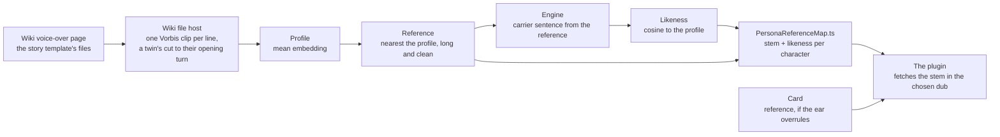

# Reference selection

A zero-shot clone is only as good as its reference, and a character has tens of lines to choose from — one-second interjections and minute-long stories, in registers from a whisper to a shout. Which one represents the voice is a measurement, not a guess, and this is the tooling that makes it: one `scripts` command, with nothing outside npm.

```bash
pnpm ai:voice-match [en | ja | ko | zh] [--write]          # measure the roster in one dub; --write generates the map
pnpm ai:voice-match en Aether Lumine --write                # the characters named alone, written into the map
pnpm ai:voice-match --check                                 # every character's reference, asked of the wiki in every dub
```

It measures over the wiki's files because the wiki is where the plugin fetches a reference from, and a measurement over the same file the plugin will use is the only one that measures the right thing. The game install, which the benchmark before it read through a Wwise decoder, is not needed by anything any more.

## What the measurement computes

For every character on the roster, in one dub:

1. **Their lines.** The story template of the character's voice-over page lists every line with the file its clip is kept under; the combat template after it is left out, since a reply is spoken in the story register. Each file's URL is asked of the wiki's API in one batched call, and each clip is fetched and decoded with the plugin's own Vorbis decoder — in memory, measured and dropped. A player twin's lines are the Traveler's dialogues with Paimon, and each clip is cut to the twin's opening turn before anything is read off it — the plugin's own cut, so the measurement and the reference are the same audio ([per-character voices](/docs/infra/claude-interface/per-character-voices)).
2. **The profile.** One unit embedding per clip through the speaker-verification encoder, over the clip's opening seconds, averaged and renormed — the centre of the character's voice. A character with fewer than a handful of usable clips is reported rather than profiled.
3. **The reference.** The clip nearest that centre by cosine, among those with at least a few seconds of speech at or above a signal-to-noise floor: the clip that is most typically the character, which is what a clone should be conditioned on.
4. **The likeness.** The reference trimmed to the engine's ten-second window, encoded into speaker tensors, one fixed carrier sentence synthesized from them through the same engine the plugin speaks with, and the output's embedding against the profile. Same encoder, carrier and trim for every character, so the numbers compare across the roster.

The profile is a working value and is not written anywhere. A run measures the roster whole, or only the characters named after the dub — for a page the wiki changed, or a character the last run could not reach — and a named run writes its entries into the map and keeps the rest.



## What it writes

One generated map, `packages/genshin-persona/src/generated/PersonaReferenceMap.ts`, read by the plugin and by nobody else: per character, the line's **stem** — its file name on the wiki without the dub prefix and extension, the same in every dub — and the **likeness** its clone scored. One map rather than a module per character, which is the exception the [generated artifacts](/docs/architecture/generated-artifacts) page states and gives the reason for. Precedence against a card's `reference` is resolved in code, never by copying ([per-character voices](/docs/infra/claude-interface/per-character-voices)).

The run prints one line per character — the stem, the likeness, how many clips the profile pooled and the reference's speech seconds and signal to noise — then the count measured and the characters it could not. `--write` generates the map at the end; a run without it is a dry measurement. Across the roster in English the likeness reads about 0.7 on average, from about 0.35 to about 0.9; a character the wiki has no voice-over page for yet is reported and left out of the map.

## The check

The stem is measured in one dub and serves the others by the wiki template's naming rule, and the wiki's pages move on the community's schedule: a line renamed or never dubbed is a character the plugin would fall silent on. `--check` measures nothing and asks the wiki's API, in batched calls, whether the line each character is read from — the card's, else the map's — is still a file in all four dubs, prints the ones that are not, and exits non-zero on any. Characters with no reference at all are listed as read from the longest story line. It is the check a card that gains or changes a `reference` runs, and the check a session runs after the map is regenerated.

## What comes back, and what never does

The decoded clips exist only in memory: fetched, decoded, measured and dropped, with no cache in the repository or beside it. The published plugin states it carries no game audio, and that holds for a temporary folder exactly as for a commit. What the run writes is one map of titles and numbers, cleared and rewritten whole. Only the models the encoder and the engine download stay outside the repository — in the system temp folder, or "VOICE_MATCH_MODELS_DIRECTORY" — because a model is a dependency rather than an output.

## Settled — it lives in `scripts`, not in the plugin

The runner reads the plugin's source — its wiki reading, its decoder, its engine loading, its card naming — and writes into the plugin's `generated/` folder, so the question of why it is not _inside_ the plugin is asked; the answer is the plugin's install. `claude plugin install` copies the plugin into its cache and freezes an `npm ci` there under a one-minute ceiling, which is why the package declares no devDependencies at all ([persona plugin](/docs/infra/claude-interface/persona-plugin)). The runner needs the speaker encoder and the in-process transformer library in its own `node_modules`, which would then install on every stranger's machine or break the install outright. So the tooling sits with the repository's own tooling in `scripts`, reaches into the plugin's source the way that package addresses itself, and the plugin receives only what it consumes: one map. The engine itself the plugin loads from a runtime its `voice` verb installs into the state directory ([spoken replies](/docs/infra/claude-interface/spoken-replies)), and the runner resolves the same package from its own dependencies through the same reader.

## Key files

| File                                                              | Role                                                            |
| :---------------------------------------------------------------- | :-------------------------------------------------------------- |
| `scripts/src/voiceMatch/index.ts`                                 | The runner: measure the roster, write the map, or check it      |
| `scripts/src/services/voiceMatch/measureCharacterReference.ts`    | Profile, reference, clone, likeness for one character           |
| `scripts/src/services/voiceMatch/readReferenceCandidates.ts`      | Every story line of one character fetched, decoded and measured |
| `scripts/src/services/voiceMatch/readMissingReferences.ts`        | Every reference asked of the wiki in every dub                  |
| `scripts/src/services/voiceMatch/getClipProfile.ts`               | Embedding, speech seconds and signal to noise off one clip      |
| `scripts/src/services/voiceMatch/getMeanEmbedding.ts`             | Clips pooled into one centre                                    |
| `scripts/src/services/voiceMatch/getPersonaReferenceMapSource.ts` | The map's source in the formatter's own shape                   |
| `scripts/src/services/voiceMatch/constants.ts`                    | Every floor, the carrier and the model id                       |
| `packages/genshin-persona/src/services/parseWikiStoryLines.ts`    | The story template's titles, texts and file stems               |
| `packages/genshin-persona/src/services/parseWikiTravelerLines.ts` | A twin's half of the Traveler's dialogues, by file and by word  |
| `packages/genshin-persona/src/services/cutReferenceClip.ts`       | The cut a twin's clip takes, in the runner as in the plugin     |
| `packages/genshin-persona/src/generated/PersonaReferenceMap.ts`   | The output: stem and likeness per measured character            |

## Notes

- The measurement runs on one dub and its stem serves every dub. Whether the Japanese performance of the _same_ line is the best Japanese reference is a refinement the runner can make by running per dub and keying the map by it; it starts with English, the language the ear settled on for the catalogue voices before it.
- The likeness is a validation number, not a ranking: there is no catalogue to rank any more, and one character's score is compared with their own next run, not with another character's.
- The engine's own variants were chosen the same way, on one character: the half-precision speech encoder and the 4-bit language model cost no likeness, and the half-precision vocoder cost a fifth of it, so the vocoder alone stays full precision. The 0.5B original checkpoint scored the same as Turbo and read at half the speed, so Turbo stands.
- The likeness is amplitude-blind: the embedder normalises what it hears, so a vocoder that returns near-silence scores as if it had spoken. The engine now moves down its [device ladder](/docs/infra/claude-interface/spoken-replies) on any synthesis that is not speech, and a run reports every move; the map's numbers and the vocoder comparison above predate that check on a machine whose GPU vocoder was returning silence, so both are due a re-run — the stems are not, since a reference is chosen from the wiki's clips before the engine speaks.
