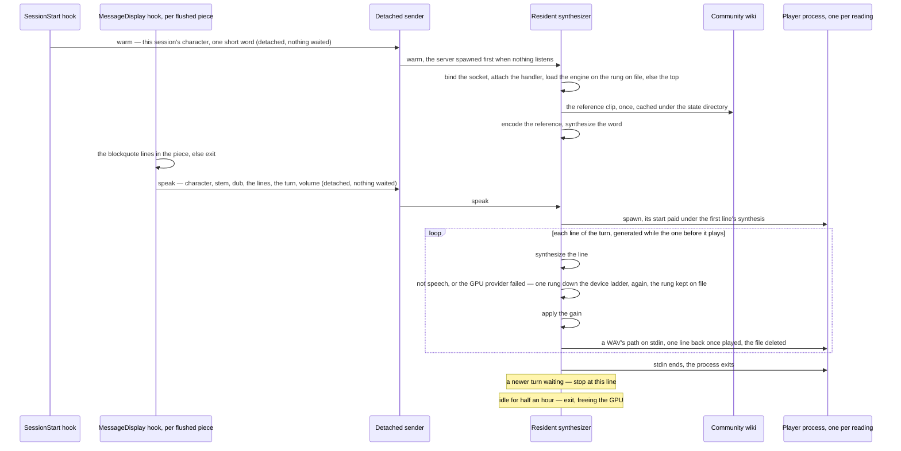
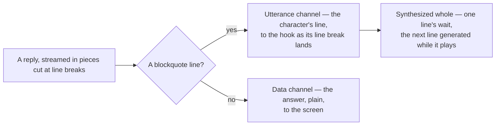
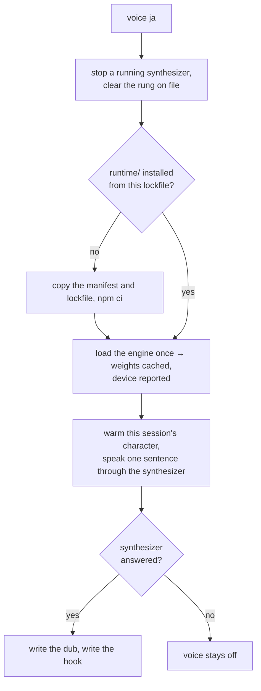

# Spoken replies

Stages 2 and 3 of the [Claude interface](/docs/infra/claude-interface): a reply is heard, in the voice of the character speaking it, from an engine that runs on this machine with no service behind it. Which line of a character's own performance the voice is cloned from is the [per-character voices](/docs/infra/claude-interface/per-character-voices) page's; this page is the reply's spoken channel, the hook, the process it talks to, the verb that installs the engine, and the gate.

Stage 2 shipped first through an Azure Speech free-tier account and a catalogue voice bent by pitch and rate, because a cloned voice needed an inference engine with a Python environment to keep alive. That gate closed when Transformers.js shipped Chatterbox — an MIT zero-shot voice cloner — as a native model class runnable from Node on the WebGPU provider, and the whole Azure path went with it: the account, its key, the markup, the catalogue benchmark. The rollback is git.

## How it works

1. **The spoken channel.** The output style confines the character to spoken lines — one blockquote each, one or two short sentences, in the first person, with no markup, code or number inside it, written for the ask rather than brought back — and what the ask is made of decides how much of the reply that is. An ask of the assistant, anything a reader will use, opens with one spoken line, answers plainly and may close with the card's sign-off; an ask of the character — a joke, a hello, an opinion — is answered wholly in spoken lines, a few at most, with nothing plain. Nothing else is written as a blockquote, and no reply repeats the card's greeting, which the welcome has already shown. What is spoken is a channel of the reply rather than a reading of it: each line short enough to synthesize whole and worth hearing, while an answer reads the way a neutral assistant's would.
2. **The MessageDisplay hook** — the tool hands it every piece of a reply as the reply is displayed, and a piece is whole lines, since the tool flushes at a line break — reads the two gates, which are file reads, takes the blockquote lines out of its piece with the markup the style forbids stripped anyway, and hands one request to a detached sender: the session's character, the line their voice is cloned from, the dub, the lines, the reply's turn and the volume, delivered over a local socket as one JSON line. The display waits on the hook, so the hook does nothing that can wait — reaching a synthesizer that is not running is the sender's, inside the load budget. It reads who the session speaks as from what the session start already recorded, never by picking again. The hook lives in user settings, written by the `voice` verb, because a hook on this event costs about a node start of display latency per line, which is the voice's to pay and not every plugin user's.
3. **The resident synthesizer** — one process per machine, spawned detached by whichever sender finds no server listening — holds the loaded engine. It binds the socket before the engine loads, so a second sender finds the address taken rather than loading a second engine, and a request arriving during the load waits for it. Per request it fetches the character's reference clip on first use and encodes it once per process, then **reads the lines in order** — each synthesized whole, checked for speech, given the volume as a gain and handed to one player process spawned for the reading, while the line after it is already being generated. It keeps **one turn pending**: a reply's later lines queue behind its first, a reply that lands while another is being read drops what of the older one is still waiting, and tells the reading already under way, which stops at the line it has reached rather than finishing over its replacement; a request with no turn — a warm, the `voice` verb's proof — is not a newer reply, and queues behind what waits. Idle for half an hour, it exits and frees the GPU.
4. **The SessionStart hook** spawns a detached warm request for the session's character, so the load, the reference's encoding and the first-synthesis cost are paid while the person reads the card and types, not on the first reply. What the warm synthesizes is one short word and nothing is kept of it: every spoken line is written for its ask, so no clip made ahead would be asked for again. Keeping the card's greeting from the warm and opening every first reply with it, so that line played with no synthesis, is rejected — it read the same line at every session start, in English under a welcome that had just shown it in the interface language, and opened on a hello when the ask was a joke. The hook itself waits on nothing: its stdout is the model's context.
5. **The gates** are the dub file the `voice` verb writes — a machine that never ran it has no engine, and every hook returns at once — and whether the session would hear anything at all. `mute` and `unmute` are a second flag file, and a `volume` of zero counts as the same silence, since it is a gain that multiplies every sample away. Both are checked before a piece is sent **and** before the session start wakes the engine, because every cost of a spoken line — the reference fetch, the graph load, every token — is paid before the gain is ever applied. `volume` is otherwise a whole number of a scale of a hundred.



The protocol is one JSON line in and one status line back — `ok` and the rung the engine speaks on, `error`, or `superseded` for a request a newer one replaced — so the server can be tried from a shell with nothing but the socket path: a named pipe on Windows, a socket file in the state directory elsewhere, and no port to collide on.

## The spoken channel

The convention, stated once so it can be lifted: **a reply has two channels, and one markup rule tells them apart.** The utterance channel is what a listener should hear — short, in the speaker's voice, written to be said — and the data channel is everything a reader needs, written plainly. The rule is one the writer follows every time and the reader applies to any piece of the text with no state; here, a blockquote line is an utterance and nothing else is written as one. What it buys: the utterance is short enough to synthesize whole, so the wait before the first sound is one line's rather than a reading's; it is complete the moment its line is, so a hook fed the text as it is written sends it before the reply is; the reader needs no model of the reply, so the hook is stateless and the piece it is handed can be any size; and the data channel is free of the voice, so the answer reads the way a neutral one would. How much of a reply is utterance is the ask's: a reply that is wholly the character's — a joke, a hello, an opinion — is all utterance and heard whole, and a reply a reader will use carries one line at each end of its data. The writer decides that with the whole conversation in front of it, which is why a classifier ahead of the reply — a prompt-submit hook putting the prompt to a typed decision and injecting the shape — is rejected: it would see the prompt alone, cost a call and a key on every turn, and decide what one rule of the style already decides. The same shape carries to any generated text a machine reads a part of — a notification's spoken summary, an alert's one line — one channel marked, the rest plain.



## The engine

Chatterbox Turbo through the ONNX runtime, a precision per component, each measured against a character's own voice before it was chosen ([reference selection](/docs/infra/claude-interface/reference-selection) is the measurement's page): the speech encoder in half precision, which cost no likeness; the language model the 4-bit variant, which cost none either and speaks twice as fast; the vocoder in full precision, because its half-precision variant is the one that moved the likeness, by a tenth to a fifth on the three characters it was re-measured on once the engine was judged by its sound — and it is the one variant this machine's GPU vocodes into speech rather than silence, so the trade it offers is the top rung's speed for that likeness, declined.

A line is spoken whole: generation ends at the model's end-of-sequence token, under a ceiling in proportion to the line's text with a floor for the shortest — a few tokens a character, above what English reads at. Two other shapes stand rejected. A fixed ceiling cuts a long sentence mid-word. No ceiling at all, with the checkpoint's repetition penalty as the only thing against a loop, lets a line the model finds no end for — a sentence in another script with one Latin word in it, or a reference too short to anchor an ending on — run for minutes, hold every reply behind it, and hand the vocoder a sequence many times longer than any sentence, which it rejects.

Where each component runs is a **device ladder**, fastest rung first, and the rung is chosen by the sound rather than by the load: a provider can load a graph and run it wrong without a word — this machine's WebGPU provider returns a constant near-silence from the full-precision vocoder on most runs and throws nothing, which the hook's silence hid for as long as nothing listened to the output. Every synthesis is checked for a loudest frame loud enough to hear and a quietest frame the speech floor below it — a sentence has pauses, noise has none — and one that fails moves the engine one rung down, releases the one it left, and runs again; a load that rejects moves it the same way, and so does a synthesis the GPU provider fails — this machine's WebGPU device is lost under load, and a lost device fails every synthesis after it — while a failure any other provider raises is the line's, since the CPU provider is deterministic and would raise it on every rung, so that line is dropped and the rung kept; the last rung failing is an error the log sees. The speech encoder runs on the CPU on every rung, since it runs once per character and the WebGPU provider rejects its graph.

| Rung                    | Language model | Vocoder |
| :---------------------- | :------------- | :------ |
| `webgpu`                | GPU            | GPU     |
| `webgpu-language-model` | GPU            | CPU     |
| `cpu`                   | CPU            | CPU     |

The rung the engine speaks on is the status line's second word and the `voice` verb's report, and every move down is a line in `voice.log`. It is also **kept**: the rung a synthesizer has spoken on is written to the state directory, and the next synthesizer starts there rather than walking the rungs above it again — on this machine that was a ten-second load and one silent synthesis at every warm, for an answer the machine had already given. A demotion rewrites the file, so it only ever moves down on its own; the one place a rung this machine once demoted is tried again is the `voice` verb, which clears the file and stops any running synthesizer before its proof, so a driver that has since started vocoding is found by setting the voice up again and by nothing that runs on a reply's path. On this machine — a laptop whose GPU is the processor's own — the engine loads from disk in seconds, encodes a reference in under a second, and on the middle rung reads a few times slower than real time: the language model on the GPU makes speech tokens at about half the rate they are spoken at, and the vocoder on the CPU costs in proportion to the reference's tokens and the unit's together, so for a short sentence the reference is the larger part of it — which is why the reference is trimmed to a few seconds and a spoken line is a sentence or two. A process's first call costs roughly twice that, which the warm request pays. The numbers themselves live in the committed bench beside the reference selection, `scripts/src/voiceMatch/synthesizer.bench.md`, which is where a session reads them rather than timing a sentence again; it measures the host, so it is switched off once committed and flipped on when the engine, its variants or the ladder change. Two other shapes were measured and rejected: the language model on the bottom rung, slower again by a factor, so the ladder's order stands; and two lines synthesized at once, hoping the GPU's language model and the CPU's vocoder would overlap, which took longer than one after the other because the vocoder's threads take every core.

## Setting it up

```bash
node "${CLAUDE_PLUGIN_ROOT}/scripts/genshin.ts" voice ja   # set up, or switch the dub
node "${CLAUDE_PLUGIN_ROOT}/scripts/genshin.ts" voice      # report what is installed
```

The plugin ships code and cards. The engine's runtime is a few hundred megabytes of native binaries and the weights a gigabyte and a half, and the plugin install runs a frozen `npm ci` under a one-minute ceiling — so none of it is a dependency of the plugin, and all of it is installed by the verb into the directory the plugin already owns for its state, the way a project's dependencies are installed beside it rather than shipped with it. Run with a dub, it first stops any synthesizer running and clears the rung on file — the proof below walks the device ladder from the top, and a running engine holds the runtime it may be about to replace — then does four things in order, each skipped when already done:

1. **The runtime.** The plugin carries a second, tiny manifest — `runtime/package.json` with its own npm lockfile — naming the one package the engine needs. The verb copies both into the state directory and runs `npm ci` there with lifecycle scripts off, since the ONNX runtime's binaries ship in the package and its only script fetches a CUDA build on Linux. Renovate moves the manifest's version like every other, and a bumped lockfile is picked up by the next `voice` run. The synthesizer resolves the package from that manifest and loads it by path; the plugin's own manifest never names it.
2. **The weights.** The runtime's own loader fetches what it is asked to load into a cache directory the verb points at the state directory, so downloading the weights is loading the engine once — in the verb's own process, which can print progress, where the detached synthesizer cannot. Exactly the variants the plugin declares are fetched and no other, and the device that loaded is reported.
3. **The proof.** The verb warms the synthesizer with the current session's character and has it speak one sentence, so the person hears the voice they set up before the first reply does — and the sentence comes through the resident process, the same path every reply takes.
4. **The dub.** One file holding the code — `en`, `ja`, `zh` or `ko`, the four the wiki hosts. Every request carries it, so a running synthesizer honours a switch without a restart. The choice is one for the whole roster. It is written **last**, because the file is the gate in front of every spoken reply: a run whose synthesizer never answered the warm leaves no file behind, so the replies stay silent rather than reaching a voice that cannot speak — and a session with no character to prove against writes it on its own way out, having nothing left to fail at.
5. **The hook.** Written with the dub: a launcher in the state directory, and one entry under the MessageDisplay event in user settings beside anyone else's, which the tool reads once per process — so replies are read from the next session. It is a user setting rather than the plugin's because the display waits on it, about a node start per line, a cost only a machine with a voice should pay.

```text
~/.claude/genshin-persona/
  picks.tsv · pin · muted · volume     ← as before
  voice-language                       ← the dub's code, and the gate
  status.mjs · speak.mjs               ← the launchers the two user settings run the scripts through
  device                               ← the rung the synthesizer last spoke on, where the next one starts
  runtime/                             ← the engine's package, npm-installed here
  models/                              ← the weights, the runtime's own cache layout
  references/<dub>/<stem>.ogg          ← one clip per line fetched so far
  voice.log                            ← why the synthesizer last refused, if it did
```



`teardown` removes the runtime, the weights, the references, the dub, the rung, the log and the hook entry — stopping a running synthesizer first, since the weights it holds open cannot be deleted under it — and leaves the pick records and the pin, which are the persona's rather than the voice's.

## Failure semantics

A reply that cannot be spoken is not spoken, and nothing waits: that rule is unchanged from the service it replaces, with a diagnosis on disk where there was none.

- **The server cannot load** — no runtime, a corrupt weight, a provider that rejects the graph: it writes the reason to `voice.log` and exits. Every sender then finds no server, spawns one, watches it die, and stays silent.
- **A synthesis fails** mid-request: a failure the GPU provider raises moves the engine one rung down, like silence, and the line is read there; any other is the line's, so that request is dropped, the reason logged, and the server keeps serving on the rung it is on — a line the model rejects does not cost a reload for the next. Dropping every failure alike, the first rule, is rejected: a lost device raised the same failure for every request after it, and the server stayed on the rung until it idled out.
- **A synthesis is not speech** — a provider ran the graph wrong: the engine moves one rung down the device ladder, the move is logged, the rung on file follows once the engine has spoken there, and the line is synthesized again. Only the bottom rung failing drops the request, and its reason is logged like any other.
- **The player does not play** — not installed, refusing the file, exiting part way, or stopped by a signal: the reason is logged, and the request still answers `ok`, since the line was synthesized. One player process serves a reading, spawned before its first synthesis, because a PowerShell start costs seconds and a player spawned per line pays it in silence before every one; a player that dies answers every clip left with why. A stock player that is silent leaves that one line where a hook's silence gives none.
- **A sender connects while the server is still starting**: the handler is attached before anything after the bind yields to the event loop, so the connection is answered once the engine has loaded. A load awaited in that gap leaves the sender that spawned the server — retrying on a short interval, and landing in it — accepted by nobody and waiting indefinitely, its line never spoken.
- **The wiki has no file under the reference's name**: the request fails, the reason is logged, and the [reference selection](/docs/infra/claude-interface/reference-selection)'s `--check` is what says so for the whole roster at once.
- **A stale socket file** — a server killed without cleanup — is removed before binding when nothing answers on it. A named pipe leaves no file behind.

## What it does not do

- **Read another language.** The engine is English-only, so the dub picks whose voice reads a reply and not what language it reads: `ja` clones the Japanese actor, and the actor reads English. A line with no Latin letter in it, or with a letter of any other script in it, is not sent: the first the tokenizer returns as the near-silence the device ladder takes for a broken provider, and the second — a code identifier inside a Japanese reply — it reads from unknown tokens the model finds no end for, up to the ceiling. Gated per line, since the synthesis is, so one such line inside an English reply is skipped rather than walking the ladder down. Reading a reply in the language it is written in is the [multilingual spoken replies](/docs/proposals/infra/multilingual-spoken-replies) proposal.
- **Stream inside a line.** A line is synthesized whole and vocoded once over it, so its first sample arrives after its last token. The [streaming fork of the engine](https://github.com/davidbrowne17/chatterbox-streaming) vocodes a few dozen speech tokens at a time as they are generated, with the reference run through the vocoder again each time, and reaches well under a second to first sound on a desktop GPU that runs the whole engine faster than real time. Here the vocoder runs on the CPU and the reference's tokens are the larger part of each pass, so every extra pass would cost seconds on a machine where the language model is already the slower half; the streaming stays between lines. What a line that sounds the moment it is written has to meet, and what gates each stage of it here, is the [seamless spoken replies](/docs/proposals/infra/seamless-spoken-replies) proposal.
- **Serve the app.** It is a personal machine's process for a personal plugin; nothing in the estate knows it exists.
- **Ship any audio.** The reference clips are fetched from the wiki to this machine and cached under the state directory, never committed, for the reason the [per-character voices](/docs/infra/claude-interface/per-character-voices) page gives.

## Key files

| File                                                                | Role                                                                                                                           |
| :------------------------------------------------------------------ | :----------------------------------------------------------------------------------------------------------------------------- |
| `packages/genshin-persona/scripts/speak.ts`                         | The MessageDisplay hook: the gates, the piece's spoken lines, one detached sender, nothing waited                              |
| `packages/genshin-persona/scripts/send.ts`                          | The detached sender: one request delivered, the server spawned first when nothing listens                                      |
| `packages/genshin-persona/src/services/spawnWarm.ts`                | The warm request the SessionStart hook spawns detached, once a voice is set up and would be heard                              |
| `packages/genshin-persona/src/services/getWarmRequest.ts`           | What a warm synthesizes: one short word, nothing kept                                                                          |
| `packages/genshin-persona/scripts/voice.ts`                         | The resident synthesizer: the socket, the load, the turn queue, the idle exit                                                  |
| `packages/genshin-persona/src/services/sendVoiceRequest.ts`         | The client: connect, else spawn a server and retry inside the load budget                                                      |
| `packages/genshin-persona/src/services/createLatestWinsQueue.ts`    | One turn's requests in order, replaced whole by a newer turn's, a request with no turn queued behind, and the running one told |
| `packages/genshin-persona/src/services/getSettingsWithSpeakHook.ts` | The hook entry written into user settings beside anyone else's, once                                                           |
| `packages/genshin-persona/src/services/writeLauncher.ts`            | The launcher a user setting runs a script through, re-aimed at every session start                                             |
| `packages/genshin-persona/src/services/createVoiceSynthesizer.ts`   | The engine on the first rung that loads, moved down by a synthesis that is not speech or that the GPU provider fails           |
| `packages/genshin-persona/src/services/checkIsSpeech.ts`            | What a synthesis has to sound like to count as spoken                                                                          |
| `packages/genshin-persona/src/services/readVoiceDevice.ts`          | The rung the last synthesizer spoke on, where the next starts                                                                  |
| `packages/genshin-persona/src/services/readReferenceClip.ts`        | The character's clip, fetched from the wiki on first use and cached                                                            |
| `packages/genshin-persona/src/services/installVoiceRuntime.ts`      | The runtime manifest and lockfile copied and `npm ci` run with scripts off                                                     |
| `packages/genshin-persona/runtime/package.json`                     | The one package the engine needs, moved by Renovate like any other                                                             |
| `packages/genshin-persona/src/services/getSpokenLines.ts`           | The blockquote lines in a piece of a reply, the markup stripped, the unreadable dropped                                        |
| `packages/genshin-persona/src/services/checkIsReadable.ts`          | What the engine can read: a Latin letter in it, and no letter of another script                                                |
| `packages/genshin-persona/src/services/checkIsSilent.ts`            | Muted, or a volume of zero — no reply sent and no engine woken                                                                 |
| `packages/genshin-persona/output-styles/in-character.md`            | The spoken channel's one rule, and how much of a reply the ask makes it: a blockquote line is a spoken line, and nothing else  |
| `packages/genshin-persona/src/services/createAudioPlayer.ts`        | The desktop's stock player, one process per reading, fed a temp WAV path per clip and answering each                           |
| `packages/genshin-persona/src/services/constants.ts`                | The state directory's voice half, the engine's variants, the device ladder, the budgets and timeouts                           |
| `scripts/src/voiceMatch/synthesizer.bench.ts`                       | The synthesizer timed per sentence shape on this host, through the runner's runtime; off once committed                        |

## Notes

- The hook speaks a reply's spoken lines, not the reply: a reply to an ask of the assistant is mostly a table, a diff or an explanation, and the point is to hear the character, not code read aloud; a reply to an ask of the character is all spoken lines, so it is heard whole. A reply with no spoken line is not spoken. It was the whole prose, read in units after the reply ended, until the channel was drawn: with a line or two to read there is no reading to fall behind, and nothing waits for the reply's last word.
- A piece that starts inside a fenced block an earlier piece opened reads a line of that code opening on `>` as spoken: the tool flushes at line breaks, so the fence's opening sits in a piece the stateless hook never saw. Such a line inside a code block is rare in a reply, and the cost is one line read aloud.
- The idle timeout and the load budget are the two constants a person might tune; the plugin declares both and nothing else about the server is configurable, because the `voice` verb is where the choices are made.
- The AMD card on this machine rules the Python engines out as much as the install ceiling does: none of the CUDA toolchains reach it under Windows, and the WebGPU provider is the one route that does from Node. DirectML was tried and rejects the speech encoder's attention op and a slice in the language model.
