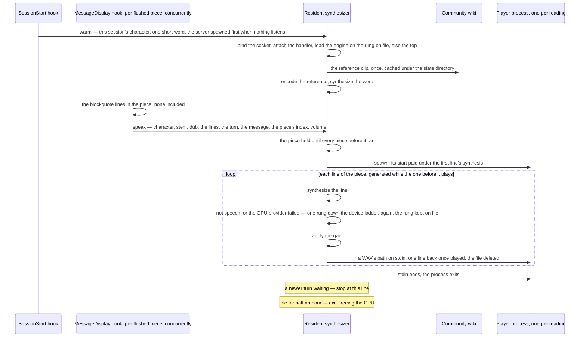
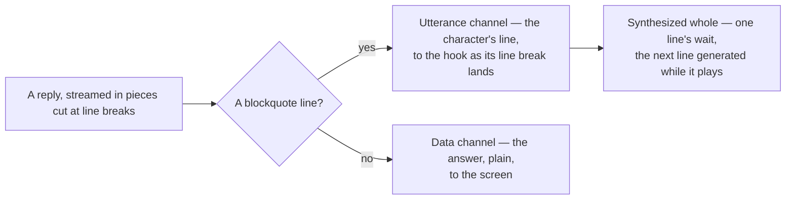
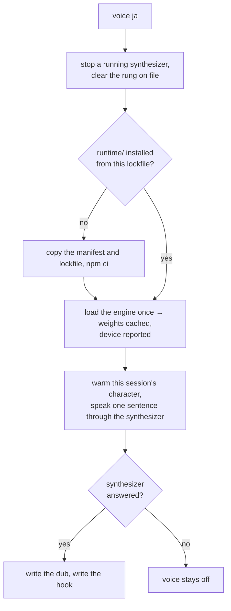

# Spoken replies

A reply is heard, in the voice of the character speaking it, from an engine that runs on this machine with no service behind it. Which line of a character's own performance the voice is cloned from is the [per-character voices](/docs/infra/claude-interface/per-character-voices) page's; this page is the reply's spoken channel, the hook, the process it talks to, the verb that installs the engine, and the gates.

## How it works

1. **The spoken channel.** The output style confines the character to spoken lines — one blockquote each, one or two short sentences, in the first person, with no markup, code or number inside it. An ask of the assistant opens with one spoken line, answers plainly and may close with the card's sign-off; an ask of the character — a joke, a hello, an opinion — is answered wholly in spoken lines, as many as the ask deserves. Nothing else is written as a blockquote, and no reply repeats the card's greeting, which the welcome has already shown.
2. **The MessageDisplay hook** receives every piece of a reply as it is displayed — whole lines, since the tool flushes at a line break — reads the two gates, takes the blockquote lines out of its piece, and hands the piece to the synthesizer over a local socket as one JSON line: the session's character, the line their voice is cloned from, the dub, the lines, where the piece sits in the reply and the volume. **Every piece is sent, spoken or not**, because the tool runs a message's hooks concurrently and a closing line can reach the synthesizer before its opening one; the synthesizer orders a message's pieces by their index, and can do so only because it can tell a piece that has not arrived from one that was never spoken. The hook waits for nothing but the socket: a synthesizer that is not running costs a spawn and a node start to its bind, and the load is the synthesizer's own. It lives in user settings, written by the `voice` verb, because a hook on this event costs about a node start of display latency per line, which the voice pays and not every plugin user.
3. **The resident synthesizer** — one process per machine, spawned detached by whichever hook finds no server listening — holds the loaded engine. It binds the socket before the engine loads, so a second hook finds the address taken rather than loading a second engine, and a request arriving during the load waits for it. Per request it fetches the character's reference clip on first use and encodes it once per process, then reads the lines in order — each synthesized whole, checked for speech, given the volume as a gain and handed to one player process spawned for the reading, while the line after it is already being generated. It keeps **one turn pending**: a message's pieces run by their index, the next message once the one before it ran its final piece, and a piece whose predecessor has not arrived is held for the hook's own timeout, past which the message moves on. A reply that lands while another is being read drops what of the older one is still waiting and stops the reading under way at the line it has reached — and a turn replaced once stays replaced, so a piece of it carried by a hook that was held up and landed after is answered rather than read out over the newer reply. A request with no turn — a warm, the `voice` verb's proof — queues behind what waits. Idle for half an hour, it exits and frees the GPU.
4. **The SessionStart hook** hands the synthesizer a warm request for the session's character, so the load, the reference's encoding and the first-synthesis cost are paid while the person reads the card, not on the first reply. The warm synthesizes one short word and keeps nothing: every spoken line is written for its ask, so no clip made ahead would be asked for again. The hook waits for no more than the synthesizer's bind, since its stdout is the model's context.
5. **The gates** are the dub file the `voice` verb writes — a machine that never ran it has no engine, and every hook returns at once — and whether the session would hear anything at all: `mute` is a flag file, and a `volume` of zero counts as the same silence. Both are checked before a piece is sent **and** before the session start wakes the engine, because every cost of a spoken line is paid before the gain is applied.



The protocol is one JSON line in and one status line back — `ok` and the rung the engine speaks on, `error`, or `superseded` for a request a newer one replaced — so the server can be tried from a shell with nothing but the socket path: a named pipe on Windows, a socket file in the state directory elsewhere, and no port to collide on.

## The spoken channel

**A reply has two channels, and one markup rule tells them apart.** The utterance channel is what a listener should hear — short, in the speaker's voice, written to be said — and the data channel is everything a reader needs, written plainly. A blockquote line is an utterance and nothing else is written as one. What it buys: the utterance is short enough to synthesize whole, so the wait before the first sound is one line's; it is complete the moment its line is, so a hook fed the text as it is written sends it before the reply is; the hook needs no model of the reply, so it is stateless and its piece can be any size; and the data channel is free of the voice. The writer decides how much of a reply is utterance with the whole conversation in front of it, which is why no classifier ahead of the reply decides the shape: it would see the prompt alone and cost a call on every turn for what one rule of the style already decides.



## The engine

Chatterbox Nano through the ONNX runtime — the smallest of the family, English only, a zero-shot cloner like the rest, with its vocoder distilled to one step where the larger checkpoints take ten. Its ONNX export is a community conversion that ships one variant per component (half-precision embeddings; 4-bit weights for the rest, over half-precision activations in the language model and the speech encoder and full-precision ones in the vocoder), so the plugin's dtype map names what exists rather than what was chosen. The engine was chosen by the [reference selection](/docs/infra/claude-interface/reference-selection)'s likeness on a few characters against the Turbo checkpoint before it: it costs a few hundredths of the likeness and reads several times faster, which on this machine is the difference between a line read slower than real time and one read faster.

A line is spoken whole: generation ends at the model's end-of-sequence token, under a ceiling in proportion to the line's text with a floor for the shortest — a few tokens a character, above what English reads at. A fixed ceiling cuts a long sentence mid-word, and no ceiling lets a line the model finds no end for — a reference too short to anchor an ending on — run for minutes, hold every reply behind it, and hand the vocoder a sequence it rejects.

Where each component runs is a **device ladder**, fastest rung first, and the rung is chosen by the sound rather than by the load, because a provider can load a graph and run it wrong without a word: this machine's WebGPU provider returns a constant near-silence from the vocoder and throws nothing. Every synthesis is checked for a loudest frame loud enough to hear and a quietest frame the speech floor below it — a sentence has pauses, noise has none — and one that fails moves the engine one rung down, releases the one it left, and runs again. A load that rejects moves it the same way, and so does a synthesis the GPU provider fails, since a device lost under load fails every synthesis after it; a failure any other provider raises is the line's, because the CPU provider is deterministic and would raise it on every rung, so that line is dropped and the rung kept. The speech encoder runs on the CPU on every rung, since it runs once per character and the WebGPU provider rejects its graph.

| Rung                    | Language model | Vocoder |
| :---------------------- | :------------- | :------ |
| `webgpu`                | GPU            | GPU     |
| `webgpu-language-model` | GPU            | CPU     |
| `cpu`                   | CPU            | CPU     |

The rung the engine speaks on is the status line's second word and the `voice` verb's report, and every move down is a line in `voice.log`. It is also **kept**: the rung a synthesizer has spoken on is written to the state directory, and the next synthesizer starts there rather than walking the rungs above it again — a load and a silent synthesis at every warm otherwise. A demotion rewrites the file, so it only ever moves down on its own; the `voice` verb clears it and stops any running synthesizer before its proof, so a driver that has since started vocoding is found by setting the voice up again and by nothing on a reply's path.

The ladder's order and the serial reading are both measured: the language model on the bottom rung is slower by a factor, and two lines synthesized at once take longer than one after the other because the vocoder's threads take every core. The numbers themselves live in the committed bench beside the reference selection, `scripts/src/voiceMatch/synthesizer.bench.md`, which is where a session reads them rather than timing a sentence again; it measures the host, so it is switched off once committed and flipped on when the engine, its variants or the ladder change. On this laptop, whose GPU is the processor's own, a line reads faster than real time on the middle rung, so a reading never pauses once it starts; the vocoder still runs over the reference's tokens on every line, which is why the reference is trimmed to a few seconds and a spoken line is a sentence or two.

## Setting it up

```bash
node "${CLAUDE_PLUGIN_ROOT}/scripts/genshin.ts" voice ja   # set up, or switch the dub
node "${CLAUDE_PLUGIN_ROOT}/scripts/genshin.ts" voice      # report what is installed
```

The plugin ships code and cards. The engine's runtime is a few hundred megabytes of native binaries and the weights about half a gigabyte, and the plugin install runs a frozen `npm ci` under a one-minute ceiling — so none of it is a dependency of the plugin, and all of it is installed by the verb into the directory the plugin already owns for its state. Run with a dub, it first stops any synthesizer running and clears the rung on file, then does the following in order, each skipped when already done:

1. **The runtime.** The plugin carries a second, tiny manifest — `runtime/package.json` with its own npm lockfile — naming the one package the engine needs. The verb copies both into the state directory and runs `npm ci` there with lifecycle scripts off, since the ONNX runtime's binaries ship in the package and its only script fetches a CUDA build on Linux. Renovate moves the manifest's version like every other, and a bumped lockfile is picked up by the next `voice` run. The synthesizer resolves the package from that manifest and loads it by path; the plugin's own manifest never names it.
2. **The weights.** The runtime's own loader fetches what it is asked to load into a cache directory the verb points at the state directory, so downloading the weights is loading the engine once — in the verb's own process, which can print progress. Exactly the variants the plugin declares are fetched and no other.
3. **The proof.** The verb warms the synthesizer with the current session's character and has it speak one sentence through the resident process, the same path every reply takes, so the person hears the voice they set up before the first reply does.
4. **The dub.** One file holding the code — `en`, `ja`, `zh` or `ko`, the four the wiki hosts. Every request carries it, so a running synthesizer honours a switch without a restart. It is written **last**, because the file is the gate in front of every spoken reply: a run whose synthesizer never answered the warm leaves no file behind, so the replies stay silent rather than reaching a voice that cannot speak.
5. **The hook.** Written with the dub: a launcher in the state directory, and one entry under the MessageDisplay event in user settings beside anyone else's, which the tool reads once per process — so replies are read from the next session.

```text
~/.claude/genshin-persona/
  picks.tsv · pin · muted · volume     ← the persona's
  voice-language                       ← the dub's code, and the gate
  status.mjs · speak.mjs               ← the launchers the two user settings run the scripts through
  device                               ← the rung the synthesizer last spoke on, where the next one starts
  runtime/                             ← the engine's package, npm-installed here
  models/                              ← the weights, the runtime's own cache layout
  references/<dub>/<stem>.ogg          ← one clip per line fetched so far
  voice.log                            ← why the synthesizer last refused, if it did
```



`teardown` removes the runtime, the weights, the references, the dub, the rung, the log and the hook entry — stopping a running synthesizer first, since the weights it holds open cannot be deleted under it — and leaves the pick records and the pin, which are the persona's rather than the voice's.

## Failure semantics

A reply that cannot be spoken is not spoken, and nothing waits on it without a bound: the one wait here is a piece held for a predecessor that has not arrived, which lasts the hook's own timeout and no longer. The diagnosis is on disk.

- **The server cannot load** — no runtime, a corrupt weight, a provider that rejects the graph: it writes the reason to `voice.log` and exits. Every hook then finds no server, spawns one, watches it die, and stays silent.
- **A synthesis fails** mid-request: a failure the GPU provider raises moves the engine one rung down, like silence, and the line is read there; any other is the line's, so that request is dropped, the reason logged, and the server keeps serving on the rung it is on.
- **A synthesis is not speech** — a provider ran the graph wrong: the engine moves one rung down, the move is logged, the rung on file follows once the engine has spoken there, and the line is synthesized again. Only the bottom rung failing drops the request.
- **The player does not play** — not installed, refusing the file, exiting part way: the reason is logged, and the request still answers `ok`, since the line was synthesized. One player process serves a reading, spawned before its first synthesis, because a PowerShell start costs seconds and a player spawned per line would pay it in silence before every one.
- **A hook connects while the server is still starting**: the handler is attached before anything after the bind yields to the event loop, so the request is taken the moment the hook lands and read once the engine has loaded.
- **A piece never arrives** — its hook killed at the tool's timeout, or failed before it could send: the synthesizer holds the pieces after it for that same timeout and reads on from the earliest of them.
- **The wiki has no file under the reference's name**: the request fails, the reason is logged, and the [reference selection](/docs/infra/claude-interface/reference-selection)'s `--check` is what says so for the whole roster at once.
- **A stale socket file** — a server killed without cleanup — is removed before binding when nothing answers on it. A named pipe leaves no file behind.

## What it does not do

- **Read another language.** The engine is English-only, so the dub picks whose voice reads a reply and not what language it reads: `ja` clones the Japanese actor, and the actor reads English. A line with no Latin letter in it, or with a letter of any other script in it, is not sent: the first the tokenizer returns as the near-silence the device ladder takes for a broken provider, and the second the model reads from unknown tokens it finds no end for. Gated per line, so one such line inside an English reply is skipped rather than walking the ladder down. Reading a reply in the language it is written in is the [multilingual spoken replies](/docs/proposals/infra/multilingual-spoken-replies) proposal.
- **Stream inside a line.** A line is synthesized whole and vocoded once, so its first sample arrives after its last token; the streaming is between lines. Doing it inside a line instead is stage 2 of the [seamless spoken replies](/docs/proposals/infra/seamless-spoken-replies) proposal.
- **Serve the app.** It is a personal machine's process for a personal plugin; nothing in the estate knows it exists.
- **Ship any audio.** The reference clips are fetched from the wiki to this machine and cached under the state directory, never committed, for the reason the [per-character voices](/docs/infra/claude-interface/per-character-voices) page gives.

## Key files

| File                                                                | Role                                                                                                                          |
| :------------------------------------------------------------------ | :---------------------------------------------------------------------------------------------------------------------------- |
| `packages/genshin-persona/scripts/speak.ts`                         | The MessageDisplay hook: the gates, the piece's spoken lines and its place in the reply, handed over and left                 |
| `packages/genshin-persona/src/services/deliverVoiceRequest.ts`      | A request handed to the synthesizer and left with it, the server spawned first when nothing listens                           |
| `packages/genshin-persona/src/services/deliverWarmRequest.ts`       | The warm request the SessionStart hook hands over, once a voice is set up and would be heard                                  |
| `packages/genshin-persona/src/services/getWarmRequest.ts`           | What a warm synthesizes: one short word, nothing kept                                                                         |
| `packages/genshin-persona/scripts/voice.ts`                         | The resident synthesizer: the socket, the load, the turn queue, the idle exit                                                 |
| `packages/genshin-persona/src/services/reachVoiceServer.ts`         | A connection to a running synthesizer, else one spawned and asked again until it binds                                        |
| `packages/genshin-persona/src/services/sendVoiceRequest.ts`         | A request answered — the `voice` verb's, which reports the status and the device                                              |
| `packages/genshin-persona/src/services/createReplyQueue.ts`         | One turn's pieces in the order written, a missing one held for, a newer turn replacing what waits, the running one told       |
| `packages/genshin-persona/src/services/getSettingsWithSpeakHook.ts` | The hook entry written into user settings beside anyone else's, once                                                          |
| `packages/genshin-persona/src/services/writeLauncher.ts`            | The launcher a user setting runs a script through, re-aimed at every session start                                            |
| `packages/genshin-persona/src/services/createVoiceSynthesizer.ts`   | The engine on the first rung that loads, moved down by a synthesis that is not speech or that the GPU provider fails          |
| `packages/genshin-persona/src/services/checkIsSpeech.ts`            | What a synthesis has to sound like to count as spoken                                                                         |
| `packages/genshin-persona/src/services/readVoiceDevice.ts`          | The rung the last synthesizer spoke on, where the next starts                                                                 |
| `packages/genshin-persona/src/services/readReferenceClip.ts`        | The character's clip, fetched from the wiki on first use and cached                                                           |
| `packages/genshin-persona/src/services/installVoiceRuntime.ts`      | The runtime manifest and lockfile copied and `npm ci` run with scripts off                                                    |
| `packages/genshin-persona/runtime/package.json`                     | The one package the engine needs, moved by Renovate like any other                                                            |
| `packages/genshin-persona/src/services/getSpokenLines.ts`           | The blockquote lines in a piece of a reply, the markup stripped, the unreadable dropped                                       |
| `packages/genshin-persona/src/services/checkIsReadable.ts`          | What the engine can read: a Latin letter in it, and no letter of another script                                               |
| `packages/genshin-persona/src/services/checkIsSilent.ts`            | Muted, or a volume of zero — no reply sent and no engine woken                                                                |
| `packages/genshin-persona/output-styles/in-character.md`            | The spoken channel's one rule, and how much of a reply the ask makes it: a blockquote line is a spoken line, and nothing else |
| `packages/genshin-persona/src/services/createAudioPlayer.ts`        | The desktop's stock player, one process per reading, fed a temp WAV path per clip and answering each                          |
| `packages/genshin-persona/src/services/constants.ts`                | The state directory's voice half, the engine's variants, the device ladder, the budgets and timeouts                          |
| `scripts/src/voiceMatch/synthesizer.bench.ts`                       | The synthesizer timed per sentence shape on this host, through the runner's runtime; off once committed                       |

## Notes

- A piece that starts inside a fenced block an earlier piece opened reads a line of that code opening on `>` as spoken: the tool flushes at line breaks, so the fence's opening sits in a piece the stateless hook never saw. Rare in a reply, and the cost is one line read aloud.
- The idle timeout and the hook's timeout are the two constants a person might tune; the plugin declares both and nothing else about the server is configurable, because the `voice` verb is where the choices are made.
- The WebGPU provider is the one route from Node to this machine's AMD card under Windows: no CUDA toolchain reaches it, and DirectML rejects the speech encoder's attention op and a slice in the language model.
