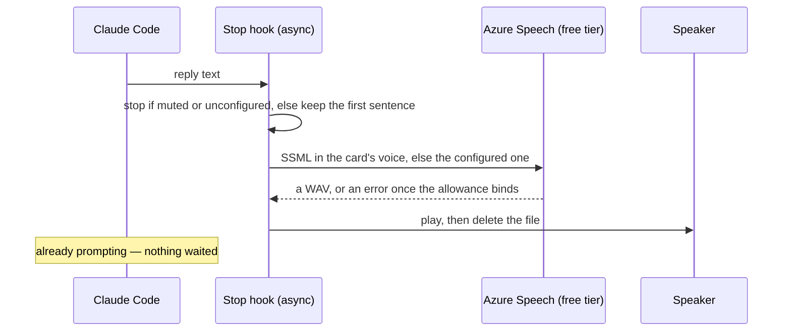

# Spoken replies

Stage 2 of the [Claude interface](/docs/infra/claude-interface): a neural voice, through a supported API, on a resource that costs nothing. Which voice reads which character is the [per-character voices](/docs/infra/claude-interface/per-character-voices) page's; this page is the account, the hook and the gate. Its purpose is to learn whether a spoken reply is something that stays switched on, because that is the gate in front of the [character voice](/docs/proposals/infra/character-voice) and nothing else is.

## How it works

1. **One Pulumi resource** — a Cognitive Services account of the speech kind on the free tier, in `apps/infra` under the provider namespace it belongs to per the [Pulumi layout](/docs/infra/azure-pulumi-layout), with a parent and no alias like every other new resource. Free-tier speech resources are limited to one per subscription, so it has no dev twin: it is a prod resource serving a personal machine. The free tier gives half a million neural characters a month and never expires; a first sentence is on the order of a hundred characters, so the allowance covers thousands of replies before it binds, and when it binds the service returns an error the hook swallows rather than a bill. It sits inside the estate's cost guard like everything else.
2. **One stack output** — the account's key, wrapped as a secret, so it is read once off `pulumi stack output prodSpchEsposter001Key --show-secrets` onto the one machine that uses it. It is a personal credential for a personal machine and not a repository secret, so it enters neither ESC nor the GitHub environment.
3. **One hook in the persona plugin** — a Stop hook, run asynchronously so the prompt never waits on it, that takes the reply text, strips code blocks, tables and markup, keeps the first sentence, posts it as SSML to the speech endpoint in the voice the session's character is read in, and plays the WAV through the desktop's stock player. The endpoint, key and voice are the plugin's three user-configuration options, the key marked sensitive so it lands in the credential store and never in a settings file. With no key or endpoint configured the hook is a no-op, so the plugin works on a machine that never set this stage up.
4. **Two skill verbs** — `mute` and `unmute` on the plugin's skill write a flag file the hook honours, so the voice is switched off without touching the configuration.



Configuring it is one install flag per option, or the plugin's configure dialog:

```bash
claude plugin install genshin-persona@esposter \
  --config speech_endpoint=https://australiaeast.tts.speech.microsoft.com \
  --config speech_key=<the stack output>
```

The endpoint is the text-to-speech host of the region the account lives in, not the account's own management endpoint, which is why it is an option rather than an output.

## Why Azure and not a published plugin

The published voice plugins that cost nothing reach the same Microsoft neural voices through an unofficial endpoint that has changed under them more than once, and every break is somebody else's fix to wait on. The same voices through the supported API, on a resource provisioned the way every other resource here is, is fewer moving parts we do not own. The hook itself is small enough that "install, don't build" bought nothing.

## What this stage does not do

Every voice it speaks with is one of the catalogue's. Azure's custom and personal voice features are structurally unavailable for a game character — they require the voice talent's recorded consent — so the character voice is the proposed stage, which replaces this hook's service with a local engine and removes the account from the estate.

## Key files

| File                                                                                         | Role                                                           |
| :------------------------------------------------------------------------------------------- | :------------------------------------------------------------- |
| `apps/infra/src/azure/resources/Microsoft.CognitiveServices/accounts/prodSpchEsposter001.ts` | The free-tier speech account                                   |
| `apps/infra/src/azure/outputs/prodSpchEsposter001Key.ts`                                     | Its key as a secret stack output                               |
| `packages/genshin-persona/scripts/speak.ts`                                                  | The Stop hook: gate, first sentence, synthesize, play          |
| `packages/genshin-persona/src/services/getFirstSentence.ts`                                  | What of a reply is spoken                                      |
| `packages/genshin-persona/src/services/synthesizeSpeech.ts`                                  | The one REST call, returning nothing when the service declines |
| `packages/genshin-persona/src/services/playAudio.ts`                                         | The stock player per desktop, and the temp file it plays       |

## Notes

- The hook speaks a first sentence, not the reply: a reply is often a table or a diff, and the point is to know the turn ended and what it said, not to hear code read aloud. A reply with no prose at all is not spoken.
- The account is read through its key by design. The estate's declined key-auth hardenings are gated on an app-side migration ([cost and security posture](/docs/infra/cost-and-security-posture)); a hook on a personal machine has no identity to migrate to.
