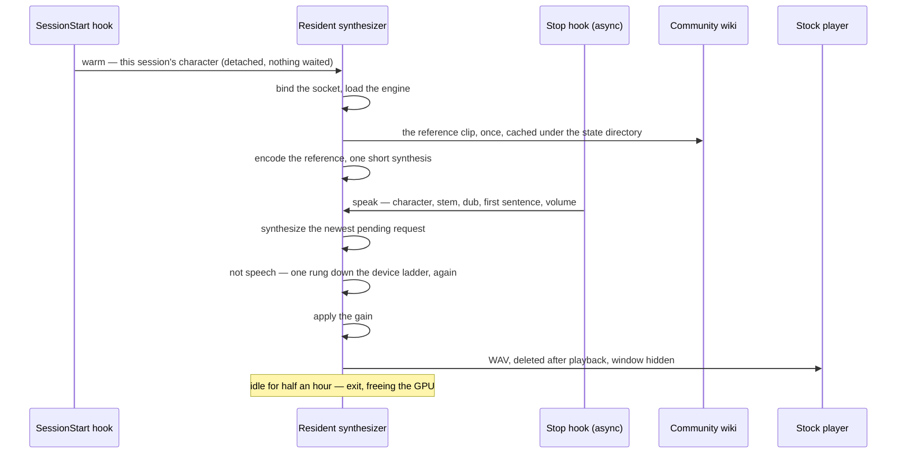
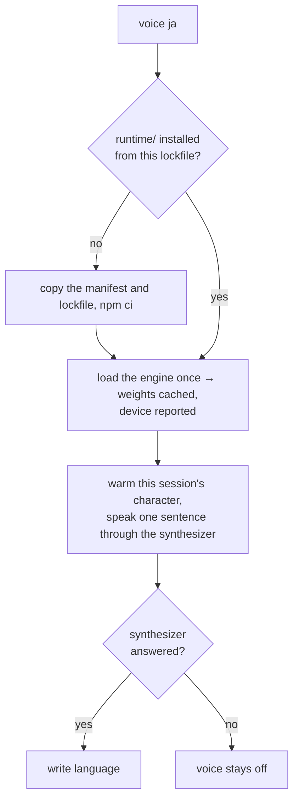

# Spoken replies

Stages 2 and 3 of the [Claude interface](/docs/infra/claude-interface): a reply is heard, in the voice of the character speaking it, from an engine that runs on this machine with no service behind it. Which line of a character's own performance the voice is cloned from is the [per-character voices](/docs/infra/claude-interface/per-character-voices) page's; this page is the hook, the process it talks to, the verb that installs the engine, and the gate.

Stage 2 shipped first through an Azure Speech free-tier account and a catalogue voice bent by pitch and rate, because a cloned voice needed an inference engine with a Python environment to keep alive. That gate closed when Transformers.js shipped Chatterbox — an MIT zero-shot voice cloner — as a native model class runnable from Node on the WebGPU provider, and the whole Azure path went with it: the account, its key, the markup, the catalogue benchmark. The rollback is git.

## How it works

1. **The Stop hook** — asynchronous, so the prompt never waits — takes the reply text, strips code blocks, tables and markup, keeps the first sentence, and sends one JSON line over a local socket: the session's character, the line their voice is cloned from, the dub, the sentence and the volume. It reads who the session speaks as from what the session start already recorded, never by picking again.
2. **The resident synthesizer** — one process per machine, spawned detached by whichever hook finds no server listening — holds the loaded engine. It binds the socket before the engine loads, so a second hook finds the address taken rather than loading a second engine, and a request arriving during the load waits for it. Per request it fetches the character's reference clip on first use, encodes it once per process, synthesizes the sentence, checks that what came back is speech, applies the volume as a gain on the samples, and plays the WAV through the desktop's stock player with its window hidden. It keeps **one pending request**: a reply that lands while a sentence is being synthesized replaces any reply still waiting, and playback in progress finishes. Idle for half an hour, it exits and frees the GPU.
3. **The SessionStart hook** spawns a detached warm request for the session's character, so the load and the first-synthesis cost are paid while the person reads the card and types, not on the first reply. The hook itself waits on nothing: its stdout is the model's context.
4. **The gate** is the dub file the `voice` verb writes: a machine that never ran it has no engine, and every hook returns at once. `mute` and `unmute` are a second flag file the hooks honour on top; `volume` is a whole number of a scale of a hundred, applied as a gain.



The protocol is one JSON line in and one status line back — `ok` and the rung the engine speaks on, `error`, or `superseded` for a request a newer one replaced — so the server can be tried from a shell with nothing but the socket path: a named pipe on Windows, a socket file in the state directory elsewhere, and no port to collide on.

## The engine

Chatterbox Turbo through the ONNX runtime, a precision per component, each measured against a character's own voice before it was chosen ([reference selection](/docs/infra/claude-interface/reference-selection) is the measurement's page): the speech encoder in half precision, which cost no likeness; the language model the 4-bit variant, which cost none either and speaks twice as fast; the vocoder in full precision, because its half-precision variant is the one that moved the likeness, by a tenth to a fifth on the three characters it was re-measured on once the engine was judged by its sound — and it is the one variant this machine's GPU vocodes into speech rather than silence, so the trade it offers is the top rung's speed for that likeness, declined.

A sentence is spoken whole: generation ends at the model's end-of-sequence token and at no length cap, so the synthesizer has no cut-off — a run that never emits one holds it until it is stopped, which a local engine is allowed, and the checkpoint's own repetition penalty is what stands against it.

Where each component runs is a **device ladder**, fastest rung first, and the rung is chosen by the sound rather than by the load: a provider can load a graph and run it wrong without a word — this machine's WebGPU provider returns a constant near-silence from the full-precision vocoder on most runs and throws nothing, which the hook's silence hid for as long as nothing listened to the output. Every synthesis is checked for a loudest frame loud enough to hear and a quietest frame the speech floor below it — a sentence has pauses, noise has none — and one that fails moves the engine one rung down, releases the one it left, and runs again; a load that rejects moves it the same way; the last rung failing is an error the log sees. The speech encoder runs on the CPU on every rung, since it runs once per character and the WebGPU provider rejects its graph.

| Rung                    | Language model | Vocoder |
| :---------------------- | :------------- | :------ |
| `webgpu`                | GPU            | GPU     |
| `webgpu-language-model` | GPU            | CPU     |
| `cpu`                   | CPU            | CPU     |

The rung the engine speaks on is the status line's second word and the `voice` verb's report, and every move down is a line in `voice.log`. On this machine the engine loads from disk in about ten seconds, encodes a ten-second reference in under a second, and reads a sentence ahead of real time on the middle rung — the CPU vocoder costs about half as long again as the GPU one — and roughly twice that on a process's first call, which the warm request pays. The bottom rung is several times slower than real time.

## Setting it up

```bash
node "${CLAUDE_PLUGIN_ROOT}/scripts/genshin.ts" voice ja   # set up, or switch the dub
node "${CLAUDE_PLUGIN_ROOT}/scripts/genshin.ts" voice      # report what is installed
```

The plugin ships code and cards. The engine's runtime is a few hundred megabytes of native binaries and the weights a gigabyte and a half, and the plugin install runs a frozen `npm ci` under a one-minute ceiling — so none of it is a dependency of the plugin, and all of it is installed by the verb into the directory the plugin already owns for its state, the way a project's dependencies are installed beside it rather than shipped with it. Run with a dub, it does four things in order, each skipped when already done:

1. **The runtime.** The plugin carries a second, tiny manifest — `runtime/package.json` with its own npm lockfile — naming the one package the engine needs. The verb copies both into the state directory and runs `npm ci` there with lifecycle scripts off, since the ONNX runtime's binaries ship in the package and its only script fetches a CUDA build on Linux. Renovate moves the manifest's version like every other, and a bumped lockfile is picked up by the next `voice` run. The synthesizer resolves the package from that manifest and loads it by path; the plugin's own manifest never names it.
2. **The weights.** The runtime's own loader fetches what it is asked to load into a cache directory the verb points at the state directory, so downloading the weights is loading the engine once — in the verb's own process, which can print progress, where the detached synthesizer cannot. Exactly the variants the plugin declares are fetched and no other, and the device that loaded is reported.
3. **The proof.** The verb warms the synthesizer with the current session's character and has it speak one sentence, so the person hears the voice they set up before the first reply does — and the sentence comes through the resident process, the same path every reply takes.
4. **The dub.** One file holding the code — `en`, `ja`, `zh` or `ko`, the four the wiki hosts. Every request carries it, so a running synthesizer honours a switch without a restart. The choice is one for the whole roster. It is written **last**, because the file is the gate in front of every spoken reply: a run whose synthesizer never answered the warm leaves no file behind, so the replies stay silent rather than reaching a voice that cannot speak — and a session with no character to prove against writes it on its own way out, having nothing left to fail at.

```text
~/.claude/genshin-persona/
  picks.tsv · pin · muted · volume     ← as before
  language                             ← the dub's code, and the gate
  runtime/                             ← the engine's package, npm-installed here
  models/                              ← the weights, the runtime's own cache layout
  references/<dub>/<stem>.ogg          ← one clip per line fetched so far
  voice.log                            ← why the synthesizer last refused, if it did
```



`teardown` removes the runtime, the weights, the references, the dub and the log — stopping a running synthesizer first, since the weights it holds open cannot be deleted under it — and leaves the pick records and the pin, which are the persona's rather than the voice's.

## Failure semantics

A reply that cannot be spoken is not spoken, and nothing waits: that rule is unchanged from the service it replaces, with a diagnosis on disk where there was none.

- **The server cannot load** — no runtime, a corrupt weight, a provider that rejects the graph: it writes the reason to `voice.log` and exits. Every hook then finds no server, spawns one, watches it die, and stays silent.
- **A synthesis throws** mid-request: the request is dropped, the reason logged, and the server keeps serving. A sentence the model rejects does not cost a reload for the next.
- **A synthesis is not speech** — a provider ran the graph wrong: the engine moves one rung down the device ladder, the move is logged, and the sentence is synthesized again. Only the bottom rung failing drops the request, and its reason is logged like any other.
- **The wiki has no file under the reference's name**: the request fails, the reason is logged, and the [reference selection](/docs/infra/claude-interface/reference-selection)'s `--check` is what says so for the whole roster at once.
- **A stale socket file** — a server killed without cleanup — is removed before binding when nothing answers on it. A named pipe leaves no file behind.

## What it does not do

- **Read another language.** The engine is English-only, so the dub picks whose voice reads a reply and not what language it reads: `ja` clones the Japanese actor, and the actor reads English. A sentence with no Latin letter in it is not sent, because the tokenizer would return it as the near-silence the device ladder takes for a broken provider. Reading a reply in the language it is written in is the [multilingual spoken replies](/docs/proposals/infra/multilingual-spoken-replies) proposal.
- **Streaming.** The port synthesizes the whole sentence and then runs the vocoder once over it, so the first sample arrives after the last token; splitting a sentence into clauses to overlap synthesis with playback is a refinement the warm number does not yet demand.
- **Serve the app.** It is a personal machine's process for a personal plugin; nothing in the estate knows it exists.
- **Ship any audio.** The reference clips are fetched from the wiki to this machine and cached under the state directory, never committed, for the reason the [per-character voices](/docs/infra/claude-interface/per-character-voices) page gives.

## Key files

| File                                                              | Role                                                                                                 |
| :---------------------------------------------------------------- | :--------------------------------------------------------------------------------------------------- |
| `packages/genshin-persona/scripts/speak.ts`                       | The Stop hook: the gate, the first sentence, one request                                             |
| `packages/genshin-persona/scripts/warm.ts`                        | The warm request the SessionStart hook spawns detached                                               |
| `packages/genshin-persona/scripts/voice.ts`                       | The resident synthesizer: the socket, the load, the queue, the idle exit                             |
| `packages/genshin-persona/src/services/sendVoiceRequest.ts`       | The client: connect, else spawn a server and retry inside the load budget                            |
| `packages/genshin-persona/src/services/createLatestWinsQueue.ts`  | One pending request, replaced by whatever arrives after it                                           |
| `packages/genshin-persona/src/services/createVoiceSynthesizer.ts` | The engine on the first rung that loads, moved down by a synthesis that is not speech                |
| `packages/genshin-persona/src/services/checkIsSpeech.ts`          | What a synthesis has to sound like to count as spoken                                                |
| `packages/genshin-persona/src/services/readWikiFile.ts`           | A clip off the wiki's file host, over the https module its edge answers                              |
| `packages/genshin-persona/src/services/readReferenceClip.ts`      | The character's clip, fetched from the wiki on first use and cached                                  |
| `packages/genshin-persona/src/services/installVoiceRuntime.ts`    | The runtime manifest and lockfile copied and `npm ci` run with scripts off                           |
| `packages/genshin-persona/runtime/package.json`                   | The one package the engine needs, moved by Renovate like any other                                   |
| `packages/genshin-persona/src/services/getFirstSentence.ts`       | What of a reply is spoken                                                                            |
| `packages/genshin-persona/src/services/playAudio.ts`              | The stock player per desktop, and the temp file it plays                                             |
| `packages/genshin-persona/src/services/constants.ts`              | The state directory's voice half, the engine's variants, the device ladder, the budgets and timeouts |

## Notes

- The hook speaks a first sentence, not the reply: a reply is often a table or a diff, and the point is to know the turn ended and what it said, not to hear code read aloud. A reply with no prose at all is not spoken.
- The idle timeout and the load budget are the two constants a person might tune; the plugin declares both and nothing else about the server is configurable, because the `voice` verb is where the choices are made.
- The wiki's file host serves a clip to a request naming the wiki as its referer — hotlink protection its API is exempt from — and its edge answers Node's `fetch` client with a browser challenge under those same headers while it serves the `node:https` module the file, so a clip is read over the https module and the API over `fetch`. The plugin's own user agent is on every request either way.
- The AMD card on this machine rules the Python engines out as much as the install ceiling does: none of the CUDA toolchains reach it under Windows, and the WebGPU provider is the one route that does from Node. DirectML was tried and rejects the speech encoder's attention op and a slice in the language model.
