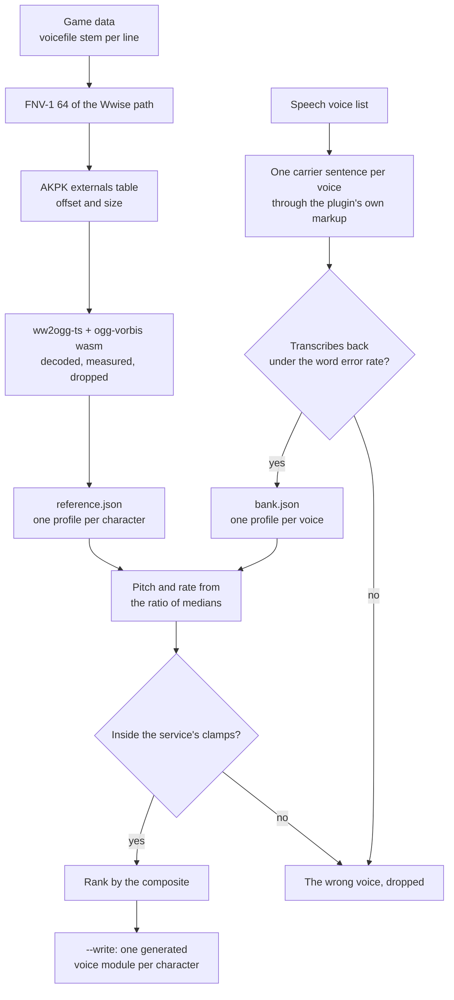

# Voice match benchmark

[Per-character voices](/docs/infra/claude-interface/per-character-voices) gives every card a catalogue voice, a pitch and a rate. The question those values answer — which of a hundred-odd voices is closest to this character, and by how much to bend it — has an objective form in speech research, and this is the tooling that computes it: three `scripts` commands, run in order, with nothing outside npm.

```bash
pnpm ai:voice-match:reference "<game folder>/GenshinImpact_Data/StreamingAssets/AudioAssets/Japanese"
pnpm ai:voice-match:bank        # needs the plugin's speech endpoint and key in the environment
pnpm ai:voice-match:rank        # --write generates one voice module per character
```

## A clip is found by the hash of its own name

The game data records, for every voiced line, the stem of the audio file it was authored as ("vo_clorinde_character_idle_03" under its folders). The Japanese track stores its clips in Wwise packages keyed by a 64-bit id, and **that id is the FNV-1 hash of the clip's path as the engine spells it** — the language folder, backslashes, the lowercased stem and the `.wem` extension. Every voiced line in the data resolves to exactly one clip this way, several thousand of them across about a hundred characters, so the reference set is labelled by construction: no clustering, no transcription, and no guessing whose voice a clip is. The language is inside the hashed string, which is also why no id is shared between the language tracks.

The one line the data mislabels is the scene: the Traveler's friendship lines transcribe their companion's dialogue and carry a speaker label, so any line whose text names its speakers is left out. What remains of the Traveler is their own combat lines.

## What is measured

Both corpora go through the same code, so whatever the estimators get wrong they get wrong on both sides.

| Measurement     | How                                                                                                                                     | What it answers                                |
| :-------------- | :-------------------------------------------------------------------------------------------------------------------------------------- | :--------------------------------------------- |
| Timbre          | A speaker-verification encoder run in process; one unit vector per clip, averaged and renormed                                          | Who this sounds like — the cosine is the score |
| Median pitch    | Normalised autocorrelation per frame, the first peak within tolerance of the best against octave errors, pooled over every voiced frame | The `pitch` lever, from a ratio of medians     |
| Pitch spread    | The standard deviation of log-F0 in semitones                                                                                           | The one prosody trait no lever moves           |
| Rate            | Syllable nuclei — voiced energy peaks with a dip between — over speech time, text-free                                                  | The `rate` lever, from a ratio of medians      |
| Signal to noise | Speech-level energy over the floor between words                                                                                        | Whether the two corpora are comparable at all  |

Two constraints from the field's own critique of speaker-similarity scores are built in rather than noted. **Duration moves the score on its own**, so the embedding reads at most the opening seconds of every reference clip, which holds it near the carrier's length. **Rhythm is invisible to the embedding**, so the ranking is never the cosine alone.

**The rate is compared relative to each corpus's median, never as a raw ratio.** Japanese runs more syllables a second than English; a raw ratio would slow every candidate by that gap. A character who speaks faster than the Japanese cast gets a voice sped up relative to the English catalogue by the same fraction.

## The pipeline



**The bank is what makes it affordable.** Every voice reads one carrier sentence at its own settings, once, and that measurement serves every character. The whole catalogue is synthesized — a Japanese-locale voice reading English is unintelligible while a multilingual one carries talent that speaks it properly, and the names do not say which is which — so eligibility is **measured**: the carrier is transcribed back by a speech recogniser and a voice over the word-error-rate ceiling is out for every character.

**Solving replaces searching.** The pitch shift is the ratio of the two median pitches as a signed percentage; the rate shift, the ratio of the two relative rates. A shift the service would clamp — pitch beyond half to one and a half times, rate beyond half to twice — marks the wrong voice and drops it, rather than a voice to correct.

**The composite** weights timbre most, then how far the two levers had to move and how far the pitch spreads sit apart. The weights are constants in one place, and the validation step below is the only thing that tunes them.

## What comes back, and what never does

The decoded clips exist only in memory: located, decoded, measured and dropped, with no cache. The published plugin states it carries no game audio, and that holds for a temporary folder exactly as for a commit. What the stages write is numbers, and every output is a [generated artifact](/docs/architecture/generated-artifacts): the profiles go to `scripts/src/generated/voiceMatch/`, one JSON file per character and per voice, and `--write` puts the fits into `packages/genshin-persona/src/generated/personaVoices/`, one typed module per character in the shape of their card. Each folder is its generator's whole output, cleared and rewritten on every run. Only the models the encoder and recogniser download stay outside the repository ("VOICE_MATCH_MODELS_DIRECTORY", else the system temp folder), because a model is a dependency rather than an output.

A generated voice carries only what was measured — a name, and the two shifts where they are not zero. It never touches a card: the card's own `voice` is the ear's, written only when someone listened and chose, and the plugin reads the card's over the generated one.

## Reading the result

`rank` prints one line per character — the chosen voice, its two shifts, the composite and the runner-up — and then the three numbers a run is judged by: the **mean composite** across the roster, the **count below the floor** (the characters the benchmark could not fit, whose cards it leaves alone), and the **number of distinct voices chosen**, because a run that lands most of the roster on a handful of voices has found a degenerate optimum and the mean will look fine while it does. The two corpora's signal-to-noise medians print beside them.

**The ear keeps the last word.** A metric is only worth its ranking if the ranking agrees with a person: for a sample of characters, the top three candidates are synthesized and ranked by ear, and the rank correlation against the composite is the licence to trust the rest. Disagreement tunes the weights on that sample only — never on the whole roster, which would fit the metric to its own output. That step, and the style pass over the chosen voices, are the person's and are the open items on the [roadmap](/docs/infra/roadmap); a voice the ear settles on goes into the card, which overrules the generated module without editing it.

## The two traps

- **The codebook variant fails silently.** The packages use the aoTuV codebooks; the converter's default set produces an Ogg stream that throws nothing and decodes to zero samples. The variant is a constant to assert, not a setting to tune, and the chain was checked against a reference decoder — the same clip through vgmstream and through the npm chain agree to the 16-bit quantisation floor — which is also how the chain is revalidated after a dependency bump.
- **Only the Japanese track enters, at any stage.** Each localisation is a different actor, so another track's audio is evidence about a different person's voice and corrupts the reference rather than diluting it. Nothing joins across tracks anyway: the language is inside every id.

## Key files

| File                                                             | Role                                                     |
| :--------------------------------------------------------------- | :------------------------------------------------------- |
| `scripts/src/voiceMatch/reference/index.ts`                      | Stage 0 and 1 — every character's clips into one profile |
| `scripts/src/voiceMatch/bank/index.ts`                           | Stage 2 — the catalogue over the carrier, gated          |
| `scripts/src/voiceMatch/rank/index.ts`                           | Stage 3 to 6 — solve, clamp, rank, report, write         |
| `scripts/src/services/voiceMatch/constants.ts`                   | Every threshold, weight and model id                     |
| `scripts/src/services/voiceMatch/reference/getExternalId.ts`     | The hash a recorded stem resolves to                     |
| `scripts/src/services/voiceMatch/reference/createClipDecoder.ts` | Wwise Vorbis to PCM, the codebook variant asserted       |
| `scripts/src/services/voiceMatch/getFrameAnalysis.ts`            | Energy and pitch per frame                               |
| `scripts/src/services/voiceMatch/getVoiceProfile.ts`             | Clips pooled into one speaker                            |
| `scripts/src/services/voiceMatch/rank/getVoiceFit.ts`            | The two shifts, the clamps and the composite             |
| `scripts/src/services/voiceMatch/rank/getPersonaVoiceSource.ts`  | One character's generated voice module                   |
| `scripts/src/generated/voiceMatch/`                              | The profiles, one file per character and per voice       |
| `packages/genshin-persona/src/generated/personaVoices/`          | The output: a voice module per fitted character          |
| `packages/genshin-persona/src/services/readCharacterVoice.ts`    | How the plugin resolves the two sources                  |
