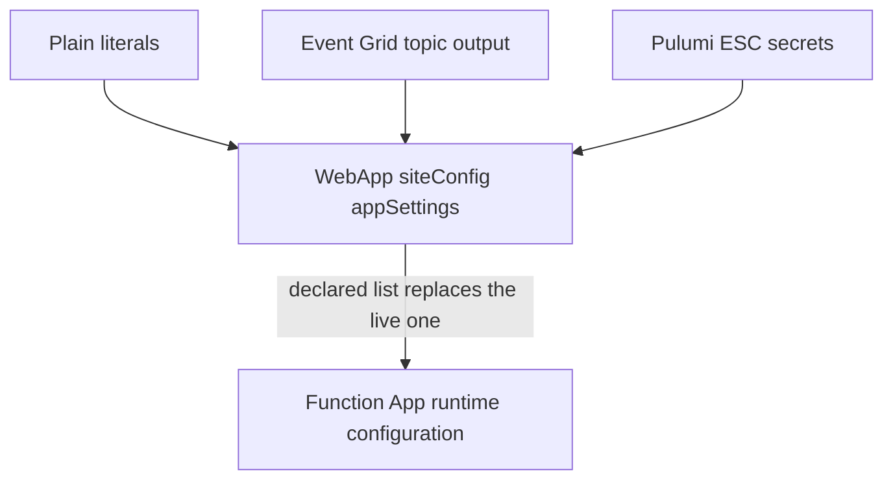

# Pulumi source of truth

A Function App's runtime app settings are declared on its `WebApp` resource, not set in the portal. Settings held only in the portal are the one surface a `pulumi preview` cannot prove, so a live configuration that the code cannot see is a configuration nobody can review — which is why they are declared here alongside the resource itself.

## How it works

Each Function App's `siteConfig.appSettings` holds the full set of app settings, resolved from three sources by classification:

- **Plain values** — runtime version, worker runtime, storage / queue / table service URIs, the managed-identity credential marker, `BASE_URL`, the VAPID public key, and the run-from-package URL — are written as literals matching the live values.
- **Managed-resource wiring** — the Event Grid endpoint comes from the Event Grid topic's output, so it tracks the resource Pulumi already owns.
- **Secrets** — the database URL, Event Grid key, storage / Web PubSub / Service Bus connection strings, and the VAPID private key — flow from Pulumi ESC via `config.requireSecret`, the same channel that manages the GitHub Actions secrets. No secret value lives in the code.

## The list is authoritative, not additive

`siteConfig.appSettings` is a **replace**, not a merge: applying it drops any live setting the declaration omits. That is the point — a setting the code cannot see is a setting `pulumi preview` cannot prove — but it is only safe because these Function Apps have no live-only settings to lose:

- The declared list was verified **name for name against both live sites** (`az functionapp config appsettings list`): dev and prod each return exactly the names declared here, so the replace has nothing to drop. Re-run that command before adding or removing a setting; a difference is the only thing that makes this replace unsafe.
- The app runs **from a package URL** (`WEBSITE_RUN_FROM_PACKAGE` pointing at `release.zip` in the environment's storage account), so deployment writes a blob rather than mutating app settings behind Pulumi's back. The URL carries **no SAS** and there is deliberately no `WEBSITE_RUN_FROM_PACKAGE_BLOB_MI_RESOURCE_ID` beside it — that is the live configuration, not an omission, and adding either to "fix" it would change a running deployment on the strength of a reading of the Azure docs rather than of the site.
- Neither app uses the consumption-plan **content share** (`WEBSITE_CONTENTAZUREFILECONNECTIONSTRING` / `WEBSITE_CONTENTSHARE`) — the settings Azure otherwise injects at create time and which a declared list would silently strip, breaking the host on its next restart. `storageAccountRequired: false` with `AzureWebJobsStorage__*` identity-based URIs is what removes the need for them.

Any future setting added in the portal is therefore drift by definition, and the next deploy correctly removes it.

## Key files

| File                                                                            | Role                           |
| :------------------------------------------------------------------------------ | :----------------------------- |
| `packages/infra/src/azure/resources/Microsoft.Web/sites/devFuncEsposter001.ts`  | Dev Function App app settings  |
| `packages/infra/src/azure/resources/Microsoft.Web/sites/prodFuncEsposter001.ts` | Prod Function App app settings |

## Notes

Adoption is import-then-own — the `WebApp` resources are `protect: true` and adopting settings updates them in place rather than recreating them. The ESC environment must hold each `config.requireSecret` key with the exact live value before a deploy, so that a preview shows an empty diff and the deploy proves ownership without changing the running configuration.
