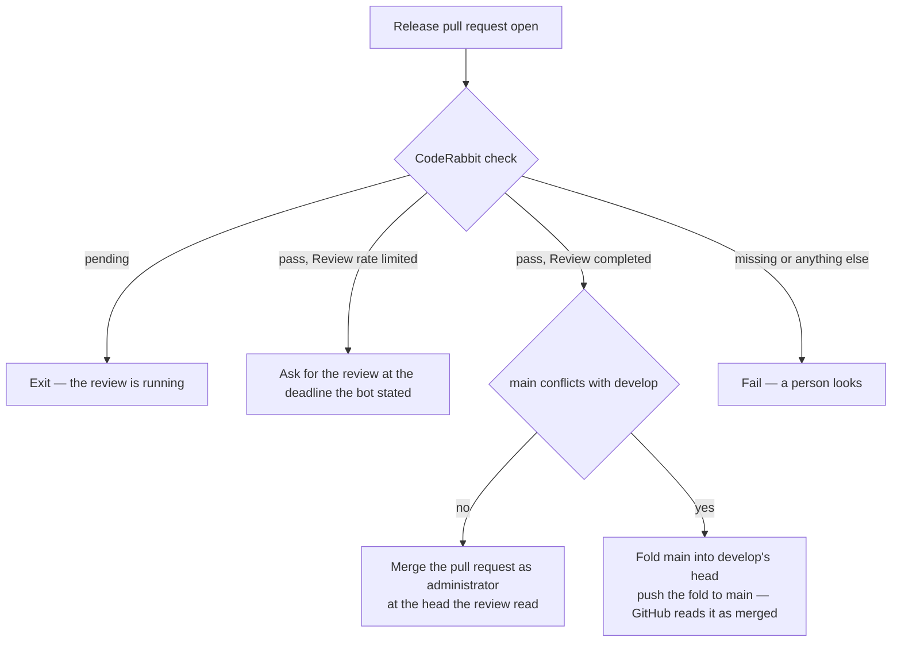
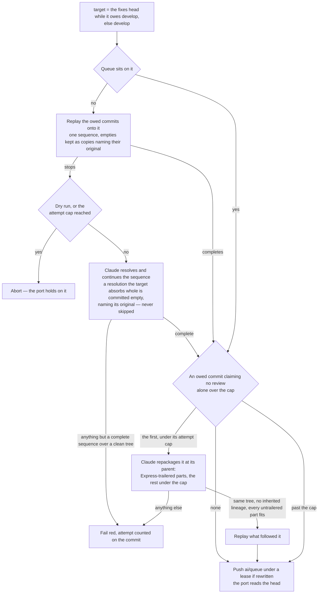
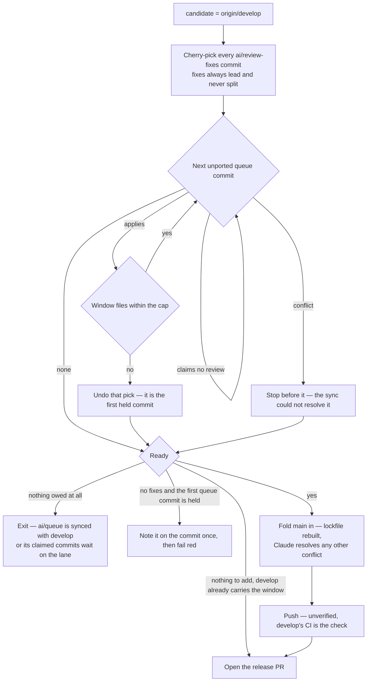

# Collection Cycle

One script, `pnpm ai:coderabbit:collect`, run by the [runner](/docs/infra/review-collector/runner) on every trigger and by hand with `--dry-run` to see what it would do. It reads the whole situation from the remote, clears the gates, and does the most it safely can in one pass, ordered so that every irreversible effect is either the single push or a predicate-guarded write a later run can finish. Which ref each writer owns is the [two writers](/docs/infra/review-collector/two-writers) page. A live run ends at its one push; a dry run ends at none of them, so it reports what every stage would do — the express cut, the reshaping, the window — in a single pass, which is how a change to any of them is read against the live refs before it is pushed.

## What it reads

Nothing is remembered between runs, so every input is a remote fact with a single source:

| Fact                          | Source                                                                                                                                                                                                                                 |
| :---------------------------- | :------------------------------------------------------------------------------------------------------------------------------------------------------------------------------------------------------------------------------------- |
| the release pull request      | the newest pull request with base `main` and head `develop`, in any state — open is the one being reviewed, merged is the one whose findings are drained, closed without merging is a person's pause                                   |
| the check                     | the CodeRabbit commit status, read by `bucket` first and `description` second                                                                                                                                                          |
| the rate-limit deadline       | the `Next included review available in …` the bot states in the walkthrough it last rewrote                                                                                                                                            |
| open findings                 | the merged release's unresolved threads whose last comment is the bot's, plus its newest review body's own buckets                                                                                                                     |
| the window's base             | the merge base of `main` and `develop` — the release's review reads everything above it                                                                                                                                                |
| fixes awaiting a push         | `git cherry origin/develop origin/ai/review-fixes` minus the ported set — the branch stays, what it owes is what counts                                                                                                                |
| what the queue still owes     | `git cherry <develop plus the fixes> origin/ai/queue` minus the ported set — commits not yet upstream by patch id, none of whose identities a copy names, nor empty                                                                    |
| the ported set                | the `(cherry picked from commit …)` line every port and every express cut writes (`cherry-pick -x`), read off the whole of the upstream and of `main` — the record a drifted patch id cannot lose                                      |
| a commit's identities         | its own sha and every sha the same line in its own body names: each rewrite of the queue replays it with `-x`, so a commit rewritten a dozen times carries a dozen earlier shas, and a copy names whichever one it had when it was cut |
| which thread a commit answers | an `Answers: <comment id>` trailer on the commit, `Drains: <review id>` for a body-only finding                                                                                                                                        |
| what claims no review         | an `Express: <why>` trailer on a queue commit — the reshaper's, or a session's own                                                                                                                                                     |
| `main` is red                 | a run of CI or of CodeQL concluded `failure` on `main`'s head — the [repair](/docs/infra/review-collector/repair)'s one input, with the failing jobs' log tails                                                                        |

The trailers are the collector's memory: a fix commit says which finding it answers in its own message, so the reply step can name it after the push, a later run can tell an answered finding from an open one, and a session fixing a finding by hand leaves the same record by writing the same trailer. The ported line is the same kind of memory for the port itself: a fix landing inside a ported hunk's context lines changes the copy's patch id, after which `git cherry` reads the original as still owed and re-picking it is the conflict nobody authored — so the copy names its original, and the owed set subtracts every original a copy names, on `develop` or on `main`.

## The return stroke, the repair and the express lane

Before the pull request is looked up, the cycle compares `develop` with `main`. When `develop` is an ancestor of `main` and the two differ, `main` holds commits and `develop` holds nothing of its own: `develop` is fast-forwarded to `main` with a plain push — no pull request is open, so it spends nothing — and the pass goes on measuring against the head it made. What put those commits on `main` is not asked: a release that merged, an express cut and a dependency bump pushed straight at it all already sit on the branch a window is diffed against, so no window could carry them to a review. The stroke ends nothing because nothing would follow it: a push to `develop` fires no run, so a pass that exited here would leave the queue waiting on the next session push for the window it could have cut.

Then the cycle cuts every queue commit that claims it needs no review onto `main` — the [express lane](/docs/infra/review-collector/express-lane), open whether or not a release is in flight. That push is the run's one irreversible act too; the fold below carries `main` into the next window, and only then is a window measured. The cut is unverified — a claimed commit red on its own is `main`'s CI's to find. With nothing to cut, the cycle asks whether `main` itself is red — a failed check, or an open CodeQL alert: that head is the [repair](/docs/infra/review-collector/repair)'s, pushed as a cut of the lane's own with the run ending on it.

## The open release: gate and merge

**A release gets one review, and merges the moment it completes.** Nothing reaches `develop` while its pull request is open — the collector pushes a window only with none open, and `.coderabbit.yaml` turns incremental reviews off — so the review that runs when the pull request opens is the only one it ever gets, and it reads the whole window. Whatever it finds is not fixed on this pull request: it merges, and its findings are drained into the next window, whose release reviews the fixes in full.

- **The status is the whole answer.** With one review per release, a completed check at the head is that review, and its flip to completed arrives as a status event of its own. A missing check or a state the gate does not recognise fails the run rather than guessing.
- **A rate limit asks again.** `Review rate limited` means the bot ran nothing; the ask is posted once the deadline the bot stated has passed, and the [runner's retrigger](/docs/infra/review-collector/runner) sleeps out a deadline still ahead.
- **The merge names the head the review read.** `gh pr merge --match-head-commit` is the same compare-and-swap the push makes: a `develop` that moved since is refused rather than released unread.
- **A release `main` conflicts with is folded, never re-reviewed.** A repair or an express cut can land on `main` after the window went out, and a merge GitHub cannot create fails every run that tries it. So the release is tried against `main` in memory; a conflict folds `main` into `develop`'s head through the same resolver the window's fold uses, and the fold is pushed to `main` itself — it descends from both, and GitHub closes a pull request whose head its base carries as merged. The fold adds nothing but `main`'s own content, so no review is owed for it. A release that still merges cleanly is left to GitHub.
- **The checks do not gate it.** `develop` runs them, and the release does not wait: the review is the gate, and a red check is one more commit in the next window.

## The merged release: drain

With no release open, the newest merged one is the review the next window answers — [drain](/docs/infra/review-collector/drain). Replies come first: a commit `develop` already carries above `main` — a window a run pushed and died before opening — answers its findings, and the reply citing it is posted before any exit. The drain's fixes land on `ai/review-fixes`, and the port puts them at the head of the next window.

## Sync

The fixes branch is synced first. A drain builds on the `develop` it read, and `develop` can move before those fixes port — the return stroke, a fold, a repair, a hand revert — so a fixes branch that no longer sits on `develop` has what it owes replayed onto it by the same sequence and the same resolver the queue gets, and is pushed back under a lease on the sha it read. A conflict nothing resolved this run — a dry run, a resolver that could not start — ends the run idle, and one past the attempt cap fails it red: nothing may port ahead of fixes still owed, so that one is a person's, the conflicting fix's commit comments saying which. Left unsynced, a fix that no longer applies would fail every port with nothing to resolve it.

Before the port reads the queue, the collector rewrites it onto the tree the window is built on — `ai/review-fixes` while it owes `develop` commits, `develop` otherwise — reshapes the first owed commit that alone exceeds the cap, and pushes it back under a lease on the sha it read. The cap does not measure a commit carrying `Express:` — that one is the lane's at any size, and reshaping it would pay a session per run to repackage what no window will ever carry. The commits the queue still owes are replayed in order as one `cherry-pick` sequence — `-x`, so every copy names the original it came from and a resolution that drifted its patch id still reads as carried, and `--empty=keep`, so a commit the tree already holds under another patch id lands as an empty copy naming it rather than falling away with nothing to say it did, and an empty copy a past resolution left rides through rather than stalling the sequence; a queue already sitting on that tree with nothing to reshape is left alone, which is every run but the one after a window.

- **Why the collector and not the session.** A queue left on an old base carries commits written against files a drain has since repaired, and every one is a conflict the porter would hold on, run after run, until a person notices a red run. Here the conflict is met once, where the fixes are, and the working session's `git pull --rebase` afterwards replays only what it committed since (`.agents/skills/review-queue/SKILL.md`).
- **The lockfile is never a conflict a session sees.** A replay of the queue stops on it once per commit that touched a manifest, and every one of those stops has the same answer the fold already gave: the lockfile is deleted and rebuilt from the manifests the replay settled, never merged (`git` skill). The sequence is run out over as many stops as land on that path alone, bounded by the replay’s own length, and only a stop on another path is worth a session — which finds the sequencer exactly where it expects it, mid-pick with that commit’s conflict open.
- **A conflict is the drain's session pointed at a conflict.** The same headless Claude, the same denials — no push, no branch switch, no GitHub — told which commit stopped the sequence and on which paths, that both sides survive, and that a commit whose whole change the target already carries is committed empty rather than skipped. What proves the resolution is a sequence run to its end over a clean tree that carries every commit the queue owed, never the session's word — the first two are what `git cherry-pick --abort` leaves as well, and the rewrite behind them would force-push every owed commit away, so the third is read off the replay itself — and so the resolver owes no finishing checks and repairs nothing beyond the conflict: a red elsewhere in the replay is a queue commit's, which the queue's own CI names to the session that owns it, and every minute the resolver spends past the conflict is one the working session can push into. **`--skip` is denied, and the empty commit is why.** A resolution the target absorbs whole leaves the same tree as an abandoned one, so no test over content can tell the sanctioned drop from the lost work; git's own prepared message names the original, and an empty copy carrying it is the one record that says which happened. The replay keeps the same record for itself: a commit whose change the target already carries under another patch id — a repaired copy the port skipped, or a fold's — still reads as owed by patch id, and dropping it as it applies would leave that check reading the resolver's finished sequence as one that lost it. The owed set ignores a commit that changes nothing, so the queue sheds either copy on the next rewrite rather than replaying it forever. A failure counts against the attempt cap under a marker in a comment on the conflicting commit itself rather than on the pull request, for the reason the runner's counts carry, and the marker names the collector's own source as the basis the attempt was made against, so a collector fixed since hands the commit a fresh turn with nobody resetting anything ([the runner's counts](/docs/infra/review-collector/runner)). Past the cap the commit is a person's: the port holds on it.
- **A commit alone over the cap is repackaged, never held.** No window can carry it and no session is asked to commit differently — what a commit holds is the session's business, and what in it needs a reviewer's eye is a judgement. The same session, detached at the commit's parent, rewrites it as a sequence: the parts that need no review — a rename, a one-rule substitution a lint rule now enforces, generated output, a format pass — each a commit of any size carrying `Express: <why>`, which the express lane takes to `main`; the rest in commits under the cap, ordered so every prefix is green. It repackages and never edits, and the collector proves that rather than trusting it: `git diff <original> HEAD` empty, no part keeping a `(cherry picked from commit …)` line, and every untrailered part under the cap, or the attempt fails and is counted on the commit. Those lines name the copies the original was replayed from, and a part keeping them shares them with its siblings — so the express lane's copy of one part reads every part as ported, and the next sync drops the rest unreplayed. One commit per run, since the rewrite's push fires the next. Past the attempt cap the commit is left whole for the port to hold on — the residual person's case, and the held notice below says so.
- **Two writers of `ai/queue`, one compare-and-swap.** The lease is the rewrite's alone — it names the sha the run read, against a session that pushes plain and pulls when the rewrite refuses it ([two writers](/docs/infra/review-collector/two-writers)). A rewrite the session's push beat is not redone: that push fast-forwarded the sha the lease named by a commit or two, so the rewrite carries those onto itself and pushes again under the lease the push moved to, a few times over before giving up — redoing the run would hand the resolver the same conflict to lose to the next push, which under an active session never converges. Only a queue whose history the session rewrote, or a carried commit that conflicts with the rewrite, exits the run idle, since that push fires a run of its own that replays onto what the queue then carries — porting off the stale head instead would hold on a conflict the next run resolves.

## Port

The port builds the window as a local branch, one cherry-pick at a time, and measures after each from the tree that will be pushed.

- **Fixes always ride, whole.** A fix split from the finding it answers is a reply that lies. Fixes alone over the cap fail the run — a drain that touched far more than its findings, for a person to see.
- **Only what the queue authored is owed.** A merge of `main` into `ai/queue` brings `main`'s commits and the merge itself, none of it the queue's. The porter takes the queue's commits that are neither on `develop` by patch id nor reachable from `main` nor named — under any identity they have carried, by a copy anywhere on either — and a cut whose ancestors hold anything the porter did not pick — a skipped merge, a commit claiming no review — is ported rather than fast-forwarded. A fast-forward moves `develop` to the queue's own sha, so everything behind that sha rides with it: a cut that carries more than was counted would put a claimed commit into the very review its claim exempts it from, over a cap measured without its files.
- **Queue order, never reordered, and a claimed commit only when something needs it.** A commit carrying `Express:` is the lane's and is skipped as if it were not there — what follows it ports — unless an owed commit only applies on top of the claimed commits skipped before it, and the window then carries those ahead of it; the first remaining commit that would overflow the cap or conflicts is where the window ends, and the count includes every fix. A hold is the residual case — a reshaping or a resolution past its attempt cap, or a dry run that resolves nothing.
- **The window is counted from the merge base, on the pull request's own side of `main`.** The release's one review reads everything above `main`, so a window `develop` already carries unopened counts beside what the port adds; measuring from the head lets the pair overflow the cap, past which CodeRabbit skips the review outright. The files a fold of `main` brings are excluded: the bot's file cap is the pull request's diff against its base, which a merged-in base never enters. That is an assumption about the bot, stated here because the code cannot verify it — a wrong guess surfaces as a review skipped for too many files, which the gate reads as an unrecognised check state and fails red, never silently.
- **The fold always lands.** What reached `main` unread — an express cut, a dependency bump — is merged into the candidate so `develop` never diverges from `main` into the release merge: the lockfile conflict is rebuilt from the installed tree (`git` skill), any other is the resolver's, counted on `main`'s head, and only past its attempts is the fold abandoned — the release's own fold then fails the run red, naming `main`'s head for a person to merge.
- **The window is pushed unverified.** `develop` runs its own CI after the push, and a red there is one more commit in the next window.
- **Fast-forward when the shas allow it** — no fixes, the queue sitting on `origin/develop`, no skipped merge among the cut's ancestors, nothing folded — so the session's local branch already matches and no rebase is owed.

### Readiness

The window goes out when the port holds anything at all — a fix, a queue commit that fit, or what `develop` already carries above `main` — at whatever size it reached; with none of those, nothing is owed, or the run fails red when the first commit is held.

**There is no lower bound on a window.** The port takes every commit the queue owes and stops only at the cap or on a conflict, so a window that came out small is the whole of what was left — and waiting for it to grow waits on a push nothing has promised while the queue stays unsynced. Fixes alone are the same case, and go out the moment they are drained (why is on the overview page). The standing goal is `ai/queue` fully drained into `develop`; the cap is the only size the window is measured against, and it is measured on the tree that will be pushed.

A held window cannot grow — the commit that stopped it is past the reshaper's or the resolver's attempts, and only this window landing clears anything. A `develop` a dying run left pushed is ready with nothing to add, and only the opening is owed. The held commit is told on itself, once: a marker comment on the commit, posted by the first run that holds on it.

## Push, reply, open

The push is `git push --force-with-lease=refs/heads/develop:<measured> origin candidate:develop`, preceded by a fresh fetch. The lease is the compare-and-swap: the remote refuses the update itself if `origin/develop` left the sha every count was measured from, so there is no gap for a concurrent update to land in; that refusal is read off the ref rather than git's localized rejection text, the run reports a moved outcome and the next one re-measures, while a push that failed for anything else fails the job as itself. No review can be running under it — no release is open — so no status is re-read first. After the push the reply step runs again and posts `Agreed, fixed in <sha>` on every thread of the merged release a pushed commit's trailer names, and one verdict comment per `Drains:` review id.

The push is followed by opening the next release pull request — its one review reads the whole window. A run that pushed and died before opening is finished by the next one, which finds `develop` carrying the window with nothing to add. Nothing is deleted afterwards: `ai/review-fixes` stays, owing nothing, until the next drain re-creates it, and the queue's ported commits drop from the session's history at its next rebase.

## Why a re-run is a no-op

| Step   | Precondition read from the remote                                                                          | Effect                                         | Second run against unchanged state                             |
| :----- | :--------------------------------------------------------------------------------------------------------- | :--------------------------------------------- | :------------------------------------------------------------- |
| return | `develop` an ancestor of `main`, the two apart                                                             | fast-forwards `develop`                        | they agree — nothing, and the pass goes on either way          |
| repair | CI red on `main`'s head, the streak under the cap                                                          | the regenerators else a session, a cut, a push | the push made a new head CI has not concluded on — nothing     |
| gate   | a release open, the check bucket                                                                           | a scheduled retrigger                          | same verdict, same deadline — the ask is posted once per block |
| merge  | a release open, its review complete                                                                        | merges the pull request                        | none is open — the merged one is drained                       |
| reply  | a trailer's thread lacks a reply citing that sha                                                           | posts the reply                                | every thread has one — nothing                                 |
| drain  | a finding of the merged release is open by the predicate                                                   | commits on `ai/review-fixes`                   | every finding carries a trailer or a reply — nothing           |
| sync   | the fixes or the queue do not sit on their target, or an owed commit claiming review is alone over the cap | rewrites `ai/review-fixes`, then `ai/queue`    | it sits on it and every commit fits — nothing                  |
| port   | `git cherry` lists unported commits, readiness                                                             | a local branch                                 | same branch, discarded with the runner                         |
| push   | `origin/develop` unchanged since the read                                                                  | fast-forwards `develop`                        | a release is open over it — the run exits at the gate          |
| open   | no release pull request open, `develop` above `main`                                                       | opens the pull request                         | one is open — the gate                                         |

## Notes

- **Rejected: trusting an incremental review.** A push to an open release asked the bot for a review of just the new commits, and it declined one it could not recover — "the last reviewed checkpoint was preserved" — then flipped its check to completed with no range stated. The collector read that as a skipped head and released it on a verdict: a release merged with most of its commits read by no review at all. Everything that kept the incremental path honest — the frontier read off stated ranges, the skipped-review detection, the merge-risk gate, the verdict session and its typed decision — existed to second-guess a review that should never have been asked for. A release now gets exactly one review, of its whole window, and the fixes it asks for are the next release's to review in full.
- **Rejected: holding the release until its findings are fixed.** Fixing on the open pull request is what asks for an incremental review. The fixes lead the next window instead, so every line that reaches `main` has been read by one full review — a fix by the release after the one that found it.
- **Rejected: verifying a window before the push** — build, typecheck and lint on the candidate, dropping the tail commit until green. A gate with no remedy: the window is a prefix of the queue, so a red commit inside it holds every window behind it while its repair sits commits later and past the cap, and each attempt spends runner-minutes finding that out. The queue's own CI already names the red commit to the session that can fix it in the next commit. The express lane's cut reaches `main` unread and is not verified either; the [repair](/docs/infra/review-collector/repair) answers whatever red it leaves there.
- **Rejected: holding the queue on a commit alone over the cap for a person to split.** Every slot until then went to the drain's fixes alone, and the red that told the person arrived only with the next release. Repackaging is the collector's, and the commit's author is asked for nothing.
- **Rejected: undoing a fold of `main` that put the range over the cap.** It left `develop` diverged until the release merge, where a conflict was a person's, and it counted files the bot's cap does not.
