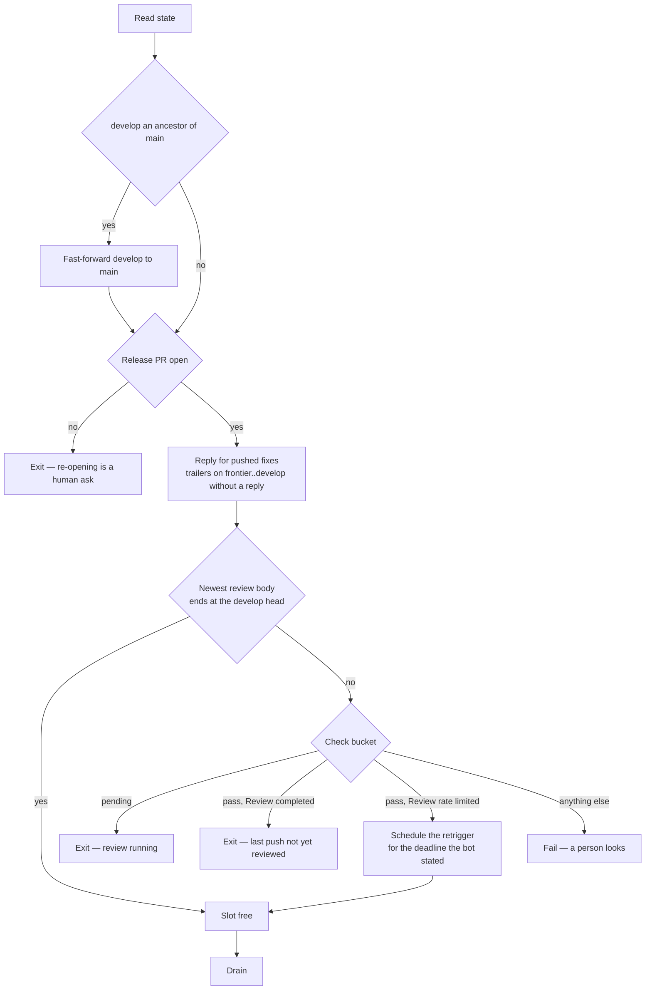
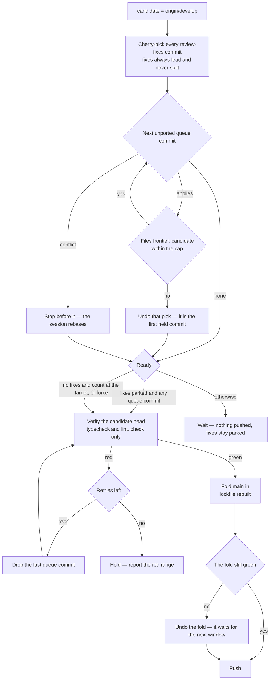

# Collection Cycle

One script, `pnpm ai:coderabbit:collect`, run by the [runner](/docs/infra/review-collector/runner) on every trigger and by hand with `--dry-run` to see what it would do; it finds the release pull request itself. It reads the whole situation from the remote, clears the gates, and then does the most it safely can in one pass. The steps are ordered so that every irreversible effect is either the single fast-forward push or a predicate-guarded write that a later run can finish. Which ref each writer owns is the [two writers](/docs/infra/review-collector/two-writers) page; this page is what the collector does inside its own turn.

## What it reads

Nothing is remembered between runs, so every input is a remote fact with a single source:

| Fact                          | Source                                                                                          |
| :---------------------------- | :---------------------------------------------------------------------------------------------- |
| the release pull request      | the one open pull request with base `main` and head `develop` — none means exit                 |
| the frontier                  | the last sha named by a review body's `between … and …` range, as `ai:coderabbit:window` reads  |
| the check                     | the CodeRabbit commit status, read by `bucket` first and `description` second                   |
| the rate-limit deadline       | the `Next included review available in …` the bot states in the walkthrough it last rewrote     |
| open findings                 | unresolved threads whose last comment is the bot's, plus the newest review body's own buckets   |
| fixes awaiting a push         | `git cherry origin/develop origin/review-fixes` — the branch stays, what it owes is what counts |
| what the queue still owes     | `git cherry origin/develop origin/queue` — commits not yet upstream by patch id                 |
| which thread a commit answers | an `Answers: <comment id>` trailer on the commit, `Drains: <review id>` for a body-only finding |

The trailers are the collector's memory. A fix commit says which finding it answers in its own message, so the reply step can name it after the push, a later run can tell an answered finding from an open one without any table, and a session fixing a finding by hand leaves the same record by writing the same trailer.

## The return stroke

Before the pull request is even looked up, the cycle compares `develop` with `main`. When `develop` is an ancestor of `main` and the two differ, the release pull request has just merged: `develop` is fast-forwarded to `main` with a plain push, which spends nothing because no pull request is open to review it. When `main` has commits `develop` lacks and `develop` is not an ancestor — a dependency bump merged straight to `main` — nothing happens here; the port step folds `main` into the candidate as a merge commit, resolving the lockfile the git skill's way (thrown away and rebuilt from the installed tree), so the bump rides the window the collector was pushing anyway and costs no slot of its own. A merge that conflicts anywhere but the lockfile is aborted and the window goes out without it. `queue` and `review-fixes` need no return stroke: the session rebases `queue` onto `develop` before its next unit, and `review-fixes` is re-created from `develop` by the next drain.

## The express lane

After the return stroke and still before the pull request is looked up, the cycle asks whether any commit the queue owes has nothing in it a reviewer could comment on — a folder sweep's moves and the imports that follow them. Those are cherry-picked onto `main` directly, because a review window is budgeted in files and a sweep is the largest thing the queue produces and the emptiest thing a reviewer reads. The push to `main` is the run's one irreversible act and the run exits on it, which fires the cycle again: the next run's return stroke fast-forwards `develop` onto it, and only then is a window measured, against a frontier that has already moved.

The lane needs no pull request open, which makes it the one thing that moves the pipeline while there is none. It is closed whenever `develop` and `main` disagree, and the cut earns the same checks a window's does before it goes anywhere near production. The proof each commit has to pass, and why order is enforced by the cherry-pick rather than by a rule, is the [express lane](/docs/infra/review-collector/express-lane) page.

## Gates

**The reply step runs before the gates, not after the push.** A reply is owed the moment a fix commit is on `develop`, and the run that pushed it may die before replying. Putting replies first makes every later run finish them: it scans the commits between the frontier and the `develop` head for `Answers:` trailers and posts on each thread that lacks a reply citing that commit. Once the review of that push completes, the frontier moves to the head and the scan is empty. This is why the runner must never exit at "review running" before replying — the running review is exactly the one that will resolve those threads, and it resolves them only if the reply is there.

**The review body, not the status, says a review is complete.** CodeRabbit writes the body naming its range at completion and flips the commit status a moment later, and the review event fires in that gap. Reading the status alone at that moment reads `pending`, exits, and nothing re-fires until the next queue push. So the primary test is whether the newest body's range ends at the `develop` head, and the status only decides when it does not. Anything unrecognised fails the run rather than guessing, because being wrong about a running review costs its findings.

**A rate limit leaves the slot free and owes a retrigger.** `Review rate limited` means the bot ran nothing: the frontier has not moved, and a window measured from that stale frontier can only over-count, which is the safe direction. So the cycle proceeds. What it owes is the review the limit refused, and the limit lifts without announcing it — so the run reads the deadline the bot published in the walkthrough it rewrote, and hands it to the [runner](/docs/infra/review-collector/runner)'s delayed retrigger job, whose review re-fires the cycle on completion. The deadline is counted from the comment that states it rather than from now, because the block outlives the limit: a merged pull request still shows the one its last skipped review wrote, and an expired block therefore resolves to no wait rather than to an hour of one.

## Drain

The drain answers every finding of the newest completed review, at every severity, and is the only step where Claude runs.

**Open** means: an unresolved thread by the bot whose last comment is the bot's, and whose id appears in no `Answers:` trailer on `review-fixes` or on the queue's unported commits. A thread with the collector's reply is closed from the collector's point of view whether or not CodeRabbit has resolved it yet; a thread the bot has answered again after that reply is open again, because its last comment is the bot's. Body-only findings — nitpicks and outside-diff-range comments have no thread — are open when the newest review states a non-zero count of either and its id appears in no `Drains:` trailer on any commit and in no verdict comment the collector posted on the pull request. A review stating none of either owes no body drain, so a clean review never spins up a Claude session.

The step checks out `review-fixes` while it still owes `develop` commits and re-creates it from the `develop` head otherwise, so the branch is never stale and never deleted, hands Claude the `ai:coderabbit:feedback` output filtered to the open set, and Claude does for each finding what the `coderabbit` skill already prescribes: verify against the code, then either fix it in a commit carrying `Answers: <comment id>` (one commit may answer several findings, and each gets its own trailer line) or reject it with a reply posted right away, since a rejection cites no sha. Body-only findings it judges real are fixed in commits carrying `Drains: <review id>`; a review whose body findings are all rejected gets one verdict comment on the pull request, which is that review's marker. It then runs the finishing checks over the touched paths and commits the repairs. It pushes nothing — the script pushes `review-fixes` after Claude exits successfully, with a lease on the sha it read, so a run that dies mid-drain leaves no trace and the next run starts the drain again from the same open set.

**A finding the drain cannot close is quarantined, not retried forever.** Each failed drain of a review leaves a hidden marker in a pull request comment carrying the review id and the attempt count; past the attempt cap the collector stops draining that review, posts that it has, and proceeds to port without fixes. The findings stay open for a person — the cost of that is a window whose fixes do not lead it, and the cost of the alternative is a pipeline stalled on one finding nobody sees. This is the [no manual recovery](/docs/architecture/no-manual-recovery) shape: land the failure durably, cap the attempts, quarantine visibly.

**A drain that never started is not a failed attempt.** Claude Code refusing to run because the account is out of session exits non-zero exactly like a drain that tried and could not, and counting it would spend the quarantine budget on an outage — three pushes during one limit would park a review for a person over something no fix addresses. So the step separates the two by reading the sentence Claude prints on its way out, and a limit writes its own marker carrying the instant it lifts. Until then every cycle skips the drain and stops before the port, because the open findings are untouched and nothing may be ported ahead of them. There is no waiting job for this one: the limit lifts on a clock this repo does not own, and the session pushes `queue` often enough that the next event is never far away.

## Port

The port builds the window as a local branch in the runner, one cherry-pick at a time, and measures after each. Estimation is what the manual process got wrong most often; here the count is read from the tree that will be pushed.

The rules the loop encodes:

- **Fixes always ride, whole.** Every unported `review-fixes` commit is picked first and none is ever dropped to make room, because a fix split from the finding it answers is a reply that lies. If the fixes alone overflow the cap the run fails — that is a drain that touched far more than its findings, and a person should see it.
- **Only what the queue authored is owed.** `main` merged into `queue` — the way a dependency bump reaches the working branch — brings `main`'s own commits and the merge itself, and none of it is the queue's: a merge cannot be cherry-picked, and `main`'s content reaches `develop` by the same `main` sync the git skill already describes rather than as copies. The porter takes only the queue's commits that are neither on `develop` by patch id nor reachable from `main`, and a cut with a skipped merge among its ancestors is ported rather than fast-forwarded, since a fast-forward would land the merge's uncounted diff.
- **Commits are taken in queue order and never reordered.** The queue is the session's linear history, and the prefix rule is what keeps every commit's tree the one its author verified. The first commit that would overflow the cap is where the window ends, and the count that decides it includes every fix.
- **Every count is measured from the frontier, never from the `develop` head.** A review covers everything since the one that last wrote a body, so a window pushed on top of one still unreviewed is read as a single range. Measuring from the head counts only the commits this run adds, and the pair then overflows the cap — the one failure the cap exists to prevent, since past it CodeRabbit skips the review outright rather than trimming it. The two bases agree exactly when the previous window has been reviewed, which is why the error is invisible until a rate limit lets a second window go out on top of the first.
- **A conflict ends the window before the conflicting commit.** The fixes changed something the queue also changed, and only the session can decide how they combine; the collector reports the commit and pushes whatever fit before it if that is ready. When the conflicting commit is the first one, the run pushes nothing and the [two writers](/docs/infra/review-collector/two-writers) page says how the session resolves it.
- **Readiness is a two-by-two.** Fixes parked and any queue commit fits: push, because the fixes are what the window is for. No fixes and the count reaches the fill target: push. No fixes and the queue is short: wait, the slot is free and nothing is waiting on it. Fixes parked and the queue empty: park, which is the case that motivated `review-fixes`. `--force` collapses the two waits into a push, for the dispatch when a short window is the right trade.
- **The cut is green on its own.** The pushed head runs CI alone, and interior queue commits were verified by nobody, so the candidate head gets `typecheck` and the lint check — check-only, never `lint:fix`, because a repair the collector wrote would be a commit nobody reviewed. Red drops the last queue commit and tries again a bounded number of times, then holds and names the range. `main` is folded in only once the cut is green, because the retry drops the candidate's last commit and on a merge commit that would be the fold rather than the queue commit; a fold that turns a green cut red is undone and left for the next window, since the bump on `main` is what broke it rather than anything the queue carried. Tests are not run here: `develop` runs its own CI after the push, and a red suite there is one more finding for the next window, which is the pipelining page's existing "correctness on `develop` is eventual".
- **Fast-forward when the shas allow it.** When there are no fixes, the queue sits directly on `origin/develop`, no skipped merge sits among the cut's ancestors and `main` had nothing to fold in, the cut is a queue commit and `git push origin <cut>:develop` moves `develop` to it without rewriting a sha, so the session's local branch already matches and no rebase is owed. The cherry-picked candidate is pushed in every other case.

## Push and reply

The push is one command, `git push origin candidate:develop`, preceded by a fresh fetch and a re-read of the check. The fetch asserts that `origin/develop` is still the sha every count was measured from — a non-fast-forward push is refused by git itself, so this is a compare-and-swap rather than a hope. The re-read catches a review that a person started with a comment while the run worked: if the bucket is `pending`, the run exits without pushing and nothing is lost, because the candidate was local and the fixes are on `review-fixes`.

After the push, the reply step runs again — the same scan the gates ran, now finding the fresh commits — and posts `Agreed, fixed in <sha>` with the commit subject on every thread a pushed commit's trailer names, and one verdict comment per `Drains:` review id listing the commits that answered it. The order is the skill's rule: push, then reply with a sha the remote has, so CodeRabbit can resolve the thread when it reviews the window that just started.

Nothing is deleted afterwards. `review-fixes` stays, owing nothing, until the next drain re-creates it from the new `develop` head. The queue is never touched: what it still owes is measured by `git cherry` on the next run, and the session's next rebase onto `origin/develop` drops the ported commits from its own history. The replies can run on any later run and find nothing to do.

## Why a re-run is a no-op

| Step  | Precondition read from the remote                | Effect                    | Second run against unchanged state                                                 |
| :---- | :----------------------------------------------- | :------------------------ | :--------------------------------------------------------------------------------- |
| reply | a trailer's thread lacks a reply citing that sha | posts the reply           | every thread has one — nothing                                                     |
| gate  | body range end, check bucket                     | a scheduled retrigger     | same verdict, same deadline — the bot re-answers a redundant retrigger and no more |
| drain | a finding is open by the predicate               | commits on `review-fixes` | every finding carries a trailer or a reply — nothing                               |
| port  | `git cherry` lists unported commits, readiness   | a local branch            | same branch, discarded with the runner                                             |
| push  | `origin/develop` unchanged since the read        | fast-forwards `develop`   | the last push moved the head, so the body no longer ends at it — exits at the gate |

The push row is the load-bearing one. After a push, the very next event finds a body that does not end at the head and a status that is `pending` or about to be, and exits — until CodeRabbit's completion moves the frontier and re-fires the cycle. Nothing here counts runs, remembers the last push, deletes a ref, or sleeps.
