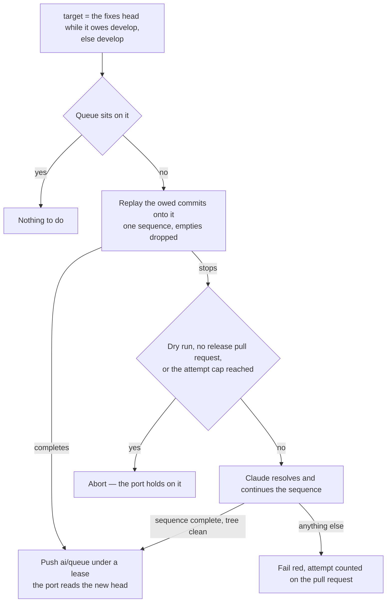
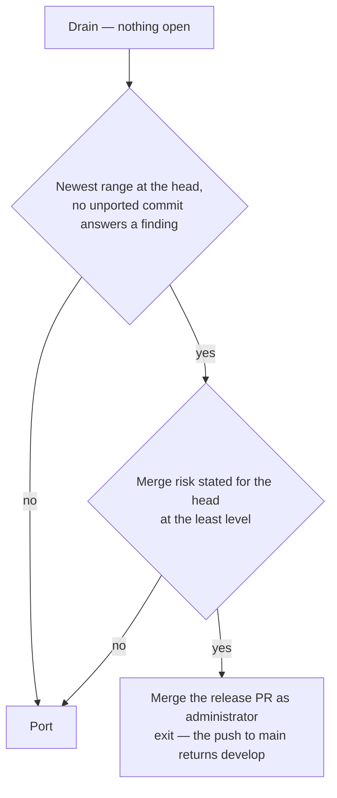
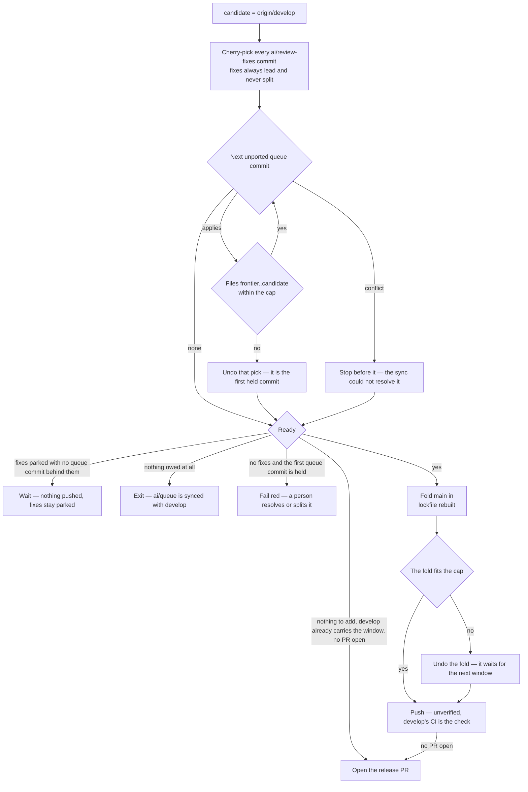

# Collection Cycle

One script, `pnpm ai:coderabbit:collect`, run by the [runner](/docs/infra/review-collector/runner) on every trigger and by hand with `--dry-run` to see what it would do. It reads the whole situation from the remote, clears the gates, and does the most it safely can in one pass, ordered so that every irreversible effect is either the single push or a predicate-guarded write a later run can finish. Which ref each writer owns is the [two writers](/docs/infra/review-collector/two-writers) page.

## What it reads

Nothing is remembered between runs, so every input is a remote fact with a single source:

| Fact                          | Source                                                                                                                                                                                              |
| :---------------------------- | :-------------------------------------------------------------------------------------------------------------------------------------------------------------------------------------------------- |
| the release pull request      | the one open pull request with base `main` and head `develop` — none means the last one merged                                                                                                      |
| the frontier                  | the last sha named by a `between … and …` range — a review body's, or the walkthrough's recent-review block's, the only record of a review that found nothing — or the merge base when none is open |
| the merge risk                | the level and the covered sha the bot states in the walkthrough's merge-risk block                                                                                                                  |
| the check                     | the CodeRabbit commit status, read by `bucket` first and `description` second                                                                                                                       |
| the rate-limit deadline       | the `Next included review available in …` the bot states in the walkthrough it last rewrote                                                                                                         |
| open findings                 | unresolved threads whose last comment is the bot's, plus the newest review body's own buckets                                                                                                       |
| fixes awaiting a push         | `git cherry origin/develop origin/ai/review-fixes` minus the ported set — the branch stays, what it owes is what counts                                                                             |
| what the queue still owes     | `git cherry <develop plus the fixes> origin/ai/queue` minus the ported set — commits not yet upstream by patch id, nor named as a copy's original                                                   |
| the ported set                | the `(cherry picked from commit …)` line every port writes (`cherry-pick -x`), read off the upstream since the two histories parted — the record a drifted patch id cannot lose                     |
| which thread a commit answers | an `Answers: <comment id>` trailer on the commit, `Drains: <review id>` for a body-only finding                                                                                                     |

The trailers are the collector's memory: a fix commit says which finding it answers in its own message, so the reply step can name it after the push, a later run can tell an answered finding from an open one, and a session fixing a finding by hand leaves the same record by writing the same trailer. The ported line is the same kind of memory for the port itself: a fix landing inside a ported hunk's context lines changes the copy's patch id, after which `git cherry` reads the original as still owed and re-picking it is the conflict nobody authored — so the copy names its original, and the owed set subtracts every original a copy names.

## The return stroke and the express lane

Before the pull request is looked up, the cycle compares `develop` with `main`. When `develop` is an ancestor of `main` and the two differ, `main` holds commits and `develop` holds nothing of its own: `develop` is fast-forwarded to `main` with a plain push — no pull request is open, so it spends nothing — and the run exits on it. What put those commits on `main` is not asked: a release that merged, an express cut and a dependency bump pushed straight at it all already sit on the branch a window is diffed against, so no window could carry them to a review, while refusing the stroke would strand `develop` behind `main` and close the express lane, which only opens when the two agree. When `main` has commits `develop` lacks and `develop` is not an ancestor (a dependency bump that landed while `develop` was already ahead), the port folds `main` into the candidate as a merge commit, the lockfile rebuilt the `git` skill's way, so the bump rides a window that was being pushed anyway; a merge that conflicts anywhere but the lockfile is aborted and the window goes out without it.

With no return stroke to make, the cycle asks whether any commit the queue owes has nothing in it to review and cherry-picks those onto `main` — the [express lane](/docs/infra/review-collector/express-lane). That push is the run's one irreversible act too; the next run's return stroke carries it to `develop`, and only then is a window measured.

## Gates

- **Replies run before the gates.** A reply is owed the moment a fix commit is on `develop`, and the run that pushed it may die before replying; putting replies first makes every later run finish them, before any exit — the running review is the one that resolves those threads, and only if the reply is there.
- **The stated range, not the status, says a review is complete.** CodeRabbit writes the range at completion and flips the status a moment later, and the review event fires in that gap; a status read alone there says `pending`, exits, and nothing re-fires until the next queue push. A review that found something states the range in its body; one that found nothing writes no body and states it only in the walkthrough's recent-review block, which is read as the newest range. The same walkthrough's rate-limit section names the range the bot _skipped_, so only the block between the recent-review markers is read. Anything unrecognised fails the run rather than guessing.
- **A rate limit leaves the slot free.** `Review rate limited` means the bot ran nothing, so a window measured from the unmoved frontier can only over-count, which is the safe direction. The review the limit refused is owed once the port has said nothing can be added to the range — asking earlier spends the hour on a range still filling, asking never leaves a frontier that can neither grow nor ship — and settling it is the [runner's delayed retrigger](/docs/infra/review-collector/runner).

## Drain

The one step Claude runs — [drain](/docs/infra/review-collector/drain). The cycle reaches it only with a pull request open; with none, no review has spoken.

## Sync

Before the port reads the queue, the collector rewrites it onto the tree the window is built on — `ai/review-fixes` while it owes `develop` commits, `develop` otherwise — and pushes it back under a lease on the sha it read. The commits the queue still owes are replayed in order as one `cherry-pick` sequence (`--empty=drop`, so a copy the tree already holds falls away); a queue already sitting on that tree is left alone, which is every run but the one after a window.

- **Why the collector and not the session.** A queue left on an old base carries commits written against files a drain has since repaired, and every one is a conflict the porter would hold on, run after run, until a person notices a red run. Here the conflict is met once, where the fixes are, and the working session's `git pull --rebase` afterwards replays only what it committed since (`.agents/skills/review-queue/SKILL.md`).
- **A conflict is the drain's session pointed at a conflict.** The same headless Claude, the same denials — no push, no branch switch, no GitHub — told which commit stopped the sequence and on which paths, that both sides survive, and that `--skip` is for a commit whose whole change the target already carries. What proves the resolution is a sequence run to its end over a clean tree, never the session's word. A failure counts against the drain's attempt cap under a marker keyed by the commit, and past the cap the commit is a person's: the port holds on it as it always did. The marker is a comment on the release pull request, so with none open there is nothing to count against and no session is spent — a conflict met between releases is a person's from the first, rather than one every run resolves afresh.
- **Two writers of `ai/queue`, one compare-and-swap.** The session pushes the queue plain; the collector rewrites it with `--force-with-lease` on the sha the run read, so a session push in between refuses the rewrite and the next run replays onto what the queue then carries ([two writers](/docs/infra/review-collector/two-writers)).

## Merge

A drain that found nothing to do may mean the release is done: the newest range ends at `develop`'s head, no thread has the bot's word last, the newest body states no findings of its own, no commit on `ai/review-fixes` or `ai/queue` that `develop` lacks by patch id carries a trailer answering one — answered elsewhere is not answered on `develop`, and a ported copy is — and the walkthrough's merge-risk block states the least level for that same head. Then the pull request is merged to `main` as an administrator and the run exits on it; the push to `main` runs the return stroke.

- **The merge names the head the verdict covers.** Every gate above it was measured against the `develop` the pass read, so the merge is made to match that sha — the same compare-and-swap the push makes. A `develop` that moved in between fails the run rather than releasing commits no review covered.
- **The checks do not gate it.** `develop` runs them, and the release does not wait: the review is the gate, and a red check is one more commit in the next window.
- **A risk above the least is a person's.** The cycle merges nothing over it and keeps porting; the bot restates the level on every review, so a later window can clear it.

## Port

The port builds the window as a local branch, one cherry-pick at a time, and measures after each from the tree that will be pushed.

- **Fixes always ride, whole.** A fix split from the finding it answers is a reply that lies. Fixes alone over the cap fail the run — a drain that touched far more than its findings, for a person to see.
- **Only what the queue authored is owed.** A merge of `main` into `ai/queue` brings `main`'s commits and the merge itself, none of it the queue's. The porter takes the queue's commits that are neither on `develop` by patch id nor reachable from `main`, and a cut with a skipped merge among its ancestors is ported rather than fast-forwarded.
- **Queue order, never reordered.** The first commit that would overflow the cap or conflicts is where the window ends; the count includes every fix. A conflict reaches the port only when the sync above could not resolve it — a dry run, no release pull request to count an attempt on, or a commit past the attempt cap.
- **Every count is measured from the frontier.** A review covers everything since the one that last wrote a body, so a window pushed on top of an unreviewed one is read as a single range; measuring from the head lets the pair overflow the cap, past which CodeRabbit skips the review outright.
- **The window is pushed unverified.** `develop` runs its own CI after the push, and a red there is one more commit in the next window. The fold of `main` is undone whole when it puts the window over the cap: the pick loop never counted a merge's own diff, and nothing here knows which of `main`'s files to drop.
- **Fast-forward when the shas allow it** — no fixes, the queue sitting on `origin/develop`, no skipped merge among the cut's ancestors, nothing folded — so the session's local branch already matches and no rebase is owed.

### Readiness

Whether the window goes out is `checkIsReady`, a two-by-two over what the port holds:

|                  | queue commits fit                       | none fit                                                                                                 |
| :--------------- | :-------------------------------------- | :------------------------------------------------------------------------------------------------------- |
| **fixes parked** | push                                    | park — unless the queue's first commit is the held one, then push                                        |
| **no fixes**     | push, at whatever size the port reached | push what `develop` carries unreviewed, else nothing is owed — or fail red when the first commit is held |

**There is no lower bound on a window.** The port takes every commit the queue owes and stops only at the cap or on a conflict, so a window that came out small is the whole of what was left — and waiting for it to grow waits on a push nothing has promised while the queue stays unsynced. The standing goal is `ai/queue` fully drained into `develop`; the cap is the only size the window is measured against, and it is measured on the tree that will be pushed.

A held window cannot grow — the commit that stopped it overflows the cap or conflicts, and both only clear once this window lands. `--force` is only ever the difference on parked fixes, since everywhere else an owed commit already goes out. With no pull request open, the commits `develop` already carries above the merge base count beside the queue's, so a `develop` a dying run left pushed is ready with nothing to add and only the opening is owed. Under a rate limit the review the limit refused is asked for first ([the runner's retrigger](/docs/infra/review-collector/runner)), since its answer is still owed.

## Push, reply, open

The push is `git push --force-with-lease=refs/heads/develop:<measured> origin candidate:develop`, preceded by a fresh fetch and a re-read of the check. The lease is the compare-and-swap: the remote refuses the update itself if `origin/develop` left the sha every count was measured from, so there is no gap for a concurrent update to land in; that refusal is read off the ref rather than git's localized rejection text, the run reports a moved outcome and the next one re-measures, while a push that failed for anything else fails the job as itself. The re-read catches a review a person started with a comment while the run worked, and it **fails closed**: a status that cannot be read at all is not a free slot, because `gh` answering nothing looks exactly like a review that began a second ago, and pushing on that reading cancels it for a window nobody re-measures. The ask under a rate limit is guarded the same way, for the same reason. After the push the reply step runs again and posts `Agreed, fixed in <sha>` on every thread a pushed commit's trailer names, and one verdict comment per `Drains:` review id.

With no pull request open, the push is followed by opening one — the same readiness a push clears, because opening is the first review of the range. A run that pushed and died before opening is finished by the next one, which finds `develop` carrying the window with nothing to add. Nothing is deleted afterwards: `ai/review-fixes` stays, owing nothing, until the next drain re-creates it, and the queue's ported commits drop from the session's history at its next rebase.

## Why a re-run is a no-op

| Step  | Precondition read from the remote                         | Effect                       | Second run against unchanged state                                                 |
| :---- | :-------------------------------------------------------- | :--------------------------- | :--------------------------------------------------------------------------------- |
| reply | a trailer's thread lacks a reply citing that sha          | posts the reply              | every thread has one — nothing                                                     |
| gate  | the newest stated range's end, check bucket               | a scheduled retrigger        | same verdict, same deadline — the ask is posted once per block                     |
| drain | a finding is open by the predicate                        | commits on `ai/review-fixes` | every finding carries a trailer or a reply — nothing                               |
| sync  | the queue does not sit on the tree the window is built on | rewrites `ai/queue`          | it sits on it — nothing                                                            |
| merge | the range at the head, nothing open, least risk           | merges the pull request      | none is open — the next window fills from the merge base                           |
| port  | `git cherry` lists unported commits, readiness            | a local branch               | same branch, discarded with the runner                                             |
| push  | `origin/develop` unchanged since the read                 | fast-forwards `develop`      | the last push moved the head, so the body no longer ends at it — exits at the gate |
| open  | no release pull request, `develop` at the target          | opens the pull request       | one is open — the ordinary cycle, with its reviews as the frontier                 |

## Notes

- **Rejected: verifying a window before the push** — build, typecheck and lint on the candidate, dropping the tail commit until green. A gate with no remedy: the window is a prefix of the queue, so a red commit inside it holds every window behind it while its repair sits commits later and past the cap, and each attempt spends runner-minutes finding that out. The queue's own CI already names the red commit to the session that can fix it in the next commit. The express lane alone verifies, because it reaches `main` unread.
