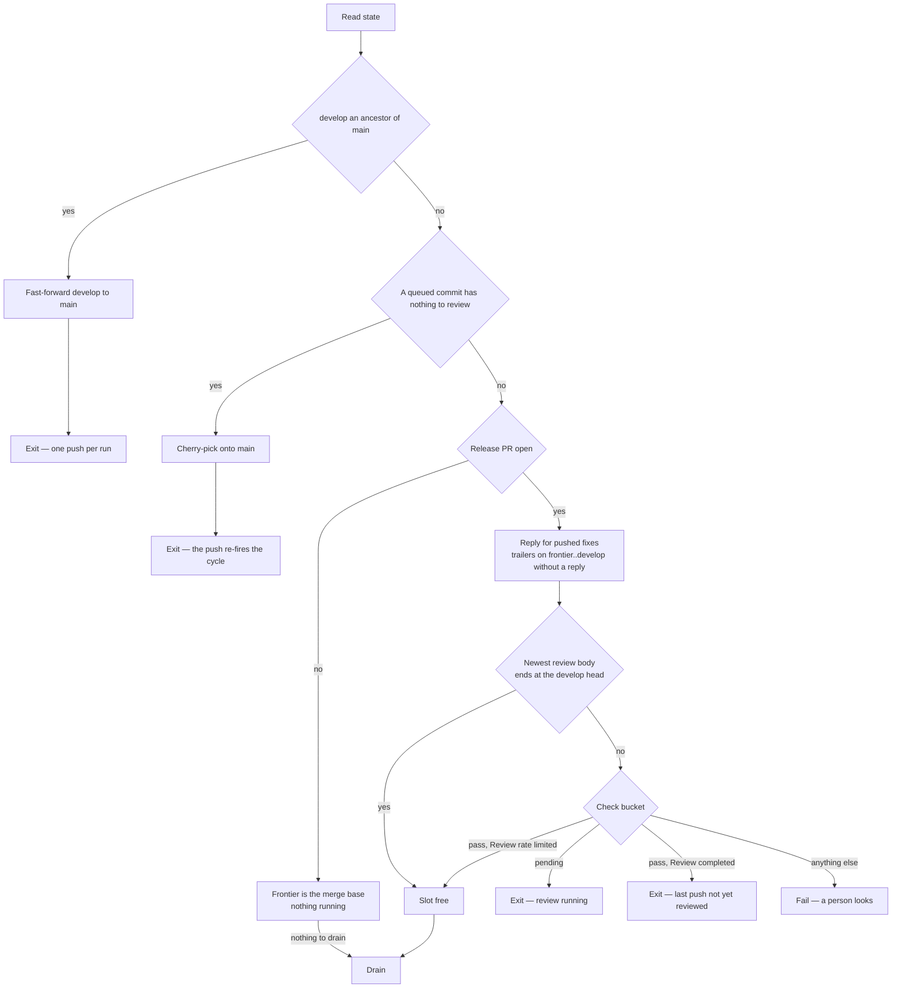
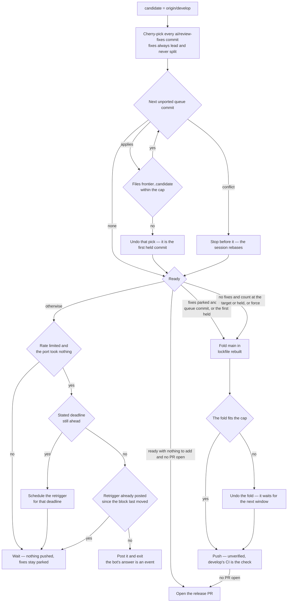

# Collection Cycle

One script, `pnpm ai:coderabbit:collect`, run by the [runner](/docs/infra/review-collector/runner) on every trigger and by hand with `--dry-run` to see what it would do; it finds the release pull request itself, and opens the next one once a window is worth its first review. It reads the whole situation from the remote, clears the gates, and then does the most it safely can in one pass. The steps are ordered so that every irreversible effect is either the single fast-forward push or a predicate-guarded write that a later run can finish. Which ref each writer owns is the [two writers](/docs/infra/review-collector/two-writers) page; this page is what the collector does inside its own turn.

## What it reads

Nothing is remembered between runs, so every input is a remote fact with a single source:

| Fact                          | Source                                                                                             |
| :---------------------------- | :------------------------------------------------------------------------------------------------- |
| the release pull request      | the one open pull request with base `main` and head `develop` — none means the last one merged     |
| the frontier                  | the last sha named by a review body's `between … and …` range, or the merge base when none is open |
| the check                     | the CodeRabbit commit status, read by `bucket` first and `description` second                      |
| the rate-limit deadline       | the `Next included review available in …` the bot states in the walkthrough it last rewrote        |
| open findings                 | unresolved threads whose last comment is the bot's, plus the newest review body's own buckets      |
| fixes awaiting a push         | `git cherry origin/develop origin/ai/review-fixes` — the branch stays, what it owes is what counts |
| what the queue still owes     | `git cherry <develop plus the fixes> origin/ai/queue` — commits not yet upstream by patch id       |
| the window `develop` carries  | the commits above the frontier no review has read — only ever non-zero with no pull request open   |
| which thread a commit answers | an `Answers: <comment id>` trailer on the commit, `Drains: <review id>` for a body-only finding    |

The trailers are the collector's memory. A fix commit says which finding it answers in its own message, so the reply step can name it after the push, a later run can tell an answered finding from an open one without any table, and a session fixing a finding by hand leaves the same record by writing the same trailer.

## The return stroke

Before the pull request is even looked up, the cycle compares `develop` with `main`. When `develop` is an ancestor of `main` and the two differ, the release pull request has just merged: `develop` is fast-forwarded to `main` with a plain push, which spends nothing because no pull request is open to review it — and the run exits on it, since that push is its one irreversible act and the express lane it just opened would be a second. When `main` has commits `develop` lacks and `develop` is not an ancestor — a dependency bump merged straight to `main` — nothing happens here; the port step folds `main` into the candidate as a merge commit, resolving the lockfile the git skill's way (thrown away and rebuilt from the installed tree), so the bump rides the window the collector was pushing anyway and costs no slot of its own. A merge that conflicts anywhere but the lockfile is aborted and the window goes out without it. `ai/queue` and `ai/review-fixes` need no return stroke: the session rebases `ai/queue` onto `develop` before its next unit, and `ai/review-fixes` is re-created from `develop` by the next drain.

## The express lane

When there was no return stroke to make, and still before the pull request is looked up, the cycle asks whether any commit the queue owes has nothing in it a reviewer could comment on — a folder sweep's moves and the imports that follow them. Those are cherry-picked onto `main` directly, because a review window is budgeted in files and a sweep is the largest thing the queue produces and the emptiest thing a reviewer reads. The push to `main` is the run's one irreversible act and the run exits on it, which fires the cycle again: the next run's return stroke fast-forwards `develop` onto it, and only then is a window measured, against a frontier that has already moved.

The lane needs no pull request open, which makes it the one thing that moves the pipeline while there is none. It is closed whenever `develop` and `main` disagree, its cut has to prove mechanical a second time as it will land, and it earns a window's checks **and the tests** before it goes anywhere near production — the one lane nobody reads is the one that pays for the most. The proof each commit has to pass, and why order is enforced by the cherry-pick rather than by a rule, is the [express lane](/docs/infra/review-collector/express-lane) page.

## Gates

**The reply step runs before the gates, not after the push.** A reply is owed the moment a fix commit is on `develop`, and the run that pushed it may die before replying. Putting replies first makes every later run finish them: it scans the commits between the frontier and the `develop` head for `Answers:` trailers and posts on each thread that lacks a reply citing that commit. Once the review of that push completes, the frontier moves to the head and the scan is empty. This is why the runner must never exit at "review running" before replying — the running review is exactly the one that will resolve those threads, and it resolves them only if the reply is there.

**The review body, not the status, says a review is complete.** CodeRabbit writes the body naming its range at completion and flips the commit status a moment later, and the review event fires in that gap. Reading the status alone at that moment reads `pending`, exits, and nothing re-fires until the next queue push. So the primary test is whether the newest body's range ends at the `develop` head, and the status only decides when it does not. Anything unrecognised fails the run rather than guessing, because being wrong about a running review costs its findings.

**A slot is only ever spent on a range worth an hour.** The collector has two ways to start a review and the cost is the same either way: a push to `develop` is auto-reviewed, since the pull request's base is the default branch, and the retrigger asks outright. A run that ships a window needs no ask at all — the push starts the review, and a limit refusing that one rewrites the block, which arrives as the event this workflow runs on. So the ask is owed exactly when the run has no window to ship and nothing can be added to the range, which is the port taking no commit: the queue is empty, or every owed commit overflows the cap from this frontier. Asking earlier spends the hour on a range still filling — the limit that skipped this review is what lets a later window grow the same range, so one review reads the lot. Asking never is worse: the frontier only moves when a review completes, so a range nothing fits into can neither grow nor ship. One rule decides both, because the port already answers the only question either was asking.

**A rate limit leaves the slot free and owes a retrigger.** `Review rate limited` means the bot ran nothing: the frontier has not moved, and a window measured from that stale frontier can only over-count, which is the safe direction. So the cycle proceeds, and what it owes — the review the limit refused — is settled at the readiness step once the port has said whether anything can still be added to the range: a deadline still ahead goes to the runner's delayed retrigger job, a deadline passed is asked about with `@coderabbitai review` once per block and after a fresh read of the slot, and the run exits on the ask because the bot's answer is itself a trigger. How the deadline is read and why the job that sleeps is not the one that asks is the [runner](/docs/infra/review-collector/runner)'s delayed-retrigger section.

## Drain

The one step Claude runs, and the only one with a page of its own: which findings are open, what the session is handed and denied, and how a drain that fails is quarantined — [drain](/docs/infra/review-collector/drain). The cycle reaches it only with a pull request open; with none, no review has spoken and there is nothing to drain.

## Port

The port builds the window as a local branch in the runner, one cherry-pick at a time, and measures after each. Estimation is what the manual process got wrong most often; here the count is read from the tree that will be pushed.

The rules the loop encodes:

- **Fixes always ride, whole.** Every unported `ai/review-fixes` commit is picked first and none is ever dropped to make room, because a fix split from the finding it answers is a reply that lies. If the fixes alone overflow the cap the run fails — that is a drain that touched far more than its findings, and a person should see it.
- **Only what the queue authored is owed.** `main` merged into `ai/queue` — the way a dependency bump reaches the working branch — brings `main`'s own commits and the merge itself, and none of it is the queue's: a merge cannot be cherry-picked, and `main`'s content reaches `develop` by the same `main` sync the git skill already describes rather than as copies. The porter takes only the queue's commits that are neither on `develop` by patch id nor reachable from `main`, and a cut with a skipped merge among its ancestors is ported rather than fast-forwarded, since a fast-forward would land the merge's uncounted diff.
- **Commits are taken in queue order and never reordered.** The queue is the session's linear history, and the prefix rule is what keeps every commit's tree the one its author verified. The first commit that would overflow the cap is where the window ends, and the count that decides it includes every fix.
- **Every count is measured from the frontier, never from the `develop` head.** A review covers everything since the one that last wrote a body, so a window pushed on top of one still unreviewed is read as a single range. Measuring from the head counts only the commits this run adds, and the pair then overflows the cap — the one failure the cap exists to prevent, since past it CodeRabbit skips the review outright rather than trimming it. The two bases agree exactly when the previous window has been reviewed, which is why the error is invisible until a rate limit lets a second window go out on top of the first.
- **A conflict ends the window before the conflicting commit.** The fixes changed something the queue also changed, and only the session can decide how they combine; the collector reports the commit and pushes whatever fit before it if that is ready. When the conflicting commit is the first one, the run pushes nothing and the [two writers](/docs/infra/review-collector/two-writers) page says how the session resolves it.
- **Readiness is a two-by-two.** Fixes parked and any queue commit fits: push, because the fixes are what the window is for. No fixes and the count reaches the fill target: push. No fixes and the queue is short: wait, the slot is free and nothing is waiting on it — unless the window is held, because then it is as large as it will ever be. The commit that stopped it overflows the cap or conflicts, and both only clear once this window lands, so holding a held window to the target parks it forever rather than under-filling one review. Fixes parked and the queue empty: park, which is the case that motivated `ai/review-fixes` — unless the queue's first commit is the held one, because then the queue is blocked rather than empty and the fixes landing is what unblocks it. `--force` collapses the two waits into a push, for the dispatch when a short window is the right trade. With no pull request open, the commits `develop` already carries above the merge base count beside the queue's — they are part of the range the first review reads — so a `develop` a dying run left at the target is ready with nothing to add, and the only act owed is opening the pull request. Asked once, because the window that was measured is the window that ships: nothing after readiness drops a commit, and the one thing that can add files — the fold of `main` — is undone whole when it overflows.
- **The window is pushed unverified.** No build, typecheck, lint or test runs on the candidate: `develop` runs its own CI after the push, and a red there is one more commit in the next window — the pipelining page's "correctness on `develop` is eventual", which already covered the tests and now covers every check. A check run here was a gate with no remedy: the window is a prefix of the queue, so a red commit inside it — a dependency bump whose repair the session committed later, as the finishing checks always produce it — holds every window behind it, since the prefix that carries the repair is past the cap and no shorter one is green; dropping the tail one commit at a time only found that out several runner-minutes per attempt later, and left the pipeline parked. The queue's own CI already names the red commit to the session that can fix it, in the next commit, which is the one place a fix can be written. The express lane is the exception, and pays for the full set (its own page). `main` is folded in after the port, and a fold that puts the window over the file cap is undone whole: the pick loop counts fixes and queue commits, never a merge's own diff, so `main`'s backlog of files would otherwise ride out uncounted past the one limit that makes CodeRabbit skip the review outright — undone rather than shrunk, because nothing here knows which of `main`'s files to drop, and the fold tries again next window.
- **Fast-forward when the shas allow it.** When there are no fixes, the queue sits directly on `origin/develop`, no skipped merge sits among the cut's ancestors and `main` had nothing to fold in, the cut is a queue commit and `git push origin <cut>:develop` moves `develop` to it without rewriting a sha, so the session's local branch already matches and no rebase is owed. The cherry-picked candidate is pushed in every other case.

## Push, reply, open

The push is one command, `git push --force-with-lease=refs/heads/develop:<measured> origin candidate:develop`, preceded by a fresh fetch and a re-read of the check. The lease is the compare-and-swap: the remote is handed the sha every count was measured from and refuses the update itself if `origin/develop` no longer sits on it, so there is no gap between the fetch and the push for a concurrent update to land in. That refusal is read off the ref rather than off git's rejection text, which is localized — the branch moved, so the run reports a moved outcome and the next one re-measures, while a push that failed for anything else fails the job as itself. The fetch before it is only an early exit. The re-read catches a review that a person started with a comment while the run worked: if the bucket is `pending`, the run exits without pushing and nothing is lost, because the candidate was local and the fixes are on `ai/review-fixes`.

After the push, the reply step runs again — the same scan the gates ran, now finding the fresh commits — and posts `Agreed, fixed in <sha>` with the commit subject on every thread a pushed commit's trailer names, and one verdict comment per `Drains:` review id listing the commits that answered it. The order is the skill's rule: push, then reply with a sha the remote has, so CodeRabbit can resolve the thread when it reviews the window that just started.

**With no pull request open, the push is followed by opening one.** The last release merged, `develop` followed `main`, and the queue has since filled a window from that merge base — the same fill target a push clears, because opening the pull request is the first review of the range, and a pull request opened on a handful of files spends the hour on them. Opening is idempotent by predicate: the cycle reaches it only when no release pull request is open, so a run that pushed and died before opening is finished by the next one, which measures `develop` already at the target with nothing to add and opens on it. A pull request cannot be opened on an empty range, which is why the push comes first. Merging it stays a person's act — that is a release.

Nothing is deleted afterwards. `ai/review-fixes` stays, owing nothing, until the next drain re-creates it from the new `develop` head. The queue is never touched: what it still owes is measured by `git cherry` on the next run, and the session's next rebase onto `origin/develop` drops the ported commits from its own history. The replies can run on any later run and find nothing to do.

## Why a re-run is a no-op

| Step  | Precondition read from the remote                | Effect                       | Second run against unchanged state                                                 |
| :---- | :----------------------------------------------- | :--------------------------- | :--------------------------------------------------------------------------------- |
| reply | a trailer's thread lacks a reply citing that sha | posts the reply              | every thread has one — nothing                                                     |
| gate  | body range end, check bucket                     | a scheduled retrigger        | same verdict, same deadline — the ask is posted once per block                     |
| drain | a finding is open by the predicate               | commits on `ai/review-fixes` | every finding carries a trailer or a reply — nothing                               |
| port  | `git cherry` lists unported commits, readiness   | a local branch               | same branch, discarded with the runner                                             |
| push  | `origin/develop` unchanged since the read        | fast-forwards `develop`      | the last push moved the head, so the body no longer ends at it — exits at the gate |
| open  | no release pull request, `develop` at the target | opens the pull request       | one is open — the ordinary cycle, with its reviews as the frontier                 |

The push row is the load-bearing one. After a push, the very next event finds a body that does not end at the head and a status that is `pending` or about to be, and exits — until CodeRabbit's completion moves the frontier and re-fires the cycle. Nothing here counts runs, remembers the last push, deletes a ref, or sleeps.
