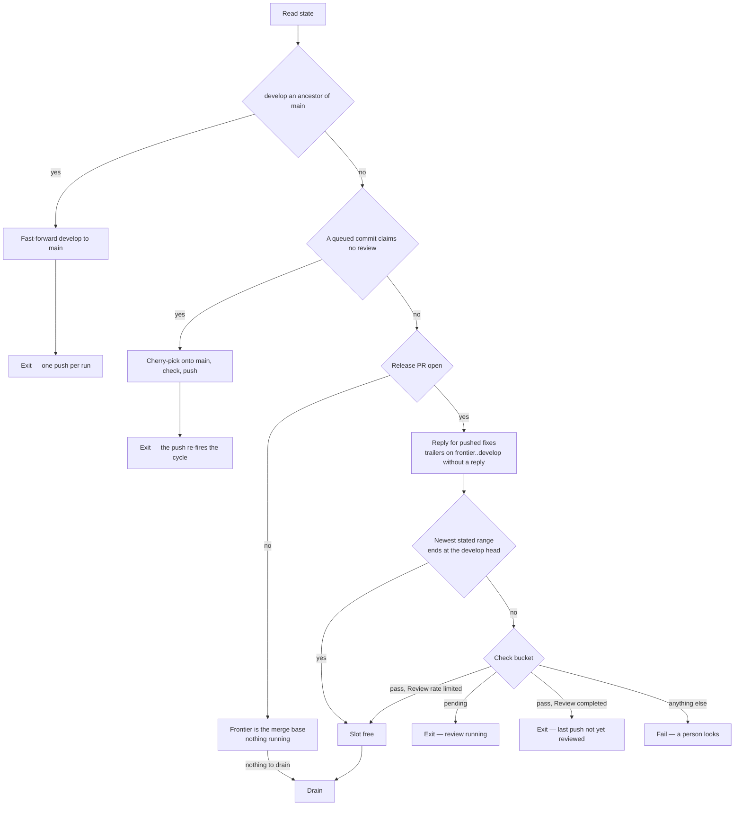
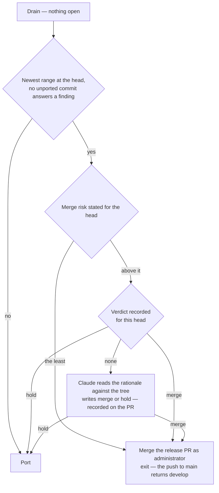
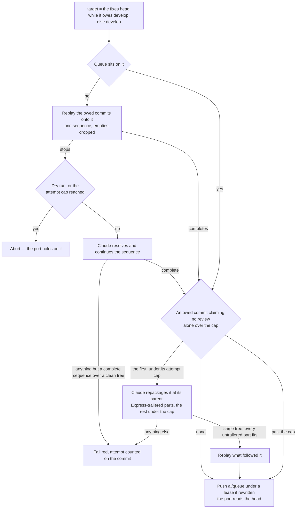
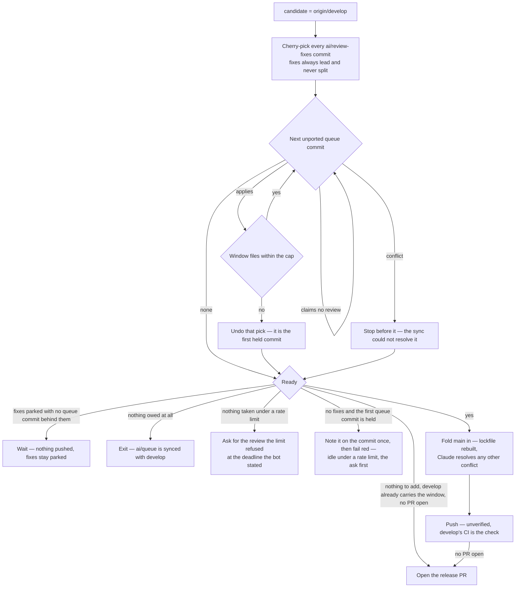

# Collection Cycle

One script, `pnpm ai:coderabbit:collect`, run by the [runner](/docs/infra/review-collector/runner) on every trigger and by hand with `--dry-run` to see what it would do. It reads the whole situation from the remote, clears the gates, and does the most it safely can in one pass, ordered so that every irreversible effect is either the single push or a predicate-guarded write a later run can finish. Which ref each writer owns is the [two writers](/docs/infra/review-collector/two-writers) page. A live run ends at its one push; a dry run ends at none of them, so it reports what every stage would do — the express cut, the reshaping, the window — in a single pass, which is how a change to any of them is read against the live refs before it is pushed.

## What it reads

Nothing is remembered between runs, so every input is a remote fact with a single source:

| Fact                          | Source                                                                                                                                                                                                           |
| :---------------------------- | :--------------------------------------------------------------------------------------------------------------------------------------------------------------------------------------------------------------- |
| the release pull request      | the one open pull request with base `main` and head `develop` — none means the last one merged                                                                                                                   |
| the frontier                  | the last sha named by a `between … and …` range — a review body's, or the walkthrough's recent-review block's, the only record of a review that found nothing — or the merge base when none is open              |
| the merge risk                | the level and the covered sha the bot states in the walkthrough's merge-risk block                                                                                                                               |
| the release verdict           | the collector's own `merge-verdict` marker for the head, verb beside it — the session's reading of the risk rationale, recorded once per head                                                                    |
| the check                     | the CodeRabbit commit status, read by `bucket` first and `description` second                                                                                                                                    |
| the rate-limit deadline       | the `Next included review available in …` the bot states in the walkthrough it last rewrote                                                                                                                      |
| open findings                 | unresolved threads whose last comment is the bot's, plus the newest review body's own buckets                                                                                                                    |
| fixes awaiting a push         | `git cherry origin/develop origin/ai/review-fixes` minus the ported set — the branch stays, what it owes is what counts                                                                                          |
| what the queue still owes     | `git cherry <develop plus the fixes> origin/ai/queue` minus the ported set — commits not yet upstream by patch id, nor named as a copy's original                                                                |
| the ported set                | the `(cherry picked from commit …)` line every port and every express cut writes (`cherry-pick -x`), read off the upstream and off `main` since the histories parted — the record a drifted patch id cannot lose |
| which thread a commit answers | an `Answers: <comment id>` trailer on the commit, `Drains: <review id>` for a body-only finding                                                                                                                  |
| what claims no review         | an `Express: <why>` trailer on a queue commit — the reshaper's, or a session's own                                                                                                                               |

The trailers are the collector's memory: a fix commit says which finding it answers in its own message, so the reply step can name it after the push, a later run can tell an answered finding from an open one, and a session fixing a finding by hand leaves the same record by writing the same trailer. The ported line is the same kind of memory for the port itself: a fix landing inside a ported hunk's context lines changes the copy's patch id, after which `git cherry` reads the original as still owed and re-picking it is the conflict nobody authored — so the copy names its original, and the owed set subtracts every original a copy names, on `develop` or on `main`.

## The return stroke and the express lane

Before the pull request is looked up, the cycle compares `develop` with `main`. When `develop` is an ancestor of `main` and the two differ, `main` holds commits and `develop` holds nothing of its own: `develop` is fast-forwarded to `main` with a plain push — no pull request is open, so it spends nothing — and the run exits on it. What put those commits on `main` is not asked: a release that merged, an express cut and a dependency bump pushed straight at it all already sit on the branch a window is diffed against, so no window could carry them to a review.

With no return stroke to make, the cycle cuts every queue commit that claims it needs no review onto `main` — the [express lane](/docs/infra/review-collector/express-lane), open whether or not a window is in flight. That push is the run's one irreversible act too; the fold below carries `main` into the next window, and only then is a window measured.

## Gates

- **Replies run before the gates.** A reply is owed the moment a fix commit is on `develop`, and the run that pushed it may die before replying; putting replies first makes every later run finish them, before any exit — the running review is the one that resolves those threads, and only if the reply is there.
- **The stated range, not the status, says a review is complete.** CodeRabbit writes the range at completion and flips the status a moment later, and the review event fires in that gap; a status read alone there says `pending`, exits, and nothing re-fires until the next queue push. A review that found something states the range in its body; one that found nothing writes no body and states it only in the walkthrough's recent-review block, which is read as the newest range. The same walkthrough's rate-limit section names the range the bot _skipped_, so only the block between the recent-review markers is read. Anything unrecognised fails the run rather than guessing.
- **A rate limit leaves the slot free.** `Review rate limited` means the bot ran nothing, so a window measured from the unmoved frontier can only over-count, which is the safe direction. The review the limit refused is owed once the port has said nothing can be added to the range — asking earlier spends the hour on a range still filling, asking never leaves a frontier that can neither grow nor ship — and settling it is the [runner's delayed retrigger](/docs/infra/review-collector/runner).

## Drain

The step that answers findings — [drain](/docs/infra/review-collector/drain). The cycle reaches it only with a pull request open; with none, no review has spoken.

## Merge

A drain that found nothing to do may mean the release is done: the newest range ends at `develop`'s head, no thread has the bot's word last, the newest body states no findings of its own, and no commit on `ai/review-fixes` or `ai/queue` that `develop` lacks by patch id carries a trailer answering one — answered elsewhere is not answered on `develop`, and a ported copy is. Then the walkthrough's merge-risk block decides: the least level for that head merges the pull request to `main` as an administrator and the run exits on it, the push to `main` running the return stroke; any other level is judged.

- **The merge names the head the verdict covers.** Every gate above it was measured against the `develop` the pass read, so the merge is made to match that sha — the same compare-and-swap the push makes. A `develop` that moved in between fails the run rather than releasing commits no review covered.
- **The checks do not gate it.** `develop` runs them, and the release does not wait: the review is the gate, and a red check is one more commit in the next window.
- **A level above the least is a judgement, made once per head.** The level is the bot's impression across every round of a long pull request, and it does not reset when the concerns behind it are answered — PR 1174 stayed `Moderate` through a day of rounds whose every finding was fixed or rejected. Nothing deterministic can read whether anything real is left, so the drain's session is handed the rationale, the feedback report and the collector's own replies, and writes one line: `merge` with why nothing is left, or `hold` with the one concern that is. The verdict is recorded on the pull request beside a marker for the head — a `merge` whose `gh pr merge` was refused merges on the next run, a `hold` ports on and the next head is judged afresh — and the session's silence is a hold, since a release is never made on a reading nobody reached. A held release is the person's: merge it, or close the pull request to pause.

## Sync

Before the port reads the queue, the collector rewrites it onto the tree the window is built on — `ai/review-fixes` while it owes `develop` commits, `develop` otherwise — reshapes the first owed commit that alone exceeds the cap, and pushes it back under a lease on the sha it read. The cap does not measure a commit carrying `Express:` — that one is the lane's at any size, and reshaping it would pay a session per run to repackage what no window will ever carry. The commits the queue still owes are replayed in order as one `cherry-pick` sequence — `--empty=drop`, so a copy the tree already holds falls away, and `-x`, so every copy names the original it came from and a resolution that drifted its patch id still reads as carried; a queue already sitting on that tree with nothing to reshape is left alone, which is every run but the one after a window.

- **Why the collector and not the session.** A queue left on an old base carries commits written against files a drain has since repaired, and every one is a conflict the porter would hold on, run after run, until a person notices a red run. Here the conflict is met once, where the fixes are, and the working session's `git pull --rebase` afterwards replays only what it committed since (`.agents/skills/review-queue/SKILL.md`).
- **A conflict is the drain's session pointed at a conflict.** The same headless Claude, the same denials — no push, no branch switch, no GitHub — told which commit stopped the sequence and on which paths, that both sides survive, and that `--skip` is for a commit whose whole change the target already carries. What proves the resolution is a sequence run to its end over a clean tree that carries every commit the queue owed, never the session's word — the first two are what `git cherry-pick --abort` leaves as well, and the rewrite behind them would force-push every owed commit away, so the third is read off the replay itself — and so the resolver owes no finishing checks and repairs nothing beyond the conflict: a red elsewhere in the replay is a queue commit's, which the queue's own CI names to the session that owns it, and every minute the resolver spends past the conflict is one the working session can push into. A failure counts against the attempt cap under a marker in a comment on the conflicting commit itself — the queue is synced with no pull request open as often as with one, so a count kept on the pull request would leave the resolver uncapped in between — and past the cap the commit is a person's: the port holds on it.
- **A commit alone over the cap is repackaged, never held.** No window can carry it and no session is asked to commit differently — what a commit holds is the session's business, and what in it needs a reviewer's eye is a judgement. The same session, detached at the commit's parent, rewrites it as a sequence: the parts that need no review — a rename, a one-rule substitution a lint rule now enforces, generated output, a format pass — each a commit of any size carrying `Express: <why>`, which the express lane takes to `main`; the rest in commits under the cap, ordered so every prefix is green. It repackages and never edits, and the collector proves that rather than trusting it: `git diff <original> HEAD` empty and every untrailered part under the cap, or the attempt fails and is counted on the commit. One commit per run, since the rewrite's push fires the next. Past the attempt cap the commit is left whole for the port to hold on — the residual person's case, and the held notice below says so.
- **Two writers of `ai/queue`, one compare-and-swap.** The lease is the rewrite's alone — it names the sha the run read, against a session that pushes plain and pulls when the rewrite refuses it ([two writers](/docs/infra/review-collector/two-writers)). A rewrite the session's push beat is not redone: that push fast-forwarded the sha the lease named by a commit or two, so the rewrite carries those onto itself and pushes again under the lease the push moved to, a few times over before giving up — redoing the run would hand the resolver the same conflict to lose to the next push, which under an active session never converges. Only a queue whose history the session rewrote, or a carried commit that conflicts with the rewrite, exits the run idle, since that push fires a run of its own that replays onto what the queue then carries — porting off the stale head instead would hold on a conflict the next run resolves.

## Port

The port builds the window as a local branch, one cherry-pick at a time, and measures after each from the tree that will be pushed.

- **Fixes always ride, whole.** A fix split from the finding it answers is a reply that lies. Fixes alone over the cap fail the run — a drain that touched far more than its findings, for a person to see.
- **Only what the queue authored is owed.** A merge of `main` into `ai/queue` brings `main`'s commits and the merge itself, none of it the queue's. The porter takes the queue's commits that are neither on `develop` by patch id nor reachable from `main` nor named by a copy on either, and a cut with a skipped merge among its ancestors is ported rather than fast-forwarded.
- **Queue order, never reordered, and never a claimed commit.** A commit carrying `Express:` is the lane's and is skipped as if it were not there — what follows it ports; the first remaining commit that would overflow the cap or conflicts is where the window ends, and the count includes every fix. A hold is the residual case — a reshaping or a resolution past its attempt cap, or a dry run that resolves nothing.
- **The window is counted from the frontier, on the pull request's own side of `main`.** A review covers everything since the one that last wrote a body, so a window pushed on top of an unreviewed one is read as a single range; measuring from the head lets the pair overflow the cap, past which CodeRabbit skips the review outright. The files a fold of `main` brings are excluded: the bot's file cap is the pull request's diff against its base, which a merged-in base never enters. That is an assumption about the bot, stated here because the code cannot verify it — a wrong guess surfaces as a review skipped for too many files, which the gate reads as an unrecognised check state and fails red, never silently.
- **The fold always lands.** What reached `main` unread — an express cut, a dependency bump — is merged into the candidate so `develop` never diverges from `main` into the release merge: the lockfile conflict is rebuilt from the installed tree (`git` skill), any other is the resolver's, counted on `main`'s head, and only past its attempts is the fold abandoned for the release merge to meet.
- **The window is pushed unverified.** `develop` runs its own CI after the push, and a red there is one more commit in the next window.
- **Fast-forward when the shas allow it** — no fixes, the queue sitting on `origin/develop`, no skipped merge among the cut's ancestors, nothing folded — so the session's local branch already matches and no rebase is owed.

### Readiness

Whether the window goes out is `checkIsReady`, a two-by-two over what the port holds:

|                  | queue commits fit                       | none fit                                                                                                 |
| :--------------- | :-------------------------------------- | :------------------------------------------------------------------------------------------------------- |
| **fixes parked** | push                                    | park — unless the queue's first commit is the held one, then push                                        |
| **no fixes**     | push, at whatever size the port reached | push what `develop` carries unreviewed, else nothing is owed — or fail red when the first commit is held |

**There is no lower bound on a window.** The port takes every commit the queue owes and stops only at the cap or on a conflict, so a window that came out small is the whole of what was left — and waiting for it to grow waits on a push nothing has promised while the queue stays unsynced. The standing goal is `ai/queue` fully drained into `develop`; the cap is the only size the window is measured against, and it is measured on the tree that will be pushed.

A held window cannot grow — the commit that stopped it is past the reshaper's or the resolver's attempts, and only this window landing clears anything. `--force` is only ever the difference on parked fixes, since everywhere else an owed commit already goes out. With no pull request open, the commits `develop` already carries above the merge base count beside the queue's, so a `develop` a dying run left pushed is ready with nothing to add and only the opening is owed. Under a rate limit the review the limit refused is asked for first ([the runner's retrigger](/docs/infra/review-collector/runner)), since its answer is still owed — and a held first commit exits the run idle there rather than red, because a throw would lose the retrigger the job output carries. So the held commit is told on itself, once, whatever the gate said: a marker comment on the commit, posted by the first run that holds on it.

## Push, reply, open

The push is `git push --force-with-lease=refs/heads/develop:<measured> origin candidate:develop`, preceded by a fresh fetch and a re-read of the check. The lease is the compare-and-swap: the remote refuses the update itself if `origin/develop` left the sha every count was measured from, so there is no gap for a concurrent update to land in; that refusal is read off the ref rather than git's localized rejection text, the run reports a moved outcome and the next one re-measures, while a push that failed for anything else fails the job as itself. The re-read catches a review a person started with a comment while the run worked, and it **fails closed**: a status that cannot be read at all is not a free slot, because `gh` answering nothing looks exactly like a review that began a second ago, and pushing on that reading cancels it for a window nobody re-measures. The ask under a rate limit is guarded the same way, for the same reason. After the push the reply step runs again and posts `Agreed, fixed in <sha>` on every thread a pushed commit's trailer names, and one verdict comment per `Drains:` review id.

With no pull request open, the push is followed by opening one — the same readiness a push clears, because opening is the first review of the range. A run that pushed and died before opening is finished by the next one, which finds `develop` carrying the window with nothing to add. Nothing is deleted afterwards: `ai/review-fixes` stays, owing nothing, until the next drain re-creates it, and the queue's ported commits drop from the session's history at its next rebase.

## Why a re-run is a no-op

| Step  | Precondition read from the remote                                                             | Effect                       | Second run against unchanged state                                                 |
| :---- | :-------------------------------------------------------------------------------------------- | :--------------------------- | :--------------------------------------------------------------------------------- |
| reply | a trailer's thread lacks a reply citing that sha                                              | posts the reply              | every thread has one — nothing                                                     |
| gate  | the newest stated range's end, check bucket                                                   | a scheduled retrigger        | same verdict, same deadline — the ask is posted once per block                     |
| drain | a finding is open by the predicate                                                            | commits on `ai/review-fixes` | every finding carries a trailer or a reply — nothing                               |
| judge | clean at the head, a level above the least, no verdict marker                                 | records a verdict            | the marker is re-applied — no session                                              |
| sync  | the queue does not sit on the target, or an owed commit claiming review is alone over the cap | rewrites `ai/queue`          | it sits on it and every commit fits — nothing                                      |
| merge | the range at the head, nothing open, least risk or a merge verdict                            | merges the pull request      | none is open — the next window fills from the merge base                           |
| port  | `git cherry` lists unported commits, readiness                                                | a local branch               | same branch, discarded with the runner                                             |
| push  | `origin/develop` unchanged since the read                                                     | fast-forwards `develop`      | the last push moved the head, so the body no longer ends at it — exits at the gate |
| open  | no release pull request, `develop` at the target                                              | opens the pull request       | one is open — the ordinary cycle, with its reviews as the frontier                 |

## Notes

- **Rejected: verifying a window before the push** — build, typecheck and lint on the candidate, dropping the tail commit until green. A gate with no remedy: the window is a prefix of the queue, so a red commit inside it holds every window behind it while its repair sits commits later and past the cap, and each attempt spends runner-minutes finding that out. The queue's own CI already names the red commit to the session that can fix it in the next commit. The express lane alone verifies, because it reaches `main` unread.
- **Rejected: a person merges a release the bot rates above the least risk.** It was the one human step left, and the step every release idled behind: the first release under the self-merge sat clean for a day at `Moderate` and was merged by hand. A person reading a rationale whose concerns the drain already answered adds a delay, not a judgement; the judgement that is real — is anything left — is the verdict's, once per head.
- **Rejected: holding the queue on a commit alone over the cap for a person to split.** Every hourly slot until then went to the drain's fixes alone, and the red that told the person arrived only with the first clean review. Repackaging is the collector's, and the commit's author is asked for nothing.
- **Rejected: undoing a fold of `main` that put the range over the cap.** It left `develop` diverged until the release merge, where a conflict was a person's, and it counted files the bot's cap does not.
