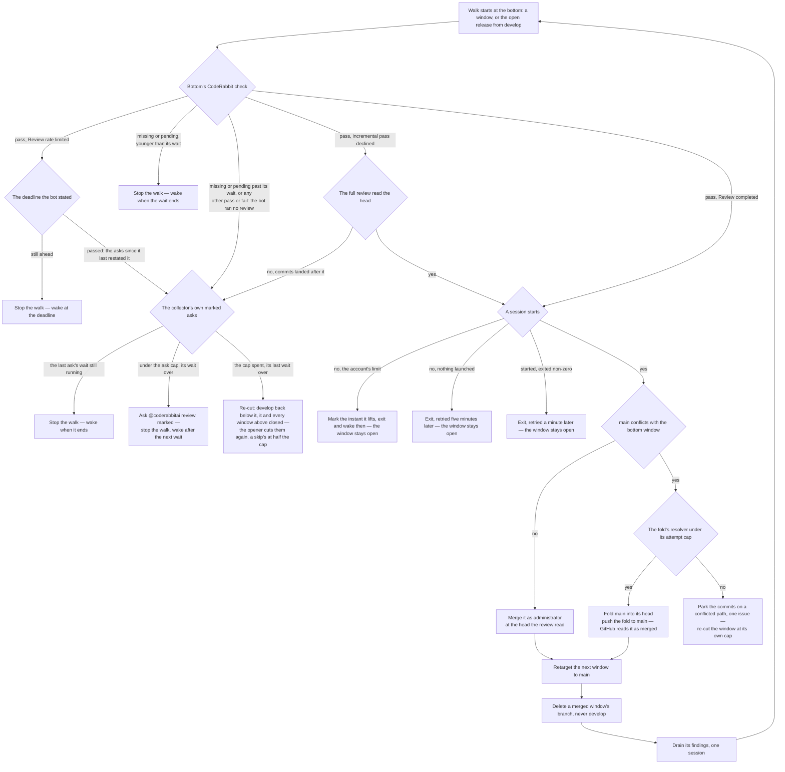
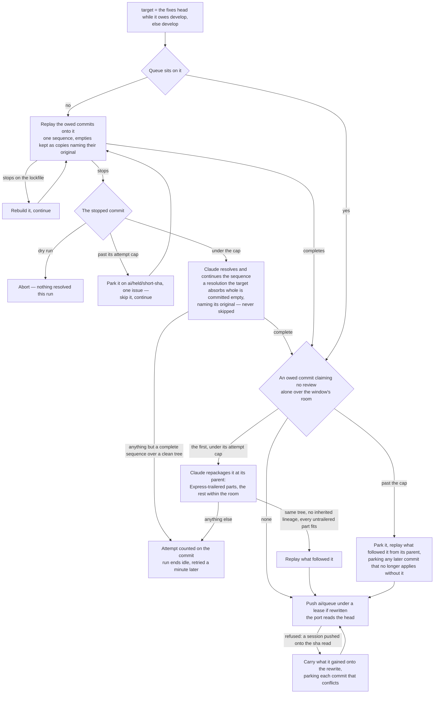
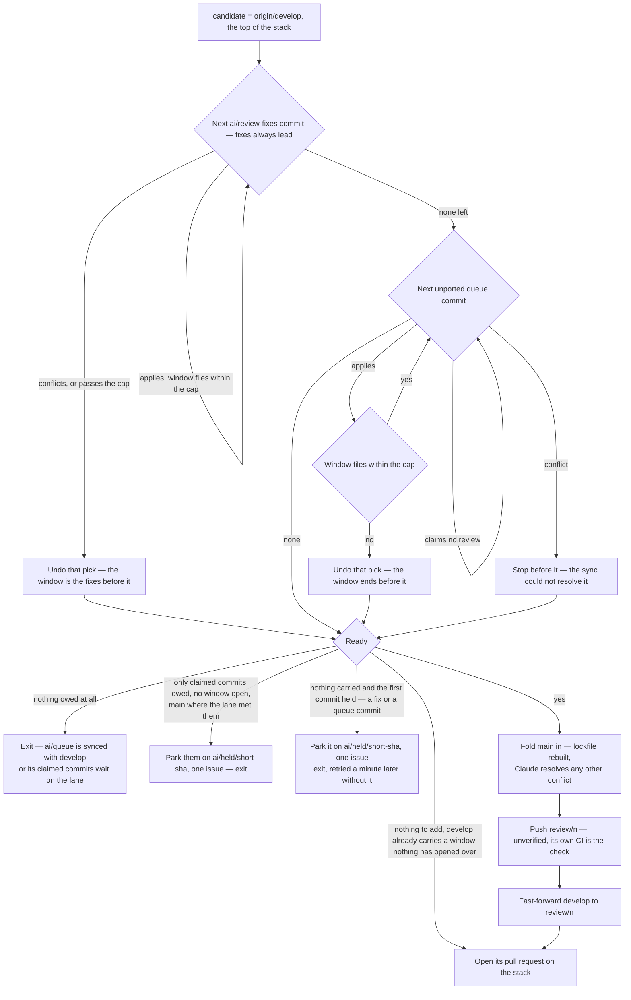
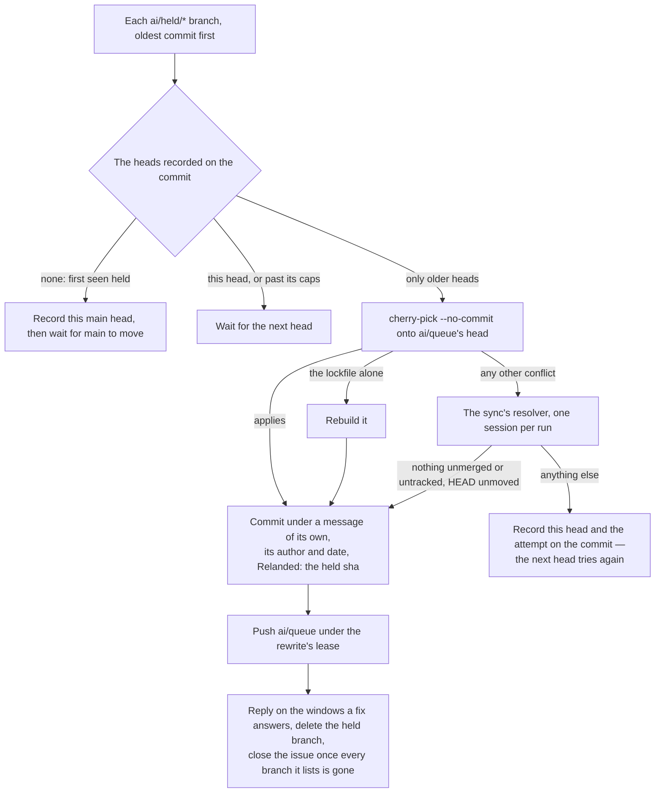

# Collection Cycle

One script, `pnpm ai:coderabbit:collect`, run by the [runner](/docs/infra/review-collector/runner) on every trigger and by hand with `--dry-run` to see what it would do. It reads the whole situation from the remote, clears the gates, and does the most it safely can in one pass, ordered so that every irreversible effect is either a compare-and-swapped push or a predicate-guarded write a later run can finish. Which ref each writer owns is the [two writers](/docs/infra/review-collector/two-writers) page. A live run ends after its last push; a dry run makes none of them, so it reports what every stage would do — the express cut, the reshaping, the walk of the stack, each window — in a single pass, which is how a change to any of them is read against the live refs before it is pushed.

## What it reads

Nothing is remembered between runs, so every input is a remote fact with a single source:

| Fact                          | Source                                                                                                                                                                                                                                 |
| :---------------------------- | :------------------------------------------------------------------------------------------------------------------------------------------------------------------------------------------------------------------------------------- |
| the window stack              | the open pull requests whose head starts with `review/`, ordered bottom up by following each base: the bottom one's base is `main`, and each other one's base is the window below it. A window off that chain is closed and cut again  |
| the window numbers            | the highest `n` among all window pull requests, open or closed, so the next window is one above it and no number is reused                                                                                                             |
| the hourly count              | the window pull requests open now, and those created in the last hour by their creation time, merged ones included                                                                                                                     |
| the stacking guard            | the `.coderabbit.yaml` on the base a window is cut over, read with `git show`: the top window's branch, or `origin/main` when none is open                                                                                             |
| the check                     | per window: the CodeRabbit commit status, read by `bucket` first and `description` second; for a pending bottom window, also when that status was posted, off the pull request's status rollup                                         |
| the rate-limit deadline       | per window: the `Next included review available in …` the bot states in the walkthrough it last rewrote                                                                                                                                |
| open findings                 | each merged window's unresolved threads whose last comment is the bot's and, where the collector has answered one, asks for a change again, plus its newest review body's own buckets                                                  |
| the window's base             | `main`'s tip for a window cut from the bottom, the head of the window below when one is open. A new window's count runs from there, the same base the bot reviews it against                                                           |
| fixes awaiting a push         | `git cherry origin/develop origin/ai/review-fixes` minus the ported set — the branch stays, what it owes is what counts                                                                                                                |
| what the queue still owes     | `git cherry <develop plus the fixes> origin/ai/queue` minus the ported set and the held set — commits not yet upstream by patch id, none of whose identities a copy or a held branch names, nor empty                                  |
| the ported set                | the `(cherry picked from commit …)` line every port and every express cut writes (`cherry-pick -x`), read off the whole of the upstream and of `main` — the record a drifted patch id cannot lose                                      |
| the held set                  | every identity the tip of each `ai/held/<short-sha>` branch carries — a commit parked, owed nowhere until a copy re-lands it, once `main` moves                                                                                        |
| a commit's identities         | its own sha and every sha the same line in its own body names: each rewrite of the queue replays it with `-x`, so a commit rewritten a dozen times carries a dozen earlier shas, and a copy names whichever one it had when it was cut |
| which thread a commit answers | an `Answers: <comment id>` trailer on the commit, `Drains: <review id>` for a body-only finding                                                                                                                                        |
| what claims no review         | an `Express: <why>` trailer on a queue commit — the reshaper's, or a session's own                                                                                                                                                     |
| `main` is red                 | a run of CI or of CodeQL concluded `failure` on `main`'s head — the [repair](/docs/infra/review-collector/repair)'s one input, with the failing jobs' log tails                                                                        |

The trailers are the collector's memory: a fix commit says which finding it answers in its own message, so the reply step can name it after the push, a later run can tell an answered finding from an open one, and a session fixing a finding by hand leaves the same record by writing the same trailer. The ported line is the same kind of memory for the port itself: a fix landing inside a ported hunk's context lines changes the copy's patch id, after which `git cherry` reads the original as still owed and re-picking it is the conflict nobody authored — so the copy names its original, and the owed set subtracts every original a copy names, on `develop` or on `main`.

## The return stroke, the repair and the express lane

Before the stack is read, the cycle compares `develop` with `main`. When no window is open, `develop` is an ancestor of `main` and the two differ, `main` holds commits and `develop` holds nothing of its own: `develop` is fast-forwarded to `main` with a plain push — nothing is open to review, so it spends nothing — and the pass goes on measuring against the head it made. While a window is open the stroke waits: `develop` is the top of the stack, and the open windows sit on it. What put those commits on `main` is not asked: a window that merged, an express cut and a dependency bump pushed straight at it all already sit on the branch a window is diffed against, so no window could carry them to a review. The stroke ends nothing because nothing would follow it: a push to `develop` fires no run, so a pass that exited here would leave the queue waiting on the next session push for the window it could have cut.

Then the cycle cuts every queue commit that claims it needs no review onto `main` — the [express lane](/docs/infra/review-collector/express-lane), open whether or not a window is in flight. That push is the run's one irreversible act too; the fold below carries `main` into the next window, and only then is a window measured. The cut is unverified — a claimed commit red on its own is `main`'s CI's to find. Whether `main` itself is red — a failed check, or an open CodeQL alert — is asked last, once the walk has merged and the openings have opened, on `main` as they left it: that head is the [repair](/docs/infra/review-collector/repair)'s, pushed as a cut of its own, and a red no window waits on never holds a merge or an opening while it is repaired.

## The open windows: gate and merge, bottom up

**A window gets one review, and merges once it completes and a session could drain it.** Each window's pull request is based on the window below it, and only the bottom one is based on `main`, so the walk only ever merges the bottom one. A window's review starts when its pull request opens and reads the window's diff against its base, which is only what that window adds. Its branch is never pushed to again, so the review reads a head that does not move. Whatever the review finds is not fixed on that pull request: it merges once a session probe succeeds, and its findings are drained into the next window, whose review reads the fixes in full.

```mermaid
flowchart TD
  S[Walk starts at the bottom: a window, or the open release from develop] --> ST{Bottom's CodeRabbit check}
  ST -->|pass, Review rate limited| RL{The deadline the bot stated}
  RL -->|still ahead| RW[Stop the walk — wake at the deadline]
  RL -->|passed: the asks since it last restated it| AK
  ST -->|missing or pending,<br/>younger than its wait| X2[Stop the walk — wake when the wait ends]
  ST -->|missing or pending past its wait, or any<br/>other pass or fail: the bot ran no review| AK{The collector's own marked asks}
  ST -->|pass, incremental pass declined| SK{The full review read the head}
  SK -->|no, commits landed after it| AK
  AK -->|the last ask's wait still running| AW[Stop the walk — wake when it ends]
  AK -->|under the ask cap, its wait over| AS[Ask @coderabbitai review, marked —<br/>stop the walk, wake after the next wait]
  AK -->|the cap spent, its last wait over| RC[Re-cut: develop back below it, it and every window above closed —<br/>the opener cuts them again, a skip's at half the cap]
  ST -->|pass, Review completed| PB{A session starts}
  SK -->|yes| PB
  PB -->|no, the account's limit| X3[Mark the instant it lifts, exit and wake then — the window stays open]
  PB -->|no, nothing launched| XL[Exit, retried five minutes later — the window stays open]
  PB -->|started, exited non-zero| X4[Exit, retried a minute later — the window stays open]
  PB -->|yes| FC{main conflicts with the bottom window}
  FC -->|no| MG[Merge it as administrator<br/>at the head the review read]
  FC -->|yes| FA{The fold's resolver under its attempt cap}
  FA -->|yes| FR[Fold main into its head<br/>push the fold to main — GitHub reads it as merged]
  FA -->|no| FP[Park the commits on a conflicted path, one issue —<br/>re-cut the window at its own cap]
  MG --> RT[Retarget the next window to main]
  FR --> RT
  RT --> DL[Delete a merged window's branch, never develop] --> DR[Drain its findings, one session] --> S
```

- **The status is the whole answer.** With one review per window, a completed check at the head is that review, and its flip to completed arrives as a status event of its own. A check the bot marked `Review skipped: incremental reviews are disabled` is the bot declining a second pass, not a verdict: it proceeds when the bot's latest review names the head, and is a skip like any other when commits landed after that review. Any other finished state — a `pass` whose description the gate does not name, or a `fail` — is the bot running no review: a skip for the plan's file limit or its usage credits, or a review that failed. Its sentence carries its own counts, so it is matched by elimination. Each window's check is read on its own, since each has its own head.
- **A skipped review is asked for, a wait apart, and then cut again.** The window is asked with `@coderabbitai review` carrying a hidden marker, and only the collector's own marked asks count — a person's ask spends none of them. Each ask is followed by a wait (`REVIEW_ASK_WAITS_MS`, whose length is the ask cap); the bot's answer fires the cycle sooner, and otherwise the retrigger wakes the walk when the wait ends. Once the wait after the last ask has passed with the bot still skipping, the window is too big for one review, and it is re-cut: `develop` moves back below it under a lease — to the window below, or to where a bottom window last met `main` — and the window and every window stacked above it are closed with their branches deleted, top first, each with a marker comment naming the cap its replacement is cut to, half the cap it was cut under. Their commits are still on `ai/queue`, so the queue owes them again and the opener cuts them anew in the same run: the first replacement under that cap, read off the newest window's marker, and the windows after it under the plan's cap again. A replacement skipped in turn is re-cut at half of its own cap, so the cap keeps halving until a review runs. A bottom window with no CodeRabbit check at all is asked the same way once it has waited `MISSING_CHECK_WAIT_MS` since it opened, and the retrigger wakes the walk at the end of that wait; a window above it with no check simply waits its turn. **A review pending past `PENDING_CHECK_WAIT_MS` is one the bot dropped**, and is asked the same way: a window's review takes a fraction of that wait, and a dropped one sends no status event to say so, so the wait counts from the status that set the check pending, read off the pull request's status rollup since `gh pr checks` gives a commit status no start. Every run that finds the bottom window pending sets the retrigger for the end of that wait, so a status event that never comes strands nothing, and a start it cannot read counts from that run, since an ask over a running review cancels it. The ask is owed only while the re-read still shows the check pending — a review that finished meanwhile is the next run's verdict — and an ask that restarts the review starts the wait again from the new status. An ask the re-read withholds — the check moved under the run, or could not be read — is read again `CHECK_REREAD_DELAY_SECONDS` later: the event a moved check sent may have landed on the run that was ending, and an unreadable one sends none. Nothing in the walk fails the run, so one window's hold never leaves another's settlement unmade.
- **A rate limit asks again, and an ask it leaves unanswered is asked as a skip is.** `Review rate limited` means the bot ran nothing. The [runner's retrigger](/docs/infra/review-collector/runner) sleeps out the deadline the bot stated, the soonest still ahead across the stack, and once it has passed the window goes through the same marked asks, waits and re-cut as a skipped review (`settleReviewAsk`). The bot answers an ask by running the review or by restating the limit in its block, so only the asks posted since the block was last rewritten count: a restated limit is a fresh deadline and a fresh count, and only an ask nothing answers spends one. A window still unreviewed past the last ask's wait is re-cut under the cap it was cut under, not half of it, since the bot never read it and its size is not what held it. **Overturned: one unmarked ask per block.** A block the bot never rewrote after the ask left the window held with no wake and nothing more to post, until a push or a person woke the cycle; the user's goal of a collector that runs unattended at the plan's full rate and finishes on its own overturned it.
- **A completed review waits its turn.** A window whose review completed above one still running is merged by a later run, once the window below it has merged. The walk takes the bottom window only, so a merge is never made over a window below it.
- **Retarget, then delete.** Merging the bottom window is followed by retargeting the next one to `main`, and only then deleting the merged window's branch: deleting a branch that is a pull request's base closes that pull request. The merged window's findings are drained before the walk moves on, one drain session per merged window, in stack order. A drain past its attempts defers what it could not answer, a reply on each finding and one issue ([drain](/docs/infra/review-collector/drain)), so the walk always goes on. A retarget that fails is logged and its branch kept, and the drain still runs: the window above is then stranded on the merged head, and the next run retargets it to `main` and deletes that branch before it reads the stack.
- **The release before the stack.** A pull request from `develop` to `main` that predates the stack is the stack's bottom while it is open: it is gated on its one review exactly as a window is, merged once that review completes, and its findings drained after the merge. It is never retargeted, and `develop` is never deleted. While it is open no window opens, since a cut over `develop` would move its head under its own review; once merged, `main` has moved past `develop`, the stroke follows it, and the windows open. Closed without merging, it pauses the collector as a closed window does. It has no window branch to cut again, so a release the bot keeps skipping past the asks only waits.
- **A closed window pauses the collector.** A window closed without merging is a person's pause, and the run exits before it merges, drains or opens anything. A folded window is the exception: its head reaches `main` by a push and its branch is deleted straight after, and a deletion GitHub processes before the push closes the pull request instead of merging it. So a closed window whose head `main` carries is read as merged — never a pause, and drained as any merged window is. A window a re-cut closed is no pause either: its marker says a replacement is owed at once.
- **A window off the chain is cut again.** The walk merges and retargets only along the chain from `main`, each window on the head of the one below, and a window off it — above a fork, or on a base no open window carries — has no base a merge or a retarget could trust. So before the walk every window off the chain is given back to the opener the way a re-cut gives one back (`settleWindowChain`): `develop` moves back under a lease to the top of the chain, or to where it last met `main` when none is left, and each is closed with its branch deleted and the marker naming the cap it was cut under. The opener cuts its commits again, and the replacement's opening asks for its review afresh. The release from `develop` is never closed, its head being `develop`, nor is `develop` moved while it is open. **Overturned: "a fork or a gap in that chain fails the run".** It failed every run red until a person put the window back on the one below it. The user's goal overturned it: the collector is to finish its own work unattended, and nothing but billing and the token may wait for someone — and a re-cut spends one review where a red run spends every review until someone looks.
- **The merge names the head the review read.** `gh pr merge --match-head-commit` is the same compare-and-swap the push makes: a branch that moved since is refused rather than released unread.
- **A window `main` conflicts with is folded, never re-reviewed.** A repair or an express cut can land on `main` after the window went out, and a merge GitHub cannot create fails every run that tries it. So the window is tried against `main` in memory; a conflict folds `main` into the window's head through the same resolver the window's fold uses, and the fold is pushed to `main` itself — it descends from both, and GitHub closes a pull request whose head its base carries as merged. The fold adds nothing but `main`'s own content, so no review is owed for it. A window that still merges cleanly is left to GitHub. Past the resolver's attempts on that `main` head, the window's commits that touch a conflicted path — all of them when the conflict is one a merge inside the window wrote — are parked as the sync parks, and the window is re-cut at the cap it was cut under, so the next run opens one that merges. Its review completed before the re-cut, so its findings are carried to the drain of the window that replaces it (below).
- **The checks do not gate it.** The window's own checks run, and the merge does not wait for them: the review is the gate, and a red check is one more commit in the next window.

## The merged window: drain

With the bottom window merged, its review's findings are drained by the [drain](/docs/infra/review-collector/drain) — one session per merged window, before the walk reaches the next. Replies come first: a commit `develop` already carries above `main` — a window a run pushed and died before opening — answers its findings, and the reply citing it is posted before any exit. The drain's fixes land on `ai/review-fixes`, and the port puts them at the head of the next window.

**A re-cut window's findings are carried to the window that replaces it.** A re-cut can close a window whose review already completed — a fold past its attempts, a window off the chain — and its commits come back in the window above it, or the first of several. That window's drain answers the closed windows directly below it as well, one session each, newest first, up to the first that is not a re-cut one (`readCarriedPullRequests`), and the cut that carries the fixes replies on them as on the window itself. The replacement's drain runs against a `develop` that carries the same code again. Draining the closed window before its re-cut is the alternative, and the code does not allow it: the fixes lead the next window from `ai/review-fixes`, which sits on `develop`, and the re-cut moves `develop` back below the very code they touch, so each would meet the sync as a conflict with nothing to apply to.

## Sync

The fixes branch is synced first. A drain builds on the `develop` it read, and `develop` can move before those fixes port — the return stroke, a window cut, a fold, a repair, a hand revert — so a fixes branch that no longer sits on `develop` has what it owes replayed onto it by the same sequence and the same resolver the queue gets, and is pushed back under a lease on the sha it read. A conflict nothing resolved this run — a dry run, or a resolver that could not start — ends the run idle. A fix whose conflict failed the resolver past the attempt cap is parked like any commit (below), so every fix behind it still lands, and the finding it answered reads as open again and is drained afresh. Left unsynced, a fix that no longer applies would fail every port with nothing to resolve it.

Before the port reads the queue, the collector rewrites it onto the tree the window is built on — `ai/review-fixes` while it owes `develop` commits, `develop` otherwise — reshapes the first owed commit adding more files than the window has room for, and pushes it back under a lease on the sha it read. The room is the cap less the files the window carries ahead of the queue — the fixes and any pending window `develop` holds, counted from the window's base as the port counts them — and a file of the commit's that the window already counts costs it nothing, since the port counts the resulting window's distinct files. The room does not measure a commit carrying `Express:` — that one is the lane's at any size, and reshaping it would pay a session per run to repackage what no window will ever carry. The commits the queue still owes are replayed in order as one `cherry-pick` sequence — `-x`, so every copy names the original it came from and a resolution that drifted its patch id still reads as carried, and `--empty=keep`, so a commit the tree already holds under another patch id lands as an empty copy naming it rather than falling away with nothing to say it did, and an empty copy a past resolution left rides through rather than stalling the sequence; a queue already sitting on that tree with nothing to reshape is left alone, which is every run but the one after a window.

```mermaid
flowchart TD
  T[target = the fixes head while it owes develop,<br/>else develop] --> A{Queue sits on it}
  A -->|no| R[Replay the owed commits onto it<br/>one sequence, empties kept as copies naming their original]
  R -->|stops on the lockfile| LF[Rebuild it, continue] --> R
  R -->|stops| C{The stopped commit}
  C -->|dry run| AB[Abort — nothing resolved this run]
  C -->|past its attempt cap| PK[Park it on ai/held/short-sha, one issue —<br/>skip it, continue] --> R
  C -->|under the cap| CL[Claude resolves and continues the sequence<br/>a resolution the target absorbs whole is committed empty,<br/>naming its original — never skipped]
  CL -->|anything but a complete sequence over a clean tree| F[Attempt counted on the commit<br/>run ends idle, retried a minute later]
  CL -->|complete| RS
  R -->|completes| RS
  A -->|yes| RS{An owed commit claiming no review<br/>alone over the window's room}
  RS -->|none| P[Push ai/queue under a lease if rewritten<br/>the port reads the head]
  P -->|refused: a session pushed onto the sha read| G[Carry what it gained onto the rewrite,<br/>parking each commit that conflicts] --> P
  RS -->|the first, under its attempt cap| SH[Claude repackages it at its parent:<br/>Express-trailered parts, the rest within the room]
  SH -->|same tree, no inherited lineage, every untrailered part fits| RP[Replay what followed it] --> P
  SH -->|anything else| F
  RS -->|past the cap| PR[Park it, replay what followed it from its parent,<br/>parking any later commit that no longer applies without it] --> P
```

- **Why the collector and not the session.** A queue left on an old base carries commits written against files a drain has since repaired, and every one is a conflict the porter would hold on, run after run, until a person notices a red run. Here the conflict is met once, where the fixes are, and the working session's `git pull --rebase` afterwards replays only what it committed since (`.agents/skills/review-queue/SKILL.md`).
- **The lockfile is never a conflict a session sees.** A replay of the queue stops on it once per commit that touched a manifest, and every one of those stops has the same answer the fold already gave: the lockfile is deleted and rebuilt from the manifests the replay settled, never merged (`git` skill). The sequence is run out over as many stops as land on that path alone, bounded by the replay’s own length, and only a stop on another path is worth a session — which finds the sequencer exactly where it expects it, mid-pick with that commit’s conflict open.
- **A conflict is the drain's session pointed at a conflict.** The same headless Claude, the same denials — no push, no branch switch, no GitHub — told which commit stopped the sequence and on which paths, that both sides survive, and that a commit whose whole change the target already carries is committed empty rather than skipped. What proves the resolution is a sequence run to its end over a clean tree that carries every commit the queue owed, never the session's word — the first two are what `git cherry-pick --abort` leaves as well, and the rewrite behind them would force-push every owed commit away, so the third is read off the replay itself — and so the resolver owes no finishing checks and repairs nothing beyond the conflict: a red elsewhere in the replay is a queue commit's, which the queue's own CI names to the session that owns it, and every minute the resolver spends past the conflict is one the working session can push into. **`--skip` is denied, and the empty commit is why.** A resolution the target absorbs whole leaves the same tree as an abandoned one, so no test over content can tell the sanctioned drop from the lost work; git's own prepared message names the original, and an empty copy carrying it is the one record that says which happened. The replay keeps the same record for itself: a commit whose change the target already carries under another patch id — a repaired copy the port skipped, or a fold's — still reads as owed by patch id, and dropping it as it applies would leave that check reading the resolver's finished sequence as one that lost it. The owed set ignores a commit that changes nothing, so the queue sheds either copy on the next rewrite rather than replaying it forever. A failure counts against the attempt cap under a marker in a comment on the conflicting commit itself rather than on the pull request, for the reason the runner's counts carry, and the marker names the collector's own source as the basis the attempt was made against, so a collector fixed since hands the commit a fresh turn with nobody resetting anything ([the runner's counts](/docs/infra/review-collector/runner)). Past the cap the commit is parked: pushed to its own held branch, `ai/held/<short-sha>`, before anything drops it, named in one issue saying how to re-land it, and skipped, so the sequence carries everything behind it. The held branch takes it out of the owed set, so no later replay, port or reshaping meets it again.
- **A commit alone over the window's room is repackaged, never held.** No window can carry it and no session is asked to commit differently — what a commit holds is the session's business, and what in it needs a reviewer's eye is a judgement. The same session, detached at the commit's parent, rewrites it as a sequence: the parts that need no review — a rename, a one-rule substitution a lint rule now enforces, generated output, a format pass — each a commit of any size carrying `Express: <why>`, which the express lane takes to `main`; the rest in commits within the room, ordered so every prefix is green. It repackages and never edits, and the collector proves that rather than trusting it: `git diff <original> HEAD` empty, no part keeping a `(cherry picked from commit …)` line, and every untrailered part within the room, or the attempt fails and is counted on the commit. Those lines name the copies the original was replayed from, and a part keeping them shares them with its siblings — so the express lane's copy of one part reads every part as ported, and the next sync drops the rest unreplayed. One commit per run, since the rewrite's push fires the next. Past the attempt cap the commit is parked whole on its held branch, what followed it is replayed from its parent without it, and a later commit that no longer applies without it is parked beside it in the same issue — a commit no window can carry is set aside with a record, and the queue moves on. **The room, not the cap, because the fixes lead every window.** A review almost always yields findings, so a commit that fits the cap alone but not beside the fixes is held behind every window, and each window ships the fixes alone; a reshaping the cap measured ended in a part of exactly the cap's size, and it sat at the queue's head while window after window carried a handful of fix files. Fixes that fill the cap alone leave no room to reshape into — the port cuts them over windows of their own, and the queue waits behind them. **Every count here is the bot's own**: the commit, the room and each part are measured through the base's `.coderabbit.yaml` path filters, by the same counter the port measures a window with (`readReviewedFilePaths`), so a commit too big only before its snapshots and generated folders are filtered out never costs a session.
- **Two writers of `ai/queue`, one compare-and-swap.** The lease is the rewrite's alone — it names the sha the run read, against a session that pushes plain and pulls when the rewrite refuses it ([two writers](/docs/infra/review-collector/two-writers)). A rewrite the session's push beat is not redone: that push fast-forwarded the sha the lease named by a commit or two, so the rewrite carries those onto itself and pushes again under the lease the push moved to, a few times over before giving up — redoing the run would hand the resolver the same conflict to lose to the next push, which under an active session never converges. **A carried commit that conflicts with the rewrite is parked, never the rewrite dropped.** The collector runs unattended and finishes on its own, and the rewrite under that commit can be minutes of replaying hundreds of commits and a resolver's work already done, so throwing it away for one commit hands the next run the same minutes to lose to the next push. The commit is parked as a commit past its attempts is — pushed to its held branch, named in one issue, and skipped, with any later carried commit that no longer applies without it — and the rest ride the push. It gets no resolver turn of its own: it was written against the queue the rewrite replaced, and every minute a resolver spends on it is one the next session push can beat again. Nor does the session that pushed it bring it back beside its held branch: its next push replays only what it committed after that push. Only a queue whose history was rewritten under the run exits it idle, since that push fires a run of its own that replays onto what the queue then carries — porting off the stale head instead would hold on a conflict the next run resolves.

## Port

The port builds the window as a local branch, one cherry-pick at a time, and measures after each from the tree that will be pushed.

```mermaid
flowchart TD
  C[candidate = origin/develop, the top of the stack] --> FX{Next ai/review-fixes commit — fixes always lead}
  FX -->|applies, window files within the cap| FX
  FX -->|conflicts, or passes the cap| FU[Undo that pick — the window is the fixes before it]
  FU --> RD
  FX -->|none left| Q{Next unported queue commit}
  Q -->|claims no review| Q
  Q -->|none| RD
  Q -->|conflict| H[Stop before it — the sync could not resolve it]
  Q -->|applies| M{Window files within the cap}
  M -->|yes| Q
  M -->|no| U[Undo that pick — the window ends before it]
  U --> RD
  H --> RD{Ready}
  RD -->|nothing owed at all| N[Exit — ai/queue is synced with develop<br/>or its claimed commits wait on the lane]
  RD -->|only claimed commits owed, no window open,<br/>main where the lane met them| XP[Park them on ai/held/short-sha, one issue — exit]
  RD -->|nothing carried and the first commit held — a fix or a queue commit| F[Park it on ai/held/short-sha, one issue —<br/>exit, retried a minute later without it]
  RD -->|nothing to add, develop already carries a window nothing has opened over| OP[Open its pull request on the stack]
  RD -->|yes| FM[Fold main in — lockfile rebuilt,<br/>Claude resolves any other conflict] --> P[Push review/n — unverified, its own CI is the check]
  P --> FF[Fast-forward develop to review/n] --> OP
```

- **Fixes lead, cut at the cap like the queue.** The fixes are picked first, one commit at a time, and measured after each by the same count as the queue against the cap the window is cut to, a re-cut's smaller one included — all but the first fix, which only the plan's cap holds back, so a fix a review could read is never parked: fixes that alone pass it go out over as many windows as it takes, each the fixes alone, and the queue waits behind the last of them. A cut falls only between commits, so a fix commit is never split from the finding it answers; a finding two commits answer is replied to on the first, and the second rides the next window. Each window carrying fixes replies on every review they were drained from — every pull request merged since the newest window opened before its oldest fix was written (`readFixedPullRequests`) — since the run's own look-back from the newest window stops at the first part's window. A fix no window can take — alone over the cap, or conflicting once a fix before it was parked — is held as a queue commit is, and parked when it leads the cut. **Overturned: fixes always ride whole, and fixes alone over the cap fail the run for a person to see.** Every run threw on the same fixes and nothing ever shrank them, so no window, merge or drain moved until a person came; the user's goal of a collector that runs unattended at the plan's full rate and finishes on its own overturned it.
- **Only what the queue authored is owed.** A merge of `main` into `ai/queue` brings `main`'s commits and the merge itself, none of it the queue's. The porter takes the queue's commits that are neither on `develop` by patch id nor reachable from `main` nor named — under any identity they have carried, by a copy anywhere on either — and a cut whose ancestors hold anything the porter did not pick — a skipped merge, a commit claiming no review — is ported rather than fast-forwarded. A fast-forward moves `develop` to the queue's own sha, so everything behind that sha rides with it: a cut that carries more than was counted would put a claimed commit into the very review its claim exempts it from, over a cap measured without its files.
- **Queue order, never reordered, and a claimed commit only when something needs it.** A commit carrying `Express:` is the lane's and is skipped as if it were not there — what follows it ports — unless an owed commit only applies on top of the claimed commits skipped before it, and the window then carries those ahead of it; the first remaining commit that would overflow the cap or conflicts is where the window ends, and the count includes every fix. A first commit no window can take is the residual case — the sync reshapes or parks every commit its caps exhaust, so this is one that still overflows or conflicts after both — and it is parked as the sync parks, with the run waking a minute later to cut what follows it.
- **The window is counted the way the bot counts its pull request: the diff against the window's base, less every path the base's `.coderabbit.yaml` `path_filters` exclude.** The bot reads its config from the base and states its count after those filters, so a filtered file — a snapshot, a generated folder, the lockfile — is room the window can still fill. The base is `main`'s tip for a window cut from the bottom, and the head of the window below for a stacked one, so each window is counted alone and the windows below it are not. A fold of `main` adds nothing to a window cut from `main`, since the diff counts only the window's own side of it; on a stacked window the files `main` brought count, because the diff against the window below holds them. So a stacked cut is measured again after its fold, and held over the cap until the stack below merges. The count is the bot's own diff through the bot's own filters, so it cannot let a review overflow, and it is one counter (`readReviewedFilePaths`): the window, the reshaper's commit and each reshaped part are all measured by it. That the bot diffs against the base the window is cut from is an assumption about the bot, stated here because the code cannot verify it — a wrong guess surfaces as a review skipped for too many files, which the gate asks about up to its ask cap and then re-cuts at half the cap, never silently.
- **The fold always lands.** What reached `main` unread — an express cut, a dependency bump — is merged into the candidate so `develop` never diverges from `main` into the window's merge: the lockfile conflict is rebuilt from the installed tree (`git` skill), any other is the resolver's, counted on `main`'s head, and only past its attempts is the fold abandoned: the window goes out unfolded, and when it reaches the bottom, the fold at merge time — counted on the same `main` head and so already past its cap — parks the window's commits that touch a conflicted path and cuts the window again without them.
- **The window is pushed unverified.** Its own CI runs after the push, and a red there is one more commit in the next window.
- **Fast-forward when the shas allow it** — no fixes, the queue sitting on `origin/develop`, no skipped merge among the cut's ancestors, nothing folded — so the session's local branch already matches and no rebase is owed.

### Readiness

The window goes out when the port holds anything at all — a fix, a queue commit that fit, or what `develop` already carries above `main` — at whatever size it reached; with none of those, nothing is owed, or the first commit is parked and the run wakes a minute later to cut what follows it, or with no window open the claimed commits the express lane could not cut are parked ([express lane](/docs/infra/review-collector/express-lane)).

**There is no lower bound on a window.** The port takes every commit the queue owes and stops only at the cap or on a conflict, so a window that came out small is the whole of what was left — and waiting for it to grow waits on a push nothing has promised while the queue stays unsynced. Fixes alone are the same case, and go out the moment they are drained (why is on the overview page). The standing goal is `ai/queue` fully drained into `develop`; the cap is the only size the window is measured against, and it is measured on the tree that will be pushed.

A window a dying run left pushed is ready with nothing to add, and only its opening is owed. A parked commit is told in one issue per park, opened once and keyed on the first commit it parks, which names each commit's held branch and the steps that re-land it: pick each held branch with `--no-commit`; settle what the cause names, splitting it under the cap or resolving the conflict; commit each part under a message of its own; push the queue, and delete the held branch. The message is the step a re-land gets wrong. The one the pick prepares keeps the held commit's "(cherry picked from commit …)" lines, and `-x` adds another; each names a sha the held branch carries, and a commit naming one stays out of the owed set until that branch is deleted, so a re-land committed under it would port only once the branch was gone. The re-landed commit is new, so it is owed and ported like any other. The collector tries that re-land itself as `main` moves ([re-land](#re-land)), so the steps are for a re-land by hand.

## Opening a window

After the walk, the sync and the port, a run asks the return stroke again — the walk may have merged the whole stack, or a re-cut closed it — then opens windows one at a time, cutting each from the top of the stack, and keeps opening while every one of these holds:

- fewer window pull requests were opened in the last hour, by their creation time, than the plan's hourly figure — merged and closed ones included;
- stacking is allowed: nothing is open, or the guard below holds;
- the queue or the fixes still owe commits.

The decision is a pure count, `getWindowOpenCount`, that returns how many more may open; the loop also stops when a cut comes out empty. The figures are the plan's, read from the constants file (see [key files](#key-files)), never restated here. **The rolling hour is the one budget**, so a window opens as soon as a slot frees in it, however many windows are still open: each spent its slot when it opened, and an open one waiting on its review or its turn spends nothing more. **Overturned: "fewer window pull requests are open than the plan's hourly figure".** With it, the slots an hour gave back stayed unspent until merges brought the open count down, a whole hour's allowance idle at a time; the user's goal of using the plan's hourly reviews completely overturned it. Each window is cut exactly as the port cuts it, measured against the window's cap — the plan's, or the smaller one a re-cut left on the newest window — and the cut is pushed to its own branch — `review/<n>`, the number one above the highest any window pull request has carried, open or closed — through the same compare-and-swap as every collector push. `develop` is then fast-forwarded to that head, so the next cut is built on it and carries the window below. The window's pull request is opened with its base at the top window's branch, or at `main` when none is open, and titled with its number. Its one review reads the window's own diff against that base.

**The ceiling turning over wakes the cycle.** It counts by creation time, so a slot comes back on the clock with no push or review to report it, and a queue that still owes commits would wait on a push that may never come. A run that ends with the hour's openings spent sets the [retrigger](/docs/infra/review-collector/runner) to the moment the oldest of them ages out of the hour, however many windows are open then, or to a sooner wait the walk stated.

**The guard.** CodeRabbit reviews a pull request by itself only when its base is `main` or a base the `.coderabbit.yaml` it reads lists under `reviews.auto_review.base_branches`. A window stacked on the window below it has that window's branch as its base, so the list has to name the window branches. `.coderabbit.yaml` carries that entry, with a comment saying why. The guard reads the copy of the file on the base a window is cut over (`git show origin/<base>:.coderabbit.yaml`): the top window's branch, or `main` when none is open. It is asked again before each cut, and a window stacks only when one of that copy's patterns matches the base's branch name. A window's copy comes from `develop`, which follows `main`, so until `main` carries the list the windows open one at a time, as they did before there was a stack.

## Push, reply, open

The window is pushed to its own branch at the cut, through `pushBranch`, the one compare-and-swap every collector push goes through. The `develop` fast-forward follows under the lease on the sha every count was measured from, so the remote refuses it if `origin/develop` left that sha: the run reports a moved outcome and the next one re-measures — fired by the push itself on `main` or `ai/queue`, and woken a minute later (`MOVED_BRANCH_RETRY_DELAY_SECONDS`) on `develop`, `ai/review-fixes` or a window's branch, whose pushes fire no run — while a push that failed for anything else fails the job as itself. No review can be running under the window's head — its branch is new — so no status is re-read first. After the pushes the reply step runs again and posts `Agreed, fixed in <sha>` on every thread of a merged window that a pushed commit's trailer names, and one verdict comment per `Drains:` review id. A thread whose newest word is already the collector's gets nothing more, so a finding two commits answer gets one reply, and only a bot comment after that reply earns another. The merged windows it replies on are the run's own drained ones and every pull request merged since the window below was opened, since a run that drained one and opened nothing leaves its fixes for a later run's cut.

The pull request is opened once its branch is on the remote. A run that pushed a window and died before opening it is finished by the next one, which finds `develop` ahead of the stack with nothing to add and opens the pull request that is owed. Nothing is deleted afterwards except a window's branch once its pull request has merged: `ai/review-fixes` stays, owing nothing, until the next drain re-creates it, and the queue's ported commits drop from the session's history at its next rebase.

## Re-land

A parked commit comes back on its own. What held it — a conflict with the tree the queue was built on, a `main` its claim or its window would not apply to, a room too small beside the fixes — changes when `main` moves, and every window merge moves it, so after the openings each held commit is picked back onto the queue's head once per `main` head (`relandHeldCommits`). The heads are recorded on the commit itself: a run that first finds it held records the head it saw it at and leaves it, since nothing has changed for it yet, and every head a re-land was tried at is recorded beside it.

```mermaid
flowchart TD
  H[Each ai/held/* branch, oldest commit first] --> S{The heads recorded on the commit}
  S -->|none: first seen held| R[Record this main head, then wait for main to move]
  S -->|this head, or past its caps| W[Wait for the next head]
  S -->|only older heads| P[cherry-pick --no-commit onto ai/queue's head]
  P -->|applies| C[Commit under a message of its own,<br/>its author and date, Relanded: the held sha]
  P -->|the lockfile alone| L[Rebuild it] --> C
  P -->|any other conflict| X[The sync's resolver, one session per run]
  X -->|nothing unmerged or untracked, HEAD unmoved| C
  X -->|anything else| F[Record this head and the attempt on the commit —<br/>the next head tries again]
  C --> U[Push ai/queue under the rewrite's lease] --> D[Reply on the windows a fix answers, delete the held branch,<br/>close the issue once every branch it lists is gone]
```

- **The resolver is the sync's.** A conflict goes to the session the replay's conflicts get, pointed at one pick rather than a sequence and told to stage its resolution and commit nothing; the tree it leaves is the proof, as the replay's is. A run spends one session on it at most, after the openings, so a backlog of held commits never holds a window.
- **The copy is a new commit with the held one's author and date.** Its message drops every "(cherry picked from commit …)" line, since one naming a sha the held branch carries keeps a commit owed nowhere, and its `Express:` claim, so a window carries it in queue order. The author and the date are what the queue push's replay matches a carried commit by. A pick the queue already carries whole commits nothing, and the branch and the issue close all the same.
- **A copy parked again is bounded.** It is a new commit, so its own counts start afresh; the `Relanded:` trailer each copy adds names the held commit it came from, and a commit carrying `SESSION_ATTEMPT_CAP` of them is not re-landed again. A failed re-land counts against the same cap on the held commit under the collector's basis, so a fix to the collector is a fresh turn. A commit over the plan's cap alone never comes back this way: only a reshaping carries it, and that is what failed.
- **A parked fix is replied for where its finding is.** A fix the sync parked from `ai/review-fixes` comes back as a queue commit, and the window it answered is often no longer the newest merged one, on which no opening replies. So its reply is posted as it re-lands, citing the copy, on each merged window whose findings it names, searched newest first.
- **Overturned: a re-land is a person's.** The issue a park opened said how to re-land each commit and waited for a session to do it, a parked fix waited for a drain that, once its window was no longer the newest, never came, and a commit whose conflict a later window settled stayed held all the same. The user's goal — a collector that finishes on its own, every finding replied to — overturned it. The issue still carries the steps, for a re-land by hand.

## Key files

| File                                                                       | Role                                                                                                                                                                                  |
| :------------------------------------------------------------------------- | :------------------------------------------------------------------------------------------------------------------------------------------------------------------------------------ |
| `scripts/src/services/coderabbit/collect/runCycle.ts`                      | the pass itself — the return stroke, the express lane, the walk of the stack, the sync and the port, the opening loop, then the repair                                                |
| `scripts/src/services/coderabbit/collect/orderWindowStack.ts`              | the open window pull requests chained bottom up from `main` by following each base, ending below a fork or at a gap                                                                   |
| `scripts/src/services/coderabbit/collect/settleWindowChain.ts`             | the windows off that chain closed for the opener to cut again, `develop` moved back to the chain's top                                                                                |
| `scripts/src/services/coderabbit/collect/closeRecutWindows.ts`             | `develop` moved back under a lease, then each window closed top first with the marker naming its cap                                                                                  |
| `scripts/src/services/coderabbit/collect/readCarriedPullRequests.ts`       | the re-cut windows directly below a window, whose findings its drain answers too                                                                                                      |
| `scripts/src/services/coderabbit/collect/walkWindowStack.ts`               | the walk — the bottom window merged, every window's rate limit or skip settled, a missing or pending check waited out, a skip past its asks re-cut                                    |
| `scripts/src/services/coderabbit/collect/getGateDecision.ts`               | the gate — one window's check read as running, complete, rate limited, skipped or missing                                                                                             |
| `scripts/src/services/coderabbit/collect/readCheckWaitEndsAtMs.ts`         | when the bottom window's missing or pending check is given up on and its review asked for                                                                                             |
| `scripts/src/services/coderabbit/collect/readCheckStartedAt.ts`            | when the check took its state — for a pending one, when its review started                                                                                                            |
| `scripts/src/services/coderabbit/collect/settleRateLimit.ts`               | a rate limit — the stated deadline slept out, then the asks since the bot last restated it settled as a skip's are                                                                    |
| `scripts/src/services/coderabbit/collect/settleSkippedReview.ts`           | a skip, a missing check or a review pending past its wait — the ask owed only over the check the gate read                                                                            |
| `scripts/src/services/coderabbit/collect/settleReviewAsk.ts`               | the asks for a review the bot owes — the collector's marked asks counted, each a wait apart, withheld and read again when the check moved, and a re-cut due once the last wait passes |
| `scripts/src/services/coderabbit/collect/recutWindowStack.ts`              | the re-cut — the window and every window above it given back to the opener (`closeRecutWindows`)                                                                                      |
| `scripts/src/services/coderabbit/collect/getWindowFileCap.ts`              | the cap the next window is cut to — the newest window's re-cut cap, read by `readRecutFileCaps`, or the plan's                                                                        |
| `scripts/src/services/coderabbit/collect/getOpeningWaitMs.ts`              | how long until the hourly ceiling gives a slot back — the oldest opening of the hour aging out                                                                                        |
| `scripts/src/services/coderabbit/collect/getWindowOpenCount.ts`            | how many more windows the rolling hour lets open, and none above an open one the guard refuses                                                                                        |
| `scripts/src/services/coderabbit/collect/checkIsStackingAllowed.ts`        | the guard — whether the base's `.coderabbit.yaml` lists a pattern matching the base's branch: the top window's, or `main`'s                                                           |
| `scripts/src/services/coderabbit/collect/pushBranch.ts`                    | the compare-and-swap every window and `develop` push goes through                                                                                                                     |
| `scripts/src/services/coderabbit/collect/getMovedOutcome.ts`               | a push the lease refused — nothing written, and a minute's wake when no push to that branch fires a run                                                                               |
| `scripts/src/services/coderabbit/collect/foldCandidate.ts`                 | the window's cut and its fold of `main`                                                                                                                                               |
| `scripts/src/services/coderabbit/collect/portWindow.ts`                    | the port — the cut's commits, fixes then queue, measured after each pick                                                                                                              |
| `scripts/src/services/coderabbit/collect/readFixedPullRequests.ts`         | the reviews a window's fixes answer, however many windows the cap cut them over                                                                                                       |
| `scripts/src/services/coderabbit/collect/readWindowFilePaths.ts`           | the count the bot makes of a window — the diff against its base less the base's path filters, on the tree that will be pushed                                                         |
| `scripts/src/services/coderabbit/collect/readReviewedFilePaths.ts`         | the one counter — any range's files through the base's path filters, for a window, a commit the reshaper measures and each part                                                       |
| `scripts/src/services/coderabbit/collect/syncQueue.ts`                     | the queue's rewrite onto the tree the next window is built on, the first commit over the room reshaped                                                                                |
| `scripts/src/services/coderabbit/collect/pushQueueRewrite.ts`              | the rewrite's push under a lease that carries what a session pushed meanwhile, parking what conflicts                                                                                 |
| `scripts/src/services/coderabbit/collect/skipStops.ts`                     | a replay's stops run out — the lockfile rebuilt, a commit past its attempts parked and skipped, the first other stop left open                                                        |
| `scripts/src/services/coderabbit/collect/parkCommits.ts`                   | a commit no window can carry pushed to `ai/held/<short-sha>`, then the one issue saying how to re-land it                                                                             |
| `scripts/src/services/coderabbit/collect/readHeldShas.ts`                  | every identity the held branches carry, taken out of what the queue owes                                                                                                              |
| `scripts/src/services/coderabbit/collect/relandHeldCommits.ts`             | each held commit picked back onto the queue once per `main` head, its branch and its issue closed on success                                                                          |
| `scripts/src/services/coderabbit/collect/relandHeldCommit.ts`              | one re-land — the pick, its conflict the resolver's, committed under a message of its own                                                                                             |
| `scripts/src/services/coderabbit/collect/replyRelandedAnswers.ts`          | a re-landed fix's replies, on the merged windows whose findings it answers                                                                                                            |
| `scripts/src/services/coderabbit/collect/getStrandedWindowPullRequests.ts` | the window whose retarget a merge did not land, found from the stack and its history                                                                                                  |
| `scripts/src/services/coderabbit/collect/retargetStrandedWindows.ts`       | the recovery that retargets it to `main` and deletes the merged head, before the stack is read                                                                                        |
| `scripts/src/services/coderabbit/collect/markFoldedWindowsMerged.ts`       | a closed window whose head `main` carries, read as the merge its fold was                                                                                                             |
| `scripts/src/services/coderabbit/collect/readMergedPullRequestsSince.ts`   | the pull requests merged since the window below opened, whose answers the cut replies on                                                                                              |
| `scripts/src/services/coderabbit/collect/readLegacyReleasePullRequest.ts`  | the pull request from `develop` to `main` that predates the stack — open is the stack's bottom, closed pauses                                                                         |
| `scripts/src/services/coderabbit/collect/constants.ts`                     | the branch names, the window branch prefix and the collector's own values                                                                                                             |
| `scripts/src/services/coderabbit/shared/constants.ts`                      | the file cap and the plan's hourly figure, both read off the plan                                                                                                                     |
| `.coderabbit.yaml`                                                         | the window branches listed as bases CodeRabbit reviews on creation, and the path filters a window's count leaves out                                                                  |

## Why a re-run is a no-op

| Step   | Precondition read from the remote                                                                                                                                 | Effect                                                      | Second run against unchanged state                                                                 |
| :----- | :---------------------------------------------------------------------------------------------------------------------------------------------------------------- | :---------------------------------------------------------- | :------------------------------------------------------------------------------------------------- |
| return | no window open, `develop` an ancestor of `main`, the two apart                                                                                                    | fast-forwards `develop`                                     | they agree — nothing, and the pass goes on either way                                              |
| gate   | a window open, its check bucket                                                                                                                                   | a scheduled retrigger, or the ask for a skipped review      | same verdict, same deadline — an ask once per wait, a rate limit's counted from its last restating |
| re-cut | the bottom or a stacked window still unreviewed past its last ask's wait — skipped, or refused by a limit                                                         | moves `develop` back, closes the window and those above it  | they are off the stack, and their markers name the cap the opener cuts to — nothing                |
| chain  | an open window off the chain from `main` — above a fork, or on a base no open window carries                                                                      | moves `develop` back, closes it and every one off the chain | the chain is whole — nothing                                                                       |
| merge  | the bottom window open, its review complete                                                                                                                       | merges it, retargets the next to `main`, deletes its branch | it is off the stack, and the walk stops at the next window not yet complete                        |
| reply  | a trailer's thread lacks a reply citing that sha                                                                                                                  | posts the reply                                             | every thread has one — nothing                                                                     |
| drain  | a finding of the merged window is open by the predicate                                                                                                           | commits on `ai/review-fixes`                                | every finding carries a trailer or a reply — nothing                                               |
| sync   | the fixes or the queue do not sit on their target, or an owed commit claiming review is alone over the room                                                       | rewrites `ai/review-fixes`, then `ai/queue`                 | it sits on it and every commit fits — nothing                                                      |
| park   | a commit past the sync's, the reshaper's or the fold's attempts, one a session pushed under the rewrite that conflicts with it, or one the port still cannot take | pushes `ai/held/<short-sha>`, opens one issue               | the held branch takes it out of the owed set and the issue's marker is found — nothing             |
| held   | a held commit `main` has moved past since a run first saw it held or last tried it, under the caps                                                                | picks it onto `ai/queue`, pushes, deletes its branch        | the branch is gone, or the head is recorded on it — nothing                                        |
| port   | `git cherry` lists unported commits, readiness                                                                                                                    | a local branch                                              | same branch, discarded with the runner                                                             |
| push   | `origin/develop` unchanged since the read, `review/<n>` absent                                                                                                    | creates `review/<n>`, fast-forwards `develop`               | the branch exists — the opening finishes it                                                        |
| open   | `develop` ahead of the stack with nothing to add, the budget holds                                                                                                | opens the window's pull request                             | one is open over it — the gate                                                                     |
| repair | CI red on `main`'s head, its signature under the cap within the span                                                                                              | the regenerators else a session, a cut, a push              | the push made a new head CI has not concluded on — nothing                                         |

## Notes

- **Rejected: trusting an incremental review.** A push to an open window asked the bot for a review of just the new commits, and it declined one it could not recover — "the last reviewed checkpoint was preserved" — then flipped its check to completed with no range stated. The collector read that as a skipped head and released it on a verdict: a window merged with most of its commits read by no review at all. Everything that kept the incremental path honest — the frontier read off stated ranges, the skipped-review detection, the merge-risk gate, the verdict session and its typed decision — existed to second-guess a review that should never have been asked for. A window now gets exactly one review, of its whole diff against its base, and the fixes it asks for are the next window's to review in full.
- **Rejected: holding a window until its findings are fixed.** Fixing on the open pull request is what asks for an incremental review. The fixes lead the next window instead, so every line that reaches `main` has been read by one full review — a fix by the window after the one that found it.
- **Rejected: verifying a window before the push** — build, typecheck and lint on the candidate, dropping the tail commit until green. A gate with no remedy: the window is a prefix of the queue, so a red commit inside it holds every window behind it while its repair sits commits later and past the cap, and each attempt spends runner-minutes finding that out. The queue's own CI already names the red commit to the session that can fix it in the next commit. The express lane's cut reaches `main` unread and is not verified either; the [repair](/docs/infra/review-collector/repair) answers whatever red it leaves there.
- **Rejected: holding the queue on a commit alone over the room for a person to split.** Every slot until then went to the drain's fixes alone, and the red that told the person arrived only with the next window. Repackaging is the collector's, and the commit's author is asked for nothing.
- **Rejected: undoing a fold of `main` that put the range over the cap.** It left `develop` diverged until the merge, where a conflict was a person's, and it counted files the bot's cap does not.
- **Rejected: failing red on any state the gate does not name.** A finished check is a sentence the bot writes, and a skip's sentence carries its own counts, so a gate that names only the sentences it has met fails on the next one. That stalled the whole stack twice, about twelve hours each — no window merged and none opened — first on `Review skipped: incremental reviews are disabled`, then on reviews skipped for the plan's file limit, every run in between failing red on the same bottom window while nothing asked the bot again, until a person did. A state the gate does not name is the bot running no review, which an ask answers. **Overturned: "only a repeat skip after that ask is a person's."** It failed every run red behind one window and waited on a person to fix the plan or ask again, and a missing check did the same; both fell to the user's goal — a review pipeline that never stalls and that no one has to step into — so the asks repeat a wait apart and a window still skipped past them is re-cut smaller.
