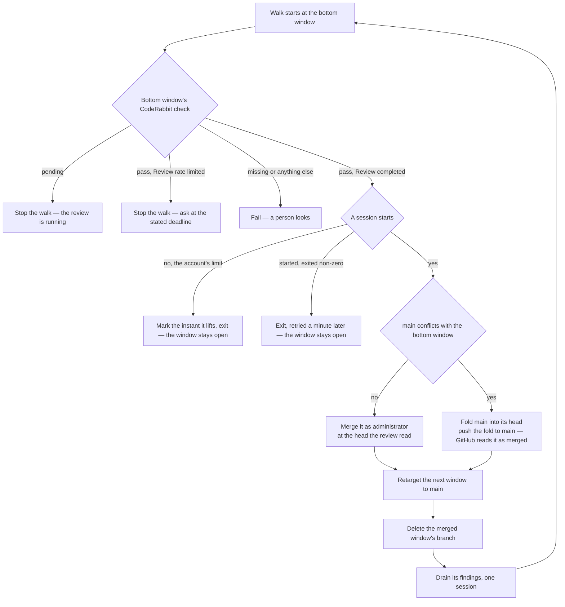
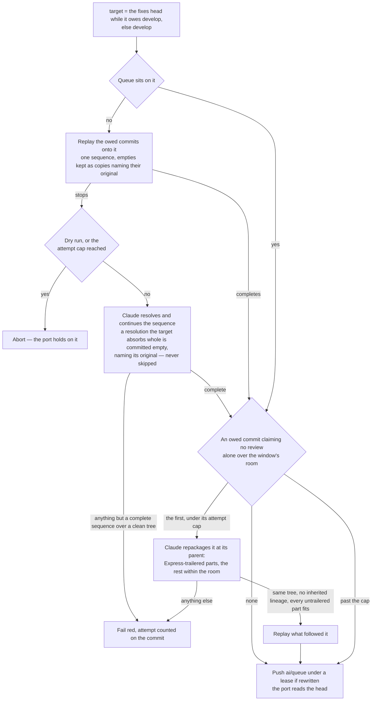
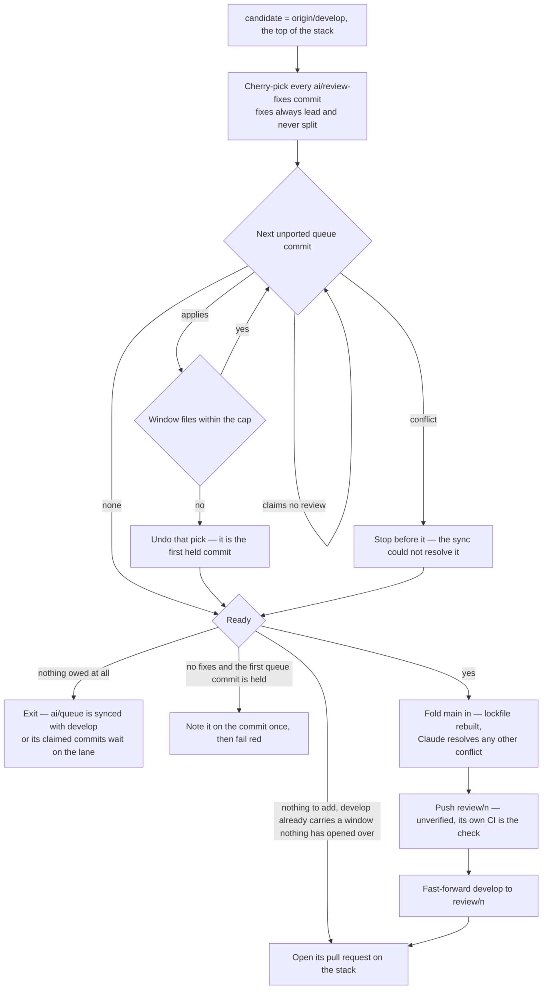

# Collection Cycle

One script, `pnpm ai:coderabbit:collect`, run by the [runner](/docs/infra/review-collector/runner) on every trigger and by hand with `--dry-run` to see what it would do. It reads the whole situation from the remote, clears the gates, and does the most it safely can in one pass, ordered so that every irreversible effect is either a compare-and-swapped push or a predicate-guarded write a later run can finish. Which ref each writer owns is the [two writers](/docs/infra/review-collector/two-writers) page. A live run ends after its last push; a dry run makes none of them, so it reports what every stage would do — the express cut, the reshaping, the walk of the stack, each window — in a single pass, which is how a change to any of them is read against the live refs before it is pushed.

## What it reads

Nothing is remembered between runs, so every input is a remote fact with a single source:

| Fact                          | Source                                                                                                                                                                                                                                 |
| :---------------------------- | :------------------------------------------------------------------------------------------------------------------------------------------------------------------------------------------------------------------------------------- |
| the window stack              | the open pull requests whose head starts with `review/`, ordered bottom up by following each base: the bottom one's base is `main`, and each other one's base is the window below it. A fork or a gap in that chain fails the run      |
| the window numbers            | the highest `n` among all window pull requests, open or closed, so the next window is one above it and no number is reused                                                                                                             |
| the hourly count              | the window pull requests open now, and those created in the last hour by their creation time, merged ones included                                                                                                                     |
| the stacking guard            | `.coderabbit.yaml` on `origin/main`, read with `git show`                                                                                                                                                                              |
| the check                     | per window: the CodeRabbit commit status, read by `bucket` first and `description` second                                                                                                                                              |
| the rate-limit deadline       | per window: the `Next included review available in …` the bot states in the walkthrough it last rewrote                                                                                                                                |
| open findings                 | each merged window's unresolved threads whose last comment is the bot's, plus its newest review body's own buckets                                                                                                                     |
| the window's base             | `main`'s tip for a window cut from the bottom, the head of the window below when one is open. A new window's count runs from there, the same base the bot reviews it against                                                           |
| fixes awaiting a push         | `git cherry origin/develop origin/ai/review-fixes` minus the ported set — the branch stays, what it owes is what counts                                                                                                                |
| what the queue still owes     | `git cherry <develop plus the fixes> origin/ai/queue` minus the ported set — commits not yet upstream by patch id, none of whose identities a copy names, nor empty                                                                    |
| the ported set                | the `(cherry picked from commit …)` line every port and every express cut writes (`cherry-pick -x`), read off the whole of the upstream and of `main` — the record a drifted patch id cannot lose                                      |
| a commit's identities         | its own sha and every sha the same line in its own body names: each rewrite of the queue replays it with `-x`, so a commit rewritten a dozen times carries a dozen earlier shas, and a copy names whichever one it had when it was cut |
| which thread a commit answers | an `Answers: <comment id>` trailer on the commit, `Drains: <review id>` for a body-only finding                                                                                                                                        |
| what claims no review         | an `Express: <why>` trailer on a queue commit — the reshaper's, or a session's own                                                                                                                                                     |
| `main` is red                 | a run of CI or of CodeQL concluded `failure` on `main`'s head — the [repair](/docs/infra/review-collector/repair)'s one input, with the failing jobs' log tails                                                                        |

The trailers are the collector's memory: a fix commit says which finding it answers in its own message, so the reply step can name it after the push, a later run can tell an answered finding from an open one, and a session fixing a finding by hand leaves the same record by writing the same trailer. The ported line is the same kind of memory for the port itself: a fix landing inside a ported hunk's context lines changes the copy's patch id, after which `git cherry` reads the original as still owed and re-picking it is the conflict nobody authored — so the copy names its original, and the owed set subtracts every original a copy names, on `develop` or on `main`.

## The return stroke, the repair and the express lane

Before the stack is read, the cycle compares `develop` with `main`. When no window is open, `develop` is an ancestor of `main` and the two differ, `main` holds commits and `develop` holds nothing of its own: `develop` is fast-forwarded to `main` with a plain push — nothing is open to review, so it spends nothing — and the pass goes on measuring against the head it made. While a window is open the stroke waits: `develop` is the top of the stack, and the open windows sit on it. What put those commits on `main` is not asked: a window that merged, an express cut and a dependency bump pushed straight at it all already sit on the branch a window is diffed against, so no window could carry them to a review. The stroke ends nothing because nothing would follow it: a push to `develop` fires no run, so a pass that exited here would leave the queue waiting on the next session push for the window it could have cut.

Then the cycle cuts every queue commit that claims it needs no review onto `main` — the [express lane](/docs/infra/review-collector/express-lane), open whether or not a window is in flight. That push is the run's one irreversible act too; the fold below carries `main` into the next window, and only then is a window measured. The cut is unverified — a claimed commit red on its own is `main`'s CI's to find. With nothing to cut, the cycle asks whether `main` itself is red — a failed check, or an open CodeQL alert: that head is the [repair](/docs/infra/review-collector/repair)'s, pushed as a cut of the lane's own with the run ending on it.

## The open windows: gate and merge, bottom up

**A window gets one review, and merges once it completes and a session could drain it.** Each window's pull request is based on the window below it, and only the bottom one is based on `main`, so the walk only ever merges the bottom one. A window's review starts when its pull request opens and reads the window's diff against its base, which is only what that window adds. Its branch is never pushed to again, so the review reads a head that does not move. Whatever the review finds is not fixed on that pull request: it merges once a session probe succeeds, and its findings are drained into the next window, whose review reads the fixes in full.

```mermaid
flowchart TD
  S[Walk starts at the bottom window] --> ST{Bottom window's CodeRabbit check}
  ST -->|pending| X1[Stop the walk — the review is running]
  ST -->|pass, Review rate limited| RL[Stop the walk — ask at the stated deadline]
  ST -->|missing or anything else| X2[Fail — a person looks]
  ST -->|pass, Review completed| PB{A session starts}
  PB -->|no, the account's limit| X3[Mark the instant it lifts, exit — the window stays open]
  PB -->|started, exited non-zero| X4[Exit, retried a minute later — the window stays open]
  PB -->|yes| FC{main conflicts with the bottom window}
  FC -->|no| MG[Merge it as administrator<br/>at the head the review read]
  FC -->|yes| FR[Fold main into its head<br/>push the fold to main — GitHub reads it as merged]
  MG --> RT[Retarget the next window to main]
  FR --> RT
  RT --> DL[Delete the merged window's branch] --> DR[Drain its findings, one session] --> S
```

- **The status is the whole answer.** With one review per window, a completed check at the head is that review, and its flip to completed arrives as a status event of its own. A missing check or a state the gate does not recognise fails the run rather than guessing. Each window's check is read on its own, since each has its own head.
- **A rate limit asks again.** `Review rate limited` means the bot ran nothing; the ask is posted once the deadline the bot stated has passed, for each window that stated one, and the [runner's retrigger](/docs/infra/review-collector/runner) sleeps out the soonest deadline still ahead.
- **A completed review waits its turn.** A window whose review completed above one still running is merged by a later run, once the window below it has merged. The walk takes the bottom window only, so a merge is never made over a window below it.
- **Retarget, then delete.** Merging the bottom window is followed by retargeting the next one to `main`, and only then deleting the merged window's branch: deleting a branch that is a pull request's base closes that pull request. The merged window's findings are drained before the walk moves on, one drain session per merged window, in stack order. A drain held past its attempts stops the walk there, so nothing above it merges until its findings are answered. A retarget that fails is logged and its branch kept, and the drain still runs: the window above is then stranded on the merged head, and the next run retargets it to `main` and deletes that branch before it reads the stack.
- **The release before the stack.** A pull request from `develop` to `main` that predates the stack is not reviewed or merged by it. While it is open no window opens, since a cut over `develop` would move its head under its own review; closed without merging, it pauses the collector as a closed release did.
- **A closed window pauses the collector.** A window closed without merging is a person's pause, and the run exits before it merges, drains or opens anything.
- **The merge names the head the review read.** `gh pr merge --match-head-commit` is the same compare-and-swap the push makes: a branch that moved since is refused rather than released unread.
- **A window `main` conflicts with is folded, never re-reviewed.** A repair or an express cut can land on `main` after the window went out, and a merge GitHub cannot create fails every run that tries it. So the window is tried against `main` in memory; a conflict folds `main` into the window's head through the same resolver the window's fold uses, and the fold is pushed to `main` itself — it descends from both, and GitHub closes a pull request whose head its base carries as merged. The fold adds nothing but `main`'s own content, so no review is owed for it. A window that still merges cleanly is left to GitHub.
- **The checks do not gate it.** The window's own checks run, and the merge does not wait for them: the review is the gate, and a red check is one more commit in the next window.

## The merged window: drain

With the bottom window merged, its review's findings are drained by the [drain](/docs/infra/review-collector/drain) — one session per merged window, before the walk reaches the next. Replies come first: a commit `develop` already carries above `main` — a window a run pushed and died before opening — answers its findings, and the reply citing it is posted before any exit. The drain's fixes land on `ai/review-fixes`, and the port puts them at the head of the next window.

## Sync

The fixes branch is synced first. A drain builds on the `develop` it read, and `develop` can move before those fixes port — the return stroke, a window cut, a fold, a repair, a hand revert — so a fixes branch that no longer sits on `develop` has what it owes replayed onto it by the same sequence and the same resolver the queue gets, and is pushed back under a lease on the sha it read. A conflict nothing resolved this run — a dry run, a resolver that could not start — ends the run idle, and one past the attempt cap fails it red: nothing may port ahead of fixes still owed, so that one is a person's, the conflicting fix's commit comments saying which. Left unsynced, a fix that no longer applies would fail every port with nothing to resolve it.

Before the port reads the queue, the collector rewrites it onto the tree the window is built on — `ai/review-fixes` while it owes `develop` commits, `develop` otherwise — reshapes the first owed commit adding more files than the window has room for, and pushes it back under a lease on the sha it read. The room is the cap less the files the window carries ahead of the queue — the fixes and any pending window `develop` holds, counted from the merge base as the port counts them — and a file of the commit's that the window already counts costs it nothing, since the port counts the resulting window's distinct files. The room does not measure a commit carrying `Express:` — that one is the lane's at any size, and reshaping it would pay a session per run to repackage what no window will ever carry. The commits the queue still owes are replayed in order as one `cherry-pick` sequence — `-x`, so every copy names the original it came from and a resolution that drifted its patch id still reads as carried, and `--empty=keep`, so a commit the tree already holds under another patch id lands as an empty copy naming it rather than falling away with nothing to say it did, and an empty copy a past resolution left rides through rather than stalling the sequence; a queue already sitting on that tree with nothing to reshape is left alone, which is every run but the one after a window.

```mermaid
flowchart TD
  T[target = the fixes head while it owes develop,<br/>else develop] --> A{Queue sits on it}
  A -->|no| R[Replay the owed commits onto it<br/>one sequence, empties kept as copies naming their original]
  R -->|stops| C{Dry run, or the<br/>attempt cap reached}
  C -->|yes| AB[Abort — the port holds on it]
  C -->|no| CL[Claude resolves and continues the sequence<br/>a resolution the target absorbs whole is committed empty,<br/>naming its original — never skipped]
  CL -->|anything but a complete sequence over a clean tree| F[Fail red, attempt counted on the commit]
  CL -->|complete| RS
  R -->|completes| RS
  A -->|yes| RS{An owed commit claiming no review<br/>alone over the window's room}
  RS -->|none| P[Push ai/queue under a lease if rewritten<br/>the port reads the head]
  RS -->|the first, under its attempt cap| SH[Claude repackages it at its parent:<br/>Express-trailered parts, the rest within the room]
  SH -->|same tree, no inherited lineage, every untrailered part fits| RP[Replay what followed it] --> P
  SH -->|anything else| F
  RS -->|past the cap| P
```

- **Why the collector and not the session.** A queue left on an old base carries commits written against files a drain has since repaired, and every one is a conflict the porter would hold on, run after run, until a person notices a red run. Here the conflict is met once, where the fixes are, and the working session's `git pull --rebase` afterwards replays only what it committed since (`.agents/skills/review-queue/SKILL.md`).
- **The lockfile is never a conflict a session sees.** A replay of the queue stops on it once per commit that touched a manifest, and every one of those stops has the same answer the fold already gave: the lockfile is deleted and rebuilt from the manifests the replay settled, never merged (`git` skill). The sequence is run out over as many stops as land on that path alone, bounded by the replay’s own length, and only a stop on another path is worth a session — which finds the sequencer exactly where it expects it, mid-pick with that commit’s conflict open.
- **A conflict is the drain's session pointed at a conflict.** The same headless Claude, the same denials — no push, no branch switch, no GitHub — told which commit stopped the sequence and on which paths, that both sides survive, and that a commit whose whole change the target already carries is committed empty rather than skipped. What proves the resolution is a sequence run to its end over a clean tree that carries every commit the queue owed, never the session's word — the first two are what `git cherry-pick --abort` leaves as well, and the rewrite behind them would force-push every owed commit away, so the third is read off the replay itself — and so the resolver owes no finishing checks and repairs nothing beyond the conflict: a red elsewhere in the replay is a queue commit's, which the queue's own CI names to the session that owns it, and every minute the resolver spends past the conflict is one the working session can push into. **`--skip` is denied, and the empty commit is why.** A resolution the target absorbs whole leaves the same tree as an abandoned one, so no test over content can tell the sanctioned drop from the lost work; git's own prepared message names the original, and an empty copy carrying it is the one record that says which happened. The replay keeps the same record for itself: a commit whose change the target already carries under another patch id — a repaired copy the port skipped, or a fold's — still reads as owed by patch id, and dropping it as it applies would leave that check reading the resolver's finished sequence as one that lost it. The owed set ignores a commit that changes nothing, so the queue sheds either copy on the next rewrite rather than replaying it forever. A failure counts against the attempt cap under a marker in a comment on the conflicting commit itself rather than on the pull request, for the reason the runner's counts carry, and the marker names the collector's own source as the basis the attempt was made against, so a collector fixed since hands the commit a fresh turn with nobody resetting anything ([the runner's counts](/docs/infra/review-collector/runner)). Past the cap the commit is a person's: the port holds on it.
- **A commit alone over the window's room is repackaged, never held.** No window can carry it and no session is asked to commit differently — what a commit holds is the session's business, and what in it needs a reviewer's eye is a judgement. The same session, detached at the commit's parent, rewrites it as a sequence: the parts that need no review — a rename, a one-rule substitution a lint rule now enforces, generated output, a format pass — each a commit of any size carrying `Express: <why>`, which the express lane takes to `main`; the rest in commits within the room, ordered so every prefix is green. It repackages and never edits, and the collector proves that rather than trusting it: `git diff <original> HEAD` empty, no part keeping a `(cherry picked from commit …)` line, and every untrailered part within the room, or the attempt fails and is counted on the commit. Those lines name the copies the original was replayed from, and a part keeping them shares them with its siblings — so the express lane's copy of one part reads every part as ported, and the next sync drops the rest unreplayed. One commit per run, since the rewrite's push fires the next. Past the attempt cap the commit is left whole for the port to hold on — the residual person's case, and the held notice below says so. **The room, not the cap, because the fixes lead every window.** A review almost always yields findings, so a commit that fits the cap alone but not beside the fixes is held behind every window, and each window ships the fixes alone; a reshaping the cap measured ended in a part of exactly the cap's size, and it sat at the queue's head while window after window carried a handful of fix files. Fixes that fill the cap alone leave no room to reshape into — the port fails that run anyway.
- **Two writers of `ai/queue`, one compare-and-swap.** The lease is the rewrite's alone — it names the sha the run read, against a session that pushes plain and pulls when the rewrite refuses it ([two writers](/docs/infra/review-collector/two-writers)). A rewrite the session's push beat is not redone: that push fast-forwarded the sha the lease named by a commit or two, so the rewrite carries those onto itself and pushes again under the lease the push moved to, a few times over before giving up — redoing the run would hand the resolver the same conflict to lose to the next push, which under an active session never converges. Only a queue whose history the session rewrote, or a carried commit that conflicts with the rewrite, exits the run idle, since that push fires a run of its own that replays onto what the queue then carries — porting off the stale head instead would hold on a conflict the next run resolves.

## Port

The port builds the window as a local branch, one cherry-pick at a time, and measures after each from the tree that will be pushed.

```mermaid
flowchart TD
  C[candidate = origin/develop, the top of the stack] --> FX[Cherry-pick every ai/review-fixes commit<br/>fixes always lead and never split]
  FX --> Q{Next unported queue commit}
  Q -->|claims no review| Q
  Q -->|none| RD
  Q -->|conflict| H[Stop before it — the sync could not resolve it]
  Q -->|applies| M{Window files within the cap}
  M -->|yes| Q
  M -->|no| U[Undo that pick — it is the first held commit]
  U --> RD
  H --> RD{Ready}
  RD -->|nothing owed at all| N[Exit — ai/queue is synced with develop<br/>or its claimed commits wait on the lane]
  RD -->|no fixes and the first queue commit is held| F[Note it on the commit once, then fail red]
  RD -->|nothing to add, develop already carries a window nothing has opened over| OP[Open its pull request on the stack]
  RD -->|yes| FM[Fold main in — lockfile rebuilt,<br/>Claude resolves any other conflict] --> P[Push review/n — unverified, its own CI is the check]
  P --> FF[Fast-forward develop to review/n] --> OP
```

- **Fixes always ride, whole.** A fix split from the finding it answers is a reply that lies. Fixes alone over the cap fail the run — a drain that touched far more than its findings, for a person to see.
- **Only what the queue authored is owed.** A merge of `main` into `ai/queue` brings `main`'s commits and the merge itself, none of it the queue's. The porter takes the queue's commits that are neither on `develop` by patch id nor reachable from `main` nor named — under any identity they have carried, by a copy anywhere on either — and a cut whose ancestors hold anything the porter did not pick — a skipped merge, a commit claiming no review — is ported rather than fast-forwarded. A fast-forward moves `develop` to the queue's own sha, so everything behind that sha rides with it: a cut that carries more than was counted would put a claimed commit into the very review its claim exempts it from, over a cap measured without its files.
- **Queue order, never reordered, and a claimed commit only when something needs it.** A commit carrying `Express:` is the lane's and is skipped as if it were not there — what follows it ports — unless an owed commit only applies on top of the claimed commits skipped before it, and the window then carries those ahead of it; the first remaining commit that would overflow the cap or conflicts is where the window ends, and the count includes every fix. A hold is the residual case — a reshaping or a resolution past its attempt cap, or a dry run that resolves nothing.
- **The window is counted the way the bot counts its pull request: the diff against the window's base.** The base is `main`'s tip for a window cut from the bottom, and the head of the window below for a stacked one, so each window is counted alone and the windows below it are not. A fold of `main` adds nothing to a window cut from `main`, since the diff counts only the window's own side of it; on a stacked window the files `main` brought count, because the diff against the window below holds them. So a stacked cut is measured again after its fold, and held over the cap until the stack below merges. The count is the bot's own diff, so it cannot let a review overflow. That the bot diffs against the base the window is cut from is an assumption about the bot, stated here because the code cannot verify it — a wrong guess surfaces as a review skipped for too many files, which the gate reads as an unrecognised check state and fails red, never silently.
- **The fold always lands.** What reached `main` unread — an express cut, a dependency bump — is merged into the candidate so `develop` never diverges from `main` into the window's merge: the lockfile conflict is rebuilt from the installed tree (`git` skill), any other is the resolver's, counted on `main`'s head, and only past its attempts is the fold abandoned — the window's own fold then fails the run red, naming `main`'s head for a person to merge.
- **The window is pushed unverified.** Its own CI runs after the push, and a red there is one more commit in the next window.
- **Fast-forward when the shas allow it** — no fixes, the queue sitting on `origin/develop`, no skipped merge among the cut's ancestors, nothing folded — so the session's local branch already matches and no rebase is owed.

### Readiness

The window goes out when the port holds anything at all — a fix, a queue commit that fit, or what `develop` already carries above `main` — at whatever size it reached; with none of those, nothing is owed, or the run fails red when the first commit is held.

**There is no lower bound on a window.** The port takes every commit the queue owes and stops only at the cap or on a conflict, so a window that came out small is the whole of what was left — and waiting for it to grow waits on a push nothing has promised while the queue stays unsynced. Fixes alone are the same case, and go out the moment they are drained (why is on the overview page). The standing goal is `ai/queue` fully drained into `develop`; the cap is the only size the window is measured against, and it is measured on the tree that will be pushed.

A held window cannot grow — the commit that stopped it is past the reshaper's or the resolver's attempts, and only this window landing clears anything. A window a dying run left pushed is ready with nothing to add, and only its opening is owed. The held commit is told on itself, once: a marker comment on the commit, posted by the first run that holds on it.

## Opening a window

After the walk, the sync and the port, a run opens windows one at a time, cutting each from the top of the stack, and keeps opening while every one of these holds:

- fewer window pull requests are open than the plan's hourly figure;
- fewer window pull requests were opened in the last hour, by their creation time, than that figure — merged ones included;
- stacking is allowed: nothing is open, or the guard below holds;
- the queue or the fixes still owe commits.

The decision is a pure count, `getWindowOpenCount`, that returns how many more may open; the loop also stops when a cut comes out empty. The figures are the plan's, read from the constants file (see [key files](#key-files)), never restated here. Each window is cut exactly as the port cuts it, measured against the file cap, and the cut is pushed to its own branch — `review/<n>`, the number one above the highest any window pull request has carried, open or closed — through the same compare-and-swap as every collector push. `develop` is then fast-forwarded to that head, so the next cut is built on it and carries the window below. The window's pull request is opened with its base at the top window's branch, or at `main` when none is open, and titled with its number. Its one review reads the window's own diff against that base.

**The guard.** CodeRabbit reviews a pull request by itself only when its base is `main` or a base the `.coderabbit.yaml` it reads lists under `reviews.auto_review.base_branches`. A window stacked on the window below it has that window's branch as its base, so the list has to name the window branches. `.coderabbit.yaml` carries that entry, with a comment saying why. The collector reads `main`'s copy of the file (`git show origin/main:.coderabbit.yaml`) and stacks only when one of its patterns matches the first window's branch name. A window's review reads the config of the branch it is based on, and that is the window below, which carries the list only once `main`'s copy has come down through `develop`. So the guard reads `main`, and until `main` carries the list the collector opens one window at a time, as it did before there was a stack.

## Push, reply, open

The window is pushed to its own branch at the cut, through `pushBranch`, the one compare-and-swap every collector push goes through. The `develop` fast-forward follows under the lease on the sha every count was measured from, so the remote refuses it if `origin/develop` left that sha: the run reports a moved outcome and the next one re-measures, while a push that failed for anything else fails the job as itself. No review can be running under the window's head — its branch is new — so no status is re-read first. After the pushes the reply step runs again and posts `Agreed, fixed in <sha>` on every thread of a merged window that a pushed commit's trailer names, and one verdict comment per `Drains:` review id.

The pull request is opened once its branch is on the remote. A run that pushed a window and died before opening it is finished by the next one, which finds `develop` ahead of the stack with nothing to add and opens the pull request that is owed. Nothing is deleted afterwards except a window's branch once its pull request has merged: `ai/review-fixes` stays, owing nothing, until the next drain re-creates it, and the queue's ported commits drop from the session's history at its next rebase.

## Key files

| File                                                                       | Role                                                                                                                                  |
| :------------------------------------------------------------------------- | :------------------------------------------------------------------------------------------------------------------------------------ |
| `scripts/src/services/coderabbit/collect/runCycle.ts`                      | the pass itself — the return stroke, the repair, the express lane, the walk of the stack, the sync and the port, and the opening loop |
| `scripts/src/services/coderabbit/collect/orderWindowStack.ts`              | the open window pull requests ordered bottom up by following each base, and a throw on a fork or a gap                                |
| `scripts/src/services/coderabbit/collect/getWindowOpenCount.ts`            | how many more windows the budget lets open, from the open count, the hourly count and the guard                                       |
| `scripts/src/services/coderabbit/collect/checkIsStackingAllowed.ts`        | the guard — whether the `.coderabbit.yaml` on `main` lists a pattern matching the first window's branch                               |
| `scripts/src/services/coderabbit/collect/pushBranch.ts`                    | the compare-and-swap every window and `develop` push goes through                                                                     |
| `scripts/src/services/coderabbit/collect/foldCandidate.ts`                 | the window's cut and its fold of `main`                                                                                               |
| `scripts/src/services/coderabbit/collect/portWindow.ts`                    | the port — the cut's commits, measured after each pick                                                                                |
| `scripts/src/services/coderabbit/collect/readWindowFilePaths.ts`           | the count the bot makes of a window — the diff against its base, on the tree that will be pushed                                      |
| `scripts/src/services/coderabbit/collect/getStrandedWindowPullRequests.ts` | the window whose retarget a merge did not land, found from the stack and its history                                                  |
| `scripts/src/services/coderabbit/collect/retargetStrandedWindows.ts`       | the recovery that retargets it to `main` and deletes the merged head, before the stack is read                                        |
| `scripts/src/services/coderabbit/collect/readLegacyReleasePullRequest.ts`  | the pull request from `develop` to `main` that predates the stack — open holds the windows, closed pauses                             |
| `scripts/src/services/coderabbit/collect/constants.ts`                     | the branch names, the window branch prefix and the collector's own values                                                             |
| `scripts/src/services/coderabbit/shared/constants.ts`                      | the file cap and the plan's hourly figure, both read off the plan                                                                     |
| `.coderabbit.yaml`                                                         | the window branches listed as bases CodeRabbit reviews on creation                                                                    |

## Why a re-run is a no-op

| Step   | Precondition read from the remote                                                                           | Effect                                                      | Second run against unchanged state                                          |
| :----- | :---------------------------------------------------------------------------------------------------------- | :---------------------------------------------------------- | :-------------------------------------------------------------------------- |
| return | no window open, `develop` an ancestor of `main`, the two apart                                              | fast-forwards `develop`                                     | they agree — nothing, and the pass goes on either way                       |
| repair | CI red on `main`'s head, the streak under the cap                                                           | the regenerators else a session, a cut, a push              | the push made a new head CI has not concluded on — nothing                  |
| gate   | a window open, its check bucket                                                                             | a scheduled retrigger                                       | same verdict, same deadline — the ask is posted once per block              |
| merge  | the bottom window open, its review complete                                                                 | merges it, retargets the next to `main`, deletes its branch | it is off the stack, and the walk stops at the next window not yet complete |
| reply  | a trailer's thread lacks a reply citing that sha                                                            | posts the reply                                             | every thread has one — nothing                                              |
| drain  | a finding of the merged window is open by the predicate                                                     | commits on `ai/review-fixes`                                | every finding carries a trailer or a reply — nothing                        |
| sync   | the fixes or the queue do not sit on their target, or an owed commit claiming review is alone over the room | rewrites `ai/review-fixes`, then `ai/queue`                 | it sits on it and every commit fits — nothing                               |
| port   | `git cherry` lists unported commits, readiness                                                              | a local branch                                              | same branch, discarded with the runner                                      |
| push   | `origin/develop` unchanged since the read, `review/<n>` absent                                              | creates `review/<n>`, fast-forwards `develop`               | the branch exists — the opening finishes it                                 |
| open   | `develop` ahead of the stack with nothing to add, the budget holds                                          | opens the window's pull request                             | one is open over it — the gate                                              |

## Notes

- **Rejected: trusting an incremental review.** A push to an open window asked the bot for a review of just the new commits, and it declined one it could not recover — "the last reviewed checkpoint was preserved" — then flipped its check to completed with no range stated. The collector read that as a skipped head and released it on a verdict: a window merged with most of its commits read by no review at all. Everything that kept the incremental path honest — the frontier read off stated ranges, the skipped-review detection, the merge-risk gate, the verdict session and its typed decision — existed to second-guess a review that should never have been asked for. A window now gets exactly one review, of its whole diff against its base, and the fixes it asks for are the next window's to review in full.
- **Rejected: holding a window until its findings are fixed.** Fixing on the open pull request is what asks for an incremental review. The fixes lead the next window instead, so every line that reaches `main` has been read by one full review — a fix by the window after the one that found it.
- **Rejected: verifying a window before the push** — build, typecheck and lint on the candidate, dropping the tail commit until green. A gate with no remedy: the window is a prefix of the queue, so a red commit inside it holds every window behind it while its repair sits commits later and past the cap, and each attempt spends runner-minutes finding that out. The queue's own CI already names the red commit to the session that can fix it in the next commit. The express lane's cut reaches `main` unread and is not verified either; the [repair](/docs/infra/review-collector/repair) answers whatever red it leaves there.
- **Rejected: holding the queue on a commit alone over the room for a person to split.** Every slot until then went to the drain's fixes alone, and the red that told the person arrived only with the next window. Repackaging is the collector's, and the commit's author is asked for nothing.
- **Rejected: undoing a fold of `main` that put the range over the cap.** It left `develop` diverged until the merge, where a conflict was a person's, and it counted files the bot's cap does not.
