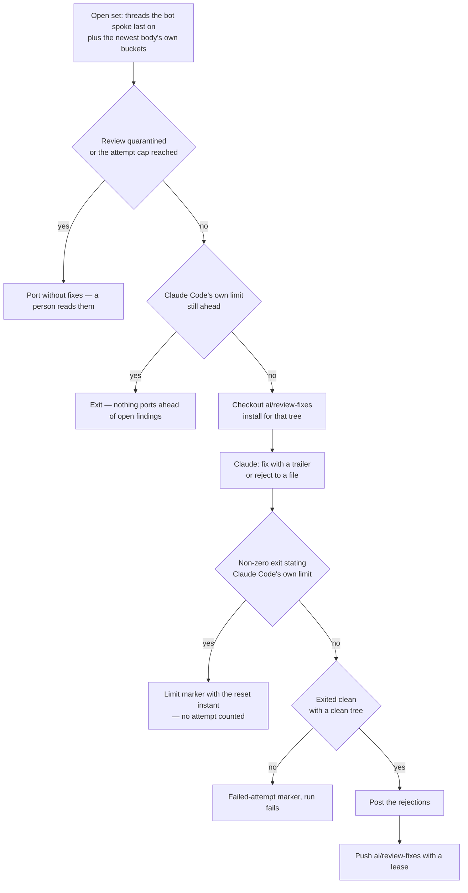

# Drain

The drain answers every finding of the newest completed review, at every severity, and is the first step of the [collection cycle](/docs/infra/review-collector/collection-cycle) where Claude runs — the resolver, the reshaper and the release verdict borrow the same session, with the same denials, for the other readings no rule can make ([runner](/docs/infra/review-collector/runner)). Everything around it — which findings are open, whether to run at all, what to post and what to push — is deterministic TypeScript.

## What is open

An inline finding is open when its thread is unresolved, the bot spoke last on it, and no `Answers: <comment id>` trailer names it on a commit the window already carries or on one `ai/review-fixes` or `ai/queue` still owes `develop` by patch id — a fixes branch keeps its head after a window carries it, and a queue not yet rebased keeps its ported commits, so a range would read both as unported. The window's own commits count because the reply is best-effort: a thread whose reply never landed still reads as the bot's, and the commit is the answer. A thread the bot has answered again after the collector's reply is open again.

Body-only findings — every bucket the review body heads `<Name> comments (N)`: nitpicks, outside-diff-range comments, and the minor comments a long review moves out of its inline threads, none of which has a thread — are open when the newest review states a non-zero count for any bucket, whatever its name, no `Drains: <review id>` trailer names it on the unported commits or the commits since the frontier, and no verdict comment carries its marker. The two halves are one memory: a trailer is lost the moment its commit is ported past the frontier, a marker outlives every rebase. A review stating none never spins up a Claude session. The buckets are read by the shape of their heading rather than from a list of names, because the set is not fixed: a list of two missed a review whose findings were all in a `Minor comments` bucket, which read as zero and was never drained.

## What Claude is handed

The step checks out `ai/review-fixes` while it still owes `develop` commits and re-creates it from the `develop` head otherwise, then installs for that tree — an install that fails is handed to the session with its tail, to repair ahead of the findings, rather than ending the run uncounted. Claude is handed each open inline finding as the reviewer wrote it — the reasoning, the proposed diff and the prompt block, with the bot's hidden fingerprints stripped — and the `ai:coderabbit:feedback` report for the body-only buckets and the stated counts; it holds no `gh` to read a thread itself. The report's own index of the open threads is left out of this one copy of it: the session already has each of them in full, and in the order it should meet them, so the index would be the same findings a second time under a second ordering.

For each finding it does what the `coderabbit` skill prescribes, in the order the `code-review` skill's fix-round page sets: verify against the code and against the written record — a decision a comment, a page or a skill states with its reason stands until a verified fact refutes the reason — then fix it in a commit carrying `Answers: <comment id>` (one commit may answer several) or reject it by writing one line naming the comment and the evidence to a rejections file. Body-only findings it judges real are fixed under `Drains: <review id>`; the invalid ones go to a second file as verdict lines. Both files sit outside the checkout, because Claude also owes a clean working tree. It runs the finishing checks over the touched paths in the foreground — a `claude -p` session has no next turn to read a backgrounded result in — commits the repairs, and leaves the tree clean.

**The drain holds no credential that can act on this repository.** Its prompt is untrusted review text steering a session that skips its permission prompts, so a rejection is a file write rather than a post; the [runner](/docs/infra/review-collector/runner) says what the session is and is not given.

## What the script does after

Once Claude exits, the script — the only process with a credential — posts a reply on each rejected thread and one verdict comment for rejected body-only findings, right away since neither cites a sha. A line naming a thread that was not open is skipped, and an HTML comment inside a reason is stripped, because a reply goes out under the login every marker read keys its trust on. Each post is best-effort: a refusal would otherwise throw away a drain that succeeded, and a thread whose reply did not land keeps the bot as its last author, so the next run drains it again. Then it pushes `ai/review-fixes` with a lease on the sha it read. The accepted findings' replies are the cycle's, after the window lands on `develop`.

**A zero exit says the session ended, never that it finished.** A drain that stopped mid-fix leaves the rest of a finding in the working tree, so a dirty tree is a failed attempt like a non-zero exit.

**The findings are put severest first.** A session is one-shot and may end mid-round, so the order it meets them in is the one thing about the prompt that survives a round that did not finish. Each open finding is scored in a single [typed decision](/docs/infra/typed-decisions) and the prompt is built in that order. Nothing is dropped and nothing acts on a score, so a wrong order costs the ordering alone, and with no tier configured the reviewer's own order stands.

## When it cannot

**A finding the drain cannot close is quarantined, not retried forever.** Each failed drain of a review leaves a hidden marker in a pull request comment; past the attempt cap the collector posts that it has stopped and ports without fixes. The marker and the quarantine both name the collector's own source as their basis ([the runner's counts](/docs/infra/review-collector/runner)), so a collector fixed since drains the review again rather than porting past it on a count the old code ran up. The findings stay open for a person — the cost of the alternative is a pipeline stalled on one finding nobody sees. This is the [no manual recovery](/docs/architecture/no-manual-recovery) shape: land the failure durably, cap the attempts, quarantine visibly.

**A drain that never started is not a failed attempt.** Claude Code refusing to run because the account is out of session exits non-zero like a drain that tried, and counting it would spend the quarantine budget on an outage. The step reads the sentence Claude Code prints on its way out — off its own lines, never the model's narration, and never trusting the result frame, which states `success` for a refusal — and a limit writes a marker carrying the instant it lifts. Until then every cycle skips the drain and stops before the port. No job sleeps this one out: Claude's reset is a time of day, up to a day off, and the next `ai/queue` push wakes the cycle soon enough.

## Key files

| File                                                               | Role                                                                               |
| :----------------------------------------------------------------- | :--------------------------------------------------------------------------------- |
| `scripts/src/services/coderabbit/collect/runDrainStep.ts`          | the open set it reads, and what stops it — nothing open, dry run, the Claude limit |
| `scripts/src/services/coderabbit/collect/drainFindings.ts`         | quarantine, the branch, the install, the session, the verdicts, the push           |
| `scripts/src/services/coderabbit/collect/getDrainPrompt.ts`        | what Claude is told, in the order it is told                                       |
| `scripts/src/services/coderabbit/collect/readFindingSeverities.ts` | the score each finding is ordered by                                               |
| `scripts/src/services/coderabbit/collect/runSession.ts`            | the headless session, its scrubbed environment and its streamed log                |
| `scripts/src/services/coderabbit/collect/postDrainVerdicts.ts`     | the rejections, posted by the one process holding a credential                     |
| `scripts/src/services/coderabbit/feedback/getFeedbackReport.ts`    | the report the CLI prints and the drain is handed                                  |
| `.agents/skills/code-review/references/fixing-findings.md`         | the order of work the prompt points the session at                                 |
