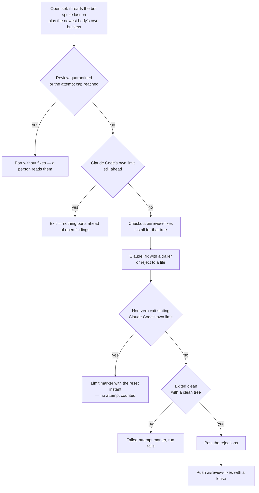

# Drain

The drain answers every finding of the newest completed review, at every severity, and is the only step of the [collection cycle](/docs/infra/review-collector/collection-cycle) where Claude runs. Everything around it — which findings are open, whether to run at all, what to post and what to push — is deterministic TypeScript, so the expensive step is the only one that can be wrong in an interesting way.

## What is open

An inline finding is open when its thread is unresolved, the bot spoke last on it, and no `Answers: <comment id>` trailer names it on `ai/review-fixes` or on the queue's unported commits. A thread with the collector's reply is closed from the collector's point of view whether or not CodeRabbit has resolved it yet; a thread the bot has answered again after that reply is open again, because its last comment is the bot's.

Body-only findings — nitpicks and outside-diff-range comments have no thread — are open when the newest review states a non-zero count of either, no `Drains: <review id>` trailer names it on the unported commits or on the commits since the frontier, and no verdict comment the collector posted carries its marker. The two halves are the same memory: a trailer is lost the moment its commit is ported past the frontier, and a marker outlives every rebase. A review stating none of either owes no body drain, so a clean review never spins up a Claude session.

## What Claude is handed

The step checks out `ai/review-fixes` while it still owes `develop` commits and re-creates it from the `develop` head otherwise, so the branch is never stale and never deleted, then installs for that tree — the runner installed once for whatever the event checked out, and the drain's own checks would otherwise run against a `node_modules` from the wrong commit. Claude is handed each open inline finding as the reviewer wrote it — the reasoning, the proposed diff and the prompt block it addresses to an agent, with the bot's hidden fingerprints stripped — and the whole `ai:coderabbit:feedback` report for the body-only buckets and the stated counts. It holds no `gh` to read a thread itself, so a title alone would have it re-derive the case the reviewer already made.

It does for each finding what the `coderabbit` skill already prescribes, in the order the `code-review` skill's delegated-fix-round page sets: verify against the code, then either fix it in a commit carrying `Answers: <comment id>` (one commit may answer several findings, and each gets its own trailer line) or reject it by writing one line naming the comment and the evidence to a rejections file. Body-only findings it judges real are fixed in commits carrying `Drains: <review id>`; the ones it judges invalid go to a second file as verdict lines, whether or not any other of them was fixed. Both files sit outside the checkout, because Claude also owes a clean working tree. It then runs the finishing checks over the touched paths — in the foreground, because a `claude -p` session has no next turn to read a backgrounded check's result in, so the repo's run-every-check-in-the-background rule is the one convention the prompt overrides — commits the repairs, and leaves the tree clean.

**The drain holds no credential that can act on this repository.** Its prompt carries CodeRabbit's finding text verbatim, which is model-written prose about code anyone may have contributed, steering a session that skips its permission prompts — the shape a prompt injection wants. So a rejection is a file write rather than a post, and the [runner](/docs/infra/review-collector/runner) says what the session is and is not given.

## What the script does after

Once Claude exits, the script — the only process with a credential — posts a reply on each rejected thread and, if any body-only findings were rejected, one verdict comment naming them, right away since neither cites a sha the push has not landed yet. A line naming a thread that was not open is skipped rather than posted, and an HTML comment inside a reason is stripped, because a reply goes out under the collector's own login and that login is what every marker read keys its trust on. Each post is best-effort: a GitHub refusal here would otherwise throw away a drain that had already succeeded, and a thread whose reply did not land keeps the bot as its last author, so the next run drains it again. Then it pushes `ai/review-fixes`, with a lease on the sha it read, so a run that dies mid-drain leaves no trace and the next run starts the drain again from the same open set. The accepted findings' replies are the cycle's, after the window lands on `develop`, and the fixes that answered a body-only review are announced in a second verdict comment then — keyed on the commit shas, so a review whose body findings were partly rejected and partly fixed gets both.

**A zero exit says the session ended, never that it finished.** A drain that stopped mid-fix leaves the rest of a finding in the working tree, and reading `HEAD` there would push half of one as though it were whole — so a dirty tree is a failed attempt like a non-zero exit.

## When it cannot

**A finding the drain cannot close is quarantined, not retried forever.** Each failed drain of a review leaves a hidden marker in a pull request comment carrying the review id; past the attempt cap the collector stops draining that review, posts that it has, and proceeds to port without fixes. The findings stay open for a person — the cost of that is a window whose fixes do not lead it, and the cost of the alternative is a pipeline stalled on one finding nobody sees. This is the [no manual recovery](/docs/architecture/no-manual-recovery) shape: land the failure durably, cap the attempts, quarantine visibly.

**A drain that never started is not a failed attempt.** Claude Code refusing to run because the account is out of session exits non-zero exactly like a drain that tried and could not, and counting it would spend the quarantine budget on an outage. So the step separates the two by reading the sentence Claude prints on its way out — off the lines Claude Code spoke for itself, never off the model's narration — and a limit writes its own marker carrying the instant it lifts. Until then every cycle skips the drain and stops before the port, because the open findings are untouched and nothing may be ported ahead of them. There is no waiting job for this one: CodeRabbit's deadline is minutes away and one runner sleeps it out, while Claude's reset is a time of day, up to a day off, and the next `ai/queue` push wakes the cycle for nothing and is rarely later.

**What the sentence rides in does not say the session refused.** The refusal arrives as a result frame stating `success`, with one turn and no cost, while the process exits non-zero — so a frame read as the model's closing message hides the one line the limit exists to find, and the outage is billed to the review as three failed attempts and a quarantine nobody earned. The exit status is the only thing that says whether the session ran, and every result frame is read as Claude Code's own.

## Key files

| File                                                            | Role                                                                               |
| :-------------------------------------------------------------- | :--------------------------------------------------------------------------------- |
| `scripts/src/services/coderabbit/collect/runDrainStep.ts`       | the open set it reads, and what stops it — nothing open, dry run, the Claude limit |
| `scripts/src/services/coderabbit/collect/drainFindings.ts`      | quarantine, the branch, the install, the session, the verdicts, the push           |
| `scripts/src/services/coderabbit/collect/getDrainPrompt.ts`     | what Claude is told                                                                |
| `scripts/src/services/coderabbit/collect/runDrain.ts`           | the headless session, its scrubbed environment and its streamed log                |
| `scripts/src/services/coderabbit/collect/postDrainVerdicts.ts`  | the rejections, posted by the one process holding a credential                     |
| `scripts/src/services/coderabbit/feedback/getFeedbackReport.ts` | the report the CLI prints and the drain is handed                                  |
| `.agents/skills/code-review/fixing-findings.md`                 | the order of work the prompt points the session at                                 |
