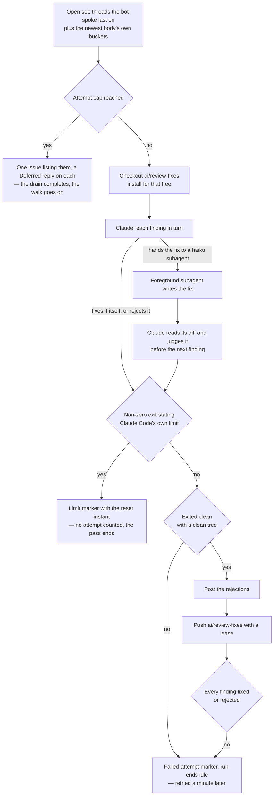

# Drain

The drain answers every finding of a merged window's review, at every severity, after that window's merge, and is the step of the [collection cycle](/docs/infra/review-collector/collection-cycle) where Claude runs — the resolvers, the reshaper and the repairer borrow the same session, with the same denials, for the other readings no rule can make ([runner](/docs/infra/review-collector/runner)). Each merged window is drained by its own session, in stack order, before the walk reaches the next one. Everything around it — which findings are open, whether to run at all, what to post and what to push — is deterministic TypeScript.

```mermaid
flowchart TD
  O[Open set: threads the bot spoke last on<br/>plus the newest body's own buckets] --> Q{Attempt cap reached}
  Q -->|yes| P[One issue listing them, a Deferred reply on each<br/>— the drain completes, the walk goes on]
  Q -->|no| B[Checkout ai/review-fixes<br/>install for that tree]
  B --> C[Claude: each finding in turn]
  C -->|fixes it itself, or rejects it| R{Non-zero exit stating<br/>Claude Code's own limit}
  C -->|hands the fix to a haiku subagent| S[Foreground subagent writes the fix]
  S --> J[Claude reads its diff and judges it<br/>before the next finding] --> R
  R -->|yes| M[Limit marker with the reset instant<br/>— no attempt counted, the pass ends]
  R -->|no| E{Exited clean<br/>with a clean tree}
  E -->|no| F[Failed-attempt marker, run ends idle<br/>— retried a minute later]
  E -->|yes| V[Post the rejections] --> PU[Push ai/review-fixes with a lease]
  PU --> U{Every finding fixed<br/>or rejected}
  U -->|no| F
```

## What is open

An inline finding is open when its thread is unresolved, the bot spoke last on it, and no `Answers: <comment id>` trailer names it on a commit `develop` already carries or on one `ai/review-fixes` or `ai/queue` still owes `develop` by patch id — a fixes branch keeps its head after a window carries it, and a queue not yet rebased keeps its ported commits, so a range would read both as unported. The commits `develop` carries count because the reply is best-effort: a thread whose reply never landed still reads as the bot's, and the commit is the answer. **A thread the collector has answered stays answered when the bot replies to that answer** — its acknowledgement, or an analysis chain arguing a rejection — and is open again only when the bot's newest comment asks for a change it can be held to, a suggestion block or a committable suggestion, which is a new finding in the same thread. So the collector replies once per finding: one comment it rejected was rejected twice, because the bot answered the first rejection with an analysis chain that the drain then read as open. That rule — any bot comment after the collector's reply reopens the thread — fell to the user's goal of a pipeline that replies to everything and finishes with nobody watching.

Body-only findings — every bucket the review body heads `<Name> comments (N)`: nitpicks, outside-diff-range comments, and the minor comments a long review moves out of its inline threads, none of which has a thread — are open when the newest review states a non-zero count for any bucket, whatever its name, no `Drains: <review id>` trailer names it on the unported commits or the commits `develop` carries above `main`, and no verdict comment carries its marker. The two halves are one memory: a trailer is only read off the commits above `main`, so it is lost the moment its commit reaches `main`, while a marker outlives every rebase. A review stating none never spins up a Claude session. The buckets are read by the shape of their heading rather than from a list of names, because the set is not fixed: a list of two missed a review whose findings were all in a `Minor comments` bucket, which read as zero and was never drained.

## What Claude is handed

The step checks out `ai/review-fixes` while it still owes `develop` commits and re-creates it from the `develop` head otherwise, then installs for that tree — an install that fails is handed to the session with its tail, to repair ahead of the findings, rather than ending the run uncounted. Claude is handed each open inline finding as the reviewer wrote it — the reasoning, the proposed diff and the prompt block, with the bot's hidden fingerprints stripped — and the `ai:coderabbit:feedback` report for the body-only buckets and the stated counts; it holds no `gh` to read a thread itself. The report's own index of the open threads is left out of this one copy of it: the session already has each of them in full, and in the order it should meet them, so the index would be the same findings a second time under a second ordering.

For each finding it does what the `coderabbit` skill prescribes, in the order the `code-review` skill's fix-round page sets: verify against the code and against the written record — a decision a comment, a page or a skill states with its reason stands until a verified fact refutes the reason — then fix it in a commit carrying `Answers: <comment id>` (one commit may answer several) or reject it by writing one line naming the comment and the evidence to a rejections file. Body-only findings it judges real are fixed under `Drains: <review id>`; the invalid ones go to a second file as verdict lines. Both files sit outside the checkout, because Claude also owes a clean working tree. It runs the finishing checks over the touched paths in the foreground — a `claude -p` session has no next turn to read a backgrounded result in — commits the repairs, and leaves the tree clean.

**A fix may go to haiku.** The session may hand a finding's fix to a foreground subagent on the haiku tier: the Agent tool with `model: "haiku"` and `run_in_background: false`, one finding at a time. It reads each subagent's diff and judges it before the next finding, and the verdicts and the replies stay the session's own. It leaves the tree clean, as the session always must. The foreground call is the constraint, for the reason above: a backgrounded subagent's result would be read by no turn. The sync, fold, reshape and repair sessions have no such clause and stay on the opus tier.

**The drain holds no credential that can act on this repository.** Its prompt is untrusted review text steering a session that skips its permission prompts, so a rejection is a file write rather than a post; the [runner](/docs/infra/review-collector/runner) says what the session is and is not given, and a subagent it starts inherits the same scrubbed environment.

## What the script does after

Once Claude exits, the script — the only process with a credential — posts a reply on each rejected thread and one verdict comment for rejected body-only findings, right away since neither cites a sha. A line naming a thread that was not open is skipped, and an HTML comment inside a reason is stripped, because a reply goes out under the login every marker read keys its trust on. Each post is best-effort: a refusal would otherwise throw away a drain that succeeded, and a thread whose reply did not land keeps the bot as its last author, so the next run drains it again. Then it pushes `ai/review-fixes` with a lease on the sha it read. The accepted findings' replies are the cycle's, after the window carrying their fixes lands on `develop`.

**A zero exit says the session ended, never that it finished.** A drain that stopped mid-fix leaves the rest of a finding in the working tree, so a dirty tree is a failed attempt like a non-zero exit. So is a clean tree with a finding neither fixed under a trailer nor rejected: what it did fix is pushed first, so the retry is handed only the rest, but the run ports nothing — a window cut over the rest would open a pull request that merges with them unread.

**The findings are put severest first.** A session is one-shot and may end mid-round, so the order it meets them in is the one thing about the prompt that survives a round that did not finish. Each open finding is scored in a single [typed decision](/docs/infra/typed-decisions) and the prompt is built in that order. Nothing is dropped and nothing acts on a score, so a wrong order costs the ordering alone, and with no tier configured the reviewer's own order stands.

## When it cannot

**A drain that cannot close its findings defers them, and the walk goes on.** Each failed drain of a review leaves a hidden marker in a pull request comment, the cause on the line under it, and the run ends idle with the minute's retrigger. Past the attempt cap the drain answers what is still open instead of trying again: it opens one issue for the window — keyed on the window's head, since every reply the bot posts in a thread is a review of its own — listing each open finding's link and the newest failure's cause, labelled for an agent to pick up (`.agents/triage-labels.md`); then it replies `Deferred after <n> attempts — <cause>` on every open thread and posts a deferred verdict for an open body review. Those replies are the answers the open-set predicate reads, so the drain is complete and the walk moves on to the next window. The issue goes first and a failure to open it is thrown, so a run that could not open it leaves every finding open for the next run; the replies are best-effort, and one that did not land is deferred again. A deferred finding is answered later the way a session answers any finding, by a commit on `ai/queue` carrying `Answers:` or `Drains:` (`.agents/skills/review-queue/references/answering-findings.md`), and a change to the collector's services before the cap is reached hands the drain a fresh turn, since every marker names their tree as its basis ([the runner's counts](/docs/infra/review-collector/runner)). This is the [no manual recovery](/docs/architecture/no-manual-recovery) shape: land the failure durably, cap the attempts, and hand the residue to the tracker rather than to a red run. **Overturned: "porting past it is the one thing it may not do."** A held drain stopped the walk and failed every run red until a person answered the findings, so one session that could not finish held every window above it; the findings a window ships past are each still answered — fixed later from the issue, or rejected with a reason — and the user's goal of a collector that completes on its own with nobody monitoring it overturned the hold.

**A session that never started is not a failed attempt.** Claude Code refusing to run because the account hit a limit — the session one or the weekly one, the sentence names either — exits non-zero like a session that tried, and counting it would spend the attempt cap on an outage. Read as failures, a weekly limit would hold a review's drain until its cap, and every window above it would wait with its findings unread. The launcher reads the sentence Claude Code prints on its way out — off its own lines, never the model's narration, and never trusting the result frame, which states `success` for a refusal — with the reset as a time of day or, for the weekly limit, a date and a time, and throws: whichever role was refused, the pass ends there and a marker on the merged window carries the instant the limit lifts.

**Nothing merges or ports while the limit stands.** Every run reads that marker right after the return stroke and exits until the instant passes — no express cut, no repair, no merge, no port — since each either needs a session or puts work ahead of a drain that cannot follow it. The merge is guarded a second time, before the limit is known: a window whose review completed is merged only after a session started and exited clean on a prompt that does nothing, so a window never merges while its drain would be refused. Merging on the review alone would ship its findings unread for as long as the limit lasts. The retrigger sleeps the limit out to the instant its marker states, in relays as it does a rate limit's deadline: the sessions that push to `ai/queue` draw on the same account and stop at the same limit, so the push that was to wake the cycle never comes.

## Key files

| File                                                               | Role                                                                              |
| :----------------------------------------------------------------- | :-------------------------------------------------------------------------------- |
| `scripts/src/services/coderabbit/collect/runDrainStep.ts`          | the open set it reads, and what stops it — nothing open, dry run, a failed launch |
| `scripts/src/services/coderabbit/collect/drainFindings.ts`         | the cap, the branch, the install, the session, the verdicts, the push             |
| `scripts/src/services/coderabbit/collect/deferFindings.ts`         | past the cap, the issue and a deferred reply on every finding still open          |
| `scripts/src/services/coderabbit/collect/getOpenFindings.ts`       | the open set — the bot spoke last, and asks again where the collector answered    |
| `scripts/src/services/coderabbit/collect/getDrainPrompt.ts`        | what Claude is told, in the order it is told                                      |
| `scripts/src/services/coderabbit/collect/constants.ts`             | the drain prompt's denials, beside which the haiku clause is written              |
| `scripts/src/services/coderabbit/collect/readFindingSeverities.ts` | the score each finding is ordered by                                              |
| `scripts/src/services/coderabbit/collect/runSession.ts`            | the headless session, its scrubbed environment and its streamed log               |
| `scripts/src/services/coderabbit/collect/postDrainVerdicts.ts`     | the rejections, posted by the one process holding a credential                    |
| `scripts/src/services/coderabbit/feedback/getFeedbackReport.ts`    | the report the CLI prints and the drain is handed                                 |
| `.agents/skills/code-review/references/fixing-findings.md`         | the order of work the prompt points the session at                                |
