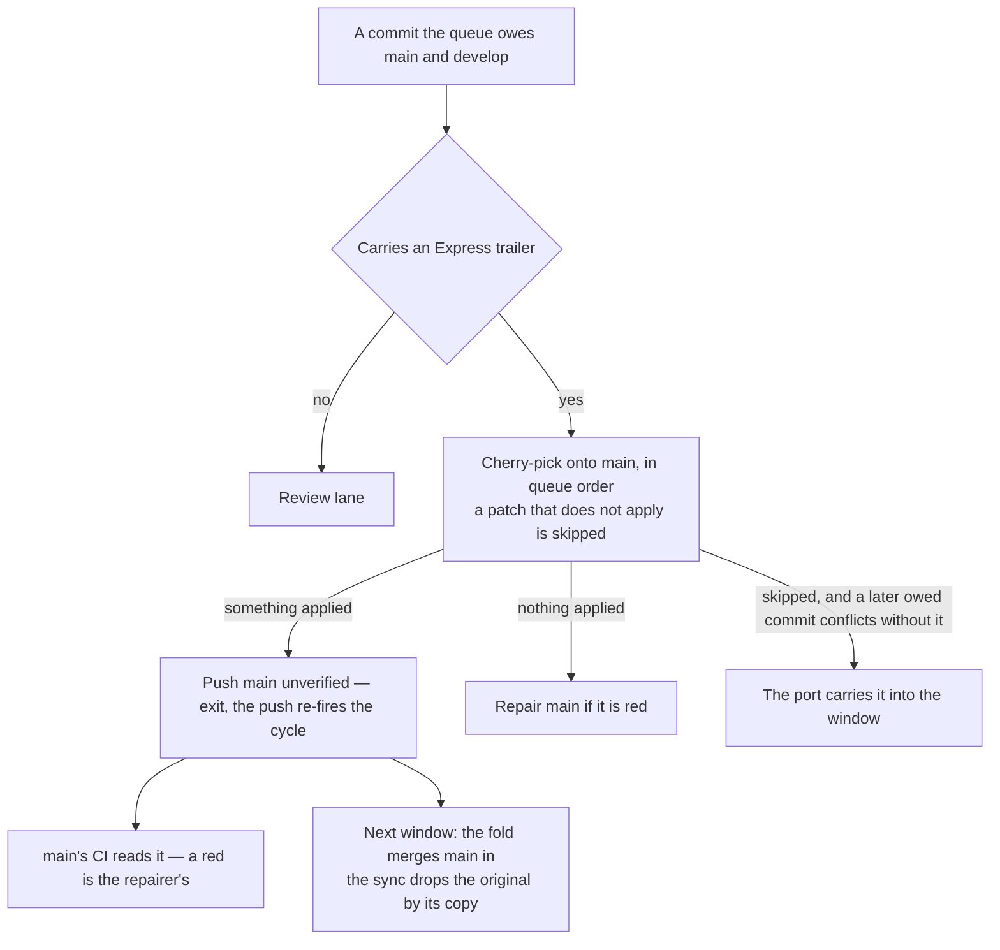

# Express Lane

A review window is budgeted in **files** and spent on **findings**. A folder sweep, a one-rule substitution across the tree, a regenerated corpus each invert that trade: the largest things the queue produces and the emptiest a reviewer reads. So a commit that claims nothing in it needs review never occupies a window — it is cherry-picked onto `main`, and the [fold](/docs/infra/review-collector/collection-cycle) carries `main` into the next window while the sync drops the original from the queue by the copy that names it.

## The claim

The claim is one trailer line, `Express: <one sentence on why nothing in it needs a reviewer>`, on a queue commit. Two hands write it:

- **The reshaper**, on the parts of an over-cap commit it judged need no review — the commit's author is asked for nothing ([sync](/docs/infra/review-collector/collection-cycle)).
- **A session**, on a commit it knows to be a sweep's moves or a format pass, which skips the reshaper's session outright.

A claim is never a proof, and nothing gates it. The cut is pushed to `main` as it applies, with no checks run on it: a gate there was a blocker with no end. A claimed commit that is red on its own is most often made green by the commit after it — the sweep's moves, then the import order the moves left behind — and that next commit cannot apply without the claimed one, so a verified cut held the claimed commit off `main` while the port held its fix off `develop`, forever. Unverified, the claimed commit lands, `main`'s own CI reads it, and a red it leaves is the [repair](/docs/infra/review-collector/repair)'s like any other red that lands on `main` unread. An intermediate red `main` is accepted; a stage that cannot resolve is not.

The cut goes first even over a red `main`, because a claimed commit may be the repair — a session's own, or a person's past the repairer's attempts — and it reaches `main` this way alone. Only a run with nothing to cut asks whether `main` is red.

## What the lane does not do

- **It does not preserve queue order.** A trailered commit stuck behind unported work is the one worth taking early; a commit whose patch needs an unported one cannot apply, so the cherry-pick refuses it and the lane moves on. A patch that lands proves only that it landed: a cut can apply over `main` and still fail typecheck on a line an unported predecessor changes — that red is `main`'s CI's to find and the repairer's to answer, and the release that carries the predecessor ends it.
- **It does not close while a window is in flight.** `main` moving under `develop` is the fold's case, and the fold always lands — the lockfile rebuilt, any other conflict the resolver's. A copy a window already carries is owed to neither branch, so it is never cut a second time.
- **It does not push twice in a run.** The push fires the cycle again; whatever else the run would have done waits for that event.
- **It does not let a claim hold what builds on it.** The port skips every trailered commit, so nothing behind one waits on it — until an owed commit cannot apply without the claimed commits ahead of it. Then the port picks those, then the commit, and the window carries them all: the claim bought a review exemption, never a place its dependents cannot reach. A claimed commit the window carries is owed to `develop` no longer, so the lane never cuts it too.

## Key files

| File                                                         | Role                                                                                         |
| :----------------------------------------------------------- | :------------------------------------------------------------------------------------------- |
| `scripts/src/services/coderabbit/collect/runExpressLane.ts`  | the lane as one step of the cycle — build and push, else repair                              |
| `scripts/src/services/coderabbit/collect/readClaimedShas.ts` | which owed commits claim the lane                                                            |
| `scripts/src/services/coderabbit/collect/readCherryShas.ts`  | what is owed at all — by patch id, and by no copy naming any identity the commit has carried |
| `scripts/src/services/coderabbit/collect/portExpress.ts`     | the candidate on `main`                                                                      |
| `scripts/src/services/coderabbit/collect/readTrailedShas.ts` | which of a set carry a trailer, in one read                                                  |

## Notes

- **Rejected: admitting a commit by a proof about its diff** — every file a byte-identical rename or an import-only edit, none at a path something reads by location. The proof admitted only what nobody needed judged, a clean sweep commit almost never happens in practice, and the lane it guarded closed whenever a window was in flight. Judgement about what needs review is the session's.
- **Rejected: verifying the cut before the push.** It was the lane's gate until a claimed commit red on its own, fixed by the unclaimed commit after it, held both lanes at once — the lane refused the one and the port could not apply the other. Every red `main` resolves through the repairer, so the gate bought nothing a later run does not.
- **The lane is measured in files it removes from a window, not in reviews it avoids.** CodeRabbit reads a pure rename and says nothing either way; what it buys is the budget that rename was occupying.
