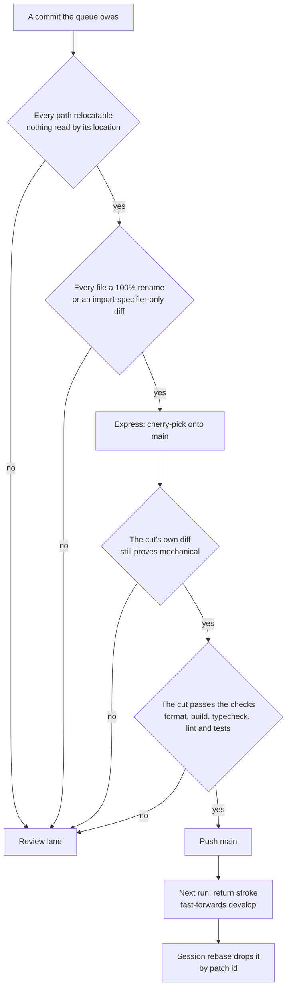

# Express Lane

A review window is budgeted in **files** and spent on **findings**. A folder sweep inverts that trade: it is the largest thing the queue produces and the emptiest thing a reviewer reads. So a commit that provably has nothing to comment on never occupies a window — it is cherry-picked onto `main`, and the [return stroke](/docs/infra/review-collector/collection-cycle) carries it to `develop` on the next run. Nothing else in the pipeline learns a new shape: `main` moving under `develop` is the dependency-bump case already handled, and the session's standing rebase drops a commit that reached `main` by patch id.

## What "nothing to review" means

The gate is a **proof about the diff**, never a claim about the commit message — a `refactor(` prefix has covered a snapshot repair and a `fix(` prefix a pure move. Each file is classified from what changed, with **one failing file sinking the whole commit**, since a window is cut at commit boundaries. A file passes when both halves hold:

- **Its content did not meaningfully change** — a rename git scores at full similarity, or a diff that is nothing but import specifiers pointing at a path that moved. Added and removed imports are compared as a sorted set with every quoted string blanked, because `perfectionist/sort-imports` re-sorts a repathed import among its neighbours, and each removed import must then pair with the added import it blanks to, the two naming the two ends of one rename the same range carries — a swap between two modules that both exist is a content change wearing an import's shape, and so is an import repointed from one rename's source to another rename's destination, which reads as followed on each side alone; a mode flip, a bare side-effect import whose position is its meaning, and a changed import attribute are each refused first.
- **Its location is not itself meaning.** The files that fail are the ones something reads by path: a loader finds a config by name, a migration's filename is its ordering, a docs page's folder is its status and a skill's is its ownership — and in the Nuxt app a page's path is its route, a component's its auto-import name, a server route's its URL and a public asset's the URL a template writes as a string, none of which an import edit shows or a typecheck fails on. A colocated test moving with its subject passes — where it sits claims nothing — which is the one place this parts company with the rule that refuses a test edit.

## What the lane does not do

- **It does not preserve queue order.** A mechanical commit stuck behind unported work is the one worth taking early; a commit whose parent is not on `main` yet cannot apply, so the cherry-pick refuses it and the lane moves on. Dependency is enforced by whether the patch lands, not by a rule.
- **It does not run while a window is in flight.** The lane is closed unless `develop` and `main` agree: a rename landing on one side of the merge an unreviewed window still owes is how a file arrives twice. A mechanical commit is never the urgent one, so waiting costs it nothing.
- **It is the one lane verified before the push.** `main` is production, and CI is the only gate these commits get, so the cut earns every check CI would fail it on — format, the package build, typecheck, both linters **and the tests**, since a relocation is exactly what a path-coupled test fails on. The app build alone is left to `main`'s own CI: it is the longest job there, and nothing a cut ships waits on it. A red cut takes the review lane, where a person reads why.
- **It does not trust the proof it selected with.** What ships is each patch replayed onto `main` and stacked with siblings taken out of order, so the proof is asked again of the cut's cumulative diff. A cut that fails takes the review lane whole.
- **It does not push twice in a run.** The push fires the cycle again, which fast-forwards `develop` and exits; the lane it opened waits for the event after that.

## What it costs a sweep

The lane only pays when the mechanical part of a sweep is **its own commit**: a sweep that bundles its moves with the repairs the finishing checks produced has one content change in it, and one is enough. That split is the `sweeps` skill's rule.

## Key files

| File                                                                      | Role                                                                 |
| :------------------------------------------------------------------------ | :------------------------------------------------------------------- |
| `scripts/src/services/coderabbit/collect/runExpressLane.ts`               | the lane as one step of the cycle — build, prove, verify, push       |
| `scripts/src/services/coderabbit/collect/portExpress.ts`                  | builds the candidate on `main` and decides whether the lane is open  |
| `scripts/src/services/coderabbit/exclusions/checkIsMechanicalRange.ts`    | the proof itself, asked of a commit to select and of the cut to push |
| `scripts/src/services/coderabbit/exclusions/checkIsMechanicalCommit.ts`   | that proof against one commit's first parent                         |
| `scripts/src/services/coderabbit/exclusions/checkIsRelocatablePath.ts`    | whether moving a file is itself a decision                           |
| `scripts/src/services/coderabbit/exclusions/checkIsImportPathOnlyDiff.ts` | whether a file's whole diff is imports following a move              |
| `scripts/src/services/coderabbit/exclusions/readMechanicalPaths.ts`       | the range read once — two git calls — and classified per file        |
| `scripts/src/services/coderabbit/exclusions/getFileDiffs.ts`              | the whole-range diff split per file, keyed by the rename pair        |

## Notes

- **A rename is invisible to a diff scoped to one path.** `git diff -- <newPath>` filters the counterpart out of the rename pair, so the range is diffed whole, once, and split per file on the header the rename pair predicts — the only reason a moved file that also repathed its own imports can be classified at all.
- **The lane is measured in files it removes from a window, not in reviews it avoids.** CodeRabbit reads a pure rename and says nothing either way; what it buys is the budget that rename was occupying.
