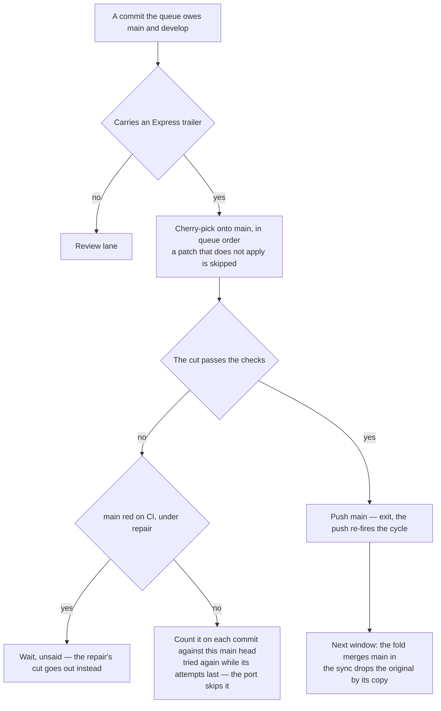

# Express Lane

A review window is budgeted in **files** and spent on **findings**. A folder sweep, a one-rule substitution across the tree, a regenerated corpus each invert that trade: the largest things the queue produces and the emptiest a reviewer reads. So a commit that claims nothing in it needs review never occupies a window — it is cherry-picked onto `main`, and the [fold](/docs/infra/review-collector/collection-cycle) carries `main` into the next window while the sync drops the original from the queue by the copy that names it.

## The claim

The claim is one trailer line, `Express: <one sentence on why nothing in it needs a reviewer>`, on a queue commit. Two hands write it:

- **The reshaper**, on the parts of an over-cap commit it judged need no review — the commit's author is asked for nothing ([sync](/docs/infra/review-collector/collection-cycle)).
- **A session**, on a commit it knows to be a sweep's moves or a format pass, which skips the reshaper's session outright.

A claim is never a proof. Nothing reads it as true, only as asked: what admits the commit to `main` is the checks — install, format, the package builds, typecheck, both linters and the tests (`EXPRESS_VERIFY_COMMANDS`) — run on the cut as it would land. A red cut takes no window either: it is counted on the commits it carried — against the `main` head it was checked on and the collector that checked it — and tried again while those attempts last. The checks answer the same for the same tree, so past the cap the cut waits for `main` to move or the collector to change, never for the next event: a red re-run on every queue push and every bot event was the whole suite spent, uncapped, on a red already known. The app build alone is left to `main`'s own CI: it is the longest job there, and nothing a cut ships waits on it. The checks run on `main`'s tree, so a red `main` refuses every cut for a red none of them made — which is why a red cut asks whether `main` itself is red before any commit is told: a red head under [repair](/docs/infra/review-collector/repair) is the collector's, the claimed commits wait unsaid, and the repair goes out as a cut of the lane's own. The cut still goes first, because a claimed commit may be the repair — a session's own, or a person's past the repairer's attempts — and it reaches `main` this way alone.

## What the lane does not do

- **It does not preserve queue order.** A trailered commit stuck behind unported work is the one worth taking early; a commit whose patch needs an unported one cannot apply, so the cherry-pick refuses it and the lane moves on. A patch that lands proves only that it landed: a cut can apply over `main` and still fail typecheck on a line an unported predecessor changes, which is the red the attempt cap and the head in its basis exist for — no ancestry check is made, and the cut is tried again once `main` carries more.
- **It does not close while a window is in flight.** `main` moving under `develop` is the fold's case, and the fold always lands — the lockfile rebuilt, any other conflict the resolver's. A copy a window already carries is owed to neither branch, so it is never cut a second time.
- **It does not push twice in a run.** The push fires the cycle again; whatever else the run would have done waits for that event.
- **It does not hand a claimed commit to a window.** The port skips every trailered commit, so nothing behind one waits on it. A cut the checks refuse is counted on each commit it carried against the `main` head it was checked on, tried again while the attempts against that head last, and again once `main` moves — a later commit reaching it may be what the cut needed — or the collector changes; past the cap against one head it waits uncut until then, and the person drops the trailer to have it reviewed, or repairs it. The third residual case; a red `main` past its [repairs](/docs/infra/review-collector/repair) is the fourth.

## Key files

| File                                                         | Role                                                                                         |
| :----------------------------------------------------------- | :------------------------------------------------------------------------------------------- |
| `scripts/src/services/coderabbit/collect/runExpressLane.ts`  | the lane as one step of the cycle — repair, build, verify, push                              |
| `scripts/src/services/coderabbit/collect/readClaimedShas.ts` | which owed commits claim the lane                                                            |
| `scripts/src/services/coderabbit/collect/readCherryShas.ts`  | what is owed at all — by patch id, and by no copy naming any identity the commit has carried |
| `scripts/src/services/coderabbit/collect/portExpress.ts`     | the candidate on `main`                                                                      |
| `scripts/src/services/coderabbit/collect/readTrailedShas.ts` | which of a set carry a trailer, in one read                                                  |

## Notes

- **Rejected: admitting a commit by a proof about its diff** — every file a byte-identical rename or an import-only edit, none at a path something reads by location. The proof admitted only what nobody needed judged, a clean sweep commit almost never happens in practice, and the lane it guarded closed whenever a window was in flight. Judgement about what needs review is the session's, and the checks are the gate either way.
- **The lane is measured in files it removes from a window, not in reviews it avoids.** CodeRabbit reads a pure rename and says nothing either way; what it buys is the budget that rename was occupying.
