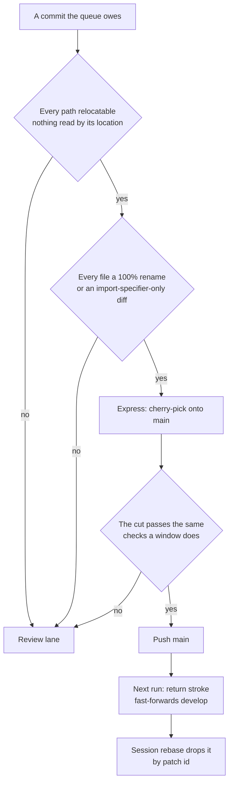

# Express Lane

A review window is budgeted in **files** and spent on **findings**. A folder sweep inverts that trade: it is the largest thing the queue produces and the emptiest thing a reviewer reads, so a single sweep commit can occupy most of a window and return nothing. The express lane is the answer — a commit that provably has nothing to comment on never occupies a window at all. It is cherry-picked onto `main`, and the [return stroke](/docs/infra/review-collector/collection-cycle) carries it to `develop` on the next run.

Nothing else in the pipeline learns a new shape. `main` moving under `develop` is already a case the collector handles, because a dependency bump does exactly that, and the session's standing rebase drops a commit that reached `main` by patch id without being told it went a different way.

## What "nothing to review" means

The gate is a **proof about the diff**, never a claim about the commit message. A `refactor(` prefix is the author's word for a change, and the same sweep that writes it also writes a snapshot repair; a `fix(` prefix has covered a pure move more than once. So the type is ignored and each file in the commit is classified from what actually changed, with **one failing file sinking the whole commit** — a window is cut at commit boundaries, and half a commit cannot skip a review.

A file passes when both halves hold.

**Its content did not meaningfully change** — it is either a rename git scores at 100% similarity, or its entire diff is import specifiers pointing at a path that moved. The second is what a sweep mostly produces, and reading it correctly is subtle: added and removed imports are compared as a **sorted set with every quoted string blanked**, because `perfectionist/sort-imports` re-sorts a repathed import among its neighbours and an in-place comparison would hold every such file for an order no reviewer decides. A mode flip, a bare side-effect import whose position is its meaning, and an import attribute that changed are each refused before that comparison runs.

**Its location is not itself meaning.** Most files answer this trivially — where a module sits is the sweep's subject rather than a claim about behaviour, and the colocated tests that move with it say no less, which is the one place this parts company with the exclusion rules that refuse a test edit outright. The files that fail are the ones something reads _by path_: a loader finds a config by name, a migration's filename is its ordering in the chain, a docs page's folder is its status and a skill's is its ownership. Moving one of those is a decision, so it takes the review lane and the sweep that moved it says why.

## What the lane does not do

**It does not preserve queue order, on purpose.** A mechanical commit stuck behind unported work is precisely the one worth taking early, and this is the whole answer to a fix that wants to jump the queue. Ordering is not something anyone maintains: a commit whose subject is not on `main` yet simply cannot apply, so the cherry-pick refuses it and the lane moves on. Dependency is enforced by whether the patch lands, which is a fact rather than a rule.

**It does not run while a window is in flight.** The lane is closed unless `develop` and `main` agree. An unreviewed window on `develop` still has to merge back into a `main` these commits have moved under it, and a rename landing on one side of that merge is how a file arrives twice. At rest there is no such merge to lose — and a mechanical commit is never the urgent one, so waiting for the quiet point costs it nothing.

**It does not skip the checks.** `main` is production: a push to it deploys the function app. CI is the only gate these commits get, so the cut earns the same `verifyCandidate` pass a window's cut does — build, typecheck, oxlint, ESLint. A red cut is not held back, it simply takes the review lane, where a person reads why.

**It does not push twice in a run.** The express push is one irreversible act, and the run exits on it. The push fires the cycle again, which fast-forwards `develop` onto the new `main` and only then measures a window, against a frontier that has already moved.

## What it costs a sweep

The lane only pays when the mechanical part of a sweep is **its own commit**. A sweep that bundles its moves with the repairs the finishing checks produced — a refreshed size snapshot, a ledger row — has one content change in it, and one is enough to sink the commit. That split is the `sweeps` skill's rule rather than this page's, and it is the same rule window composition already states for a different reason: the collector cuts at commit boundaries, so every boundary has to mean something.

## Key files

| File                                                                      | Role                                                                |
| :------------------------------------------------------------------------ | :------------------------------------------------------------------ |
| `scripts/src/services/coderabbit/collect/portExpress.ts`                  | builds the candidate on `main` and decides whether the lane is open |
| `scripts/src/services/coderabbit/exclusions/checkIsMechanicalCommit.ts`   | the per-commit proof                                                |
| `scripts/src/services/coderabbit/exclusions/checkIsRelocatablePath.ts`    | whether moving a file is itself a decision                          |
| `scripts/src/services/coderabbit/exclusions/checkIsImportPathOnlyDiff.ts` | whether a file's whole diff is imports following a move             |
| `scripts/src/services/coderabbit/exclusions/readMechanicalPaths.ts`       | the range read once — two git calls — and classified per file       |
| `scripts/src/services/coderabbit/exclusions/getFileDiffs.ts`              | the whole-range diff split per file, keyed by the rename pair       |

## Notes

- **A rename is invisible to a diff scoped to one path.** `git diff -- <newPath>` filters the counterpart out of the rename pair, so git has nothing to rename-detect against and reports the file as wholly new — and every classifier above then sees the entire content as added. So the range is diffed whole, once, and split per file on the header the rename pair predicts, which is the only reason the moved file that also repathed its own imports, the most common file in a sweep, can be classified at all — and why a commit costs two git calls rather than one per file. The manual exclusions command reads the same classification, for the same reason.
- **The lane is measured in files it removes from a window, not in reviews it avoids.** Avoiding a review is not the point; CodeRabbit reads a pure rename and says nothing either way. What it buys is the budget that rename was occupying, which is the scarce thing.
