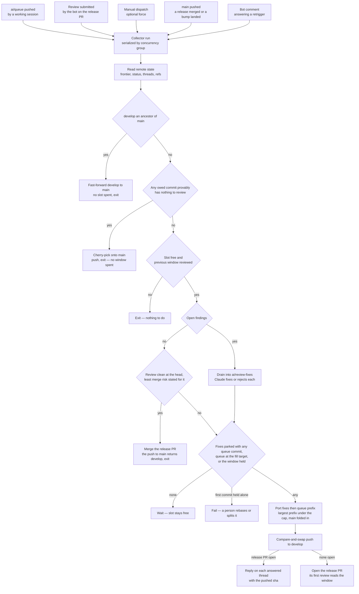

# Review Collector

Work is committed faster than CodeRabbit reviews complete, and every step that turns a finished review into the next one — fixing the findings, replying on each thread, sizing the next window, cutting it to the cap, pushing it — runs without a person at a keyboard. Local work is pushed to **one permanent `ai/queue` branch** with no window boundaries on it; the collector cuts the windows. It is the garbage collector of the review budget: allocation (the queue pushed) and freeing (a review completed) trigger the same run, the run reads every fact it needs from the remote, decides in one pass, and pushes at most one window. Re-running it against unchanged state does nothing, which is what lets any event fire it without a schedule.

## The parts

1. [The collection cycle](/docs/infra/review-collector/collection-cycle) — what the collector reads, the gates it clears, how it merges a release whose review is clean, ports the largest prefix of `ai/queue` under the cap, pushes, replies with the pushed sha, and opens the release pull request once a window is worth its first review. One script, `ai:coderabbit:collect`.
2. [The drain](/docs/infra/review-collector/drain) — the one step Claude runs: which findings are open, what the session is handed and denied, and how a drain that fails is quarantined.
3. [The runner](/docs/infra/review-collector/runner) — the workflow that fires the cycle, the credentials it holds, why it has no cron, and what a failed run leaves behind.
4. [Two writers](/docs/infra/review-collector/two-writers) — the ref ownership that lets a session and the collector work one pull request without racing.
5. [The express lane](/docs/infra/review-collector/express-lane) — the commits that never occupy a window, because a proof about their diff says there is nothing in them to comment on.

What the session does on its side — pushing `ai/queue`, rebasing, answering a finding by hand — is the `review-queue` skill (`.agents/skills/review-queue/SKILL.md`).

**The release merges itself.** A review that ends at `develop`'s head and left nothing open — no thread the bot spoke last on, no body-only findings, no unported commit still answering one — with the bot's least merge risk stated for that head is a release: the cycle merges the pull request to `main` as an administrator, without waiting on `develop`'s checks (the review is the gate, and a red check is one more commit in the next window). The return stroke then fast-forwards `develop` to `main`, the queue fills the next window from that merge base, and the cycle that pushes it opens the next pull request at the same fill target a push clears. A `main` that advanced on its own (a dependency bump) is folded into the next window as a merge commit. A person merges only a release whose risk the bot rates above the least, and closing the pull request without merging is their pause: the cycle opens nothing over it and waits for it to be re-opened.

## How it works

Every trigger runs the same cycle. Which event it was is irrelevant, because the cycle re-derives the whole situation from the remote and the gates decide what, if anything, is done.

Three properties make the picture safe to fire from anything:

- **All state is remote.** The frontier is read from review bodies, open findings from the threads, fixes awaiting a push from `ai/review-fixes`, which thread a fix answers from a trailer on the fix commit, and what the queue still owes from `git cherry` against the tree the fixes built. A second run sees exactly what the first saw plus whatever the first pushed.
- **One irreversible act per run** — the return stroke's fast-forward, the express lane's push to `main`, or the window's push to `develop` — and it is a compare-and-swap the remote performs: the push carries `--force-with-lease` on the sha every count was measured from, so a `develop` that moved is refused with nothing written and reported as an outcome the next run re-measures against. The lease makes the push forced, so the fast-forward is asserted before it — a non-descendant target is the porter's bug, and that one fails the run. Everything before the push is a local branch in the runner; everything after it is idempotent by predicate — a reply is posted only where the thread lacks one citing that sha, the pull request is opened only when none is open. Nothing is ever deleted.
- **The cap is measured on the tree that will be pushed,** never estimated: the porter cherry-picks one commit at a time and reads the file count from the frontier after each.

## Parameters

The review budget has one knob, the file cap, in `scripts/src/services/coderabbit/shared/constants.ts`; the fill target is a share of it. No prose restates either as a number — a test over the skill and these pages fails on one written back in. The collector's own values — branch names, trailer keys, the drain attempt cap, the check strings — sit in `scripts/src/services/coderabbit/collect/constants.ts`. The slot duration is not a parameter: an event-triggered collector runs the minute the slot frees.

## Key files

| File                                                  | Role                                                                                                                                     |
| :---------------------------------------------------- | :--------------------------------------------------------------------------------------------------------------------------------------- |
| `scripts/src/coderabbit/collect/index.ts`             | the entry point — `pnpm ai:coderabbit:collect [pr] [--dry-run] [--force]`                                                                |
| `scripts/src/services/coderabbit/collect/runCycle.ts` | the pass itself, which returns its verdict rather than exiting                                                                           |
| `scripts/src/services/coderabbit/collect`             | one service per step — gate, drain, port, express, the fold of `main`, reply — the git-touching ones proved against a fixture repository |
| `scripts/src/services/coderabbit/exclusions`          | the diff classifiers the express lane's proof runs                                                                                       |
| `scripts/src/models/coderabbit/collect`               | the inputs and outcomes the steps exchange                                                                                               |
| `.github/workflows/ReviewCollector.yaml`              | the runner's triggers, calling `run-review-collector.yaml` at `ai/queue`                                                                 |
| `scripts/src/services/coderabbit/shared/constants.ts` | the cap, and the fill target derived from it                                                                                             |
| `scripts/src/coderabbit/feedback/index.ts`            | the finding report, printed by hand and handed to the drain                                                                              |
| `.agents/skills/review-queue/SKILL.md`                | the session's side of the loop — pushing `ai/queue` and catching up after a window                                                       |

## Notes

- **One queue, not numbered bookmarks.** A bookmark per window would make a person decide where a window ends and remember to delete it afterwards; measuring does the first and the second stops existing.
- **Parking fixes trades finding freshness for a full slot.** A completed review with findings and an empty queue leaves the slot idle rather than spending it on a handful of fix files; the fixes wait on `ai/review-fixes` until the queue has anything at all, then lead that window. A manual dispatch with `force` pushes them alone when that is the wrong trade.
- **Claude does two things and no more:** decide whether each finding is real and write the fix or the rejection. Everything else is deterministic, tested TypeScript, so the expensive step is the only one that can be wrong in an interesting way and every other step can be dry-run locally against the live pull request.
- **An event that fires too often is the cheap failure;** the one this design refuses is an event that never fires. The bot's own replies arrive as reviews, several within seconds of a drain; the concurrency group serializes them and every one after the first exits at the gates.
- **Rejected: keeping the merge a person's act.** It was the one human step, and it was the step the pipeline idled behind: a clean review is the state with nothing left to weigh, and a person reading "no actionable comments" adds a delay, not a judgement. The judgement that remains — a merge risk above the least — is still theirs.
- **Rejected: waiting on `develop`'s checks before the merge.** The branch rules hold every check `develop` runs, and honouring them would need a trigger on their completion and a merge-state read; the review is the gate, a red check is a commit in the next window, and the merge is made as an administrator.
- **Rejected: reading the frontier off review bodies alone.** A review that finds nothing writes no review body — its range is stated only in the walkthrough's recent-review block — so a body-only frontier stalls on the best outcome a review can have, with the status saying `Review completed` for a head the frontier never reaches.
