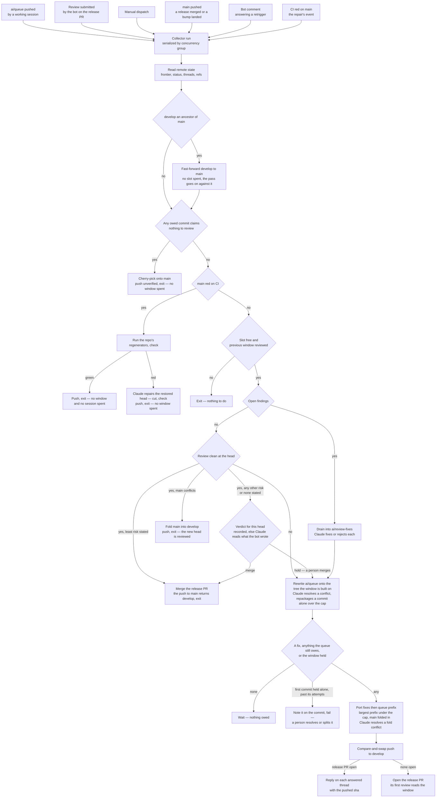

# Review Collector

Work is committed faster than CodeRabbit reviews complete, and every step that turns a finished review into the next one — fixing the findings, replying on each thread, sizing the next window, cutting it to the cap, pushing it — runs without a person at a keyboard. Local work is pushed to **one permanent `ai/queue` branch** with no window boundaries on it; the collector cuts the windows. It is the garbage collector of the review budget: allocation (the queue pushed) and freeing (a review completed) trigger the same run, the run reads every fact it needs from the remote, decides in one pass, and pushes at most one window. Re-running it against unchanged state does nothing, which is what lets any event fire it without a schedule.

## The parts

1. [The collection cycle](/docs/infra/review-collector/collection-cycle) — the one pass every trigger runs, from what it reads off the remote to the single push it ends at. One script, `ai:coderabbit:collect`.
2. [The drain](/docs/infra/review-collector/drain) — the first of the steps Claude runs: which findings are open, what the session is handed and denied, and how a drain that fails is quarantined. The resolver, the reshaper and the verdict are the same session pointed at other work.
3. [The runner](/docs/infra/review-collector/runner) — the workflow that fires the cycle, the credentials it holds, why it has no cron, and what a failed run leaves behind.
4. [Two writers](/docs/infra/review-collector/two-writers) — the ref ownership that lets a session and the collector work one pull request without racing.
5. [The express lane](/docs/infra/review-collector/express-lane) — the commits that never occupy a window, because they claim nothing in them needs review; they land on `main` unverified, and a red they leave is the repairer's.
6. [Repair](/docs/infra/review-collector/repair) — a red `main` answered from CI's own verdict by the repo's own regenerators where they answer it and by the same session where they do not, either way as a cut of the lane's own.

What the session does on its side — pushing `ai/queue`, rebasing, answering a finding by hand — is the `review-queue` skill (`.agents/skills/review-queue/SKILL.md`).

**The release merges itself.** A review at `develop`'s head that left nothing open is merged to `main` by the cycle — on the bot's least merge risk outright, on every other reading of that head, including none at all or a head the bot skipped reviewing, once the verdict has read what the bot did write against the tree and found nothing real left ([merge](/docs/infra/review-collector/collection-cycle)). A person merges only a release the verdict held, and closing the pull request without merging is their pause.

## Principles

- **Non-blocking.** A person is told, never waited on. Three cases remain theirs, each posted where it is read: a conflict or a reshaping that failed past its attempt cap, a release the verdict held, and a red `main` past its repairs — and only the first holds anything behind it.
- **Never blocked by what it carries.** A tree that fails — to install, to pass a check, to replay — is the red of the step working on it, never the run's. The runner installs only the collector's own projects, so no app's postinstall stands between an event and the cycle; a step's own install that fails is handed to its session as one more red to repair; and a session that fails counts its attempt, ends the run idle and wakes the next one a minute later, so a step failing for good reaches its cap and is routed around in minutes rather than on the next push. A run goes red only on the collector's own code, or on a first commit held for a person. **Rejected: a collector that never fails at all** — a broken collector would read as a quiet one, and nothing else reports it.
- **Zero-trust commit content.** A session commits anything, in any shape; nothing reads a message as a signal of what a diff is. The collector classifies diffs and rewrites packaging — a commit no window can carry is repackaged, never sent back. A trailer is a claim, never a proof — nothing gates the cut it buys, and `main`'s own CI is what reads it.
- **Judgement is the only thing Claude is paid for.** Six bounded entry points ([runner](/docs/infra/review-collector/runner)), and nothing a rule could decide reaches one of them; the tree or the remote proves every step afterwards.
- **The review is the gate, never CI.** A release merges on a clean review at the head and its verdict, whatever the checks say. What CI holds at that point is a snapshot a rename moved, a lint rule a sweep enabled, a bundle nobody rebuilt — trivia the bot has already read the cause of, and the [repair](/docs/infra/review-collector/repair) answers it on `main` from CI's own verdict. Waiting for green parks every release behind a repair no review is owed, which is the block this design exists to remove.
- **One irreversible act per run, compare-and-swapped** — below.

## How it works

Every trigger runs the same cycle. Which event it was is irrelevant, because the cycle re-derives the whole situation from the remote and the gates decide what, if anything, is done.

Three properties make the picture safe to fire from anything:

- **All state is remote.** The frontier is read from review bodies, open findings from the threads, fixes awaiting a push from `ai/review-fixes`, which thread a fix answers from a trailer on the fix commit, and what the queue still owes from `git cherry` against the tree the fixes built minus every commit a copy on `develop` or `main` names under any sha it has carried. A second run sees exactly what the first saw plus whatever the first pushed.
- **One irreversible act per run** — the express lane's push to `main`, the repair's, or the window's push to `develop` — and it is a compare-and-swap the remote performs, on the sha every count was measured from, so a branch that moved is refused with nothing written and the next run re-measures against it ([push](/docs/infra/review-collector/collection-cycle)). The return stroke's fast-forward is the one push that ends nothing: it spends no slot, a push to `develop` fires no run, and every count after it is measured against the head it made. Everything before the act is a local branch in the runner; everything after it is idempotent by predicate — a reply is posted only where the thread lacks one citing that sha, the pull request is opened only when none is open. Nothing is ever deleted.
- **The cap is measured on the tree that will be pushed,** never estimated: the porter cherry-picks one commit at a time and reads the file count from the frontier after each, on the pull request's own side of `main`.

## Parameters

The review budget has one knob, the file cap, in `scripts/src/services/coderabbit/shared/constants.ts` — read off the CodeRabbit plan the repository is on, so a trial starting or ending is one line naming the plan, live on the first cycle after it reaches `ai/queue`. No prose restates it as a number — a test over the skill and these pages fails on one written back in. There is no second knob beneath it: a window has no minimum size, because the port takes everything the queue owes and a small one is all there was. The collector's own values — branch names, trailer keys, the drain attempt cap, the check strings — sit in `scripts/src/services/coderabbit/collect/constants.ts`. Neither the slot duration nor the plan's hourly review count is a parameter: an event-triggered collector runs the minute a review completes, and a rate limit is waited out to the deadline the bot states.

## Key files

| File                                                  | Role                                                                                                                                                                        |
| :---------------------------------------------------- | :-------------------------------------------------------------------------------------------------------------------------------------------------------------------------- |
| `scripts/src/coderabbit/collect/index.ts`             | the entry point — `pnpm ai:coderabbit:collect [pr] [--dry-run]`                                                                                                             |
| `scripts/src/services/coderabbit/collect/runCycle.ts` | the pass itself, which returns its verdict rather than exiting                                                                                                              |
| `scripts/src/services/coderabbit/collect`             | one service per step — gate, drain, verdict, sync and reshape, port, express, repair, the fold of `main`, reply — the git-touching ones proved against a fixture repository |
| `scripts/src/models/coderabbit/collect`               | the inputs and outcomes the steps exchange                                                                                                                                  |
| `.github/workflows/ReviewCollector.yaml`              | the runner's triggers, calling `run-review-collector.yaml` at `ai/queue`                                                                                                    |
| `scripts/src/services/coderabbit/shared/constants.ts` | the file cap — the one knob of the review budget                                                                                                                            |
| `scripts/src/coderabbit/feedback/index.ts`            | the finding report, printed by hand and handed to the drain                                                                                                                 |
| `.agents/skills/review-queue/SKILL.md`                | the session's side of the loop — pushing `ai/queue` and catching up after a window                                                                                          |

## Notes

- **One queue, not numbered bookmarks.** A bookmark per window would make a person decide where a window ends and remember to delete it afterwards; measuring does the first and the second stops existing.
- **Fixes go out the moment they are drained, alone if need be.** The review they answer is the one the release waits on, and a limit refusing it is an event the retrigger answers. **Rejected: parking fixes until the queue owes a commit**, to save the slot for a fuller window — the only case it changed was the empty queue, where it parked them for good: the release unmergeable over findings already fixed while the slot sat idle, and the `force` dispatch that unparked them a person's job. **Rejected: parking with a deadline** — a timer and a second retrigger reason for a saving the retrigger already makes free.
- **Claude judges and never decides alone:** whether a finding is real, how a conflict resolves, what in an over-cap commit needs a reviewer, whether a risk rationale names anything left. Every answer is proved by TypeScript afterwards — a clean tree, a complete sequence, an identical tree, a recorded verdict — so the expensive steps are the only ones that can be wrong in an interesting way, and every other step can be dry-run locally against the live pull request.
- **An event that fires too often is the cheap failure;** the one this design refuses is an event that never fires. The bot's own replies arrive as reviews, several within seconds of a drain; the concurrency group serializes them and every one after the first exits at the gates.
- **Rejected: replacing the bot — reviews bought past the plan's included ones, or a Claude review of every push in CI.** The design maximises what the plan's included reviews cover, with the file cap and the hourly slot as its levers; every mechanism here is the price of a review the plan already pays for, and either alternative spends on every push where the drain spends only on findings.
- **Rejected: waiting on `develop`'s checks before the merge.** Honouring the branch rules would need a trigger on their completion and a merge-state read, for a gate the review already is — so the merge is made as an administrator instead.
- **Rejected: reading the frontier off review bodies alone.** A review that finds nothing writes no review body — its range is stated only in the walkthrough's recent-review block — so a body-only frontier stalls on the best outcome a review can have, with the status saying `Review completed` for a head the frontier never reaches.
