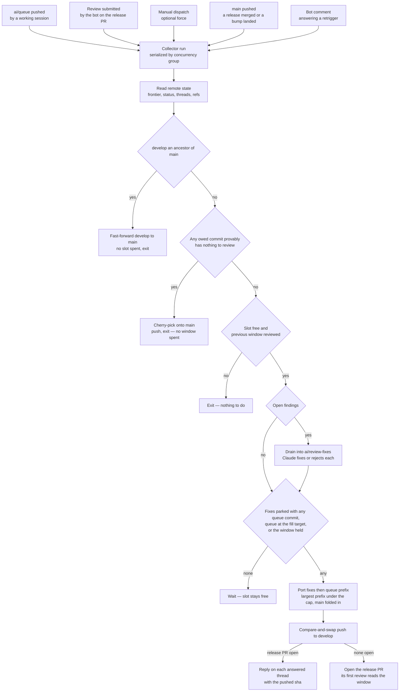

# Review Collector

Work is committed faster than CodeRabbit reviews complete, and every step that turns a finished review into the next one — fixing the findings, replying on each thread, sizing the next window, cutting it to the cap, pushing it — runs without a person at a keyboard. A slot never idles because no session is open: a review completes, its findings are answered, and the next window is pushed the minute the slot frees.

Local work is pushed to **one permanent `ai/queue` branch** with no window boundaries on it at all; the collector cuts the windows. It is the garbage collector of the review budget: allocation (the queue pushed) and freeing (a review completed) both trigger the same run, the run reads every fact it needs from the remote, decides in one pass, and pushes at most one window. Re-running it against unchanged state does nothing, which is what lets any event fire it without a schedule.

## The parts

The pipelining rules are prose in the `coderabbit` skill, and the one command left under `scripts/src/coderabbit/` beside the collector reads the facts it turns on — every open finding across the three endpoints (`feedback`). The collector composes the rest into one cycle that runs without a person, in five self-contained parts:

1. [The collection cycle](/docs/infra/review-collector/collection-cycle) — the state the collector reads, the gates it must clear, how it ports the largest prefix of `ai/queue` under the cap, pushes, replies with the pushed sha, and opens the release pull request once a window is worth its first review. One script, `ai:coderabbit:collect`.
2. [The drain](/docs/infra/review-collector/drain) — the one step Claude runs: which findings are open, what the session is handed and denied, and how a drain that fails is quarantined rather than retried forever.
3. [The runner](/docs/infra/review-collector/runner) — the workflow that fires the cycle from the allocation and free events, the credentials it holds, why it has no cron, and what a failed run leaves behind.
4. [Two writers](/docs/infra/review-collector/two-writers) — the ref ownership that lets a human session and the collector work the same pull request without racing: the collector alone writes `develop` and `ai/review-fixes`, the session alone writes `ai/queue`.
5. [The express lane](/docs/infra/review-collector/express-lane) — the commits that never occupy a window at all, because a proof about their diff says there is nothing in them to comment on.

**One act stays human:** merging the release pull request to `main`, which is a production release. Everything after it is the collector's — the return stroke fast-forwards `develop` to `main`, the queue fills the next window from that merge base, and the cycle that pushes it opens the next pull request, at the same fill target a push clears, so no pull request is ever opened on a handful of files. A `main` that advanced on its own (a dependency bump) is folded into the next window as a merge commit so it rides a slot that was being spent anyway. Closing the pull request without merging is a person's pause, not a window that filled: the cycle opens nothing over it and waits for it to be re-opened — the workflow can also be disabled outright, as the `coderabbit` skill's pipelining page says.

## How it works

Every trigger runs the same cycle. The trigger only says _something changed_ — which event it was is irrelevant, because the cycle re-derives the whole situation from the remote and the gates decide what, if anything, is done.

Three properties make the picture safe to fire from anything:

- **All state is remote.** The runner is ephemeral, so nothing it learns survives a run: the frontier is read from review bodies, open findings from the threads, fixes awaiting a push from the `ai/review-fixes` branch, which thread a fix answers from a trailer on the fix commit itself, and what the queue still owes from `git cherry` against the tree the fixes built. A second run sees exactly what the first saw plus whatever the first pushed.
- **One irreversible act per run** — the return stroke's fast-forward of `develop`, the express lane's push to `main`, or the window's push to `develop`, never two — and it is a compare-and-swap the remote performs: the push carries `--force-with-lease` on the sha every count was measured from, so a `develop` that moved is refused with nothing written and the run reports it as an outcome the next one re-measures against, rather than failing the job over a concurrent update the picture is built to absorb. The lease is what makes the push forced, so the fast-forward git used to refuse for free is asserted before it instead — a target that is not a descendant of the sha it was built on is the porter's bug, and that one does fail the run. Everything before the push is a local branch in the runner, and everything after it is idempotent by predicate — a reply is posted only where the thread lacks one citing that sha. Opening the release pull request after a push is a second write, but a predicate-guarded one like a reply — no pull request open and `develop` at the target — so a run that dies between the two is finished by the next. Nothing is ever deleted: `ai/review-fixes` is re-created from `develop` by the next drain once it owes nothing, and what `ai/queue` still owes is a `git cherry` away.
- **The cap is measured on the tree that will be pushed,** never estimated. The porter builds the candidate branch one cherry-pick at a time and reads the file count from the frontier after each, so fixes, ported commits and a queue rebased by nobody all count exactly once.

## Parameters

The review budget has one knob, the file cap, in `scripts/src/services/coderabbit/shared/constants.ts`; the fill target is a share of it, so moving the cap moves everything sized in files. No prose restates either as a number — a page says "the cap" and cites that file, and a test over the skill and these pages fails on a number written back in, because a number in prose drifts silently when the constant moves. The collector's own values — the branch names it owns, the trailer keys, the drain attempt cap, the check strings — sit beside its services in `scripts/src/services/coderabbit/collect/constants.ts`. The slot duration is not a parameter at all: an event-triggered collector runs the minute the slot frees, so it is a property of the reviewer, not a number anything here waits on. The cap moves with the Open Source tier's popularity scaling, and the bot's skip comment states the current one.

## Key files

| File                                                  | Role                                                                                                |
| :---------------------------------------------------- | :-------------------------------------------------------------------------------------------------- |
| `scripts/src/coderabbit/collect/index.ts`             | the entry point — `pnpm ai:coderabbit:collect [pr] [--dry-run] [--force]`                           |
| `scripts/src/services/coderabbit/collect/runCycle.ts` | the pass itself, which returns its verdict rather than exiting                                      |
| `scripts/src/services/coderabbit/collect`             | one service per step — gate, drain, port, express, the fold of `main`, reply                        |
| `scripts/src/services/coderabbit/exclusions`          | the diff classifiers the express lane's proof and the manual exclusions command share               |
| `scripts/src/models/coderabbit/collect`               | the inputs and outcomes the steps exchange — the gate decision, the port result, the drain input    |
| `.github/workflows/ReviewCollector.yaml`              | the runner's triggers, calling `run-review-collector.yaml` at `ai/queue` — the runner page says why |
| `scripts/src/services/coderabbit/shared/constants.ts` | the cap, and the fill target derived from it                                                        |
| `scripts/src/coderabbit/feedback/index.ts`            | the finding report, printed here and handed to the drain                                            |
| `.github/workflows/claude-warmup.yaml`                | the headless Claude Code invocation the runner copies                                               |
| `.github/actions/trust-workspace`                     | the trust-dialog shim the warmup and the runner share                                               |
| `.agents/skills/coderabbit/references/pipelining.md`  | the human side of the loop — pushing `ai/queue` and catching up after a window                      |

## Notes

- **One queue, not numbered bookmarks.** A bookmark per window would make a person decide where a window ends and remember to delete it afterwards. The first is what the collector does by measuring, and the second stops existing. `ai/queue` is the session's own checked-out branch, pushed after every commit, carrying every unported commit in the order they were authored, so the session's only job is to push it, and what it still owes is a `git cherry` away rather than a ref to be maintained.
- **Parking fixes trades finding freshness for a full slot.** A completed review with findings and an empty queue leaves the slot idle rather than spending it on a handful of fix files; the fixes wait on `ai/review-fixes` until the queue has anything at all, and then lead that window. Any queue content is enough once fixes are parked — the fixes are what the window is for, and the findings age by exactly the time until the next commit lands, which under a standing sweep is minutes. A queue whose first commit is held counts too: it is blocked rather than empty, and the fixes landing is what unblocks it, so they go out alone. A manual dispatch with `force` pushes them alone when that is the wrong trade.
- **Claude does two things and no more:** decide whether each finding is real and write the fix or the rejection. Reading state, gating, porting, pushing, replying and opening are deterministic and stay in tested TypeScript, so the expensive step is the only one that can be wrong in an interesting way, and every other step can be dry-run locally against the live pull request.
- **The bot's own replies arrive as reviews.** A `pull_request_review` event is not one per run: CodeRabbit submits a review each time it answers a batch of replies, so several fire within seconds of a drain. The concurrency group serializes them and every one after the first exits at the gates. An event that fires too often is the cheap failure; the one this design refuses is an event that never fires.
