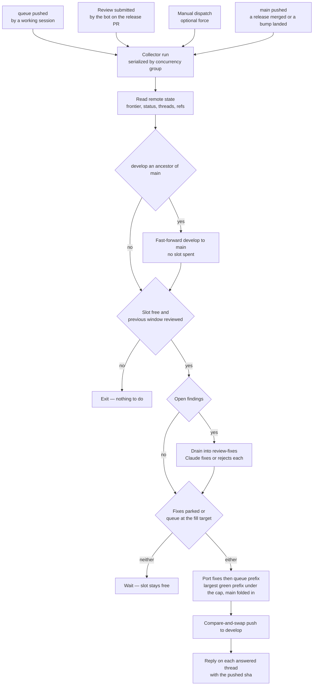

# Review Collector

Work is committed faster than CodeRabbit reviews complete, and every step that turns a finished review into the next one — fixing the findings, replying on each thread, sizing the next window, cutting it to the cap so its head is green, pushing it — runs without a person at a keyboard. A slot never idles because no session is open: a review completes, its findings are answered, and the next window is pushed the minute the slot frees.

Local work is pushed to **one permanent `queue` branch** with no window boundaries on it at all; the collector cuts the windows. It is the garbage collector of the review budget: allocation (the queue pushed) and freeing (a review completed) both trigger the same run, the run reads every fact it needs from the remote, decides in one pass, and pushes at most one window. Re-running it against unchanged state does nothing, which is what lets any event fire it without a schedule.

## The parts

The pipelining rules are prose in the `coderabbit` skill, and the commands under `scripts/src/coderabbit/` read the facts they turn on — the reviewed frontier and the window size (`window`), every open finding across the three endpoints (`feedback`), whether the checkpoint covers the head (`probe`, which a session runs by hand). The collector composes them into one cycle that runs without a person, in three self-contained parts:

1. [The collection cycle](/docs/infra/review-collector/collection-cycle) — the state the collector reads, the gates it must clear, how it drains findings into a parked `review-fixes` branch, ports the largest green prefix of `queue` under the cap, pushes and replies with the pushed sha. One script, `ai:coderabbit:collect`, with Claude invoked for exactly one step.
2. [The runner](/docs/infra/review-collector/runner) — the workflow that fires the cycle from the allocation and free events, the credentials it holds, why it has no cron, and what a failed run leaves behind.
3. [Two writers](/docs/infra/review-collector/two-writers) — the ref ownership that lets a human session and the collector work the same pull request without racing: the collector alone writes `develop` and `review-fixes`, the session alone writes `queue`.

**Two acts stay human:** merging the release pull request to `main` is a production release, and so is re-opening the pull request after a merge, since that spends a slot the skill says is always asked for. What happens right after the merge is the collector's — the return stroke: a push to `main` runs the cycle, which fast-forwards `develop` to `main` when `develop` is its ancestor, and a `main` that advanced on its own (a dependency bump) is folded into the next window as a merge commit so it rides a slot that was being spent anyway. The collector exits when it finds no open `develop` → `main` pull request.

## How it works

Every trigger runs the same cycle. The trigger only says _something changed_ — which event it was is irrelevant, because the cycle re-derives the whole situation from the remote and the gates decide what, if anything, is done.

Three properties make the picture safe to fire from anything:

- **All state is remote.** The runner is ephemeral, so nothing it learns survives a run: the frontier is read from review bodies, open findings from the threads, fixes awaiting a push from the `review-fixes` branch, which thread a fix answers from a trailer on the fix commit itself, and what the queue still owes from `git cherry` against `develop`. A second run sees exactly what the first saw plus whatever the first pushed.
- **One irreversible act per run,** the push to `develop`, and it is a compare-and-swap: a non-fast-forward push is refused, so a `develop` that moved between the read and the push fails the run rather than clobbering anything. Everything before it is a local branch in the runner, and everything after it is idempotent by predicate — a reply is posted only where the thread lacks one citing that sha. Nothing is ever deleted: `review-fixes` is re-created from `develop` by the next drain once it owes nothing, and what `queue` still owes is a `git cherry` away.
- **The cap is measured on the tree that will be pushed,** never estimated. The porter builds the candidate branch one cherry-pick at a time and reads the file count from the frontier after each, so fixes, ported commits and a queue rebased by nobody all count exactly once.

## Parameters

The cap and the fill target live where the CodeRabbit tooling declares its shared values, `scripts/src/services/coderabbit/constants.ts`; the collector's own — the branch names it owns, the trailer keys, the retry and attempt caps, the check and probe strings — sit beside its services in `scripts/src/services/coderabbit/collect/constants.ts`. The slot duration is not a parameter at all: an event-triggered collector runs the minute the slot frees, so the hour is a property of the reviewer, not a number anything here waits on. The cap moves with the Open Source tier's popularity scaling, and the bot's skip comment states the current one, which is why it is a constant to read rather than a number to write here.

## Key files

| File                                                 | Role                                                                                             |
| :--------------------------------------------------- | :----------------------------------------------------------------------------------------------- |
| `scripts/src/coderabbit/collect/index.ts`            | the cycle — `pnpm ai:coderabbit:collect [pr] [--dry-run] [--force]`                              |
| `scripts/src/services/coderabbit/collect`            | one service per step — gate, drain, port, the fold of `main`, verify, reply — and the constants  |
| `scripts/src/models/coderabbit/collect`              | the inputs and outcomes the steps exchange — the gate decision, the port result, the drain input |
| `.github/workflows/ReviewCollector.yaml`             | the runner                                                                                       |
| `scripts/src/services/coderabbit/constants.ts`       | the cap and the fill target                                                                      |
| `scripts/src/coderabbit/window/index.ts`             | the frontier and window-size read the gates reuse                                                |
| `scripts/src/coderabbit/feedback/index.ts`           | the finding read the drain step feeds to Claude                                                  |
| `scripts/src/coderabbit/probe/index.ts`              | the checkpoint probe a session runs by hand to ask the bot to take the head                      |
| `.github/workflows/claude-warmup.yaml`               | the headless Claude Code invocation and trust-dialog shim the runner copies                      |
| `.agents/skills/coderabbit/references/pipelining.md` | the human side of the loop — pushing `queue` and catching up after a window                      |

## Notes

- **One queue, not numbered bookmarks.** A bookmark per window would make a person decide where a window ends and remember to delete it afterwards. The first is what the collector does by measuring, and the second stops existing. `queue` is the session's own checked-out branch, pushed after every commit, carrying every unported commit in the order they were authored, so the session's only job is to push it, and what it still owes is a `git cherry` away rather than a ref to be maintained.
- **Parking fixes trades finding freshness for a full slot.** A completed review with findings and an empty queue leaves the slot idle rather than spending it on a handful of fix files; the fixes wait on `review-fixes` until the queue has anything at all, and then lead that window. Any queue content is enough once fixes are parked — the fixes are what the window is for, and the findings age by exactly the time until the next commit lands, which under a standing sweep is minutes. A manual dispatch with `force` pushes them alone when that is the wrong trade.
- **Claude does two things and no more:** decide whether each finding is real and write the fix or the rejection. Reading state, gating, porting, pushing and replying are deterministic and stay in tested TypeScript, so the expensive step is the only one that can be wrong in an interesting way, and every other step can be dry-run locally against the live pull request.
- **The bot's own replies arrive as reviews.** A `pull_request_review` event is not one per run: CodeRabbit submits a review each time it answers a batch of replies, so several fire within seconds of a drain. The concurrency group serializes them and every one after the first exits at the gates. An event that fires too often is the cheap failure; the one this design refuses is an event that never fires.
