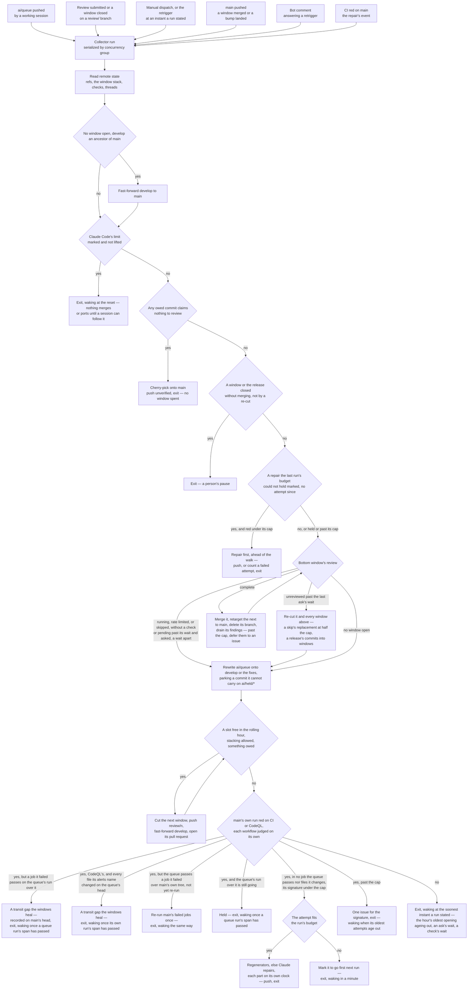

# Review Collector

Work is committed faster than CodeRabbit reviews complete, and every step that turns a finished review into the next one — merging the bottom window, fixing its findings, replying on each thread, sizing the next window, cutting it to the cap, pushing it and opening its pull request — runs without a person at a keyboard. Local work is pushed to **one permanent `ai/queue` branch** with no window boundaries on it; the collector cuts the windows. Each window is its own branch and its own pull request, and the open ones stack: each is based on the window below it, so a review reads only what its window adds. The collector is the garbage collector of the review budget: allocation (the queue pushed) and freeing (a review completed) trigger the same run, the run reads every fact it needs from the remote, decides in one pass, and pushes what it cut. Re-running it against unchanged state does nothing, which is what lets any event fire it without a schedule.

## The parts

1. [The collection cycle](/docs/infra/review-collector/collection-cycle) — the one pass every trigger runs, from what it reads off the remote to the pushes it ends at: the walk of the stack, the sync, and the opening of the next window. One script, `ai:coderabbit:collect`.
2. [The drain](/docs/infra/review-collector/drain) — the step Claude runs after each merge: which findings of the merged window are open, what the session is handed and denied, whether a fix may go to a haiku subagent, and how a drain that fails past its attempts defers what is left to one issue so the walk goes on. The resolvers, the reshaper and the repairer are the same session pointed at other work.
3. [The runner](/docs/infra/review-collector/runner) — the workflow that fires the cycle, the filters that name the window branches, the credentials it holds, why it has no cron, and what a failed run leaves behind.
4. [Two writers](/docs/infra/review-collector/two-writers) — the ref ownership that lets a session and the collector work one stack without racing: the collector writes `develop` and each window branch, the session writes `ai/queue`.
5. [The express lane](/docs/infra/review-collector/express-lane) — the commits that never occupy a window, because they claim nothing in them needs review; they land on `main` unverified, and a red they leave is the repairer's.
6. [Repair](/docs/infra/review-collector/repair) — a red `main` answered from CI's own verdict by the repo's own regenerators where they answer it and by the same session where they do not, either way as a cut of its own, last in the pass so no window waits on it — first in the run after one the run's budget could not hold; a red the queue already passes — or a CodeQL red whose every alerted file the queue already changes — is a transit gap its windows heal, and spends nothing, and one it passes over `main`'s own tree is a flake whose failed jobs run again once.
7. [Realign](/docs/infra/review-collector/realign) — the queue rebased onto `develop` on request, when a hand repair outside the collector has left its diff counting files the base already holds.

What the session does on its side — pushing `ai/queue`, rebasing, answering a finding by hand — is the `review-queue` skill (`.agents/skills/review-queue/SKILL.md`).

**One review per window, and the windows stack.** Each window is reviewed once, when its pull request opens, and that review reads only what the window adds on top of the window below it. The open windows form a stack from `main` upward. The bottom one merges the moment its review completes and a session could drain it, and the next one moves to the bottom and follows. Why nothing is fixed on its own pull request, and where its findings go instead, is [gate and merge](/docs/infra/review-collector/collection-cycle). How many windows may open in an hour, and how the next one is opened, is the opening section of the [collection cycle](/docs/infra/review-collector/collection-cycle). No incremental review is trusted, because none is ever asked for. Closing a window's pull request, or the release from `develop`, without merging is a person's pause.

## Principles

- **Non-blocking.** A person is told, never waited on. Whatever a session could not finish past its attempts becomes an issue labelled for an agent, and none holds what is behind it: a commit no window can carry, or that claims the express lane and never applies to `main`, is parked on its own held branch, `ai/held/<short-sha>`, with one issue, and re-landed by the collector itself — tried on the next run at the `main` head it was parked at, then at every later one and again after a lengthening wait at one that does not move, up to its attempts, and let go for the paths that parked it to try again while the queue still holds it — an express claim once, after which its copy without the claim takes its place in the queue for a window to carry; a drain's findings left open are each deferred with a reply, one issue listing them; and a red `main` whose failure signature is past its repairs gets one issue while the repairer stops on that signature. A window the bot keeps skipping is cut again smaller rather than held, one whose rate limit leaves every ask unanswered is cut again, and so is a window off the stack's chain of bases; a release from `develop` the bot keeps skipping is closed and its commits cut into windows. The little that still needs a person is listed under the [runner](/docs/infra/review-collector/runner)'s failure semantics.
- **Never blocked by what it carries.** A tree that fails — to install, to pass a check, to replay — is the red of the step working on it, never the run's. The runner installs only the collector's own projects, so no app's postinstall stands between an event and the cycle; a step's own install that fails is handed to its session as one more red to repair; and a session that fails, or runs past its wall clock, counts its attempt, ends the run idle and wakes the next one a minute later, while one that never started counts nothing and wakes it five minutes later, so a step failing for good reaches its cap and is routed around in minutes rather than on the next push. A GitHub outage met mid-pass ends the run idle the same way. A run stops before any session that could end past its budget, so none meets its job's timeout, and a run that fails red or is killed anyway is woken five minutes later by the runner's guard, unless its newest runs all died at one step on one error line, which gets one issue in place of a wake. A run goes red only on the collector's own code, or on what stops it before the cycle starts — an outage or a dead token at its checkout — as the [runner](/docs/infra/review-collector/runner)'s failure semantics set out. **Rejected: a collector that never fails at all** — a broken collector would read as a quiet one, and nothing else reports it. **Rejected: capping the outage retries**, so a server error GitHub gives the same request every time — a GraphQL query timing out answers 502 — reaches a person as red. The cap would be a count, a marker to keep it in and the tests holding both, all to save runner minutes a public repository is never billed for, and a run held on one still names the error as its idle reason in the Actions tab every five minutes.
- **Zero-trust commit content.** A session commits anything, in any shape; nothing reads a message as a signal of what a diff is. The collector classifies diffs and rewrites packaging — a commit no window can carry is repackaged, and past the reshaper's attempts parked, never sent back. A trailer is a claim, never a proof — nothing gates the cut it buys, and `main`'s own CI is what reads it.
- **Judgement is the only thing Claude is paid for.** Five bounded entry points ([runner](/docs/infra/review-collector/runner)), and nothing a rule could decide reaches one of them; the tree or the remote proves every step afterwards.
- **The review is the gate, never CI.** A window merges on its completed review, whatever the checks say. What CI holds at that point is a snapshot a rename moved, a lint rule a sweep enabled, a bundle nobody rebuilt — trivia the bot has already read the cause of, and the [repair](/docs/infra/review-collector/repair) answers it on `main` from CI's own verdict. Waiting for green parks every window behind a repair no review is owed, which is the block this design exists to remove.
- **Each irreversible act is compare-and-swapped** — below.

## How it works

Every trigger runs the same cycle. Which event it was is irrelevant, because the cycle re-derives the whole situation from the remote and the gates decide what, if anything, is done.

```mermaid
flowchart TD
  A[ai/queue pushed<br/>by a working session] --> C
  F[Review submitted or a window closed<br/>on a review/ branch] --> C
  D[Manual dispatch, or the retrigger<br/>at an instant a run stated] --> C
  MN[main pushed<br/>a window merged or a bump landed] --> C
  CM[Bot comment<br/>answering a retrigger] --> C
  CI[CI red on main<br/>the repair's event] --> C
  C[Collector run<br/>serialized by concurrency group] --> R[Read remote state<br/>refs, the window stack, checks, threads]
  R --> RS{No window open, develop an ancestor of main}
  RS -->|yes| FF[Fast-forward develop to main]
  RS -->|no| LM
  FF --> LM{Claude Code's limit<br/>marked and not lifted}
  LM -->|yes| LX[Exit, waking at the reset — nothing merges<br/>or ports until a session can follow it]
  LM -->|no| E{Any owed commit claims<br/>nothing to review}
  E -->|yes| EP[Cherry-pick onto main<br/>push unverified, exit — no window spent]
  E -->|no| CL{A window or the release closed<br/>without merging, not by a re-cut}
  CL -->|yes| PZ[Exit — a person's pause]
  CL -->|no| RF{A repair the last run's budget<br/>could not hold marked, no attempt since}
  RF -->|yes, and red under its cap| RP[Repair first, ahead of the walk —<br/>push, or count a failed attempt, exit]
  RF -->|no, or held or past its cap| BW{Bottom window's review}
  BW -->|running, rate limited, or skipped, without a check<br/>or pending past its wait and asked, a wait apart| SY
  BW -->|unreviewed past the last ask's wait| RC[Re-cut it and every window above —<br/>a skip's replacement at half the cap,<br/>a release's commits into windows] --> SY
  BW -->|complete| MG[Merge it, retarget the next to main, delete its branch,<br/>drain its findings — past the cap, defer them to an issue] --> BW
  BW -->|no window open| SY
  SY[Rewrite ai/queue onto develop or the fixes,<br/>parking a commit it cannot carry on ai/held/*] --> OB{A slot free in the rolling hour,<br/>stacking allowed, something owed}
  OB -->|yes| W[Cut the next window, push review/n,<br/>fast-forward develop, open its pull request] --> OB
  OB -->|no| MR{main's own run red on CI or CodeQL,<br/>each workflow judged on its own}
  MR -->|yes, but a job it failed passes on the queue's run over it| TG[A transit gap the windows heal —<br/>recorded on main's head, exit, waking once a queue run's span has passed]
  MR -->|yes, CodeQL's, and every file its alerts name<br/>changed on the queue's head| TC[A transit gap the windows heal —<br/>exit, waking once its own run's span has passed]
  MR -->|yes, but the queue passes a job it failed<br/>over main's own tree, not yet re-run| RR[Re-run main's failed jobs once —<br/>exit, waking the same way]
  MR -->|yes, and the queue's run over it is still going| HD[Held — exit, waking once a queue run's span has passed]
  MR -->|yes, in no job the queue passes nor files it changes,<br/>its signature under the cap| RB{The attempt fits<br/>the run's budget}
  RB -->|yes| RG[Regenerators, else Claude repairs,<br/>each part on its own clock — push, exit]
  RB -->|no| MK[Mark it to go first next run —<br/>exit, waking in a minute]
  MR -->|yes, past the cap| RI[One issue for the signature, exit —<br/>waking when its oldest attempts age out]
  MR -->|no| X[Exit, waking at the soonest instant a run stated —<br/>the hour's oldest opening ageing out, an ask's wait, a check's wait]
```

Three properties make the picture safe to fire from anything:

- **All state is remote.** Which windows are open and in what order is read from their pull requests and their bases, open findings from each merged window's threads, fixes awaiting a push from `ai/review-fixes`, which thread a fix answers from a trailer on the fix commit, and what the queue still owes from `git cherry` against the tree the fixes built minus every commit a copy on `develop` or `main` names under any sha it has carried. A second run sees exactly what the first saw plus whatever the first pushed.
- **Each irreversible act is compare-and-swapped on the sha its count was measured from.** Those acts are a merge, the express lane's push to `main`, the repair's, and a window's push to its own branch with `develop`'s fast-forward after it. The remote performs the compare, so a branch that moved is refused with nothing written and the next run re-measures against it, woken a minute later where no push to that branch fires a run ([push](/docs/infra/review-collector/collection-cycle)). A run may make several — a merge for each completed review it walks past, a window for each open slot — and each is read against the remote before the next. The return stroke's fast-forward is the one push that ends nothing: it spends no slot, a push to `develop` fires no run, and every count after it is measured against the head it made. Everything after an act is idempotent by predicate — a reply is posted only where the thread lacks one citing that sha, and a pull request is opened only when none is open over that branch. What is deleted afterwards is set out on the [collection cycle](/docs/infra/review-collector/collection-cycle) page.
- **The cap is measured on the tree that will be pushed,** never estimated: the porter cherry-picks one commit at a time and reads the file count against the window's base after each — `main`, or the window below — and the cut is counted again after its fold, so the count is the one the bot makes of the same pull request.

## Parameters

The review budget reads two figures off the CodeRabbit plan the repository is on, both in one file. The file cap bounds each window. The plan's hourly review figure bounds how many window pull requests may open in any rolling hour; nothing bounds how many are open at once, since each spent its slot when it opened. Both sit beside the plan line in `scripts/src/services/coderabbit/shared/constants.ts`, so a trial starting or ending is one line naming the plan, live on the first cycle after it reaches `ai/queue`. No prose restates either figure as a number. There is no further knob: a window has no minimum size, because the port takes everything the queue owes and a small one is all there was. The collector's own values — branch names, the window and held branch prefixes (`HELD_BRANCH_PREFIX`), trailer keys, the attempt cap, the check strings, the waits after an ask (`REVIEW_ASK_WAITS_MS`) and for a missing check (`MISSING_CHECK_WAIT_MS`), every session's wall clock (`SESSION_TIMEOUT_MS`), a run's budget before it launches no further session (`CYCLE_BUDGET_MS`), and a repair attempt's deadline and the span its signature is counted over (`REPAIR_ATTEMPT_TIMEOUT_MS`, `REPAIR_SIGNATURE_SPAN_MS`) — sit in `scripts/src/services/coderabbit/collect/constants.ts`. The slot duration is not a parameter: an event-triggered collector runs the minute a review completes, and a rate limit is waited out to the deadline the bot states, the hourly ceiling to the moment its oldest opening ages out.

## Key files

| File                                                            | Role                                                                                                                                                                                                        |
| :-------------------------------------------------------------- | :---------------------------------------------------------------------------------------------------------------------------------------------------------------------------------------------------------- |
| `scripts/src/coderabbit/collect/index.ts`                       | the entry point — `pnpm ai:coderabbit:collect [pr] [--dry-run]`                                                                                                                                             |
| `scripts/src/services/coderabbit/collect/runCycle.ts`           | the pass itself, which walks the stack and returns its verdict rather than exiting                                                                                                                          |
| `scripts/src/services/coderabbit/collect`                       | one service per step — gate and merge, drain, sync and reshape, port, the window's push and opening, express, repair, the fold of `main`, reply — the git-touching ones proved against a fixture repository |
| `scripts/src/models/coderabbit/collect`                         | the inputs and outcomes the steps exchange                                                                                                                                                                  |
| `.github/workflows/ReviewCollector.yaml`                        | the runner's triggers, calling `run-review-collector.yaml` at `ai/queue`                                                                                                                                    |
| `scripts/src/services/coderabbit/shared/constants.ts`           | the file cap and the plan's hourly figure — the review budget's two knobs                                                                                                                                   |
| `.coderabbit.yaml`                                              | see the [collection cycle](/docs/infra/review-collector/collection-cycle)                                                                                                                                   |
| `scripts/src/coderabbit/feedback/index.ts`                      | the finding report, printed by hand and handed to the drain                                                                                                                                                 |
| `scripts/src/coderabbit/state/index.ts`                         | the collector's state as JSON — `pnpm ai:coderabbit:state`, the same reads a pass makes, read by the agent console's harbour                                                                                |
| `scripts/src/services/coderabbit/collect/openCollectorIssue.ts` | the one issue per marker every route-around opens, labelled for an agent                                                                                                                                    |
| `.agents/skills/review-queue/SKILL.md`                          | the session's side of the loop — pushing `ai/queue` and catching up after a window                                                                                                                          |

## Notes

- **One queue, not numbered bookmarks.** A bookmark per window would make a person decide where a window ends and remember to delete it afterwards; measuring does the first and the second stops existing.
- **Fixes go out the moment they are drained, alone if need be.** They are the next window, and a limit refusing its review is an event the retrigger answers. **Rejected: parking fixes until the queue owes a commit**, to save the slot for a fuller window — the only case it changed was the empty queue, where it parked them for good: findings already fixed sat unmerged while the slot stood idle, and the `force` dispatch that unparked them was a person's job. **Rejected: parking with a deadline** — a timer and a second retrigger reason for a saving the retrigger already makes free.
- **Stacking spends the hourly figure instead of waiting on one review.** One open window would wait out its review before the next could be cut, so an hour's allowance bought one review's worth of windows. A stack spends the allowance as it comes. The price: each window's base is the window below it, so a merge retargets the next one, a window closed without merging pauses the whole stack, and each window's file count runs from the window below it, so each window is counted alone, as the bot counts it.
- **An event that fires too often is the cheap failure;** the one this design refuses is an event that never fires. The bot's own replies arrive as reviews, several within seconds of a drain; the concurrency group serializes them and every one after the first exits at the gates.
- **Rejected: replacing the bot — reviews bought past the plan's included ones, or a Claude review of every push in CI.** The design maximises what the plan's included reviews cover, with the file cap and the plan's hourly figure as its levers; every mechanism here is the price of a review the plan already pays for, and either alternative spends on every push where the drain spends only on findings.
- **Rejected: waiting on `develop`'s checks before the merge.** Honouring the branch rules would need a trigger on their completion and a merge-state read, for a gate the review already is — so the merge is made as an administrator instead.
- **Rejected: an incremental review of an open window.** The bot declined one it could not recover, flipped its check to completed with no range stated, and the window merged on a verdict over commits no review read. Every mechanism that second-guessed an incremental review — the frontier, skipped-review detection, the merge-risk gate, the verdict — is gone with it ([collection cycle](/docs/infra/review-collector/collection-cycle), Notes).
