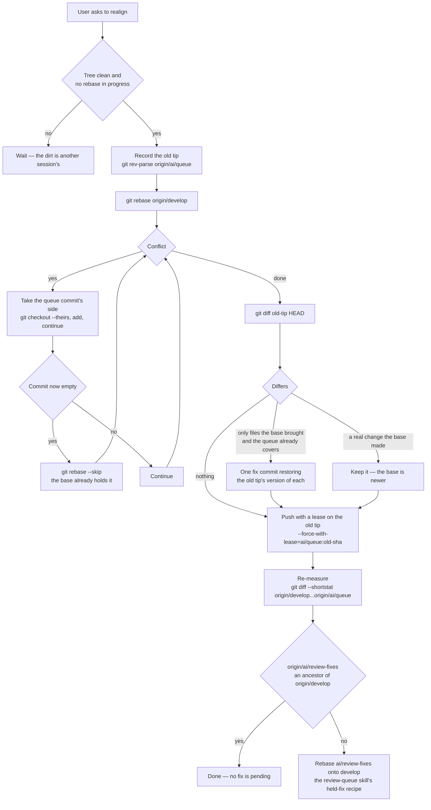

# Realign

The collector rewrites `ai/queue` onto each window's base itself ([sync](/docs/infra/review-collector/collection-cycle)), so a session never rebases the queue on its own initiative. One situation falls between windows: a person repairs `main` by hand — a red CI fixed in one commit that also carries a queue commit's content — and folds `main` into `develop`. Until the next window, the queue's diff against `develop` (`git diff origin/develop...origin/ai/queue`) is measured from the old merge base, so it counts every file the repair already brought across, and a pass meant to be small reads as hundreds of files owed. A realign moves the merge base forward so that the diff shows only what the queue still owes. It runs **when the user asks for it**, never as a side effect of a push.

A request to send one queue commit **straight to `main`** comes first, because the repair has often carried it already. Cherry-pick the commit onto `origin/main` in a scratch worktree and settle each conflict to `main`'s side. If the pick comes out empty, `main` already holds the commit and nothing is pushed. If it does not, the route is the [express lane](/docs/infra/review-collector/express-lane) (an `Express:` trailer), never a hand push to `main`.

## The recipe

The hand repair moved `develop` too, so the last check is `ai/review-fixes`. If `git merge-base --is-ancestor origin/ai/review-fixes origin/develop` succeeds, every fix is already on `develop` and the next drain starts from it. A fix left off `develop` is rebased onto it commit by commit, the way the `review-queue` skill repairs a fix whose replay failed.

- **Conflicts take the queue's side.** The base already holds a copy of what the conflicting commit was converging on, and the queue commit being replayed is the newer word on it, so `--theirs` (inside a rebase, the commit being applied) is what the old tip held. A commit left empty by that choice is one the base already carries, and is skipped.
- **The proof is a tree diff against the old tip.** It should be empty but for what the base brought. Where the base brought something the queue had already answered some other way — a declaration duplicated in a file of its own, a generic added for a caller the queue removed — one fix commit restores the old tip's version of those paths, so the queue's history stays on top of the base and its tree stays exactly what it was.
- **The push names the sha it replaced.** `--force-with-lease=ai/queue:<old tip>` refuses the push if the collector or another session has moved the queue since, which is the race the Settled rule against hand rebases exists to prevent. A bare `--force-with-lease` would take the last fetch as its lease and overwrite that move without saying so.

## Key files

| File                                      | Role                                                                   |
| :---------------------------------------- | :--------------------------------------------------------------------- |
| `.agents/skills/review-queue/SKILL.md`    | the session's loop, and the Settled rule this page is the exception to |
| `scripts/src/services/coderabbit/collect` | the sync that realigns the queue on its own after every window         |
