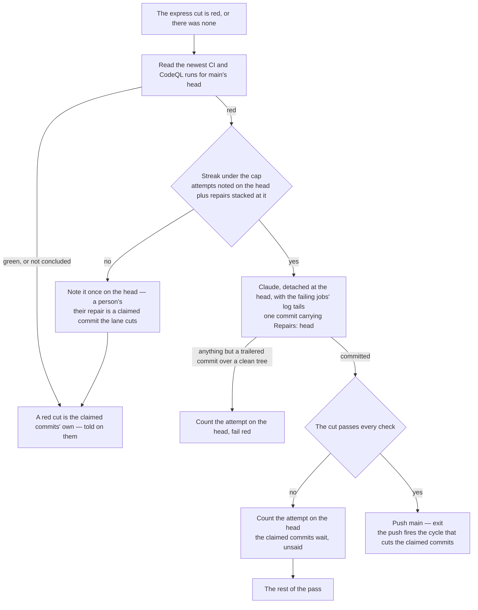

# Repair

The release merges on the review and never waits for CI ([principles](/docs/infra/review-collector)), so what CI held at that moment — a lint rule a bump enabled, a size snapshot a build moved, a test a rename path-coupled — lands on `main` unread and stays. CodeQL scans nothing but `main` (`CodeQL.yaml`), so an alert it raises — on the release, or on the week's run with a query pack the release never met — is a red on `main` too, and its gate job fails the run on any alert still open so that it reads as one. Two things then wait on a red head. The [express lane](/docs/infra/review-collector/express-lane) checks every cut against `main`'s tree, so a red head fails every claimed commit for a red none of them made, and nothing behind a claimed commit is blocked but the commit itself sits. And every window `develop` runs its CI on inherits the same red, so the one signal a session has for its own commits says red before it has pushed anything.

Nothing a rule can decide answers a red: which substitution a lint rule wants, whether a failing test is wrong or the code is, what a flagged regex should say instead. So the repair is the drain's session pointed at the verdict itself, and the collector proves what it left and verifies it with every check before `main` sees it.

## What it reads

| Fact          | Source                                                                                                                                                                                                                                                     |
| :------------ | :--------------------------------------------------------------------------------------------------------------------------------------------------------------------------------------------------------------------------------------------------------- |
| `main` is red | the newest run of each workflow the repairer answers — CI and CodeQL (`MAIN_CHECK_WORKFLOW_FILES`) — for the head, by the file (`gh run list --commit`); concluded `failure`, nothing else, and a run still going or cancelled is not a red                |
| what is red   | the tail of every failing job's log (`gh run view --log-failed`), one section per job, colours stripped — a check states its verdict at the end of what it printed, and CodeQL's gate prints the open alerts, one per line with its path, rule and message |
| the streak    | the attempts noted on the head in marker comments, plus the repairs already stacked consecutively at the head by their `Repairs:` trailer                                                                                                                  |

**A repair that landed red counts.** Every repair makes a new head, and a fresh count per head would pay a session and a verify on every head a red nobody can answer produces — a check only CI runs, a flaky test. The consecutive `Repairs:` commits at the head are the record git already holds of how many times this streak was answered, and the marker comments on the head are the attempts that produced no push; the cap bounds their sum.

## The session

The drain's session under the drain's denials ([collection cycle](/docs/infra/review-collector/collection-cycle)), detached at `main`'s head with the tree installed, handed the run's URL and the log tails, and told what a red asks for: a lint rule its substitution in the repo's own convention, a size snapshot a rebuild and the narrowed `-u` run, a failing test whichever of the code or the assertion the test proves wrong, a code-scanning alert the rule's own remedy at the line it names — never a dismissal or a suppression comment. It runs each failed check locally as CI runs it — a scan has no local run, and the push's own scan proves that repair — commits once with `Repairs: <head>`, and leaves the tree clean. The body is the only review the repair gets, so it says what each red was and what answered it.

What proves the repair is read off the tree, never the session's word: a clean exit, a clean tree, and a head that moved by the one commit the session was told to leave, carrying the trailer that names this head. One commit exactly: the streak reads a repair off the head as a commit, so a session that left three would spend the whole streak on itself and hand the head it made to a person. Anything else counts the attempt on the head and fails the run, as the fold's resolver does. A session that could not start — Claude Code's own limit, a launch that never happened — is nobody's attempt.

Past the streak the head is a person's, said once on it — and their repair arrives the only way a session's commit reaches `main` unread: a queue commit carrying `Express:`, which the lane cuts and verifies as it does any other.

## The cut

The express lane's own cut goes first, even over a red `main`: a claimed commit may be the repair — a session that fixed the red itself, a person's past the repairer's attempts — and a green cut is `main` green again with no session spent. Only a red cut, or nothing to cut, asks whether `main` is red; a red head under repair is the collector's, and the red cut is told on no claimed commit, since the red was never theirs. The verify a red cut spends over a red `main` is the price of that order — runner minutes, not a session.

A repair is then a cut of its own, alone: the claimed commits are not picked on top of it, because the verify is one verdict for the whole cut and a claimed commit that is itself red would spend the streak's attempts on a red the repair answered. It earns every check a claimed commit does (`EXPRESS_VERIFY_COMMANDS`); red, the attempt is counted on the head and the claimed commits wait; green, it is pushed to `main` under the same lease every push carries, the run ends on it, and the push fires the cycle that cuts what waited — or fast-forwards `develop` onto it, when nothing of its own sat there. The lane's checks hold no scan, so a repair of an alert is proven by the scan its push fires: an alert still open there is a red on the new head, and the streak counts the repair beneath it as an attempt.

## What it does not do

- **It does not repair `develop`.** A red on `develop` while a pull request is open is a window commit's, and the session that pushed it reads its own CI — that is the standing rule for a window ([port](/docs/infra/review-collector/collection-cycle)). Repairing it here would spend a review slot on a push no window measured; a red `develop` carries into `main` at the release, where it becomes this page's.
- **It does not wait for the trigger.** `workflow_run` fires from the default branch's copy of the triggers, which a release lags ([runner](/docs/infra/review-collector/runner)); every pass reads the verdict itself, so a queue push or a review lands the repair meanwhile.
- **It does not run the checks to learn `main` is red.** That is a verify's cost — the whole suite — spent on every run for a fact CI already recorded.

## Key files

| File                                                             | Role                                                        |
| :--------------------------------------------------------------- | :---------------------------------------------------------- |
| `scripts/src/services/coderabbit/collect/repairMain.ts`          | the step — CI's verdict, the streak, the session, the proof |
| `scripts/src/services/coderabbit/collect/runExpressLane.ts`      | the repair as the lane's own cut, behind a red cut or none  |
| `scripts/src/services/coderabbit/collect/readRedMainCheck.ts`    | the red run on `main`'s head, CI's or CodeQL's              |
| `.github/workflows/CodeQL.yaml`                                  | the gate that makes an open alert a red run                 |
| `scripts/src/services/coderabbit/collect/getFailedLogExcerpt.ts` | the tail of every failing job, one section per job          |
| `scripts/src/services/coderabbit/collect/readStackedRepairs.ts`  | the repairs consecutive at the head                         |
| `scripts/src/services/coderabbit/collect/getRepairPrompt.ts`     | what the session is told                                    |

## Notes

- **Rejected: a repair through the review lane, on `ai/review-fixes`.** Fixes park until the queue owes something and ride the next window, so `main` stayed red across a release with nothing to push — and the release then merged the same red back. The express lane's verify is the review a repair gets.
- **Rejected: learning `main` is red from the express cut's own red, by re-running the failed check on bare `main`.** It repaired only when a claimed commit happened to be waiting, and it ran a second check to learn what CI had already said.
- **Rejected: the repair ahead of the cut.** It held every claimed commit while `main` was red, which kept out the one commit that answers a red past the repairer's attempts, and spent a session on a red a claimed commit already fixed.
- **Rejected: an alert as a required check on the pull request.** The scan runs on `main` and on a weekly schedule, never on a pull request, since the release and every bump would pay a full analysis for what the same tree's scan on `main` finds; so an alert is met where the scan is, on `main`, and the repair is what already answers a red there.
- **Rejected: GitHub's autofix for an alert.** It answers the one alert in a pull request a person merges, without the repo's conventions; the repairer answers it as it answers a lint rule — one session, proven by the checks, bounded by the streak. A false positive is a person's dismissal on the Security tab, which the gate reads as green on the next scan.
