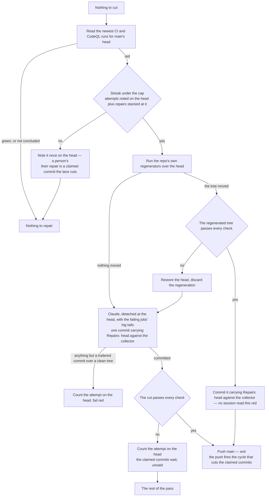

# Repair

The release merges on the review and never waits for CI ([principles](/docs/infra/review-collector)), so what CI held at that moment — a lint rule a bump enabled, a size snapshot a build moved, a test a rename path-coupled — lands on `main` unread and stays. CodeQL scans nothing but `main` (`CodeQL.yaml`), so an alert it raises — on the release, or on the week's run with a query pack the release never met — is a red on `main` too, and its gate job fails the run on any alert still open so that it reads as one. The [express lane](/docs/infra/review-collector/express-lane) adds its own: its cuts land unverified, so a claimed commit red on its own is a red head too. Nothing waits on a red head — the lane cuts over it regardless — but every window `develop` runs its CI on inherits the same red, so the one signal a session has for its own commits says red before it has pushed anything.

Much of what lands red here has a regenerator already. The formatter over a file a fix left unformatted, a lint rule that ships its own fix, a ledger whose coverage rows a sweep derives from the tree: for each of those the answer is a command this repository already holds, and a session that reads a log to arrive at it has spent a slice of the one shared window on a lookup. So the regenerators run first and the check suite says whether they answered it.

What they do not touch is what genuinely has to be read — which substitution a lint rule wants where it ships no fix, whether a failing test is wrong or the code is, what a flagged regex should say instead — and that is the drain's session pointed at the verdict itself. Either way the collector proves what was left and verifies it with every check before `main` sees it.

## What it reads

| Fact          | Source                                                                                                                                                                                                                                                                              |
| :------------ | :---------------------------------------------------------------------------------------------------------------------------------------------------------------------------------------------------------------------------------------------------------------------------------- |
| `main` is red | the newest run of each workflow the repairer answers — CI and CodeQL (`MAIN_CHECK_WORKFLOW_FILES`) — for the head, by the file (`gh run list --commit`); concluded `failure`, nothing else, and a run still going or cancelled is not a red                                         |
| what is red   | the tail of every failing job's log (`gh run view --log-failed`), one section per job, colours stripped — a check states its verdict at the end of what it printed, and CodeQL's gate prints the open alerts, one per line with its path, rule and message                          |
| the streak    | the attempts noted on the head in marker comments plus the repairs already stacked consecutively at the head by their `Repairs:` trailer — both halves naming this collector's source as their basis, like every count ([the runner's counts](/docs/infra/review-collector/runner)) |

**A repair that landed red counts.** Every repair makes a new head, and a fresh count per head would pay a session and a verify on every head a red nobody can answer produces — a check only CI runs, a flaky test. The consecutive `Repairs:` commits at the head are the record git already holds of how many times this streak was answered, and the marker comments on the head are the attempts that produced no push; the cap bounds their sum. **The trailer names the collector that wrote it**, because a commit carries no marker and the basis has to travel on the commit for the count to read it: a repairer fixed since reads a head three of its predecessor's repairs left red as one nothing of its own has answered, exactly as it reads that head's markers, where a count over every repair the head carries would hand a fix to the collector a head it could never try.

## The regenerating repair

Before any session is asked for one, the collector runs every root script that rewrites a tracked artifact rather than reading one (`REPAIR_REGENERATE_COMMANDS`): the formatter, the lint passes in their `--fix` form, and the ledger-coverage sweep. Each writes derived output, so what it produces is by construction what a check failing on that output asked for.

**Nothing here classifies the red.** There is no reading of the log, no roster of failure strings, no judgement about which regenerator applies — the regenerators run, and the collector's check suite (`REPAIR_VERIFY_COMMANDS`) is what says whether they answered it. Three outcomes, and the head is left in exactly one state by each:

| The regenerators                    | Then                                                                                                                |
| :---------------------------------- | :------------------------------------------------------------------------------------------------------------------ |
| moved nothing                       | no session-free repair is possible; the session runs against the head untouched                                     |
| moved the tree, and it is green     | committed with `Repairs: <head> against:<collector>`, pushed as the lane's cut — no session read this red           |
| moved the tree, and it is still red | the head is restored and the session runs against it, so a partial regeneration is never what a session starts from |

The suite is only ever the price of a tree that moved. A head the regenerators leave untouched — a failing test, an open alert, a lint rule that ships no fix — reaches the session having spent nothing at all, and a head they move without answering costs the one verify that found that out: runner minutes, which the pipeline has, rather than a slice of the window, which is what it is short of. A repair that proved itself green this way is not put through the same suite a second time when the lane picks it up; a session's repair carries no such proof and is verified there as it always was.

Their exit status is nothing to read: `lint:fix` exits non-zero on exactly the problems it could not fix, which is the case this still tries.

## The session

The drain's session under the drain's denials ([collection cycle](/docs/infra/review-collector/collection-cycle)), detached at `main`'s head with the tree installed, handed the run's URL and the log tails, and told what a red asks for: a lint rule its substitution in the repo's own convention, a size snapshot a rebuild and the narrowed `-u` run, a failing test whichever of the code or the assertion the test proves wrong, a code-scanning alert the rule's own remedy at the line it names — never a dismissal or a suppression comment. It runs each failed check locally as CI runs it — a scan has no local run, and the push's own scan proves that repair — commits once with `Repairs: <head> against:<collector>`, and leaves the tree clean. The body is the only review the repair gets, so it says what each red was and what answered it.

What proves the repair is read off the tree, never the session's word: a clean exit, a clean tree, and a head that moved by the one commit the session was told to leave, carrying the trailer that names this head and this collector — the same trailer the streak counts, so a repair the proof accepts is one the next streak can read. One commit exactly: the streak reads a repair off the head as a commit, so a session that left three would spend the whole streak on itself and hand the head it made to a person. Anything else counts the attempt on the head and fails the run, as the fold's resolver does. A session that could not start — Claude Code's own limit, a launch that never happened — is nobody's attempt.

Past the streak the head is a person's, said once on it — and their repair arrives the only way a session's commit reaches `main` unread: a queue commit carrying `Express:`, which the lane cuts as it does any other.

## The cut

The express lane's own cut goes first, even over a red `main`: a claimed commit may be the repair — a session that fixed the red itself, a person's past the repairer's attempts — and a cut that answers the red is `main` green again with no session spent. Only nothing to cut asks whether `main` is red; a cut that leaves it red is answered on the run its push fires.

A repair is then a cut of its own, alone: no claimed commit is picked on top of it, because the verify is one verdict for the whole repair. It earns every check (`REPAIR_VERIFY_COMMANDS`); red, the attempt is counted on the head; green, it is pushed to `main` under the same lease every push carries, the run ends on it, and the push fires the cycle that cuts what waited — or fast-forwards `develop` onto it, when nothing of its own sat there. The lane's checks hold no scan, so a repair of an alert is proven by the scan its push fires: an alert still open there is a red on the new head, and the streak counts the repair beneath it as an attempt.

## What it does not do

- **It does not repair `develop`.** A red on `develop` while a pull request is open is a window commit's, and the session that pushed it reads its own CI — that is the standing rule for a window ([port](/docs/infra/review-collector/collection-cycle)). Repairing it here would spend a review slot on a push no window measured; a red `develop` carries into `main` at the release, where it becomes this page's.
- **It does not wait for the trigger.** `workflow_run` fires from the default branch's copy of the triggers, which a release lags ([runner](/docs/infra/review-collector/runner)); every pass reads the verdict itself, so a queue push or a review lands the repair meanwhile.
- **It does not run the checks to learn `main` is red.** That is a verify's cost — the whole suite — spent on every run for a fact CI already recorded. It runs them to learn whether the regenerators answered that red, which is a question nothing has recorded and only a red head ever asks.

## Key files

| File                                                             | Role                                                            |
| :--------------------------------------------------------------- | :-------------------------------------------------------------- |
| `scripts/src/services/coderabbit/collect/repairMain.ts`          | the step — CI's verdict, the streak, the two repairs, the proof |
| `scripts/src/services/coderabbit/collect/repairMechanically.ts`  | the regenerators, the verify, the commit or the restore         |
| `scripts/src/services/coderabbit/collect/checkIsGreen.ts`        | the check suite, shared with the lane's own cut                 |
| `scripts/src/services/coderabbit/collect/runExpressLane.ts`      | the repair as the lane's own cut, when there is nothing to cut  |
| `scripts/src/services/coderabbit/collect/readRedMainCheck.ts`    | the red run on `main`'s head, CI's or CodeQL's                  |
| `.github/workflows/CodeQL.yaml`                                  | the gate that makes an open alert a red run                     |
| `scripts/src/services/coderabbit/collect/getFailedLogExcerpt.ts` | the tail of every failing job, one section per job              |
| `scripts/src/services/coderabbit/collect/readStackedRepairs.ts`  | the repairs consecutive at the head                             |
| `scripts/src/services/coderabbit/collect/getRepairPrompt.ts`     | what the session is told                                        |

## Notes

- **Rejected: a repair through the review lane, on `ai/review-fixes`.** A fix rides a review window, so `main` stayed red across a review and a release — and the release then merged the same red back. The express lane's verify is the review a repair gets.
- **Rejected: learning `main` is red from the express cut's own red, by re-running the failed check on bare `main`.** It repaired only when a claimed commit happened to be waiting, and it ran a second check to learn what CI had already said.
- **Rejected: the repair ahead of the cut.** It held every claimed commit while `main` was red, which kept out the one commit that answers a red past the repairer's attempts, and spent a session on a red a claimed commit already fixed.
- **Rejected: an alert as a required check on the pull request.** The scan runs on `main` and on a weekly schedule, never on a pull request, since the release and every bump would pay a full analysis for what the same tree's scan on `main` finds; so an alert is met where the scan is, on `main`, and the repair is what already answers a red there.
- **Rejected: reading the log to decide which regenerator applies.** It needs a roster of each tool's failure strings, which drifts with every version of every tool and fails silently when it drifts — the same objection this repo makes to any enforcer whose exceptions are a list. Running all of them and letting the checks judge needs no roster and cannot drift.
- **Rejected: `vitest -u` among the regenerators.** A size snapshot's regenerator writes down whatever the run measured, so it would record a real regression as readily as a moved baseline. It stays the session's, which is told to rebuild the package first and narrow the update to it.
- **Rejected: GitHub's autofix for an alert.** It answers the one alert in a pull request a person merges, without the repo's conventions; the repairer answers it as it answers a lint rule — one session, proven by the checks, bounded by the streak. A false positive is a person's dismissal on the Security tab, which the gate reads as green on the next scan.
