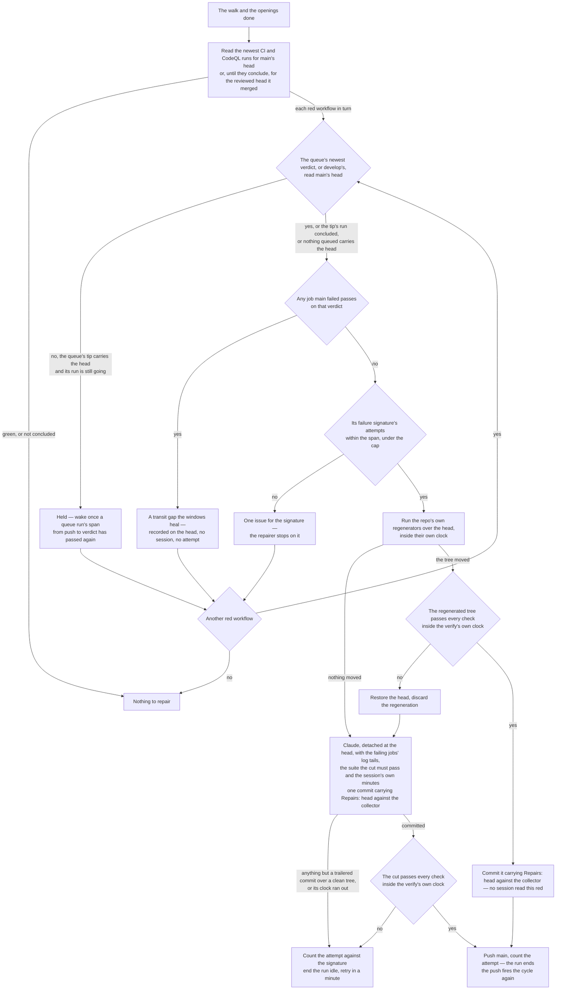

# Repair

The release merges on the review and never waits for CI ([principles](/docs/infra/review-collector)), so what CI held at that moment — a lint rule a bump enabled, a size snapshot a build moved, a test a rename path-coupled — lands on `main` unread and stays. CodeQL scans nothing but `main` (`CodeQL.yaml`), so an alert it raises — on the release, or on the week's run with a query pack the release never met — is a red on `main` too, and its gate job fails the run on any alert still open so that it reads as one. The [express lane](/docs/infra/review-collector/express-lane) adds its own: its cuts land unverified, so a claimed commit red on its own is a red head too. Nothing waits on a red head — the lane cuts over it, and the walk and the openings run before the repair is asked for — but every window `develop` runs its CI on inherits the same red, so the one signal a session has for its own commits says red before it has pushed anything.

Much of what lands red here has a regenerator already. The formatter over a file a fix left unformatted, a lint rule that ships its own fix, a ledger whose coverage rows a sweep derives from the tree: for each of those the answer is a command this repository already holds, and a session that reads a log to arrive at it has spent a slice of the one shared window on a lookup. So the regenerators run first and the check suite says whether they answered it.

What they do not touch is what genuinely has to be read — which substitution a lint rule wants where it ships no fix, whether a failing test is wrong or the code is, what a flagged regex should say instead — and that is the drain's session pointed at the verdict itself. Either way the collector proves what was left and verifies it with every check before `main` sees it.

```mermaid
flowchart TD
  E[The walk and the openings done] --> R[Read the newest CI and CodeQL runs for main's head<br/>or, until they conclude, for the reviewed head it merged]
  R -->|green, or not concluded| L[Nothing to repair]
  R -->|each red workflow in turn| QV{The queue's newest verdict, or develop's,<br/>read main's head}
  QV -->|no, the queue's tip carries the head<br/>and its run is still going| H[Held — wake once a queue run's span<br/>from push to verdict has passed again] --> N
  QV -->|yes, or the tip's run concluded,<br/>or nothing queued carries the head| Q{Any job main failed passes<br/>on that verdict}
  Q -->|yes| TG[A transit gap the windows heal —<br/>recorded on the head, no session, no attempt] --> N
  Q -->|no| S{Its failure signature's attempts<br/>within the span, under the cap}
  S -->|no| P[One issue for the signature —<br/>the repairer stops on it] --> N{Another red workflow}
  N -->|yes| QV
  N -->|no| L
  S -->|yes| G[Run the repo's own regenerators over the head,<br/>inside their own clock]
  G -->|nothing moved| C
  G -->|the tree moved| GV{The regenerated tree passes every check<br/>inside the verify's own clock}
  GV -->|no| RS[Restore the head, discard the regeneration] --> C
  GV -->|yes| GC[Commit it carrying Repairs: head against the collector — no session read this red] --> PU
  C[Claude, detached at the head, with the failing jobs' log tails,<br/>the suite the cut must pass and the session's own minutes<br/>one commit carrying Repairs: head against the collector]
  C -->|anything but a trailered commit over a clean tree,<br/>or its clock ran out| F[Count the attempt against the signature<br/>end the run idle, retry in a minute]
  C -->|committed| V{The cut passes every check<br/>inside the verify's own clock}
  V -->|no| F
  V -->|yes| PU[Push main, count the attempt — the run ends<br/>the push fires the cycle again]
```

## What it reads

| Fact                | Source                                                                                                                                                                                                                                                                                                                                                                                                                                                                                                                                                                                                                                             |
| :------------------ | :------------------------------------------------------------------------------------------------------------------------------------------------------------------------------------------------------------------------------------------------------------------------------------------------------------------------------------------------------------------------------------------------------------------------------------------------------------------------------------------------------------------------------------------------------------------------------------------------------------------------------------------------- |
| `main` is red       | the newest run of each workflow the repairer answers — CI and CodeQL (`MAIN_CHECK_WORKFLOW_FILES`) — for the head, by the file and the commit alone (`gh run list --commit`), since GitHub's per-workflow branch filter has gone stale for weeks at a time; concluded `failure`, nothing else, and a run still going or cancelled is not a red. Every red workflow is read and judged on its own. Until the head's own run concludes, a parent carrying the head's exact tree stands in for it — the reviewed `develop` head a release merged — so a release that merged red is repaired by the cycle its merge fires rather than one CI run later |
| what is red         | the tail of every failing job's log (`gh run view --log-failed`), one section per job, colours stripped — a check states its verdict at the end of what it printed, and CodeQL's gate prints the open alerts, one per line with its path, rule and message                                                                                                                                                                                                                                                                                                                                                                                         |
| the queue's verdict | the newest run of the red run's workflow that concluded green or red on `ai/queue`, or on `develop` where the queue has none, listed by that branch alone (`QUEUE_CHECK_RUN_LIST_LIMIT`); counted only when its commit carries `main`'s head under a sha the head has (`readMainHeadIdentities`), and otherwise replaced by the run over the branch's tip, read by its commit, once the tip carries the head; then the conclusion of each of its jobs by name — or, once a pass has recorded a transit gap against that run's commit, the marker on `main`'s head (`TRANSIT_GAP_MARKER`) in their place                                            |
| the signature       | the red run's workflow and the names of its failing jobs, sorted, each once — the jobs CI skipped behind a failed one name no red of their own — hashed short into the marker that keys every attempt at it (`getFailureSignature`)                                                                                                                                                                                                                                                                                                                                                                                                                |
| the attempts        | the marker comments keyed by that signature among the repository's newest commit comments, on whichever head each was made at, within `REPAIR_SIGNATURE_SPAN_MS`, and naming this collector's source as their basis like every count ([the runner's counts](/docs/infra/review-collector/runner))                                                                                                                                                                                                                                                                                                                                                  |

**The attempts are counted per signature, not per head.** Every repair makes a new head, and so does every window that merges over a red one; a count per head started afresh on each, so one red nobody can answer — a check only CI runs, a flaky test — paid a session and a verify on every head that carried it, a score of failed attempts gathering on one head alone. The same jobs failing in the same workflow are the same red on whichever head carries them, so every attempt, failed or pushed, is one marker on the head it was made at, keyed by the signature, and the count reads the repository's newest commit comments at once. A pushed repair counts as well, so a repair that lands and leaves the same jobs red is paid for once rather than on every head it makes. The span keeps a signature as common as one test job from staying exhausted for good once its attempts have run out a single time, and the marker names the collector's source, so a repairer fixed since starts the signature afresh. **Overturned: the per-head streak** — the attempts noted on a head plus the repairs stacked consecutively at it. A window merging over the red reset it to nothing, so one unanswerable red spent the repairer again on every merge; the user wanted the collector to run itself without stalling, and that goal overturned the per-head count.

## The transit gap

A window carries part of the queue onto `main`, and a commit in it can need one still queued behind it: the rest of a commit the reshaper split across windows, the reader a data change waits on, the build configuration a new chunk needs. `main` is then red on jobs the queue, which carries both, passes, and it stays red until the windows carrying the rest have merged. Nothing at `main`'s head can answer that: the repair's verify runs every check, so it fails on such a job however a session answers the rest, and a session that did answer it would land on `main` a copy of what the queue already carries, for the fold to meet again. **Overturned: a repair for every red head.** Each attempt at such a red paid a session and a verify, a quarter to three quarters of an hour, and failed as a cut until the signature ran out of attempts, so while one lasted the windows went out at about half the rate the plan allows; the user's goal — the plan's whole hourly rate, kept by a collector that finishes on its own — overturned it.

So before any attempt is counted, the repairer reads the queue's verdict on the same workflow over `main`'s head (`readQueueCheck`, `readCarryingCheck`) — the newest run on `ai/queue` that concluded green or red, below — and looks up each job `main` failed by its name there. **While any of them passed on the queue, the red is a transit gap** (`settleTransitGap`): the repairer starts no install, no regenerator and no session, counts no attempt and opens no issue, and the windows heal it as they merge. The walk and the openings ran before it, so nothing else waits on it either. Only a red every one of whose failing jobs failed on the queue too is `main`'s own, and that one is repaired as below. A job the queue skipped or never ran is no evidence that it heals, so it counts as red there, and a CodeQL red, which only `main` is scanned for, is always the repairer's.

The verdict is recorded on `main`'s head, a commit comment whose marker names the queue commit whose run gave it, so a later pass on the same head reads it there instead of both runs' jobs and records nothing twice. A newer verdict on the queue names another commit, so it is read afresh, and a gap the queue stops passing is repaired on the first pass after that run concludes.

**Every red workflow on the head is judged on its own** (`settleRedChecks`), in the order the repairer answers them: a transit gap is held, a signature past its repairs gets its issue, and the first red left is the one repaired, so a gap in CI never hides a CodeQL alert, which only `main` is scanned for and the queue therefore never passes. **Overturned: the first red workflow alone.** CI was read first, and a CI red the queue passed ended the repairer's turn before CodeQL was read, so an open alert waited on windows that can never close it; the user's goal — a collector that runs unattended, with nothing left for a person but billing, the tokens, a pause and a commit past every cap — overturned it.

### The queue's own runs, and a verdict over the head

The queue's verdict is its own branch's runs, listed by the branch, so no other branch's runs share the list. **Overturned: the newest runs of every branch read as one list**, the branch matched among them. Renovate reruns CI on each of its branches every time `main` moves, so a hundred runs held about an hour and a quarter of live traffic, and a queue quiet for that long had no verdict in reach: a gap was repaired as `main`'s own, and the attempt failed in the verify for the reason above. The user's goal of the plan's full rate, run unattended, overturned it. Where the queue has no concluded run, `develop`'s newest stands in for it, as the windows in flight.

A verdict counts only over a commit that carries `main`'s red head. The newest concluded run on the queue can predate a commit that has since reached both the queue and `main` — an express cut lands on `main` in the pass its own push fires, while the queue's run over it is still going — and pass the job that commit broke. So the verdict's commit must descend from one of the shas the head has (`readMainHeadIdentities`): its own; the parent carrying its exact tree, the reviewed head a release merged, which the queue was rewritten onto when that window was cut; or an original its message names, since the express lane cuts a copy and the queue keeps the original. When it does not, and the branch's tip does, the verdict is the run over the tip, read by its commit (`readCommitCheck`) so a branch filter lagging behind it cannot hide it. While that run is still going the red is held: no session, no attempt, no marker. A head the tip does not carry either — a bump or a repair `main` took directly — waits on no queued run until a fold brings it in, so it is judged on the newest verdict as before; and a tip run that ended with no verdict leaves nothing coming, so the newest stands then too.

A held red has nothing to fire the pass that judges it — no event reports a queue run concluding — so the run wakes itself once the newest verdict's own span from push to verdict has passed again, plus the retrigger's buffer; a run still going then is held again with the same wake. **Overturned: a held red left for the next push or review event**, which a quiet queue may not send for hours; the user's goal overturned it — the collector running unattended, woken by its own clock for every verdict it waits on. **Decided: a wake on a clock, not a `workflow_run` trigger on the queue's CI.** A trigger's filter reads only the event and the repository's settings, and whether a red is held is the collector's own state, so the trigger could not be narrowed to a held red: it would run a cycle on every queue CI run, and it reads `main`'s copy of the triggers, a release behind ([runner](/docs/infra/review-collector/runner)).

**Decided: one job the queue passes holds the repair, not only all of them.** A red with one job the queue passes and another it fails cannot be repaired either, because the verify fails on the first whatever the session does with the second, so its attempts would run out on a red the windows are about to shrink, and the issue would name a signature that no longer exists once they have. Holding it costs nothing — `main` is red on the healed job until the windows land, whatever the repairer does — and the job red on both is repaired once it is the only red left.

**Decided: the queue's verdict before `develop`'s.** Right after a release, `develop`'s head is the reviewed head `main` has just merged, so its verdict is `main`'s own and says nothing about what is still queued. The queue is rewritten onto the tree each window leaves, so its run reads every commit a later window will carry to `main`. `develop`'s is read only where the queue has no concluded run: then a release's own verdict fails the job `main` fails, which repairs the red as no verdict would, and with windows in flight it is a verdict on what they carry.

## The regenerating repair

Before any session is asked for one, the collector runs every root script that rewrites a tracked artifact rather than reading one (`REPAIR_REGENERATE_COMMANDS`): the formatter, the lint passes in their `--fix` form, and the ledger-coverage sweep. Each writes derived output, so what it produces is by construction what a check failing on that output asked for.

**Nothing here classifies the red.** There is no reading of the log, no roster of failure strings, no judgement about which regenerator applies — the regenerators run, and the collector's check suite (`REPAIR_VERIFY_COMMANDS`) is what says whether they answered it. Three outcomes, and the head is left in exactly one state by each:

| The regenerators                    | Then                                                                                                                |
| :---------------------------------- | :------------------------------------------------------------------------------------------------------------------ |
| moved nothing                       | no session-free repair is possible; the session runs against the head untouched                                     |
| moved the tree, and it is green     | committed with `Repairs: <head> against:<collector>`, pushed as a cut of its own — no session read this red         |
| moved the tree, and it is still red | the head is restored and the session runs against it, so a partial regeneration is never what a session starts from |

The suite is only ever the price of a tree that moved. A head the regenerators leave untouched — a failing test, an open alert, a lint rule that ships no fix — reaches the session having spent nothing at all, and a head they move without answering costs the one verify that found that out: runner minutes, which the pipeline has, rather than a slice of the window, which is what it is short of. A repair that proved itself green this way is not put through the same suite a second time when the repair step pushes it; a session's repair carries no such proof and is verified there.

Their exit status is nothing to read: `lint:fix` exits non-zero on exactly the problems it could not fix, which is the case this still tries.

## The session

The drain's session under the drain's denials ([collection cycle](/docs/infra/review-collector/collection-cycle)), detached at `main`'s head with the tree installed — or, when the head does not install, handed the install's tail as one more red and no regenerator run first, since every one of them runs on the installed tree — handed the run's URL and the log tails, and told what a red asks for: a lint rule its substitution in the repo's own convention, a size snapshot a rebuild and the narrowed `-u` run, a failing test whichever of the code or the assertion the test proves wrong, a code-scanning alert the rule's own remedy at the line it names — never a dismissal or a suppression comment. It runs each failed check locally as CI runs it — a scan has no local run, and the push's own scan proves that repair — then the collector's own suite in order, since CI skips every job that needs a red one and the tails may not hold every red on the head; it commits once with `Repairs: <head> against:<collector>`, and leaves the tree clean. The body is the only review the repair gets, so it says what each red was and what answered it.

**Each part of an attempt runs on a clock of its own**, so one part running long never cuts another short. The install and the regenerators share one (`REPAIR_REGENERATE_TIMEOUT_MS`), and a regenerator is not started past it. The session has its own (`REPAIR_SESSION_TIMEOUT_MS`), counted from its launch: the prompt names its minutes so the session budgets its own checks inside them, and it is killed when they run out. Each verify — of what the regenerators moved, and of the session's commit — has its own (`REPAIR_VERIFY_TIMEOUT_MS`), counted from its first check, and no check is started past it, so whatever is left reads as still red. A clock that runs out is a failed attempt like any other. Each is sized from what the runner measured: the regenerators take a few minutes, the whole suite about a quarter of an hour with the tests most of it, and a session's repair anything from a minute to most of twenty. The clocks end to end (`REPAIR_ATTEMPT_TIMEOUT_MS`) are what the run's budget is asked for before the attempt starts ([runner](/docs/infra/review-collector/runner)). **Overturned: one deadline over the whole attempt.** Half an hour covered the install, the regenerators, the session and the verify together, while the suite alone takes about half of that, so a session that used most of what was left cut its own verify off in the tests — a repair that may well have been green counted as a failed attempt, and three such attempts hand the signature to an issue. The shared deadline fell to the user's goal: a repair that ends on its own, its verify never cut short, with nobody stepping in.

What proves the repair is read off the tree, never the session's word: a clean exit, a clean tree, and a head that moved by the one commit the session was told to leave, carrying the trailer that names this head and this collector — a commit left by another head's repair, or by an older collector, proves nothing about this one. One commit exactly, because the repair is pushed as one cut the verify gives one verdict on. Anything else counts the attempt against the signature and ends the run idle, retried a minute later, as the fold's resolver does. A session that could not start — Claude Code's own limit, a launch that never happened — is nobody's attempt.

Past the cap the signature gets one issue, labelled for an agent like every issue the collector opens, naming the red run and its failing jobs and saying how to finish it, and the repairer stops on that signature while nothing else waits. Its attempts resume once enough of the oldest age out of the span to bring the count under the cap — an instant nothing reports, so the run that finds the signature past its cap wakes the cycle then, slept in relays past one sleep's cap — or once the collector's own source changes; meanwhile the repair arrives the only way a session's commit reaches `main` unread: a queue commit carrying `Express:`, which the lane cuts as it does any other.

## The cut

The express lane's own cut goes first, even over a red `main`: a claimed commit may be the repair — a session that fixed the red itself, or an agent answering a signature past the repairer's attempts — and a cut that answers the red is `main` green again with no session spent. **The repair is the pass's last step**, after the walk has merged what it could and the openings have opened what the budget allows, on `main` as they left it: its session and checks run for up to their clocks, and the windows merged and opened before it are being reviewed meanwhile rather than waiting on a red no window is blocked by. **Overturned: the repair before the stack.** A repair ran first and its push ended the run, so a red `main` held every merge and opening behind an hour of repairing while no window was open; the user's goal that the hourly reviews be spent in full, with nobody watching, overturned that order.

A repair is a cut of its own, alone: no claimed commit is picked on top of it, because the verify is one verdict for the whole repair. A repair the regenerators proved green is pushed as it stands; a session's earns every check (`REPAIR_VERIFY_COMMANDS`) inside the verify's own clock, and red, the attempt is counted against the signature and the run retries a minute later. Pushed to `main` under the same lease every push carries, the repair is counted as an attempt too, the run ends on it with the wake the stack is owed, and the push fires the cycle again — which fast-forwards `develop` onto it when no window is open. The lane's checks hold no scan, so a repair of an alert is proven by the scan its push fires: an alert still open there is a red on the new head, and the streak counts the repair beneath it as an attempt.

## What it does not do

- **It does not repair `develop`.** A red on `develop` while a pull request is open is a window commit's, and no session watches for it: sessions leave every check but their touched tests to CI. Repairing it here would spend a review slot on a push no window measured; a red `develop` carries into `main` at the release, where it becomes this page's.
- **It does not wait for the trigger.** `workflow_run` fires from the default branch's copy of the triggers, which a release lags ([runner](/docs/infra/review-collector/runner)); every pass reads the verdict itself, so a queue push or a review lands the repair meanwhile.
- **It never holds the walk.** A signature past its attempts stops only the repairer; the issue carries it, and windows go on merging and opening over the red.
- **It does not run the checks to learn `main` is red.** That is a verify's cost — the whole suite — spent on every run for a fact CI already recorded. It runs them to learn whether the regenerators answered that red, which is a question nothing has recorded and only a red head ever asks.

## Key files

| File                                                                | Role                                                            |
| :------------------------------------------------------------------ | :-------------------------------------------------------------- |
| `scripts/src/services/coderabbit/collect/runRepairStep.ts`          | the pass's last step — the repair verified as a cut and pushed  |
| `scripts/src/services/coderabbit/collect/repairMain.ts`             | the repair of the red left — regenerators, session, proof       |
| `scripts/src/services/coderabbit/collect/repairMechanically.ts`     | the regenerators, the verify, the commit or the restore         |
| `scripts/src/services/coderabbit/collect/checkIsGreen.ts`           | the check suite, run on a clock of its own                      |
| `scripts/src/services/coderabbit/collect/readRedMainChecks.ts`      | every red run on `main`'s head, CI's and CodeQL's               |
| `scripts/src/services/coderabbit/collect/settleRedChecks.ts`        | each red judged on its own, the first left the one repaired     |
| `.github/workflows/CodeQL.yaml`                                     | the gate that makes an open alert a red run                     |
| `scripts/src/services/coderabbit/collect/getFailedLogExcerpt.ts`    | the tail of every failing job, one section per job              |
| `scripts/src/services/coderabbit/collect/readRunJobs.ts`            | the red run's workflow and each job's verdict, read off the run |
| `scripts/src/services/coderabbit/collect/settleTransitGap.ts`       | the queue's verdict on the jobs `main` failed, recorded on it   |
| `scripts/src/services/coderabbit/collect/readQueueCheck.ts`         | the red workflow's newest verdict on the queue or `develop`     |
| `scripts/src/services/coderabbit/collect/readCarryingCheck.ts`      | that verdict over `main`'s head, or none while its run goes     |
| `scripts/src/services/coderabbit/collect/readMainHeadIdentities.ts` | every sha a branch may carry `main`'s head under                |
| `scripts/src/services/coderabbit/collect/readSignatureAttempts.ts`  | the repository's newest commit comments, within the span        |
| `scripts/src/services/coderabbit/collect/getRepairPrompt.ts`        | what the session is told                                        |

## Notes

- **A held red waits at most about two queue runs.** CI never cancels a queue run once it has started (`CI.yaml`), so the run over the tip is at worst pending behind the one going, and each wake that finds it still going sets the next.
- **Rejected: a repair through the review lane, on `ai/review-fixes`.** A fix rides a review window, so `main` stayed red across a review and a release — and the release then merged the same red back. A repair earns every check before it is cut, and that is the review it gets.
- **Rejected: learning `main` is red from the express cut's own red, by re-running the failed check on bare `main`.** It repaired only when a claimed commit happened to be waiting, and it ran a second check to learn what CI had already said.
- **Rejected: the repair ahead of the cut.** It held every claimed commit while `main` was red, which kept out the one commit that answers a red past the repairer's attempts, and spent a session on a red a claimed commit already fixed.
- **Rejected: an alert as a required check on the pull request.** The scan runs on `main` and on a weekly schedule, never on a pull request, since the release and every bump would pay a full analysis for what the same tree's scan on `main` finds; so an alert is met where the scan is, on `main`, and the repair is what already answers a red there.
- **Rejected: reading the log to decide which regenerator applies.** It needs a roster of each tool's failure strings, which drifts with every version of every tool and fails silently when it drifts — the same objection this repo makes to any enforcer whose exceptions are a list. Running all of them and letting the checks judge needs no roster and cannot drift.
- **Rejected: `vitest -u` among the regenerators.** A size snapshot's regenerator writes down whatever the run measured, so it would record a real regression as readily as a moved baseline. It stays the session's, which is told to rebuild the package first and narrow the update to it.
- **Rejected: GitHub's autofix for an alert.** It answers the one alert in a pull request a person merges, without the repo's conventions; the repairer answers it as it answers a lint rule — one session, proven by the checks, bounded per signature. A false positive is a person's dismissal on the Security tab, which the gate reads as green on the next scan.
